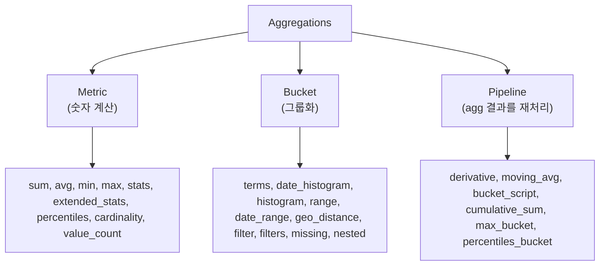

## 정의

**Aggregations (aggs)** = ES 의 *집계 분석*. SQL 의 GROUP BY + 함수 + window. *검색 결과 또는 전체* 위에서.

## 3가지 카테고리



## Metric Aggregations

```json
GET /products/_search
{
  "size": 0,
  "aggs": {
    "avg_price":   { "avg":   { "field": "price" } },
    "max_price":   { "max":   { "field": "price" } },
    "total_sold":  { "sum":   { "field": "sold_count" } },
    "unique_categories": { "cardinality": { "field": "category.keyword" } },
    "stats_price": { "stats": { "field": "price" } },
    "percentiles_price": {
      "percentiles": { "field": "price", "percents": [50, 95, 99] }
    }
  }
}
```

| Metric | 의미 |
|---|---|
| `avg`, `min`, `max`, `sum` | 기본 |
| `stats` | min/max/avg/sum/count 한 번에 |
| `extended_stats` | + variance, std_dev |
| `percentiles` | p50, p95, p99 (HDR 또는 t-digest) |
| `cardinality` | *근사* unique count (HLL) |
| `value_count` | non-null count |
| `top_hits` | bucket 안의 *대표 문서* |

> [!IMPORTANT]
> *`cardinality` 는 HyperLogLog 추정*. 정확 unique 가 필요하면 *별도 계산*.

## Bucket Aggregations

### Terms (GROUP BY)

```json
{
  "aggs": {
    "by_category": {
      "terms": { "field": "category.keyword", "size": 10 },
      "aggs": {
        "avg_price": { "avg": { "field": "price" } }
      }
    }
  }
}
```

> Sub-aggregation 으로 *중첩*: 카테고리별 평균 가격.

### Date Histogram (시계열)

```json
{
  "aggs": {
    "sales_by_day": {
      "date_histogram": {
        "field": "created_at",
        "calendar_interval": "1d",
        "time_zone": "Asia/Seoul",
        "min_doc_count": 0
      },
      "aggs": {
        "revenue": { "sum": { "field": "total" } }
      }
    }
  }
}
```

### Filters (다중 조건 동시)

```json
{
  "aggs": {
    "tiers": {
      "filters": {
        "filters": {
          "cheap":  { "range": { "price": { "lt": 50 } } },
          "mid":    { "range": { "price": { "gte": 50, "lt": 200 } } },
          "luxury": { "range": { "price": { "gte": 200 } } }
        }
      }
    }
  }
}
```

## Pipeline Aggregations

### Derivative + Cumulative Sum

```json
{
  "aggs": {
    "sales_per_day": {
      "date_histogram": { "field": "date", "calendar_interval": "1d" },
      "aggs": {
        "revenue":           { "sum": { "field": "total" } },
        "revenue_diff":      { "derivative": { "buckets_path": "revenue" } },
        "cumulative_revenue":{ "cumulative_sum": { "buckets_path": "revenue" } },
        "moving_7d":         { "moving_avg": { "buckets_path": "revenue", "window": 7 } }
      }
    }
  }
}
```

### bucket_script (커스텀 비율)

```json
{
  "aggs": {
    "by_day": {
      "date_histogram": { ... },
      "aggs": {
        "revenue":      { "sum": { "field": "total" } },
        "refund":       { "sum": { "field": "refund_amount" } },
        "refund_ratio": {
          "bucket_script": {
            "buckets_path": { "r": "refund", "v": "revenue" },
            "script": "params.r / params.v"
          }
        }
      }
    }
  }
}
```

## Composite Aggregation (pagination)

`terms` 의 *큰 cardinality* 페이지네이션:

```json
{
  "aggs": {
    "by_user_day": {
      "composite": {
        "size": 100,
        "sources": [
          { "user":  { "terms": { "field": "user_id" } } },
          { "day":   { "date_histogram": { "field": "ts", "calendar_interval": "1d" } } }
        ],
        "after": { "user": "...", "day": ... }
      }
    }
  }
}
```

## Doc Count Error

```json
"buckets": [
  { "key": "A", "doc_count": 100 },
  { "key": "B", "doc_count": 80 }
],
"sum_other_doc_count": 250,
"doc_count_error_upper_bound": 5
```

> `terms` 는 *각 shard 의 top-N 합산* → *전역 정확도 보장 X*. `size` 늘리면 정확도 ↑.

## ESQL 의 STATS

ESQL 의 *간결 표현*:

```sql
FROM products
| STATS avg_price = AVG(price), max_price = MAX(price) BY category
| SORT avg_price DESC
| LIMIT 10
```

DSL 의 `terms` + `avg` 와 동등. 자세한 건 [[elasticsearch-query]] 의 ESQL.

## 시각화 (Kibana)

| Agg | Kibana 시각화 |
|---|---|
| `date_histogram` | line chart |
| `terms` | bar / pie / table |
| `range` | bar |
| `percentiles` | bar / table |
| `cardinality` | metric panel |

## 흔한 함정

> [!WARNING]
> 1. **`terms` size 너무 큼** = 메모리 폭증. *composite* 로.
> 2. **`text` 필드에 terms** = `fielddata` 활성 필요 (메모리 비쌈). `keyword` multi-field.
> 3. **scripted metric** = 매 doc 평가, 느림. *index time 계산* 권장.
> 4. **`cardinality` 의 정확도** = `precision_threshold` 옵션. 기본 3000.

## 관련 위키

- [[elasticsearch-query]]
- [[elasticsearch-sort]]
- [[elasticsearch-mapping]]
- [[Redis HyperLogLog Geo]] (HLL 비교)
