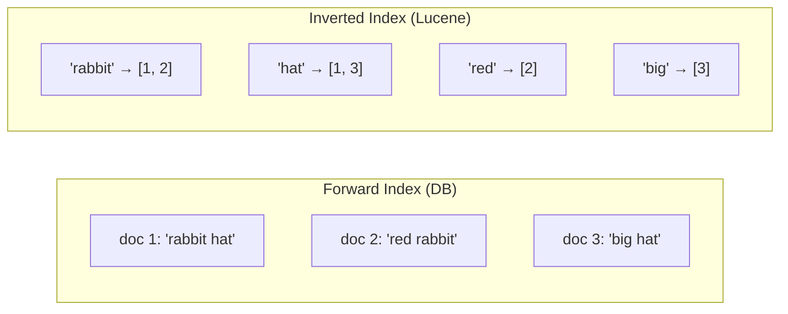
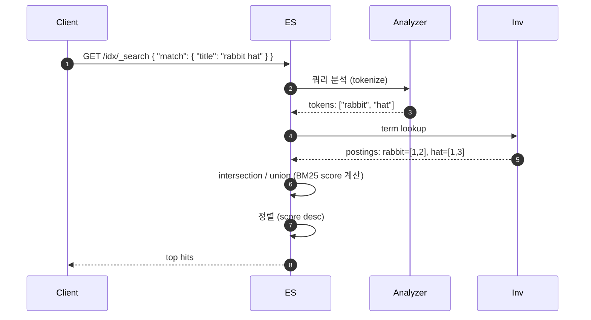
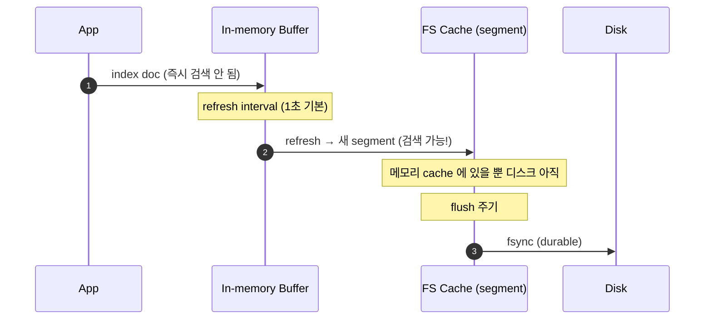

## 정의

ES 의 *모든 동작* 은 *Lucene 의 inverted index* 위에 얹혀있다. *문서 단위 저장* + *term 단위 검색* 의 분리.

## Inverted Index (역색인)

```anim:trie
{}
```

> 위 trie 의 *prefix tree 구조* 가 *term dictionary* 의 직관. Lucene 은 *FST (Finite State Transducer)* 라는 *압축된 trie* 사용.

### 일반 정방향 인덱스 vs 역색인



| 정방향 | 역색인 |
|---|---|
| doc → terms | *term → docs* |
| RDB 의 row | 검색에 최적 |
| `LIKE '%rabbit%'` = O(N) | *term 으로 즉시 lookup* |

## 검색 흐름



## Segment: Lucene 의 단위

```mermaid
flowchart TB
    Shard[Shard]
    Shard --> Seg1[Segment 1<br/>(불변)]
    Shard --> Seg2[Segment 2<br/>(불변)]
    Shard --> Seg3[Segment 3<br/>(불변)]
    Shard --> Seg4[Segment N<br/>(최신)]
```

| 속성 | 의미 |
|---|---|
| **Immutable** | segment 는 *생성 후 절대 변경 안 됨* |
| **Append-only** | 새 문서 = *새 segment* |
| **Merge** | 여러 segment 를 *주기적으로 큰 하나로* (background) |
| **Delete** | 삭제 = *별도 `.del` 파일에 표시* (실제 제거는 merge 시) |

> [!IMPORTANT]
> Segment 의 *불변성* 이 ES 의 *concurrent search + write 가능* 의 토대. 동시 읽기에 lock 없음.

## Near Real-Time: refresh



| 동작 | 주기 | 의미 |
|---|---|---|
| **Buffer → Refresh** | 1초 (`refresh_interval`) | 검색 가능 (still in memory) |
| **Refresh → Flush** | `index.translog.flush_threshold_size` | 디스크 fsync |
| **Merge** | 백그라운드 | 작은 segment 들 → 큰 segment |

> [!TIP]
> *대량 인덱싱* 시 `refresh_interval: -1` 로 끄면 *수배 빠름*. 인덱싱 후 명시적 `_refresh`.

## Translog (WAL)

```mermaid
flowchart LR
    Write[Index API] --> Buf[Buffer]
    Write --> TL[Translog<br/>(WAL)]
    TL -->|fsync 주기| Disk
```

*Refresh* 와 무관하게 *write 가 안전*. 자세한 건 [[wal-write-ahead-log]].

| 모드 | 동작 |
|---|---|
| `request` (기본) | 매 요청 fsync (느림, 안전) |
| `async` | 주기적 fsync (5s 기본) |

## Document 와 ID

```json
PUT /products/_doc/sku-1234
{
  "name": "Mechanical Keyboard",
  "price": 129.99,
  "tags": ["accessory", "input"]
}
```

| 필드 | 의미 |
|---|---|
| `_index` | 인덱스 이름 |
| `_id` | 문서 ID (없으면 자동 생성) |
| `_source` | 원본 JSON (저장 + 반환용) |
| `_version` | 낙관적 동시성 제어 |
| `_seq_no`, `_primary_term` | versioning 의 개선판 |

## Routing

```
shard = hash(routing) % number_of_primary_shards
```

- 기본 `routing = _id`.
- *같은 routing → 같은 shard*.
- *멀티 테넌트* 에서 `routing = tenant_id` 로 *데이터 locality*.

## 자세한 영역

- *인덱싱 흐름 + mapping*: [[elasticsearch-indexing]]
- *쿼리 종류*: [[elasticsearch-query]]
- *cluster, shard*: [[elasticsearch-infrastructure]]
- *BM25*: [[elasticsearch-relevance-scoring]]
- *한국어 분석*: [[elasticsearch-korean-indexing]]

## 관련 위키

- [[elasticsearch]] (개요)
- [[btree-indexing]] (RDB 인덱스 비교)
- [[Redis Vector Search]] (대안)
- [[trie]] (FST 의 토대)
