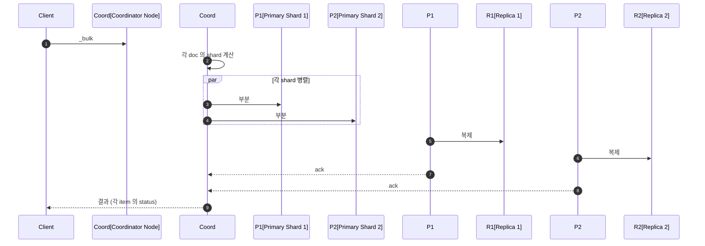
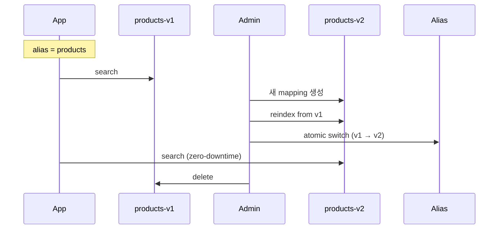

## 정의

**Indexing** = JSON 문서를 *역색인에 등록* 하는 행위. *Lucene segment 빌드* + *refresh* + *flush* 의 흐름.

## 단일 인덱싱

```bash
PUT /products/_doc/sku-1
{ "name": "Keyboard", "price": 100 }
```

| 동작 | 결과 |
|---|---|
| ID 명시 | upsert (있으면 update) |
| ID 자동 | `POST /products/_doc` |
| Create-only | `PUT /products/_create/sku-1` (있으면 409) |

## Bulk API (실전)

```bash
POST /_bulk
{ "index": { "_index": "products", "_id": "sku-1" } }
{ "name": "Keyboard", "price": 100 }
{ "index": { "_index": "products", "_id": "sku-2" } }
{ "name": "Mouse", "price": 50 }
{ "delete": { "_index": "products", "_id": "sku-old" } }
{ "update": { "_index": "products", "_id": "sku-1" } }
{ "doc": { "price": 95 } }
```

> [!IMPORTANT]
> *단일 인덱싱 보다 100배 빠름*. *5-15 MB / batch*, *1000-10000 docs* 권장.

### Bulk 흐름



## 대량 인덱싱 튜닝

```bash
PUT /products/_settings
{
  "index.refresh_interval": "-1",      # refresh 끄기
  "index.number_of_replicas": 0,       # replica 끄기
  "index.translog.durability": "async" # WAL 비동기
}

# 인덱싱...

PUT /products/_settings
{
  "index.refresh_interval": "1s",
  "index.number_of_replicas": 1
}
POST /products/_refresh
POST /products/_forcemerge?max_num_segments=1
```

> *수 배 빠름*. 단 *진행 중 검색 결과 stale + 실패 시 손실 위험* 있어 *별도 인덱스* 에 작업 후 alias swap.

## Index 생성 + Mapping

```json
PUT /products
{
  "settings": {
    "number_of_shards": 3,
    "number_of_replicas": 1,
    "analysis": { ... }
  },
  "mappings": {
    "properties": {
      "name":    { "type": "text", "analyzer": "korean" },
      "price":   { "type": "double" },
      "tags":    { "type": "keyword" },
      "created": { "type": "date" },
      "vector":  { "type": "dense_vector", "dims": 384 }
    }
  }
}
```

자세한 mapping 은 [[elasticsearch-mapping]].

## Ingest Pipeline (Logstash 대안)

```json
PUT /_ingest/pipeline/products-pipeline
{
  "processors": [
    { "lowercase": { "field": "tags" } },
    { "set": { "field": "ingested_at", "value": "{{_ingest.timestamp}}" } },
    { "remove": { "field": "raw" } },
    { "grok": { "field": "log", "patterns": ["%{IP:client} %{WORD:method}"] } }
  ]
}

POST /_bulk?pipeline=products-pipeline
...
```

> *문서가 ES 에 들어오기 전 변환*. Logstash 같은 *별도 프로세스 없이* ES 내장. 대부분의 *경량 변환* 은 ingest pipeline 으로.

## Update vs Reindex

| 동작 | 의미 |
|---|---|
| **Update** | 문서 *재인덱싱* (Lucene 의 *immutable* 때문). 옛 문서 삭제 + 새 문서 등록 |
| **Update by Query** | 쿼리 매칭 모두 update |
| **Reindex** | 다른 인덱스로 copy + 변환 |

```bash
POST /_update_by_query?conflicts=proceed
{
  "query": { "term": { "in_stock": true } },
  "script": { "source": "ctx._source.price *= 1.1" }
}

POST /_reindex
{
  "source": { "index": "products-old" },
  "dest":   { "index": "products-new" },
  "script": { "source": "ctx._source.version = 2" }
}
```

## Alias + Zero-Downtime Reindex



```bash
POST /_aliases
{
  "actions": [
    { "remove": { "index": "products-v1", "alias": "products" } },
    { "add":    { "index": "products-v2", "alias": "products" } }
  ]
}
```

> [!IMPORTANT]
> *mapping 변경* 은 *대부분 불가능* (immutable). *새 인덱스 + reindex + alias swap* 이 정통. 자세한 무중단 패턴은 [[Zero Downtime Deployment]].

## 흔한 함정

> [!WARNING]
> 1. **Bulk size 너무 큼** = `EsRejectedExecutionException` (스레드 큐 초과). 5-15MB 권장.
> 2. **`refresh=true` 매번** = 검색 즉시 가능하지만 *write throughput 폭락*.
> 3. **수동 force_merge 자주** = I/O 폭증. *대량 인덱싱 후 1회* 만.
> 4. **mapping 의 dynamic 폭증** = *수만 개 field* → 메모리 폭발. `dynamic: strict` 또는 *명시적 mapping*.

## 관련 위키

- [[elasticsearch-basics]] (segment, refresh)
- [[elasticsearch-mapping]]
- [[elasticsearch-korean-indexing]]
- [[Kafka]] (인덱싱 source 로)
- [[outbox-pattern]] (DB → ES 동기화)
