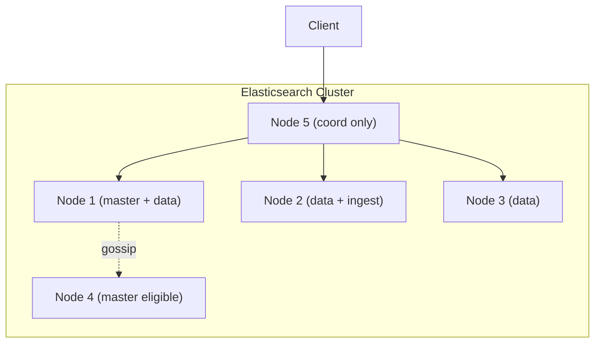
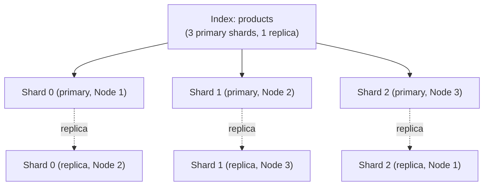
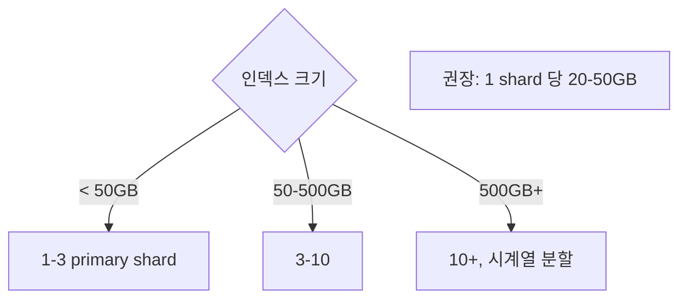
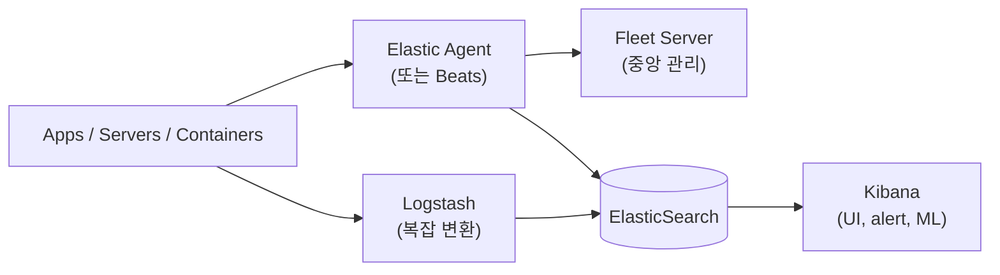
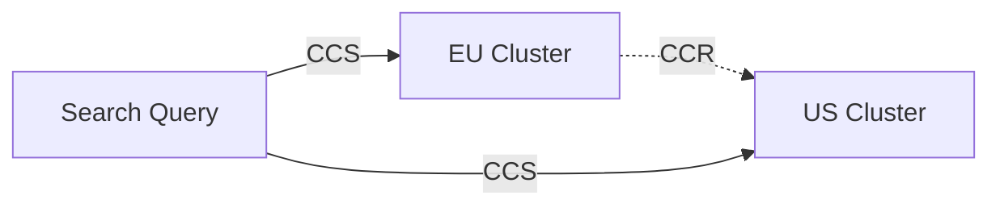
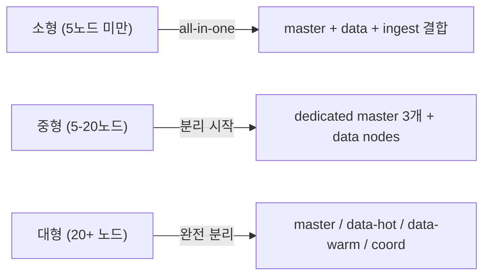

## 정의

ES 는 *분산 시스템*. *cluster + multiple nodes + shards + replicas + Elastic Stack 보조 도구*.

## Cluster 구조



## Node Role

| Role | 의미 |
|---|---|
| **master** | cluster state 관리 |
| **master_eligible** | master 후보 |
| **data** | shard 보관 + 쿼리 |
| **data_hot** / **data_warm** / **data_cold** / **data_frozen** | tier 별 |
| **ingest** | ingest pipeline 실행 |
| **coordinating_only** | 라우팅 + 합치기만 |
| **ml** | ML 전용 |
| **remote_cluster_client** | cross-cluster search |
| **transform** | continuous transform |

> [!IMPORTANT]
> *production = 분리된 dedicated master 3노드* + *data nodes* + *coordinating-only* (큰 환경). 작은 환경은 master+data 결합 OK.

## Shard + Replica



| 개념 | 의미 |
|---|---|
| Primary shard | write 의 주체 |
| Replica shard | *읽기 분산 + HA* |
| Routing | `hash(routing) % primary_shards` |
| primary 다운 | replica → primary 자동 승격 |

### Shard 수 결정



> *너무 많음* = cluster state 비대 + 리밸런싱 비용. *너무 적음* = 노드 추가해도 분산 안 됨.

## ILM (Index Lifecycle Management)


```json
PUT _ilm/policy/logs-policy
{
  "policy": {
    "phases": {
      "hot":    { "actions": { "rollover": { "max_size": "50gb", "max_age": "1d" } } },
      "warm":   { "min_age": "7d",  "actions": { "shrink": { "number_of_shards": 1 }, "forcemerge": { "max_num_segments": 1 } } },
      "cold":   { "min_age": "30d", "actions": { "searchable_snapshot": { "snapshot_repository": "s3-repo" } } },
      "frozen": { "min_age": "90d", "actions": { "searchable_snapshot": { "snapshot_repository": "s3-repo" } } },
      "delete": { "min_age": "365d", "actions": { "delete": {} } }
    }
  }
}
```

> *로그 / 메트릭 / APM 의 표준*. *비용 차감 + 성능 유지* 의 핵심.

## Elastic Stack (옛 ELK)



| 컴포넌트 | 의미 |
|---|---|
| **Elastic Agent** | 통합 shipper (옛 Beats 통합) |
| **Beats** (Filebeat, Metricbeat, Packetbeat, ...) | 가벼운 단일 목적 shipper |
| **Logstash** | 강력 변환, *Elastic Agent + Ingest pipeline 으로 대부분 대체 진행 중* |
| **Fleet** | Elastic Agent 의 중앙 관리 + policy 배포 |
| **Kibana** | 시각화 + dev tools + alerting + ML UI |

> 2026 시점: *Elastic Agent + Fleet 이 표준*. Beats 는 *legacy* (지원 계속).

## Snapshot / Restore

```bash
# Repository 등록 (S3)
PUT _snapshot/my_s3_repo
{
  "type": "s3",
  "settings": { "bucket": "es-snapshots", "region": "us-east-1" }
}

# Snapshot
PUT _snapshot/my_s3_repo/snap-2026-06-25?wait_for_completion=true
{
  "indices": "products,logs-*",
  "include_global_state": false
}

# Restore
POST _snapshot/my_s3_repo/snap-2026-06-25/_restore
{
  "indices": "products",
  "rename_pattern": "(.+)",
  "rename_replacement": "restored-$1"
}
```

## Searchable Snapshot

```
ILM 의 cold / frozen tier 에서 사용.
S3 의 snapshot 을 *직접 검색* (로컬 복원 없이).
```

> 비용 *대폭 절감*. cold 는 *부분 mount*, frozen 은 *완전 S3 기반 + small local cache*.

## Cross-Cluster Search / Replication



- **CCR** (Cross-Cluster Replication): leader → follower 비동기 복제.
- **CCS** (Cross-Cluster Search): 동시에 여러 cluster 검색.
- DR / 글로벌 분석.

## 모니터링 핵심 지표

운영 중 최우선으로 관찰해야 할 지표:

| 범주 | 지표 | 임계치/설명 |
|:---|:---|:---|
| **클러스터 상태** | `cluster.health` status | GREEN 목표, YELLOW 주의, RED 즉각 대응 |
| **JVM 힙** | `jvm.mem.heap_used_percent` | 75% 초과 시 GC 압력 증가, 85% 이상 위험 |
| **GC 시간** | `jvm.gc.collectors.old.collection_time` | old GC 200ms 이상이면 조사 |
| **Search 지연** | `indices.search.query_time` | p99 기준 200ms 이상이면 조사 |
| **Index 속도** | `indices.indexing.index_rate` | 피크 처리량 대비 70% 이상 지속 시 조사 |
| **Disk 사용률** | `fs.total.available` | 85% 초과 시 shard allocation 중지 |
| **Thread pool** | `thread_pool.write.queue` | 큐 적체 = 인덱싱 병목 신호 |

```bash
# 클러스터 상태 한눈에 보기
GET _cluster/health?pretty

# 노드별 JVM / 디스크 현황
GET _cat/nodes?v&h=ip,name,heapPercent,diskUsedPercent,cpu,load_1m
```

## 용량 계획 가이드라인

### 스토리지 계산

```
실제 필요 디스크 = 원본 데이터 크기
                  x 인덱싱 오버헤드 (1.1-1.5x)
                  x (replica 수 + 1)
                  + safety buffer (20-30%)
```

예시: 100 GB 원본 + replica 1 = `100 x 1.2 x 2 x 1.25 = 약 300 GB`

### JVM 힙 설정

```yaml
# jvm.options
-Xms16g
-Xmx16g     # 힙은 전체 RAM 의 50%, 최대 32 GB (Compressed OOPs 한계)
```

32 GB 초과 시 Compressed OOPs 가 비활성화되어 오히려 메모리 효율이 떨어집니다.

### 노드 역할 분리 권장 규모



## 성능 튜닝 체크리스트

**인덱싱 속도 향상**:
- [ ] `refresh_interval: 30s` (기본 1s, 실시간 검색 불필요 시)
- [ ] `number_of_replicas: 0` (초기 대량 인덱싱 후 복구)
- [ ] bulk API 사용: 배치당 5-15 MB, 500-1000 docs
- [ ] 클라이언트 스레드 수 = data node 수 x 2

**검색 속도 향상**:
- [ ] `filter context` 최대 활용 (score 불필요 조건은 반드시 filter)
- [ ] `fielddata` 비활성화 (집계에는 keyword 필드 사용)
- [ ] 결과 크기 제한 (`size: 10`, `_source includes/excludes` 활용)
- [ ] Shard 크기 20-50 GB 유지

## 흔한 함정

> [!WARNING]
> 1. **Master node 분리 안 함 + 데이터 폭증** = master 가 GC pause → split brain.
> 2. **Shard 수 *영구 고정*** = 만들 때 결정. *늘리려면 reindex*.
> 3. **ILM 없는 로그** = *수 TB 누적 → cluster 다운*. ILM 필수.
> 4. **Replica 0 in production** = 노드 다운 시 *데이터 손실*. 최소 1.

## 관련 위키

- [[elasticsearch]]
- [[elasticsearch-basics]]
- [[Zero Downtime Deployment]] (alias swap)
- [[aws-s3]] (snapshot)
- [[prometheus]] / [[opentelemetry]] (대안 / 통합)
