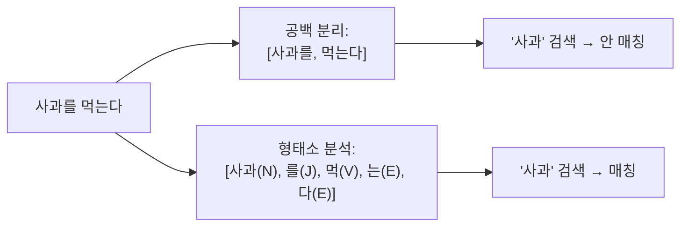

## 정의

*한국어* 는 *교착어 + 띄어쓰기 모호* + *형태소 변화* 때문에 *공백 단순 분리* 로는 검색 불가. *형태소 분석 (morphological analysis)* 필수.

## 한글이 어려운 이유



| 영어 | 한국어 |
|---|---|
| 띄어쓰기 = 단어 경계 | *모호* (붙여쓰기 허용) |
| 어형 변화 적음 (s, ed, ing) | *극심* (조사, 어미, 어간) |
| stemmer 로 충분 | *형태소 분석기* 필요 |

## 한국어 형태소 분석 직관

```anim:aho-corasick
{}
```

> Aho-Corasick (다중 패턴 매칭) 의 동작 직관. 한국어 형태소 분석도 *사전 + 트라이* 기반의 *모든 가능한 경계 후보 동시 매칭* + *최적 분리 선택*. 핵심 아이디어가 동일.

```anim:trie
{}
```

> 사전 (dictionary) 의 *trie 구조*. 형태소 분석기의 *내부 사전* 도 trie 또는 FST.

## 주요 분석기 비교

| 분석기 | 출시 | 사전 | 특징 |
|---|---|---|---|
| **nori** | 2018 (Elastic 공식) | mecab-ko-dic | *공식 + 안정* + Lucene 기본 통합 |
| **mecab-ko-analyzer** | 2014 | mecab-ko-dic | 옛 표준. 별도 plugin 필요 |
| **arirang** | 2010 | 자체 사전 | 옛, *현재 거의 안 씀* |
| **eunjeon (은전한닢)** | 2014 | mecab-ko-dic | mecab-ko 기반 |
| **OpenKoreanText** (twitter-korean) | 2014 | 자체 | 트위터 특화 |

> [!IMPORTANT]
> *2026 시점 권장: nori*. 공식 + 활발한 유지보수 + Lucene 통합 + 한국어 search 의 *de facto*.

## nori 사용

```bash
# 플러그인 설치
bin/elasticsearch-plugin install analysis-nori
```

```json
PUT /products
{
  "settings": {
    "analysis": {
      "tokenizer": {
        "nori_user_dict": {
          "type": "nori_tokenizer",
          "decompound_mode": "mixed",
          "user_dictionary": "userdict_ko.txt"
        }
      },
      "filter": {
        "nori_pos_remove": {
          "type": "nori_part_of_speech",
          "stoptags": ["E", "IC", "J", "MAG", "MAJ", "MM", "SP", "SSC", "SSO", "SC", "SE", "XPN", "XSA", "XSN", "XSV", "UNA", "NA", "VSV"]
        }
      },
      "analyzer": {
        "korean": {
          "type": "custom",
          "tokenizer": "nori_user_dict",
          "filter": ["lowercase", "nori_readingform", "nori_pos_remove"]
        }
      }
    }
  },
  "mappings": {
    "properties": {
      "title": { "type": "text", "analyzer": "korean" }
    }
  }
}
```

## decompound_mode (복합어 분해)

```
"백화점" → 백화 + 점 ?
```

| 모드 | 동작 | 결과 |
|---|---|---|
| `none` | 분해 안 함 | `[백화점]` |
| `discard` | 분해 + *원본 버림* | `[백화, 점]` |
| `mixed` (권장) | 분해 + *원본 유지* | `[백화점, 백화, 점]` |

> [!TIP]
> *`mixed` 가 권장*. *원본도 검색 + 분해된 단어도 검색* 가능. recall 향상.

## 분석 테스트

```bash
POST /_analyze
{
  "tokenizer": "nori_tokenizer",
  "text": "백화점에서 아이폰 15 프로를 샀어요"
}
```

```json
{
  "tokens": [
    { "token": "백화점", "start_offset": 0, "end_offset": 3, "type": "word", "position": 0 },
    { "token": "에서",    "start_offset": 3, "end_offset": 5, "type": "word", "position": 1 },
    { "token": "아이폰",  "start_offset": 6, "end_offset": 9, "type": "word", "position": 2 },
    { "token": "15",     "start_offset": 10, "end_offset": 12, "type": "word", "position": 3 },
    { "token": "프로",    "start_offset": 13, "end_offset": 15, "type": "word", "position": 4 },
    { "token": "를",      "start_offset": 15, "end_offset": 16, "type": "word", "position": 5 },
    { "token": "샀",      "start_offset": 17, "end_offset": 18, "type": "word", "position": 6 },
    { "token": "어요",    "start_offset": 18, "end_offset": 20, "type": "word", "position": 7 }
  ]
}
```

## 품사 필터 (POS filter)

`nori_part_of_speech` 로 *불필요 품사 제거*:

| 태그 | 의미 | 보통 제외? |
|---|---|---|
| `J` | 조사 (은, 는, 이, 가) | *예* |
| `E` | 어미 (다, 어요, 았) | *예* |
| `MAG` | 일반 부사 | *예* |
| `IC` | 감탄사 | *예* |
| `NNG` | 일반 명사 | 유지 |
| `NNP` | 고유 명사 | 유지 |
| `VV` | 동사 | 유지 (어간) |
| `VA` | 형용사 | 유지 |
| `XR` | 어근 | 유지 |

## User Dictionary (사용자 사전)

`userdict_ko.txt`:

```
아이폰
삼성갤럭시
대한항공
미스터트롯
삼성전자
```

> 신조어 / 고유명사 / 브랜드 등 *분리되어선 안 될 단어* 등록.

## 한자 / 영문 / 발음 변환

```json
"filter": {
  "korean_readingform": { "type": "nori_readingform" }
}
```

- 한자 → 한글 *발음 변환* (`漢字` → `한자`).
- 검색 시 *한자 입력 OK + 한글로 매칭*.

## ngram 기반 한글 검색

복합어 / 부분 매칭이 필요하면 *ngram* 보조:

```json
"filter": {
  "edge_ngram_filter": {
    "type": "edge_ngram",
    "min_gram": 1,
    "max_gram": 10
  }
}
```

- *자동완성 (autocomplete)* 의 표준.
- `samsung` → `[s, sa, sam, samp, sams, samsu, samsun, samsung]`.

## 흔한 함정

> [!WARNING]
> 1. **공백 분리만 사용** = *조사* 가 붙은 단어 검색 실패. nori 필수.
> 2. **POS filter 안 함** = `J/E` 가 토큰 폭증 → 인덱스 크기 + 검색 잡음.
> 3. **decompound_mode `none`** = `백화점`만 매칭, `백화` 안 됨. `mixed` 권장.
> 4. **User dictionary 갱신 후 재인덱싱 안 함** = 옛 인덱스는 *그대로 옛 분석*. 신조어 반영 안 됨.

## 관련 위키

- [[elasticsearch-basics]]
- [[elasticsearch-indexing]]
- [[elasticsearch-mapping]]
- [[trie]]
- [[aho-corasick]]
