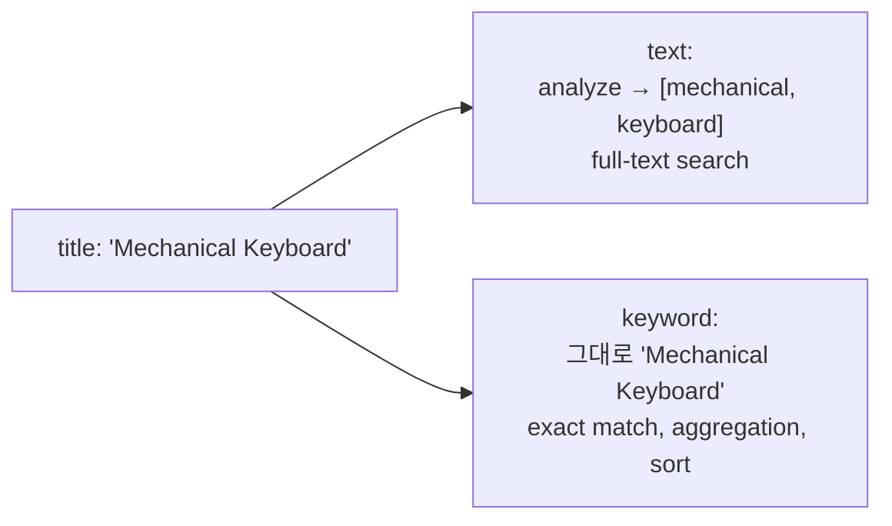

## 정의

**Mapping** = ES 의 *schema*. 각 필드의 *type + analyzer + indexing 옵션*. *대부분 immutable* (재인덱싱 필요).

## Field Type 카탈로그

| 카테고리 | type |
|---|---|
| **String** | `text`, `keyword`, `match_only_text` (8.x), `wildcard` |
| **Numeric** | `long`, `integer`, `short`, `byte`, `double`, `float`, `half_float`, `scaled_float`, `unsigned_long` |
| **Date** | `date`, `date_nanos` |
| **Boolean** | `boolean` |
| **Binary** | `binary` |
| **Range** | `integer_range`, `date_range`, `ip_range`, `long_range`, `float_range`, `double_range` |
| **Object** | `object`, `nested`, `flattened` |
| **Geo** | `geo_point`, `geo_shape` |
| **Specialized** | `ip`, `version`, `histogram`, `percolator`, `dense_vector`, `sparse_vector`, `rank_feature`, `rank_features`, `completion` (autocomplete), `token_count`, `join` |

## text vs keyword



| | text | keyword |
|---|---|---|
| 분석기 | 적용 | *없음* |
| 검색 | `match` | `term` |
| 정렬 | *불가* (기본) | 가능 |
| 집계 | *불가* (기본) | 가능 |
| 용도 | 본문, 설명 | ID, tag, status, exact |

## Multi-Field (둘 다)

```json
"title": {
  "type": "text",
  "analyzer": "korean",
  "fields": {
    "raw":     { "type": "keyword", "ignore_above": 256 },
    "english": { "type": "text", "analyzer": "english" },
    "search_as_you_type": { "type": "search_as_you_type" }
  }
}
```

- `title` → full-text search
- `title.raw` → 정렬 / 집계 / exact
- `title.english` → 영어 분석
- `title.search_as_you_type` → autocomplete

## Dynamic Mapping

```mermaid
flowchart TB
    Doc[새 필드 포함 문서] --> ES
    ES -->|dynamic: true| Auto[자동 type 추정 + mapping 추가]
    ES -->|dynamic: false| Ignore[필드 무시 (저장만)]
    ES -->|dynamic: strict| Reject[에러]
    ES -->|dynamic: runtime| Runtime[runtime field 추가]
```

### Type 자동 추정

```
JSON value     → ES type
"hello"        → text + keyword.raw (multi-field)
123            → long
1.5            → float
true           → boolean
"2026-06-25"   → date (string + 자동 date detection)
```

> [!WARNING]
> *Dynamic 폭증*: 사용자 입력의 *임의 key* → 수만 field → 메모리 폭발. *`dynamic: strict`* 또는 *flattened* 권장.

## Object vs Nested

```json
PUT /orders
{
  "mappings": {
    "properties": {
      "items": {
        "type": "nested",
        "properties": {
          "name":  { "type": "keyword" },
          "price": { "type": "double" }
        }
      }
    }
  }
}
```

```json
PUT /orders/_doc/1
{
  "items": [
    { "name": "keyboard", "price": 100 },
    { "name": "mouse",    "price": 50 }
  ]
}
```

### object 의 함정

`object` (기본) = *flatten 저장*:

```
items.name:  ["keyboard", "mouse"]
items.price: [100, 50]
```

→ "name=mouse AND price=100" 검색 시 *잘못 매칭* (실제로는 keyboard=100, mouse=50).

`nested` = *각 sub-doc 을 별도 Lucene doc* → 정확한 검색 + 비용 큼.

```json
{
  "nested": {
    "path": "items",
    "query": {
      "bool": {
        "must": [
          { "term": { "items.name": "mouse" } },
          { "range": { "items.price": { "gte": 100 } } }
        ]
      }
    }
  }
}
```

## Runtime Field (schema-on-read)

```json
PUT /logs
{
  "mappings": {
    "runtime": {
      "duration_ms": {
        "type": "long",
        "script": "emit(doc['end'].value.toEpochMilli() - doc['start'].value.toEpochMilli())"
      }
    }
  }
}
```

> *Reindex 없이* 새 필드 추가 가능. *쿼리 시 계산* → 느림. *자주 쓰는 건 index time field* 로.

## Aliases

```bash
POST /_aliases
{
  "actions": [
    { "add": { "index": "products-v2", "alias": "products" } }
  ]
}
```

자세한 건 [[elasticsearch-indexing]] 의 Alias.

## Index Template

```json
PUT _index_template/logs-template
{
  "index_patterns": ["logs-*"],
  "template": {
    "settings": { "number_of_shards": 3 },
    "mappings": { "properties": { ... } }
  }
}
```

> *패턴 매칭 인덱스* 의 *기본 mapping*. ILM rollover 와 짝.

## Best Practice

```
✓ text vs keyword 명시 (dynamic 의존 X)
✓ ID 같은 식별자는 keyword
✓ 본문은 text + 적절한 analyzer
✓ 정렬/집계 필요 컬럼 → multi-field 의 keyword
✓ 객체 배열에 검색 필요 → nested
✓ 임의 key JSON → flattened
✓ ignore_above: 256 으로 큰 string 의 인덱싱 회피
```

## 흔한 함정

> [!WARNING]
> 1. **모든 string 이 text + keyword.raw** = 인덱스 *2배 크기*. 필요한 것만.
> 2. **object 에 검색** = wrong match. nested 로.
> 3. **mapping 변경 시도** = 거의 항상 *reindex 필요*.
> 4. **자동 date detection** = "2026-06-25" 가 date 로 인식 → 다른 형식 거절. *비활성 권장* (`"date_detection": false`).

## 관련 위키

- [[elasticsearch-indexing]]
- [[elasticsearch-basics]]
- [[elasticsearch-query]] (text vs keyword 와 match vs term)
