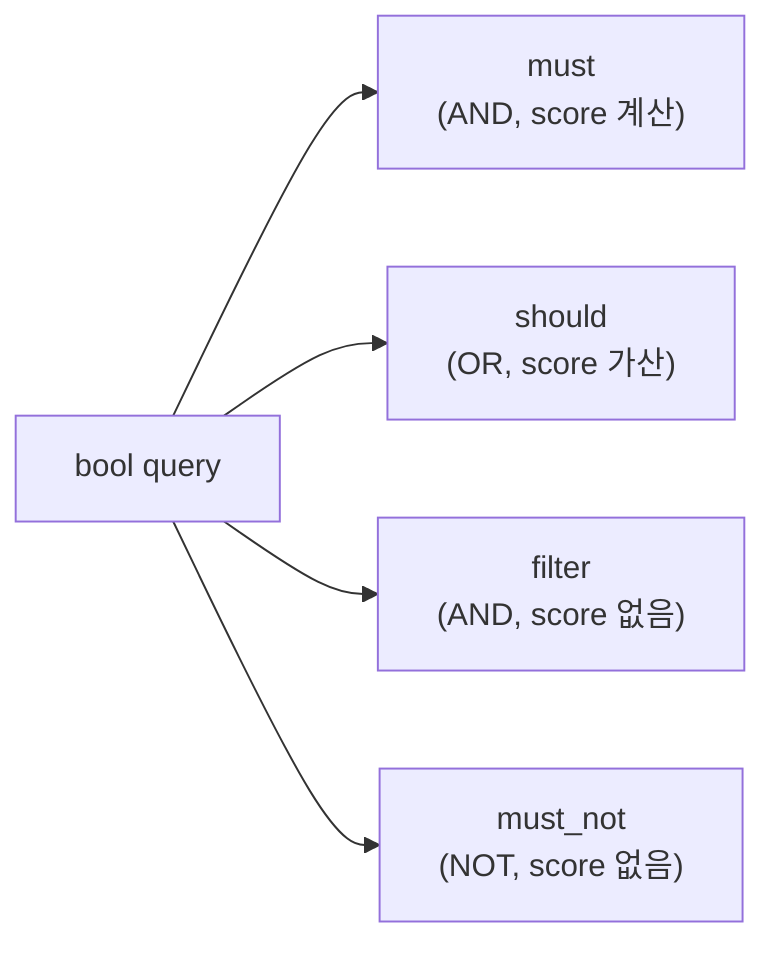
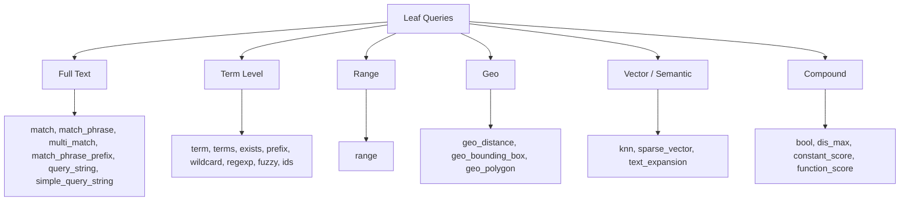
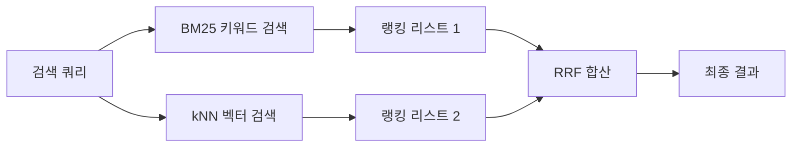

## 정의

ES 의 *Query DSL* = *JSON 기반 표현력 풍부한 쿼리 언어*. *bool query* + *leaf query* 의 조합.

## bool query: 4가지 절



| 절 | AND/OR | Score | Cache |
|---|---|---|---|
| `must` | AND | *예* | 안됨 |
| `should` | OR | 예 (가산) | 안됨 |
| `filter` | AND | *없음* | *예 (빠름!)* |
| `must_not` | NOT | 없음 | 예 |

> [!IMPORTANT]
> *Score 가 필요 없으면 항상 `filter`*. `must` + 동일 조건보다 *압도적으로 빠름* (cache + scoring 생략).

## 종합 예시

```json
GET /products/_search
{
  "query": {
    "bool": {
      "must": [
        { "match": { "title": "mechanical keyboard" } }
      ],
      "should": [
        { "match": { "tags": "rgb" } },
        { "match": { "tags": "wireless" } }
      ],
      "filter": [
        { "term": { "category": "input-device" } },
        { "range": { "price": { "gte": 50, "lte": 200 } } },
        { "term": { "in_stock": true } }
      ],
      "must_not": [
        { "term": { "brand": "Brand-X" } }
      ],
      "minimum_should_match": 1
    }
  }
}
```

해석:

1. `title` 에 *"mechanical keyboard"* 매칭 (필수, score 계산)
2. `tags` 에 *"rgb" 또는 "wireless"* 있으면 가산 (`minimum_should_match: 1` 적용)
3. *category, 가격 50-200, 재고 있음* (필터, 빠름)
4. *Brand-X 제외*

## leaf query 카테고리



## match vs term

```json
// match: 분석기 적용 → tokenized 비교
{ "match": { "title": "Mechanical Keyboard" } }
// → tokens: ["mechanical", "keyboard"]
// → 둘 중 하나라도 매칭 (operator=or 기본)

// term: 분석 없이 *exact* (keyword 필드용)
{ "term": { "status": "active" } }
```

> [!CAUTION]
> *`text` 필드에 `term` 쿼리* = *원본 토큰 못 찾음* (분석기가 lowercase 등 했기 때문). `text` 는 `match`, `keyword` 는 `term`.

## match_phrase + slop

```json
{ "match_phrase": { "title": { "query": "mechanical keyboard", "slop": 1 } } }
```

- *연속된 토큰* 매칭.
- `slop`: *얼마나 떨어져도 OK* (단어 거리).

## multi_match

```json
{
  "multi_match": {
    "query": "rabbit hat",
    "fields": ["title^3", "description", "tags"]
  }
}
```

- 여러 필드 *동시 검색*.
- `field^N`: *가중치*.
- type: `best_fields`, `most_fields`, `cross_fields`, `phrase`.

## function_score (커스텀 ranking)

```json
{
  "query": {
    "function_score": {
      "query": { "match": { "title": "keyboard" } },
      "functions": [
        { "filter": { "term": { "premium": true } }, "weight": 2.0 },
        { "field_value_factor": { "field": "popularity", "modifier": "log1p" } },
        { "gauss": { "created_at": { "origin": "now", "scale": "30d", "decay": 0.5 } } }
      ],
      "boost_mode": "multiply"
    }
  }
}
```

| function | 의미 |
|---|---|
| `weight` | 상수 곱 |
| `field_value_factor` | 필드값 기반 (popularity 등) |
| `gauss` / `linear` / `exp` | 거리 기반 감쇠 (시간, 위치) |
| `script_score` | Painless 스크립트 |
| `random_score` | 무작위 (A/B) |

## ESQL (2024 GA)

SQL 같은 *파이프 표기*:

```sql
FROM logs-*
| WHERE @timestamp > NOW() - 7 days AND status_code >= 500
| STATS error_count = COUNT(*) BY service.name, host.name
| SORT error_count DESC
| LIMIT 20
```

> [!TIP]
> *DSL 의 복잡함 회피*. 2026 시점 *대시보드 / ad-hoc 쿼리* 에서 *ESQL 이 표준*. Kibana 의 default 쿼리도 ESQL 전환 중.

## 동작 흐름

```anim:browser-google-search
{}
```

> 일반 검색 직관. ES 도 같은 *query → ranking → top-K* 흐름.

## 중첩 문서 쿼리

문서 안에 배열 객체가 있을 때 `nested` 타입 + `nested` query 가 필요합니다.

```json
// 매핑
{
  "mappings": {
    "properties": {
      "reviews": { "type": "nested" }
    }
  }
}
```

```json
// nested query: 같은 리뷰 객체 내에서 author + score 조합 매칭
{
  "query": {
    "nested": {
      "path": "reviews",
      "query": {
        "bool": {
          "must": [
            { "match": { "reviews.author": "kim" } },
            { "range": { "reviews.score": { "gte": 4 } } }
          ]
        }
      },
      "score_mode": "avg"
    }
  }
}
```

`nested` 를 쓰지 않으면 서로 다른 배열 원소의 필드가 cross-match 되는 "객체 평탄화" 버그가 발생합니다.

## 하이브리드 검색

벡터 유사도와 키워드 검색을 결합하는 **RRF (Reciprocal Rank Fusion)** 방식:



```json
GET /products/_search
{
  "retriever": {
    "rrf": {
      "retrievers": [
        {
          "standard": {
            "query": { "match": { "description": "lightweight keyboard" } }
          }
        },
        {
          "knn": {
            "field": "embedding",
            "query_vector_builder": {
              "text_embedding": {
                "model_id": "sentence-transformers__msmarco-minilm-l-12-v3",
                "model_text": "lightweight keyboard"
              }
            },
            "num_candidates": 100
          }
        }
      ],
      "rank_window_size": 100,
      "rank_constant": 60
    }
  }
}
```

> [!TIP]
> RRF 는 두 랭킹 리스트를 `1 / (rank_constant + rank)` 점수로 합산합니다. 가중치 튜닝 없이도 안정적인 성능을 냅니다.

## 쿼리 성능 최적화

### Profile API

느린 쿼리 원인 분석:

```json
GET /products/_search
{
  "profile": true,
  "query": { "match": { "title": "keyboard" } }
}
```

응답의 `profile.shards[].searches[].query` 에서 각 단계의 소요 시간을 확인합니다.

### 성능 원칙 요약

| 원칙 | 구체 방법 |
|:---|:---|
| **Score 불필요 조건은 filter** | `must` 대신 `filter` context |
| **와일드카드 최소화** | `edge_ngram` 분석기로 prefix 검색 대체 |
| **필요한 필드만 반환** | `_source: { includes: ["title", "price"] }` |
| **Shard 수 최적화** | 과다한 shard 수 = 쿼리 오버헤드 |
| **routing 활용** | 특정 테넌트 데이터는 routing 으로 단일 shard 접근 |
| **Query 캐시** | filter 결과는 자동 캐시: 반복 filter 는 빠름 |

## 흔한 함정

> [!WARNING]
> 1. **`text` 에 `term`** = 매칭 0. `keyword` field 사용 또는 `match`.
> 2. **`should` 만 사용** = `minimum_should_match` 누락 → *0개 일치 OK*. 명시 권장.
> 3. **score 불필요한데 `must`** = *cache 못 씀*. filter 로.
> 4. **`wildcard`, `regexp`, `prefix` 남용** = *느림*. *분석기 변경 + edge_ngram* 으로 대체.

## 관련 위키

- [[elasticsearch-mapping]] (text vs keyword)
- [[elasticsearch-relevance-scoring]] (BM25)
- [[elasticsearch-vector-search]] (kNN + bool 결합)
- [[elasticsearch-aggregations]] (query 결과의 집계)
