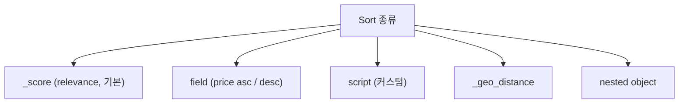
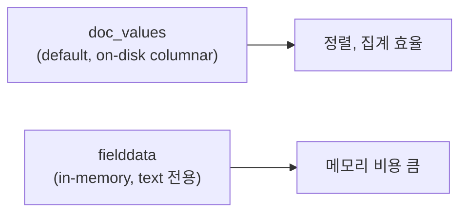
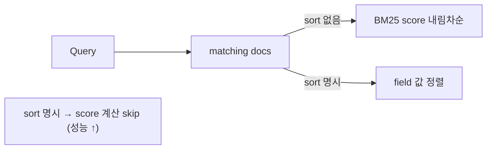
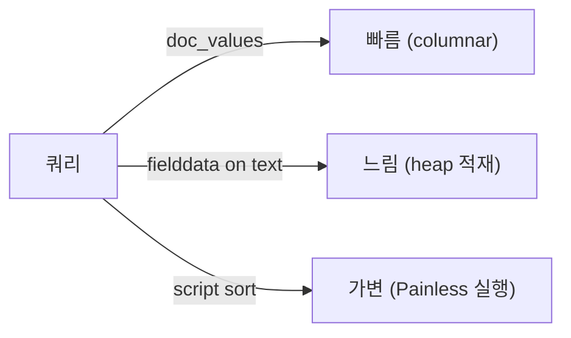

## 정의

ES 의 *기본 정렬* = *relevance score (BM25) 내림차순*. *명시적 sort* 로 변경 가능. *doc_values* 로 메모리 효율적 정렬.

## 5가지 정렬



## 1. Field Sort

```json
GET /products/_search
{
  "query": { "match_all": {} },
  "sort": [
    { "price": "asc" },
    { "created_at": "desc" },
    "_score"
  ]
}
```

| 옵션 | 의미 |
|---|---|
| `order`: `asc` / `desc` | 방향 |
| `missing`: `_first` / `_last` / 값 | NULL 처리 |
| `mode`: `min` / `max` / `avg` / `sum` / `median` | 배열 필드의 대표값 |
| `unmapped_type` | 인덱스에 없는 필드 무시 |

## 2. Relevance (_score)

```json
"sort": ["_score"]
```

기본. 별도 sort 명시 안 하면 적용. 자세한 BM25 는 [[elasticsearch-relevance-scoring]].

## 3. Script Sort

```json
"sort": {
  "_script": {
    "type": "number",
    "script": {
      "lang": "painless",
      "source": "doc['price'].value * (1 - doc['discount'].value)"
    },
    "order": "asc"
  }
}
```

> *런타임 계산*. 무거움. *자주 쓰는 정렬은 *index 시 계산해서 저장**.

## 4. Geo Distance

```json
"sort": [
  {
    "_geo_distance": {
      "location": { "lat": 37.55, "lon": 126.97 },
      "order": "asc",
      "unit": "km",
      "distance_type": "arc"
    }
  }
]
```

## doc_values vs fielddata



| | doc_values | fielddata |
|---|---|---|
| 자료구조 | columnar (Lucene) | in-memory (heap) |
| 적용 | 거의 모든 필드 (기본) | text 필드 (옵션) |
| 정렬 / 집계 | 가능 | 가능하지만 *비쌈* |
| 비활성 | `"doc_values": false` | `"fielddata": false` (기본) |

> [!IMPORTANT]
> **`text` 필드에 정렬/집계 = 거절** (기본). `keyword` 또는 `multi-field` 사용.

```json
"properties": {
  "title": {
    "type": "text",
    "fields": {
      "raw": { "type": "keyword" }
    }
  }
}
```

→ 정렬 시 `"title.raw"` 사용.

## search_after + PIT (deep pagination)

`from + size` 의 *깊은 페이지네이션* 은 *비효율*. 대용량 결과는 *search_after* + *Point in Time (PIT)*.

```bash
# 1. PIT 생성
POST /products/_pit?keep_alive=5m
→ { "id": "pit_id_xxx" }

# 2. 첫 페이지
GET /_search
{
  "size": 100,
  "pit": { "id": "pit_id_xxx", "keep_alive": "5m" },
  "sort": [{ "created_at": "asc" }, { "_id": "asc" }]
}
# → 결과의 sort 값을 저장: [created_at_value, id_value]

# 3. 다음 페이지
GET /_search
{
  "size": 100,
  "pit": { "id": "pit_id_xxx", "keep_alive": "5m" },
  "sort": [{ "created_at": "asc" }, { "_id": "asc" }],
  "search_after": [created_at_value, id_value]
}
```

> [!TIP]
> *10K offset 이상* 은 *search_after 만*. `from + size` 는 `index.max_result_window` 한계 (10000 기본).

## track_total_hits

```json
{
  "track_total_hits": false   // 또는 10000 (정확 카운트 한도)
}
```

> *정확한 total count* 가 비싸다. *대시보드 / "수천 개+"* 표시면 *생략* 또는 *근사*.

## Sort 와 BM25



> [!TIP]
> *sort 가 score 무관* 이면 *score 계산 skip* (성능 ↑). 단 *function_score* 같이 *score 가 필요한 정렬* 은 그대로 계산.

## 흔한 함정

> [!WARNING]
> 1. **`text` 필드로 정렬** = 에러. `keyword` multi-field 사용.
> 2. **deep `from + size`** = `max_result_window` 초과. `search_after`.
> 3. **`track_total_hits: true`** = 대량 매칭 시 *2배 느림*. 필요 없으면 *false* 또는 *10000*.
> 4. **script sort 남용** = 매 쿼리 *Painless 컴파일*. *runtime field* 또는 *index 시 저장* 으로.

## Nested Sort

중첩 오브젝트 배열에서 조건부 정렬:

```json
{
  "sort": [
    {
      "offers.price": {
        "mode": "min",
        "order": "asc",
        "nested": {
          "path": "offers",
          "filter": { "term": { "offers.currency": "KRW" } }
        }
      }
    }
  ]
}
```

> 한 문서에 여러 `offers` 가 있을 때, *KRW 통화 중 최저가* 로 정렬.

## Collapse + Sort

그룹별 대표 문서만 반환 (중복 제거):

```json
GET /products/_search
{
  "query": { "match": { "category": "노트북" } },
  "sort": [{ "sold_count": "desc" }],
  "collapse": {
    "field": "brand.keyword",
    "inner_hits": {
      "name": "top_per_brand",
      "size": 3,
      "sort": [{ "price": "asc" }]
    }
  }
}
```

> 브랜드별 판매량 1위 제품 + 브랜드 내 저가 3개. 쇼핑 검색 결과 UX.

## Cursor Pagination 패턴

`search_after` + PIT 로 대용량 데이터 순회:

```python
def paginate(client, index: str, query: dict, sort: list, page_size: int = 100):
    pit = client.open_point_in_time(index=index, keep_alive="5m")["id"]
    search_after = None
    try:
        while True:
            body = {
                "size": page_size,
                "pit": {"id": pit, "keep_alive": "5m"},
                "query": query,
                "sort": sort,
            }
            if search_after:
                body["search_after"] = search_after
            resp = client.search(body=body)
            hits = resp["hits"]["hits"]
            if not hits:
                break
            yield hits
            search_after = hits[-1]["sort"]
    finally:
        client.close_point_in_time(id=pit)
```

> *PIT + search_after* 조합은 *인덱스 변경에도 일관된 스냅샷* 보장.

## Sort 성능 튜닝

| 전략 | 설명 |
|---|---|
| doc_values 활성화 | 숫자, 날짜, keyword 기본 ON. text 는 OFF |
| `_source` 최소화 | `fields` 파라미터로 필요한 필드만 |
| script sort 제한 | 자주 쓰는 정렬은 index 시 계산해 저장 |
| keyword sub-field | text 정렬 시 `title.raw` (keyword) 사용 |
| size 최소화 | 불필요하게 큰 페이지 크기는 힙 낭비 |



## 관련 위키

- [[elasticsearch-query]]
- [[elasticsearch-relevance-scoring]]
- [[elasticsearch-mapping]]
- [[elasticsearch-aggregations]] (정렬과 함께)
