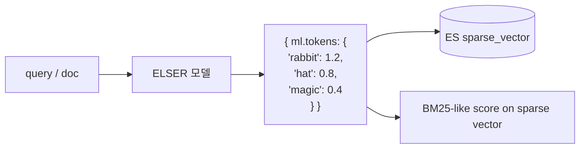

## 정의

ES 의 *벡터 검색* = *임베딩 기반 의미 검색*. *kNN (Approximate Nearest Neighbor)* 으로 *수억 벡터* 안에서 가까운 *K개* 찾기.

2026 시점의 ES 위치: *전통 BM25 + dense vector + sparse vector + hybrid* 모두 지원하는 *통합 검색 엔진*.

## 3가지 벡터 표현

```mermaid
flowchart TB
    Q[Vector 표현]
    Q --> Dense[dense_vector<br/>(예: 384, 768, 1536 차원)]
    Q --> Sparse[sparse_vector / ELSER<br/>(term:weight 맵)]
    Q --> Hybrid[Hybrid<br/>(BM25 + Vector RRF)]
```

| 종류 | 의미 |
|---|---|
| **Dense** | 모든 차원 채워진 vector (OpenAI, Cohere, BGE 등) |
| **Sparse** | *대부분 0*, 의미있는 term 만 가중치 |
| **Hybrid** | 키워드 + 의미 결합 |

## Dense Vector (전통 임베딩)

```json
PUT /docs
{
  "mappings": {
    "properties": {
      "content": { "type": "text" },
      "embedding": {
        "type": "dense_vector",
        "dims": 384,
        "index": true,
        "similarity": "cosine",
        "index_options": {
          "type": "hnsw",
          "m": 16,
          "ef_construction": 100
        }
      }
    }
  }
}
```

| 옵션 | 의미 |
|---|---|
| `dims` | 차원 (모델 의존) |
| `similarity` | `cosine`, `dot_product`, `l2_norm`, `max_inner_product` |
| `type` | `hnsw` (기본), `flat`, `int8_hnsw`, `int4_hnsw`, `bbq_hnsw` (8.15+) |
| `m` | HNSW 노드의 연결 수 |
| `ef_construction` | 빌드 시 후보군 |

### Quantization (메모리 절감)

| 옵션 | 메모리 (vs float32) | 정확도 |
|---|---|---|
| `hnsw` (float32) | 100% | 기준 |
| `int8_hnsw` | 25% | 95%+ recall |
| `int4_hnsw` (8.15+) | 12.5% | 90%+ recall |
| `bbq_hnsw` (Better Binary Quantization, 9.x) | *3%* | 80%+ recall |

> [!IMPORTANT]
> *2026 시점 기본 = int8_hnsw*. 메모리 1/4 + 거의 같은 정확도. *대용량 (수억+) = BBQ*.

### kNN Search

```json
GET /docs/_search
{
  "knn": {
    "field": "embedding",
    "query_vector": [0.1, 0.2, ..., 0.05],
    "k": 10,
    "num_candidates": 100
  }
}
```

| 파라미터 | 의미 |
|---|---|
| `k` | 반환할 수 |
| `num_candidates` | 후보 풀 (정확도 vs 속도) |
| `filter` | bool query 와 결합 |
| `boost` | hybrid 시 가중치 |

## ELSER (Elastic Learned Sparse EncodeR)



- *Elastic 자체 모델*. 8.8+ stable.
- *term 단위 가중치* (sparse).
- 별도 GPU 없이 *CPU 추론* 가능.
- 영문 우수. *9.x 에서 multilingual* 진입.

```json
PUT /docs
{
  "mappings": {
    "properties": {
      "content_expanded": {
        "type": "sparse_vector"
      }
    }
  }
}

POST /_ml/trained_models/.elser_model_2/deployment/_start

PUT /_ingest/pipeline/elser-pipeline
{
  "processors": [
    {
      "inference": {
        "model_id": ".elser_model_2",
        "input_output": [{ "input_field": "content", "output_field": "content_expanded" }]
      }
    }
  ]
}
```

쿼리:

```json
{
  "query": {
    "sparse_vector": {
      "field": "content_expanded",
      "inference_id": ".elser_model_2",
      "query": "토끼가 마술 모자에서 나오다"
    }
  }
}
```

## semantic_text (8.15+, 추천)

```json
PUT /docs
{
  "mappings": {
    "properties": {
      "content": {
        "type": "semantic_text",
        "inference_id": "my-elser-or-openai-or-cohere"
      }
    }
  }
}
```

> 위 한 필드면 *자동 청크 + 임베딩 + 인덱싱 + 쿼리*. *별도 ingest pipeline 불필요*. **2026 시점 권장 접근**.

## Hybrid Search + RRF (Reciprocal Rank Fusion)

```json
GET /docs/_search
{
  "retriever": {
    "rrf": {
      "retrievers": [
        { "standard": { "query": { "match": { "content": "토끼 모자" } } } },
        { "knn": { "field": "embedding", "query_vector_builder": { "text_embedding": { "model_id": "...", "model_text": "토끼 모자" } }, "k": 50, "num_candidates": 200 } }
      ],
      "rank_window_size": 50,
      "rank_constant": 60
    }
  }
}
```

> *키워드 (BM25) + 의미 (벡터)* 두 ranking 을 *RRF* 로 결합. *최강 패턴*.

자세한 RRF 공식:

```
RRF_score(d) = Σ 1 / (k + rank_i(d))
```

| 출처 | rank | RRF (k=60) |
|---|---|---|
| BM25 | 1 | 1/61 ≈ 0.0164 |
| BM25 | 10 | 1/70 ≈ 0.0143 |
| Vector | 1 | 1/61 |
| 둘 다 top | 합산 | 약 0.033 |

## Inference API (외부 LLM 통합)

```bash
PUT _inference/text_embedding/my-openai
{
  "service": "openai",
  "service_settings": {
    "api_key": "sk-...",
    "model_id": "text-embedding-3-small"
  }
}

PUT _inference/text_embedding/my-cohere
{
  "service": "cohere",
  "service_settings": { "api_key": "...", "model_id": "embed-multilingual-v3.0" }
}
```

> OpenAI, Cohere, HuggingFace, Bedrock, Azure AI, Anthropic 등 *공통 인터페이스*.

## RAG 패턴

```mermaid
flowchart LR
    User[User query] --> Embed[Inference API:<br/>embedding]
    Embed --> Hybrid[Hybrid Retriever<br/>(BM25 + vector + RRF)]
    Hybrid -->|top-K chunks| Prompt[LLM prompt 구성]
    Prompt --> LLM[OpenAI / Claude / Llama]
    LLM --> Answer
```

## ES vs 전용 Vector DB

| | ES | Pinecone | Milvus | Weaviate | Qdrant |
|---|---|---|---|---|---|
| BM25 + Vector | *최고* | 약 | 약 | 보통 | 보통 |
| Filter + kNN | 강 | 보통 | 강 | 강 | 강 |
| Operation | *익숙 (ES 운영자)* | managed only | self-host 가능 | 둘 다 | 둘 다 |
| 가격 (자체) | 무료 | 비쌈 | 무료 | 무료 | 무료 |

> [!IMPORTANT]
> *기존에 ES 운영 중* = vector store 도 ES 로 *통합 추천*. 별도 vector DB 도입 비용 > ES 의 vector 기능 한계.

## 흔한 함정

> [!WARNING]
> 1. **차원 불일치** = mapping 의 `dims` 와 실제 vector 길이 다름 → 인덱싱 거절.
> 2. **HNSW 빌드 메모리** = 큰 인덱스의 빌드 시간이 *수십 분 ~ 시간*. heap 충분.
> 3. **scoring 단위 다름** = BM25 와 vector score 의 *절대값 비교 무의미*. *RRF* 가 답.
> 4. **dense 만 사용** = 키워드 매치 (정확한 product code 등) 못 잡음. hybrid.

## 관련 위키

- [[elasticsearch-query]]
- [[elasticsearch-relevance-scoring]]
- [[Redis Vector Search]] (대안)
- [[elasticsearch-aggregations]]
