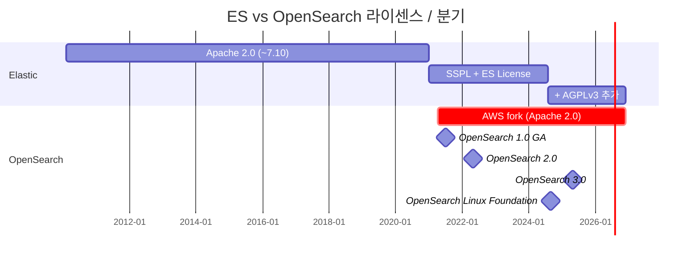
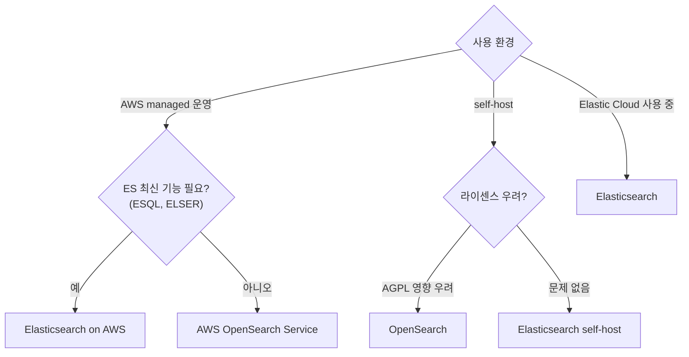

## 정의

**OpenSearch** = AWS 가 2021 년 *Elasticsearch 7.10* 에서 fork 한 *Apache 2.0 라이센스 search engine*. *Kibana → OpenSearch Dashboards* 도 함께 fork.

## 분기 타임라인



| 시점 | 이벤트 |
|---|---|
| 2021-01 | Elastic 가 SSPL + ES License 로 *전환* (AWS 비판) |
| 2021-04 | AWS 가 *OpenSearch 프로젝트 시작* |
| 2021-07 | OpenSearch 1.0 GA |
| 2022-05 | OpenSearch 2.0 |
| 2024-08 | Elastic 가 *AGPLv3 추가* (8.16+, OSI 호환 복귀) |
| 2024-09 | OpenSearch 가 *Linux Foundation* 으로 이관 |
| 2025-05 | OpenSearch 3.0 |

## ES vs OpenSearch 매트릭스 (2026-06)

| 항목 | Elasticsearch | OpenSearch |
|---|---|---|
| 라이센스 | *AGPLv3* + SSPL + ES License (3-way) | *Apache 2.0* |
| 거버넌스 | Elastic (단일 회사) | *Linux Foundation* (다 vendor) |
| Cloud (managed) | Elastic Cloud + 3rd party | *AWS OpenSearch Service* + Aiven, ScalyR 등 |
| 출발점 | original | ES 7.10 fork |
| ESQL | *예 (8.11+)* | PPL (Piped Processing Language) |
| Vector / kNN | *dense_vector + ELSER + semantic_text* | *kNN plugin + Neural Search* |
| ML 통합 | 강 | 강 (자체 ML Commons) |
| ILM / ISM | ILM | *ISM (Index State Management)* |
| Kibana 호환 | Kibana | *OpenSearch Dashboards* |
| API 호환 | (자체 진화) | ES 7.10 API + 자체 확장 |
| 학습 | 풍부 (긴 역사) | 빠르게 성장 |
| 사용자 | 큰 기업 + Elastic 생태계 | AWS 사용자 + 라이센스 회피 |

## 쿼리 언어 비교: ESQL vs PPL

두 포크는 각자 SQL-like 파이프 언어를 개발했다:

**Elasticsearch ESQL** (8.11+, GA 2024):

```sql
FROM logs-*
| WHERE @timestamp > NOW() - 7 days AND status_code >= 500
| STATS error_count = COUNT(*) BY service.name
| SORT error_count DESC
| LIMIT 10
```

**OpenSearch PPL** (Piped Processing Language):

```sql
search source=logs-*
| where timestamp > DATE_SUB(NOW(), INTERVAL 7 DAY) AND status_code >= 500
| stats count() as error_count by service_name
| sort - error_count
| head 10
```

| 항목 | ESQL | PPL |
|---|---|---|
| 기반 | Elasticsearch 자체 | OpenSearch |
| 문법 | `\|` 파이프 (ES 스타일) | `\|` 파이프 (Splunk 영향) |
| 집계 | `STATS ... BY` | `stats ... by` |
| 함수 | `DATE_TRUNC`, `BUCKET` 등 | `DATE_FORMAT`, `DATE_TRUNC` 등 |
| 자동 변환 | 없음 | 없음 |

> [!CAUTION]
> ESQL 과 PPL 은 *문법이 달라 자동 변환 도구 없음*. 마이그레이션 시 *수동 재작성* 필요.

## 기술적 차이 (2026 시점)

### Elasticsearch 만의 기능

- **ELSER** (Elastic Learned Sparse EncodeR): 영문 + 다국어 sparse embedding
- **semantic_text** field (8.15+): 자동 chunk + embedding + kNN 결합
- **ESQL** (Elasticsearch Query Language): GA 프로덕션 표준
- **Better Binary Quantization (BBQ)** (9.x): 벡터 압축 향상
- **Search AI Lake**: storage + compute 분리 아키텍처
- **Universal Profiling**: continuous profiling 통합

### OpenSearch 만의 기능

- **PPL** (Piped Processing Language): Splunk 친화 문법
- **Observability**: 자체 통합 (traces, metrics, logs)
- **Anomaly Detection**: 자체 ML 기반 이상 탐지
- **Security Analytics**: SIEM 통합 (MITRE ATT&CK 매핑)
- **Neural Search**: BM25 + vector hybrid
- **k-NN plugin with FAISS/NMSLIB**: 다양한 ANN 백엔드

> [!NOTE]
> 2026 시점 *기능 차이가 점점 벌어지고 있다*. *Elastic 의 ESQL + ELSER + semantic_text* 가 *상품 차별화*. OpenSearch 는 *AWS 통합 + ML Commons* 강조.

## Kibana vs OpenSearch Dashboards

| 항목 | Kibana | OpenSearch Dashboards |
|---|---|---|
| 기반 | Elastic 개발 | Kibana fork |
| 라이센스 | SSPL / Elastic License | Apache 2.0 |
| 기본 시각화 | ✅ | ✅ |
| ESQL 탐색기 | ✅ (Discover) | ❌ (PPL 사용) |
| Machine Learning | ✅ (anomaly, forecasting) | ✅ (ML Commons) |
| Alerting | ✅ | ✅ |
| Maps | ✅ (Elastic Maps) | ✅ |
| APM 통합 | ✅ (Elastic APM) | ✅ (Data Prepper) |
| Security (SIEM) | ✅ (Elastic Security) | ✅ (Security Analytics) |
| Canvas / Lens | ✅ | 제한적 |

## 결정 트리



## 마이그레이션 (ES ↔ OpenSearch)

| 방향 | 난이도 | 주의사항 |
|---|---|---|
| ES 7.10 → OpenSearch | *쉬움* (분기점) | API 거의 동일 |
| ES 8.x → OpenSearch | *중간* (API 차이 누적) | ESQL 제거 필요 |
| OpenSearch → ES 8.x | *어려움* (각자 자체 기능) | PPL, ISM, ML Commons 교체 필요 |

```bash
# Reindex via Snapshot 방식
# 1. 소스 클러스터에서 스냅샷 생성
PUT /_snapshot/my-repo/snapshot-1

# 2. 대상 클러스터에서 restore
POST /_snapshot/my-repo/snapshot-1/_restore
{
  "indices": "my-index",
  "rename_pattern": "(.+)",
  "rename_replacement": "migrated-$1"
}
```

> [!IMPORTANT]
> 클라이언트 라이브러리도 교체 필요: `elasticsearch-py` vs `opensearch-py`. API 서명 일부 차이.

## 다른 검색 엔진 (참고)

| 도구 | 특징 |
|---|---|
| **Apache Solr** | Lucene 위, ES 의 *직전 표준*. 옛 강함 |
| **Typesense** | Go, fast, 작은 데이터셋 |
| **Meilisearch** | Rust, dev 친화 UI |
| **Algolia** | SaaS, 매우 빠름 |
| **Vespa** (Yahoo) | scale + ML ranking |
| **Quickwit** | Rust, log 특화 |

## 흔한 함정

> [!WARNING]
> 1. **"OpenSearch 는 ES" 라고 가정** = API 비호환 영역 다수. 명시 테스트.
> 2. **AGPL 의 의미 오해** = *SaaS 노출* 시 *source 공개 의무* 가 켜진다. Elastic 가 AGPL 옵션 추가했지만, *상업 활용* 은 SSPL/ES License.
> 3. **ESQL → PPL 자동 변환** = *없음*. 마이그레이션 시 *수동 재작성*.
> 4. **클라이언트 라이브러리 혼용** = `elasticsearch-py` 와 `opensearch-py` 는 *같은 API 처럼 보이나 세부 차이* 있음. 명시적으로 교체.
> 5. **ISM vs ILM 정책 직접 이식** = 필드명, 조건 구문이 다름. 재작성 필요.

## 생태계 / 커뮤니티 비교

| 항목 | Elasticsearch | OpenSearch |
|---|---|---|
| GitHub Stars | ~68K (elastic/elasticsearch) | ~9K (opensearch-project) |
| 거버넌스 | Elastic (단일 회사) | Linux Foundation (중립) |
| 기여자 | Elastic 직원 위주 | AWS + 커뮤니티 |
| 릴리즈 주기 | 분기별 마이너 | 분기별 마이너 |
| Enterprise 지원 | Elastic 구독 | AWS Support, OpenSearch partners |
| 커뮤니티 포럼 | Elastic Discuss | OpenSearch Forum |

## 클라이언트 라이브러리 비교

```python
# Elasticsearch Python 클라이언트
from elasticsearch import Elasticsearch

es = Elasticsearch("https://localhost:9200", api_key=("id", "key"))
resp = es.search(index="logs", query={"match": {"message": "error"}})

# OpenSearch Python 클라이언트
from opensearchpy import OpenSearch

client = OpenSearch(hosts=[{"host": "localhost", "port": 9200}])
resp = client.search(index="logs", body={"query": {"match": {"message": "error"}}})
```

두 클라이언트의 API 는 유사하나 *패키지명, 인증 방식, 일부 고급 기능*에서 차이가 있다. 마이그레이션 시 *단순 패키지 교체로 안 되는 경우* 가 있으므로 통합 테스트 필수.

## 보안 플러그인 비교

| 기능 | Elasticsearch (기본 포함) | OpenSearch Security Plugin |
|---|---|---|
| TLS (노드간, HTTP) | ✅ (무료) | ✅ |
| 사용자 / 역할 기반 접근 제어 | ✅ (기본 제공) | ✅ |
| SAML / OIDC SSO | ✅ (Platinum+) | ✅ (무료) |
| 필드 / 문서 레벨 보안 | ✅ (Platinum+) | ✅ (무료) |
| 감사 로그 | ✅ (Gold+) | ✅ (무료) |

> OpenSearch 는 *보안 기능을 기본 무료* 제공. Elasticsearch 는 *Gold/Platinum 구독 필요* 영역이 있었으나 8.x 부터 일부 무료화.

## 관련 위키

- [[elasticsearch]]
- [[Redis]] (라이센스 분기 유사 사례)
- [[aws-iam]] (OpenSearch Service 권한)
