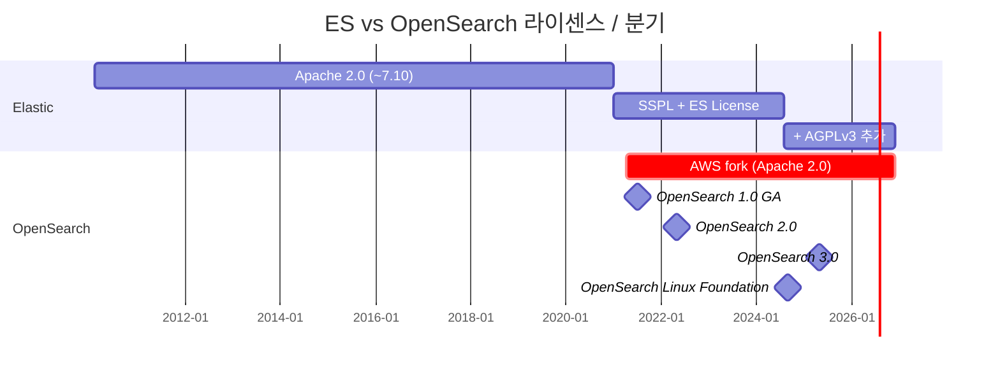
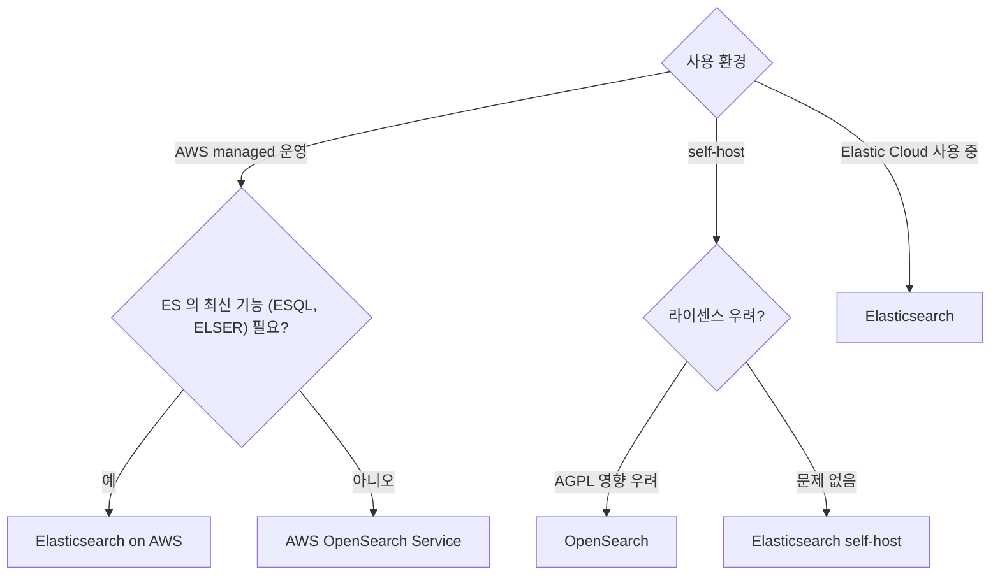

## 정의

**OpenSearch** = AWS 가 2021 년 *Elasticsearch 7.10* 에서 fork 한 *Apache 2.0 라이센스 search engine*. *Kibana → OpenSearch Dashboards* 도 함께 fork.

## 분기 타임라인

| 시점 | 이벤트 |
|---|---|
| 2021-01 | Elastic 가 SSPL + ES License 로 *전환* (AWS 비판) |
| 2021-04 | AWS 가 *OpenSearch 프로젝트 시작* |
| 2021-07 | OpenSearch 1.0 GA |
| 2022-05 | OpenSearch 2.0 |
| 2024-08 | Elastic 가 *AGPLv3 추가* (8.16+, OSI 호환 복귀) |
| 2024-09 | OpenSearch 가 *Linux Foundation* 으로 이관 |
| 2025-05 | OpenSearch 3.0 |

## ES vs OpenSearch 매트릭스 (2026-06)

| 항목 | Elasticsearch | OpenSearch |
|---|---|---|
| 라이센스 | *AGPLv3* + SSPL + ES License (3-way) | *Apache 2.0* |
| 거버넌스 | Elastic (단일 회사) | *Linux Foundation* (다 vendor) |
| Cloud (managed) | Elastic Cloud + 3rd party | *AWS OpenSearch Service* + Aiven, ScalyR 등 |
| 출발점 | original | ES 7.10 fork |
| ESQL | *예 (8.11+)* | PPL (Piped Processing Language) |
| Vector / kNN | *dense_vector + ELSER + semantic_text* | *kNN plugin + Neural Search* |
| ML 통합 | 강 | 강 (자체 ML Commons) |
| ILM / ISM | ILM | *ISM (Index State Management)* |
| Kibana 호환 | Kibana | *OpenSearch Dashboards* |
| API 호환 | (자체 진화) | ES 7.10 API + 자체 확장 |
| 학습 | 풍부 (긴 역사) | 빠르게 성장 |
| 사용자 | 큰 기업 + Elastic 생태계 | AWS 사용자 + 라이센스 회피 |

## 기술적 차이 (2026 시점)

### Elasticsearch 만의 기능

- **ELSER** (Elastic Learned Sparse EncodeR)
- **semantic_text** field (8.15+) 자동 chunk + embedding
- **ESQL** (Elasticsearch Query Language)
- **Better Binary Quantization (BBQ)** (9.x)
- **Search AI Lake** (storage 분리)
- **Universal Profiling** (continuous profiling)

### OpenSearch 만의 기능

- **PPL** (Piped Processing Language) - SQL-like
- **Observability** (자체 통합)
- **Anomaly Detection** (자체 ML)
- **Security Analytics** (SIEM)
- **Neural Search** (BM25 + vector hybrid)
- **k-NN plugin** with FAISS

> [!NOTE]
> 2026 시점 *기능 차이가 점점 벌어지고 있다*. *Elastic 의 ESQL + ELSER + semantic_text* 가 *상품 차별화*. OpenSearch 는 *AWS 통합 + ML Commons* 강조.

## 결정 트리

## 마이그레이션 (ES ↔ OpenSearch)

| 방향 | 난이도 |
|---|---|
| ES 7.10 → OpenSearch | *쉬움* (분기점) |
| ES 8.x → OpenSearch | *중간* (API 차이 누적) |
| OpenSearch → ES 8.x | *어려움* (각자 자체 기능) |

> Reindex API + *clients-migration* tool. 일반적 데이터는 OK, *고급 기능 (ESQL, ELSER, ML)* 은 호환성 깨짐.

## 다른 검색 엔진 (참고)

| 도구 | 특징 |
|---|---|
| **Apache Solr** | Lucene 위, ES 의 *직전 표준*. 옛 강함 |
| **Typesense** | Go, fast, 작은 데이터셋 |
| **Meilisearch** | Rust, dev 친화 UI |
| **Algolia** | SaaS, 매우 빠름 |
| **Vespa** (Yahoo) | scale + ML ranking |
| **Quickwit** | Rust, log 특화 |

## 흔한 함정

> [!WARNING]
> 1. **"OpenSearch 는 ES" 라고 가정** = API 비호환 영역 다수. 명시 테스트.
> 2. **AGPL 의 의미 오해** = *SaaS 노출* 시 *source 공개 의무* 가 켜진다. Elastic 가 AGPL 옵션 추가했지만, *상업 활용* 은 SSPL/ES License.
> 3. **ESQL → PPL 자동 변환** = *없음*. 마이그레이션 시 *수동 재작성*.

## 관련 위키

- [[elasticsearch]]
- [[Redis]] (라이센스 분기 유사 사례)
- [[aws-iam]] (OpenSearch Service 권한)
