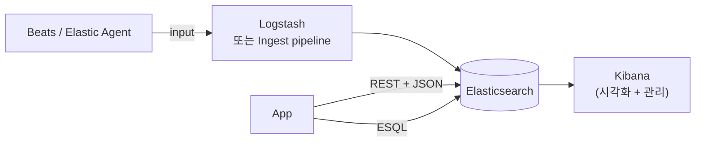
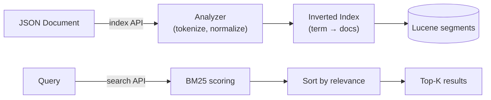
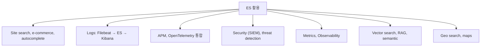

## 정의

**ElasticSearch** = *Apache Lucene* 위의 *분산 RESTful 검색/분석 엔진*. 2010 출시. *Logstash + Kibana + Beats* 와 함께 *Elastic Stack (옛 ELK)* 의 코어.

> [!IMPORTANT]
> 2026-06 시점 *세계 가장 많이 쓰이는 검색 엔진*. *전문 검색, 로그 분석, APM, SIEM, vector search, RAG* 의 *de facto*.

## 라이센스 분기 타임라인

| 시점 | 이벤트 |
|---|---|
| 2010 | ES 출시. Apache 2.0 |
| 2021-01 | **SSPL + ES License** 로 전환 (AWS 와의 갈등) |
| 2021-04 | **AWS 가 OpenSearch fork** (ES 7.10 기반, Apache 2.0) |
| 2024-08 | **Elastic 가 AGPLv3 추가** ([blog](https://www.elastic.co/blog/elasticsearch-is-open-source-again)). 8.16+ 부터 *AGPL/SSPL/ES License 3-way 선택* |
| 2026 | ES 9.x stable 운영. OpenSearch 도 계속 활성 |

> [!NOTE]
> *Elastic 가 다시 OSI 호환 라이센스 (AGPL)* 를 추가. *OpenSearch 와의 경쟁 + 사용자 신뢰 회복* 의 결합 결정. 단 *managed cloud 운영 제약* 은 SSPL 유지.

## 핵심 컴포넌트

| 컴포넌트 | 역할 |
|---|---|
| **Elasticsearch** | 분산 인덱스 + 검색 + 분석 |
| **Kibana** | UI, dashboard, dev tools, alerting |
| **Logstash** | 데이터 수집 + 변환 (옛). 현재 *Ingest pipeline* 이 대안 |
| **Beats** | 가벼운 shipper. **Elastic Agent** 로 통합 진행 중 |
| **Fleet** | Elastic Agent 의 중앙 관리 |

## ES 의 본질

- **JSON 문서** 단위 저장.
- 자동 *inverted index* 빌드.
- *near real-time* (인덱싱 후 1초 내 검색 가능).
- *RESTful + JSON*: HTTP 만 알면 사용.

자세한 원리는 [[elasticsearch-basics]].

## ES vs 다른 DB

| | ElasticSearch | RDBMS | MongoDB | Solr |
|---|---|---|---|---|
| 강점 | *full-text search* + analytics | 트랜잭션 | 문서 + flexible | full-text search |
| 약점 | 트랜잭션, write-heavy | full-text 약함 | 검색 약함 | 분산 운영 어려움 |
| Query | DSL + ESQL | SQL | MQL | DSL |
| Scaling | shard + replica | replica + read split | shard | shard |
| 사용 | search, log, APM | OLTP | 문서 + 모바일 | search (옛) |

## ES 8.x → 9.x 주요 변화

| 영역 | 8.x | 9.x (2025+) |
|---|---|---|
| **ESQL** | 도입 (8.11) | *프로덕션 표준* |
| **Vector** | dense_vector + kNN | quantization 자동, BBQ |
| **ELSER** | 영문 모델 (sparse) | 다국어 + v2 |
| **Inference API** | 외부 LLM 통합 | endpoint 확장 |
| **Bytes**/**Cost** | 기본 | *Search AI Lake* (storage 분리) |
| **Snapshots** | 지원 | searchable snapshots 강화 |

## 활용 카테고리

## 관련 위키 (이 클러스터)

운영자 시점의 *세부 페이지*:

- [[elasticsearch-basics]] (Lucene, inverted index, segment)
- [[elasticsearch-query]] (must / should / filter / must_not)
- [[elasticsearch-indexing]] (인덱싱 흐름, refresh, flush)
- [[elasticsearch-mapping]] (field type, dynamic mapping)
- [[elasticsearch-korean-indexing]] (nori, mecab, 한국어 분석)
- [[elasticsearch-sort]]
- [[elasticsearch-aggregations]] (metric, bucket, pipeline)
- [[elasticsearch-relevance-scoring]] (BM25, function_score)
- [[elasticsearch-vector-search]] (kNN, ELSER, RAG)
- [[elasticsearch-infrastructure]] (cluster, shard, replica, Beats, ILM)
- [[elasticsearch-vs-opensearch]] (라이센스 분기)

## 인접 위키

- [[Redis Vector Search]] (대안 vector store)
- [[mongodb]] (문서 DB)
- [[Kafka]] (로그 수집 파이프)
- [[prometheus]] (메트릭 대안)
- [[opentelemetry]] (관측)
