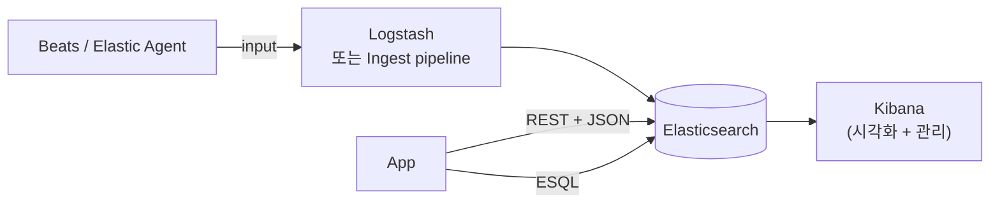
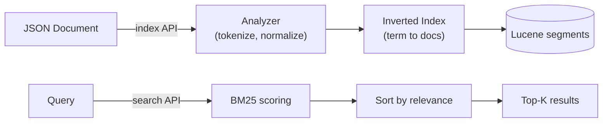
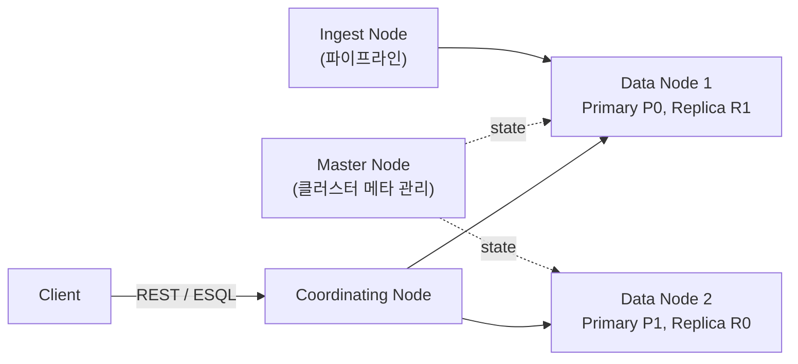
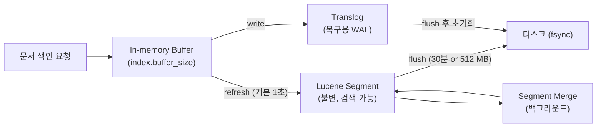
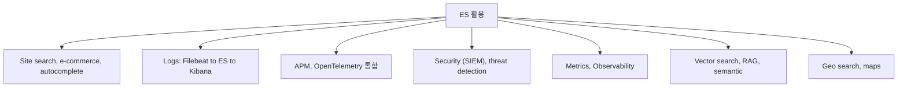

## 정의

**ElasticSearch** = *Apache Lucene* 위의 *분산 RESTful 검색/분석 엔진*. 2010 출시. *Logstash + Kibana + Beats* 와 함께 *Elastic Stack (옛 ELK)* 의 코어.

> [!IMPORTANT]
> 2026-06 시점 *세계 가장 많이 쓰이는 검색 엔진*. *전문 검색, 로그 분석, APM, SIEM, vector search, RAG* 의 *de facto*.

## 라이센스 분기 타임라인

| 시점 | 이벤트 |
|---|---|
| 2010 | ES 출시. Apache 2.0 |
| 2021-01 | **SSPL + ES License** 로 전환 (AWS 와의 갈등) |
| 2021-04 | **AWS 가 OpenSearch fork** (ES 7.10 기반, Apache 2.0) |
| 2024-08 | **Elastic 가 AGPLv3 추가** ([blog](https://www.elastic.co/blog/elasticsearch-is-open-source-again)). 8.16+ 부터 *AGPL/SSPL/ES License 3-way 선택* |
| 2026 | ES 9.x stable 운영. OpenSearch 도 계속 활성 |

> [!NOTE]
> *Elastic 가 다시 OSI 호환 라이센스 (AGPL)* 를 추가. *OpenSearch 와의 경쟁 + 사용자 신뢰 회복* 의 결합 결정. 단 *managed cloud 운영 제약* 은 SSPL 유지.

## 핵심 컴포넌트



| 컴포넌트 | 역할 |
|---|---|
| **Elasticsearch** | 분산 인덱스 + 검색 + 분석 |
| **Kibana** | UI, dashboard, dev tools, alerting |
| **Logstash** | 데이터 수집 + 변환 (옛). 현재 *Ingest pipeline* 이 대안 |
| **Beats** | 가벼운 shipper. **Elastic Agent** 로 통합 진행 중 |
| **Fleet** | Elastic Agent 의 중앙 관리 |

## ES 의 본질



- **JSON 문서** 단위 저장.
- 자동 *inverted index* 빌드.
- *near real-time* (인덱싱 후 1초 내 검색 가능).
- *RESTful + JSON*: HTTP 만 알면 사용.

자세한 원리는 [[elasticsearch-basics]].

## 역인덱스 (Inverted Index) 원리

*역인덱스* = **term → 문서 ID 목록** 매핑. Lucene 이 구현, ES 가 분산 래핑.

예시 문서:

| doc | 내용 |
|---|---|
| doc1 | "quick brown fox" |
| doc2 | "brown dog jumps" |
| doc3 | "quick dog runs" |

인덱스 결과:

| Term | Posting list |
|---|---|
| `quick` | doc1, doc3 |
| `brown` | doc1, doc2 |
| `fox` | doc1 |
| `dog` | doc2, doc3 |

검색 `quick AND dog` → `{doc1,doc3} ∩ {doc2,doc3}` = `doc3`. *O(1) 조회*.

텍스트 필드 분석 파이프라인:

1. **Character filter**: HTML 제거, 문자 변환
2. **Tokenizer**: 공백/구두점 기준 분리
3. **Token filter**: lowercase, stemming, stopword 제거

## 클러스터 / 노드 / 샤드 구조



| 노드 역할 | 설명 |
|---|---|
| *Master* | 클러스터 상태, 인덱스 생성/삭제, 샤드 할당 관리 |
| *Data* | 실제 문서 저장 + 검색 처리 |
| *Coordinating* | 요청 파싱 + 샤드 분산 + 결과 집합 |
| *Ingest* | 인덱싱 전처리 파이프라인 (Logstash 대안) |
| *ML* | ML 모델 실행 (유료 기능) |

**샤드 설계 원칙**:

- 샤드 1개 권장 최대 크기: *20-50 GB* (hot tier)
- 총 샤드 수 너무 많으면 클러스터 상태 비대화 → *오버샤딩이 최대 실수*
- Replica 는 *가용성 + 읽기 처리량* 향상. 쓰기는 느려짐
- `index.number_of_shards` 는 생성 시 결정. *변경 불가* (rollover 필요)

```json
PUT /my-index
{
  "settings": {
    "number_of_shards": 3,
    "number_of_replicas": 1
  }
}
```

샤드 라우팅 공식: `shard = hash(document_id) % number_of_primary_shards`

## 인덱싱 라이프사이클



| 단계 | 동작 | 기본값 |
|---|---|---|
| *Refresh* | 버퍼 → 세그먼트. 검색 가능 | `index.refresh_interval: 1s` |
| *Flush* | translog + 세그먼트 → 디스크 commit | 30분 or 512 MB |
| *Merge* | 작은 세그먼트 병합. 삭제 문서 실제 제거 | 백그라운드 자동 |

> [!IMPORTANT]
> *bulk 인덱싱 시 `refresh_interval: -1`* 설정 → 완료 후 수동 `POST /index/_refresh`. *5-10배 속도 향상*.

## JVM Heap 설정

```yaml
# jvm.options
-Xms16g
-Xmx16g   # 반드시 Xms = Xmx (동적 확장 방지)
```

| 규칙 | 이유 |
|---|---|
| *총 RAM 의 50% 이하* | 나머지 50% → OS page cache (Lucene file I/O) |
| *최대 30 GB* | JVM Compressed OOPs 활성 유지 |
| *Xms = Xmx* | 런타임 확장 방지 (GC pause 최소화) |
| *G1GC 기본 (7.0+)* | 큰 heap 의 pause time 안정화 |

> [!CAUTION]
> 32 GB 이상 heap 설정 시 compressed OOPs 비활성 → 포인터 크기 2배 → *오히려 느려짐*. 30 GB 이하 유지.

## ES vs 다른 DB

| | ElasticSearch | RDBMS | MongoDB | Solr |
|---|---|---|---|---|
| 강점 | *full-text search* + analytics | 트랜잭션 | 문서 + flexible | full-text search |
| 약점 | 트랜잭션, write-heavy | full-text 약함 | 검색 약함 | 분산 운영 어려움 |
| Query | DSL + ESQL | SQL | MQL | DSL |
| Scaling | shard + replica | replica + read split | shard | shard |
| 사용 | search, log, APM | OLTP | 문서 + 모바일 | search (옛) |

## ES 8.x → 9.x 주요 변화

| 영역 | 8.x | 9.x (2025+) |
|---|---|---|
| **ESQL** | 도입 (8.11) | *프로덕션 표준* |
| **Vector** | dense_vector + kNN | quantization 자동, BBQ |
| **ELSER** | 영문 모델 (sparse) | 다국어 + v2 |
| **Inference API** | 외부 LLM 통합 | endpoint 확장 |
| **Bytes/Cost** | 기본 | *Search AI Lake* (storage 분리) |
| **Snapshots** | 지원 | searchable snapshots 강화 |

## 활용 카테고리



## 운영 함정

> [!WARNING]
> 1. **오버샤딩** = 샤드 수 / 노드 > 20 이상이면 클러스터 상태 비대 → master 부하. *작은 인덱스 = 적은 샤드*.
> 2. **dynamic mapping 방치** = 예측 못한 필드 자동 매핑 → *매핑 폭발 + 타입 충돌*. `dynamic: strict` 로 관리.
> 3. **deep pagination (`from: 10000+`)** = 메모리 + 속도 문제. *search_after* 또는 *scroll API* 사용.
> 4. **Index 를 Alias 없이 직접 노출** = 인덱스 재생성 (rolling) 불가. 처음부터 *alias* 로 추상화.
> 5. **snapshot 없는 운영** = 클러스터 다운 시 복구 방법 없음. *Snapshot + ILM* 필수.
> 6. **heap 32 GB 초과** = compressed OOPs 비활성 → 성능 역전. 30 GB 이하 유지.

## 관련 위키 (이 클러스터)

운영자 시점의 *세부 페이지*:

- [[elasticsearch-basics]] (Lucene, inverted index, segment)
- [[elasticsearch-query]] (must / should / filter / must_not)
- [[elasticsearch-indexing]] (인덱싱 흐름, refresh, flush)
- [[elasticsearch-mapping]] (field type, dynamic mapping)
- [[elasticsearch-korean-indexing]] (nori, mecab, 한국어 분석)
- [[elasticsearch-sort]]
- [[elasticsearch-aggregations]] (metric, bucket, pipeline)
- [[elasticsearch-relevance-scoring]] (BM25, function_score)
- [[elasticsearch-vector-search]] (kNN, ELSER, RAG)
- [[elasticsearch-infrastructure]] (cluster, shard, replica, Beats, ILM)
- [[elasticsearch-vs-opensearch]] (라이센스 분기)

## 인접 위키

- [[Redis Vector Search]] (대안 vector store)
- [[mongodb]] (문서 DB)
- [[Kafka]] (로그 수집 파이프)
- [[prometheus]] (메트릭 대안)
- [[opentelemetry]] (관측)
