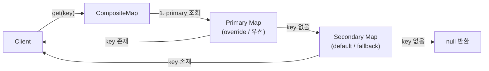
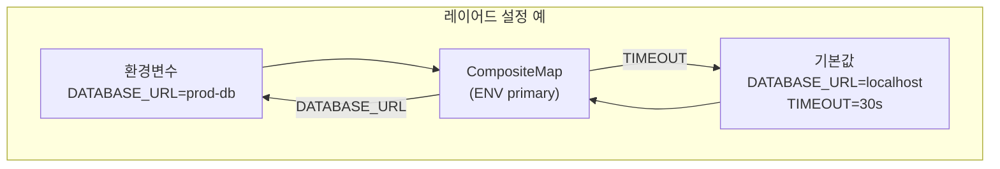

## 정의

**`org.springframework.util.CompositeMap<K,V>`** 는 두 개의 Map 을 **하나의 view 로 합쳐서** 보여주는 read-mostly 자료구조. 첫 번째 Map 이 우선, 없으면 두 번째 Map 을 본다.

**`org.springframework.util.CompositeIterator<E>`** 는 여러 Iterator 를 순차적으로 이어 붙여 하나의 iterator 처럼 제공.

둘 다 "여러 소스의 데이터를 하나로 본다" 는 Composite 패턴의 도우미. 데이터를 실제로 병합(merge) 하지 않고 **뷰(view)** 만 제공하므로 메모리 절약.

## 사용 상황

| 상황 | 설명 |
|:---|:---|
| 환경별 설정 | 기본값 Map + 환경 오버라이드 Map 을 하나로 |
| L1/L2 캐시 | 빠른 캐시(primary) 에 없으면 느린 캐시(secondary) 조회 |
| 부모-자식 BeanDefinition | 부모 정의 위에 자식 정의 overlay |
| 다중 properties 소스 | `.properties`, 환경변수, Vault 를 하나처럼 조회 |

## 레이어드 조회 흐름





## CompositeMap

```java
import org.springframework.util.CompositeMap;

Map<String, Integer> primary = Map.of("a", 1, "b", 2);
Map<String, Integer> secondary = Map.of("b", 99, "c", 3);

CompositeMap<String, Integer> composite = new CompositeMap<>(primary, secondary);

composite.get("a");   // 1 (primary)
composite.get("b");   // 2 (primary 우선, secondary 의 99 무시)
composite.get("c");   // 3 (secondary fallback)
composite.get("d");   // null

composite.size();     // 3 (a, b, c - 중복 key 는 1개로 카운트)
composite.keySet();   // [a, b, c]
composite.entrySet(); // [{a=1}, {b=2}, {c=3}]
```

### put 은 primary 에만

```java
// put 은 primary 맵에만 들어감 (secondary 는 불변 취급)
Map<String, Integer> primary = new HashMap<>(Map.of("a", 1));
Map<String, Integer> secondary = Map.of("b", 99, "c", 3);

CompositeMap<String, Integer> composite = new CompositeMap<>(primary, secondary);
composite.put("d", 4);   // primary 에 추가

primary.get("d");        // 4
secondary.get("d");      // null (secondary 건드리지 않음)
```

### 불변 primary 로 사용 (read-only view)

```java
// primary, secondary 모두 불변 Map 이면 CompositeMap 도 사실상 read-only
Map<String, String> defaults = Map.of("timeout", "30s", "retries", "3");
Map<String, String> overrides = Map.of("timeout", "60s");

CompositeMap<String, String> config = new CompositeMap<>(overrides, defaults);
config.get("timeout");    // "60s" (override)
config.get("retries");    // "3" (default)
```

## CompositeIterator

여러 컬렉션을 실제로 합치지 않고 순차 순회:

```java
import org.springframework.util.CompositeIterator;

List<Integer> a = List.of(1, 2, 3);
List<Integer> b = List.of(4, 5);
List<Integer> c = List.of(6);

CompositeIterator<Integer> it = new CompositeIterator<>();
it.add(a.iterator());
it.add(b.iterator());
it.add(c.iterator());

while (it.hasNext()) {
    System.out.print(it.next() + " ");
}
// 출력: 1 2 3 4 5 6
```

```java
// Stream 으로 변환
Iterable<Integer> iterable = () -> {
    CompositeIterator<Integer> ci = new CompositeIterator<>();
    ci.add(a.iterator());
    ci.add(b.iterator());
    return ci;
};

StreamSupport.stream(iterable.spliterator(), false)
    .filter(n -> n % 2 == 0)
    .forEach(System.out::println);   // 2 4 6
```

### remove 지원

`CompositeIterator` 는 `remove()` 를 지원한다. 현재 순회 중인 원본 컬렉션(mutable) 에서 항목 제거.

```java
List<String> list1 = new ArrayList<>(List.of("a", "b", "c"));
List<String> list2 = new ArrayList<>(List.of("d", "e"));

CompositeIterator<String> it = new CompositeIterator<>();
it.add(list1.iterator());
it.add(list2.iterator());

while (it.hasNext()) {
    String v = it.next();
    if (v.equals("b") || v.equals("d")) {
        it.remove();     // list1 또는 list2 에서 제거
    }
}
// list1: [a, c], list2: [e]
```

## 실전 패턴

### 환경별 설정 레이어

```java
@Configuration
public class ConfigLayerConfig {

    @Bean
    public Map<String, String> appConfig(
        @Value("#{systemEnvironment}") Map<String, String> envVars,
        @Value("#{applicationProperties}") Map<String, String> appProps
    ) {
        // 환경변수가 우선, 없으면 application.properties
        return new CompositeMap<>(envVars, appProps);
    }
}
```

### 다중 캐시 계층 (L1/L2)

```java
public class LayeredCache<K, V> {
    private final Map<K, V> l1;   // 빠른 로컬 캐시 (small)
    private final Map<K, V> l2;   // 느린 원격 캐시 (large)

    private final CompositeMap<K, V> composite;

    public LayeredCache(int l1Size, Map<K, V> l2) {
        this.l1 = new LinkedHashMap<>(l1Size, 0.75f, true) {
            @Override
            protected boolean removeEldestEntry(Map.Entry<K,V> e) {
                return size() > l1Size;
            }
        };
        this.l2 = l2;
        this.composite = new CompositeMap<>(l1, l2);
    }

    public V get(K key) {
        return composite.get(key);    // L1 먼저, 없으면 L2
    }

    public void put(K key, V value) {
        l1.put(key, value);           // L1 에 넣음
    }
}
```

### Spring PropertySource 스타일

```java
public class LayeredPropertySource {
    private final List<Map<String, String>> sources = new ArrayList<>();

    public void addFirst(Map<String, String> source) {
        sources.add(0, source);
    }

    public void addLast(Map<String, String> source) {
        sources.add(source);
    }

    public String getProperty(String key) {
        // 앞에서부터 찾기
        return sources.stream()
            .filter(m -> m.containsKey(key))
            .map(m -> m.get(key))
            .findFirst()
            .orElse(null);
    }
}
```

실제 Spring `PropertySources` 는 더 복잡하지만 동일한 철학.

## 한계 및 함정

> [!WARNING]
> **Thread-safe 가 아니다**. `CompositeMap` 과 `CompositeIterator` 모두 단일 스레드 전용. 멀티 스레드에서 공유하면 외부 동기화 필요.

> [!IMPORTANT]
> **`size()` 와 `entrySet()` 은 중복 key 를 한 번만 카운트**. primary 에 `"a"=1`, secondary 에 `"a"=99` 가 있으면 `size()` 에서 `"a"` 는 1회만 카운트되고, `get("a")` 는 `1` 을 반환한다.

> [!CAUTION]
> **secondary 수정 시 동작**: `put()` 은 primary 에만 쓴다. secondary 를 직접 수정하면 CompositeMap 에 반영되지만, secondary 불변 Map(`Map.of(...)`) 을 직접 수정하려 하면 `UnsupportedOperationException`.

> [!WARNING]
> **`entrySet().iterator().remove()` 지원 여부**: 구현에 따라 다름. primary Map 이 mutable 이어야 한다.

## CompositeIterator 함정

```java
// 동일 iterator 를 두 번 add 하면 순서 꼬임
List<Integer> list = List.of(1, 2, 3);
CompositeIterator<Integer> ci = new CompositeIterator<>();
ci.add(list.iterator());
ci.add(list.iterator());    // 같은 소스를 두 번 순회 (1 2 3 1 2 3 출력)
```

## 관련 위키

- [[Map]] - Java Map 인터페이스
- [[Iterable]] - Java Iterable, for-each 지원
- [[spring-multi-value-map]] - MultiValueMap, 여러 값을 가진 Map
- [[spring-linked-case-insensitive-map]] - 대소문자 무관 Map
- [[spring-concurrent-lru-cache]] - 동시성 LRU 캐시
- [[spring-bean-lifecycle]] - BeanDefinition parent-child 합성
