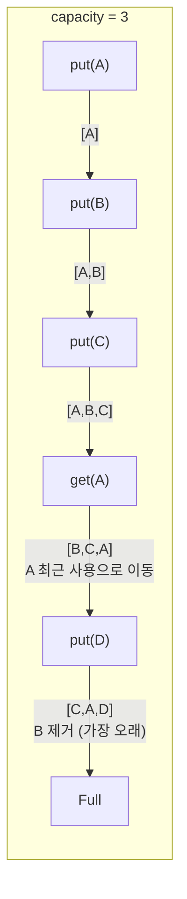
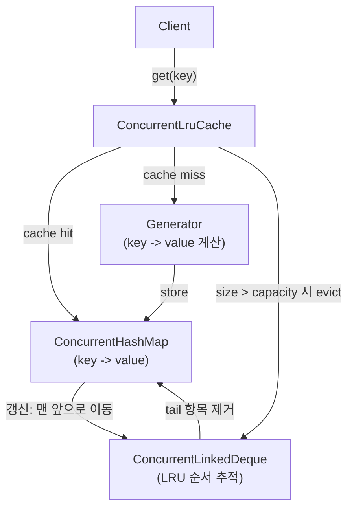

## 정의

**`org.springframework.util.ConcurrentLruCache<K,V>`** 는 Spring 5.3+ 의 thread-safe LRU (Least Recently Used) 캐시. 크기 제한이 있고, 가장 오래 사용하지 않은 항목부터 제거.

내부적으로 [[ConcurrentHashMap]] + [[ConcurrentLinkedDeque]] (또는 유사한 자료구조) 조합으로 **동시성** 과 **LRU 순서** 를 함께 지원.

## LRU 알고리즘 기본



- 캐시가 가득 차면 **가장 오래 사용하지 않은 항목** (LRU) 이 제거된다.
- `get()` 을 호출하면 해당 항목이 "최근 사용됨" 으로 갱신된다.
- `put()` 은 히트 시 값 갱신, 미스 시 새 항목 추가 후 용량 초과면 LRU 항목 제거.

## 내부 구조



핵심 동시성 설계:
- `ConcurrentHashMap` : key-value 저장 (read-write 세분화 락)
- `ConcurrentLinkedDeque` : LRU 순서 추적 (lock-free)
- 항목 접근 시 deque 에서 tail 로 이동 (최근 사용 표시)
- 용량 초과 시 deque head 항목 제거

## 사용

### 기본 생성 (generator 패턴)

```java
import org.springframework.util.ConcurrentLruCache;

// capacity 1000, 미스 시 로더 자동 호출
ConcurrentLruCache<String, User> cache = new ConcurrentLruCache<>(
    1000,
    key -> userRepository.findByUsername(key)   // 미스 시 자동 실행
);

// get() 은 캐시 미스 시 generator 호출 후 저장
User alice = cache.get("alice");    // 미스: DB 조회 -> 저장
User alice2 = cache.get("alice");   // 히트: 캐시 반환
```

`get(key)` 는 `computeIfAbsent` 와 유사하게 동작하는 **generator 패턴**. 별도 null 체크 없이 항상 값을 반환한다.

### 주요 API

```java
ConcurrentLruCache<String, String> cache = new ConcurrentLruCache<>(100, key -> "computed_" + key);

cache.get("foo");          // 있으면 반환, 없으면 generator 실행
cache.contains("foo");     // 포함 여부 (순서 갱신 없음)
cache.size();              // 현재 항목 수
cache.capacity();          // 최대 용량
cache.remove("foo");       // 항목 제거
cache.clear();             // 전체 제거
```

### Spring Bean 으로 등록

```java
@Configuration
public class CacheConfig {

    @Bean
    public ConcurrentLruCache<String, Product> productCache(ProductRepository repo) {
        return new ConcurrentLruCache<>(500, repo::findByCode);
    }
}

@Service
@RequiredArgsConstructor
public class ProductService {
    private final ConcurrentLruCache<String, Product> productCache;

    public Product getProduct(String code) {
        return productCache.get(code);
    }

    public void evictProduct(String code) {
        productCache.remove(code);
    }
}
```

## 실제 사용 사례

### Spring 내부 사용

Spring Framework 가 내부적으로 `ConcurrentLruCache` 를 사용하는 주요 지점:

| 컨텍스트 | 용도 |
|:---|:---|
| `ReflectionUtils` | 리플렉션 결과 캐싱 (메서드, 필드 조회) |
| `AnnotationUtils` | 어노테이션 메타데이터 캐시 |
| 일부 Bean 메타데이터 | BeanDefinition 파생 정보 |
| `PathPatternParser` | URL 패턴 파싱 결과 |

### 실전 패턴: 외부 서비스 결과 캐시

```java
@Service
public class ExchangeRateService {
    // 통화쌍 -> 환율, 최대 50개 쌍 캐시
    private final ConcurrentLruCache<String, BigDecimal> rateCache =
        new ConcurrentLruCache<>(50, this::fetchRate);

    private BigDecimal fetchRate(String pair) {
        // 외부 API 호출 (느림)
        return exchangeApiClient.getRate(pair);
    }

    public BigDecimal getRate(String from, String to) {
        return rateCache.get(from + "_" + to);
    }

    public void invalidate(String from, String to) {
        rateCache.remove(from + "_" + to);
    }
}
```

### 실전 패턴: 파싱 결과 캐시

```java
@Component
public class TemplateEngine {
    // 자주 쓰는 템플릿 파싱 결과 캐시
    private final ConcurrentLruCache<String, CompiledTemplate> templateCache =
        new ConcurrentLruCache<>(200, TemplateParser::parse);

    public String render(String templateName, Map<String, Object> context) {
        return templateCache.get(templateName).render(context);
    }
}
```

## LinkedHashMap LRU 와의 비교

```java
// LinkedHashMap LRU (단일 스레드)
Map<String, String> lruMap = new LinkedHashMap<>(16, 0.75f, true) {   // accessOrder=true
    @Override
    protected boolean removeEldestEntry(Map.Entry<String, String> eldest) {
        return size() > 100;
    }
};
```

| 항목 | LinkedHashMap LRU | ConcurrentLruCache |
|:---|:---|:---|
| Thread-safe | X (외부 동기화 필요) | O |
| LRU 순서 유지 | O (accessOrder=true) | O |
| Generator 내장 | X (직접 구현) | O |
| 생성 비용 | 낮음 | 중간 |
| 동시 처리량 | 낮음 (단일 락) | 높음 (세분화 락) |
| 용도 | 단일 스레드, 간단한 캐시 | 멀티 스레드 환경 |

단일 스레드 환경에서는 `LinkedHashMap` 이 더 가볍다.

## Caffeine 과의 비교

Caffeine 은 LRU 보다 **W-TinyLFU** 알고리즘 사용. 적중률이 LRU 보다 높다.

| 항목 | ConcurrentLruCache | Caffeine |
|:---|:---|:---|
| 알고리즘 | LRU | W-TinyLFU |
| 의존성 | Spring 내장 | 외부 (caffeine jar) |
| 적중률 | 보통 | 높음 (LRU 대비 약 10-30%) |
| 기능 | 기본 | TTL, 통계, 가중치, 비동기 로딩 |
| Spring Boot Cache 통합 | 직접 | @EnableCaching + Caffeine 자동 설정 |
| 적합 | 경량 내부 캐시 | 프로덕션 애플리케이션 캐시 |

```xml
<!-- Caffeine 의존성 -->
<dependency>
    <groupId>com.github.ben-manes.caffeine</groupId>
    <artifactId>caffeine</artifactId>
</dependency>
```

```java
// Spring Boot @Cacheable + Caffeine
@Configuration
public class CaffeineCacheConfig {
    @Bean
    public CacheManager cacheManager() {
        CaffeineCacheManager manager = new CaffeineCacheManager("products");
        manager.setCaffeine(Caffeine.newBuilder()
            .maximumSize(500)
            .expireAfterWrite(10, TimeUnit.MINUTES)
            .recordStats());
        return manager;
    }
}

@Service
public class ProductService {
    @Cacheable("products")
    public Product findByCode(String code) { ... }

    @CacheEvict("products")
    public void invalidate(String code) { }
}
```

대규모 캐시, TTL 필요, 통계 필요 시에는 Caffeine 권장.

## 함정

> [!WARNING]
> **Generator 는 동기 호출**. `ConcurrentLruCache` 의 generator 는 동기 함수여야 한다. 외부 API 를 generator 로 넣으면 캐시 미스 시 해당 스레드가 블로킹된다. 비동기 로딩이 필요하면 Caffeine 의 `AsyncLoadingCache` 사용.

> [!IMPORTANT]
> **`contains()` 는 순서를 갱신하지 않는다**. LRU 순서를 갱신하려면 `get()` 을 사용해야 한다. `contains()` 는 순수 존재 여부만 확인.

> [!CAUTION]
> **capacity 0 허용 안 됨**. `new ConcurrentLruCache<>(0, ...)` 는 `IllegalArgumentException`. capacity 는 1 이상.

> [!WARNING]
> **`size()` 는 근사치가 아니라 정확한 값**이지만, 호출 시점에 다른 스레드의 삽입/제거가 동시 진행 중일 수 있어 즉시 스냅샷이 아님.

## 성능 특성

- `get()`: O(1) 평균 (ConcurrentHashMap 조회 + Deque 재배치)
- `remove()`: O(1)
- `capacity` 초과 eviction: O(1)
- 적합한 용량: 수십 ~ 수천 개 항목. 수십만 항목이라면 Caffeine 이 더 적합.

## 관련 위키

- [[Map]] - Java Map 인터페이스
- [[ConcurrentHashMap]] - 내부 key-value 저장소
- [[LinkedHashMap]] - 단일 스레드 LRU 구현 기반
- [[ConcurrentLinkedDeque]] - 내부 LRU 순서 추적
- [[spring-cache]] - @Cacheable, @CacheEvict, Spring Cache 추상화
- [[spring-concurrent-reference-hashmap]] - WeakReference 기반 캐시 대안
