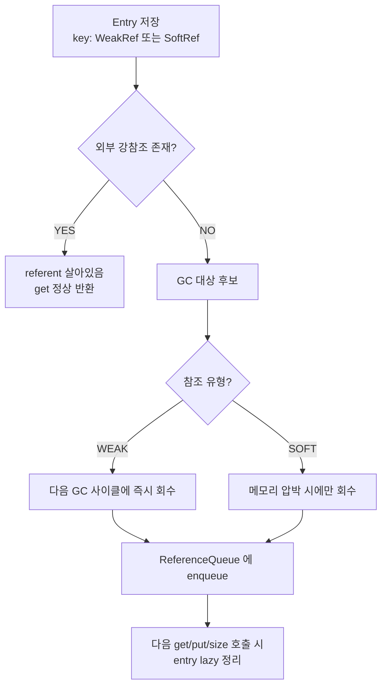

## 정의

**`org.springframework.util.ConcurrentReferenceHashMap<K,V>`** 는 Spring Framework 의 핵심 유틸리티. **`ConcurrentHashMap` 의 동시성** 과 **`WeakReference` / `SoftReference` 의 GC 친화성** 을 결합한 Map.

JDK 표준에 없는 조합. **메모리 압박 시 GC 가 entry 를 회수** 할 수 있도록 설계된 Map. Spring 내부의 reflection 캐시, 어노테이션 메타데이터 캐시 등 **장수 실행 환경에서 메모리 누수를 방지** 하는 곳에 광범위하게 사용된다.

## 시각화

```anim:spring-crh
{}
```

## 왜 필요한가, JDK 만으로 부족한 이유

| Map | 동시성 | GC 친화 |
|:---|:---:|:---:|
| `HashMap` | ✗ | ✗ |
| [[ConcurrentHashMap]] | ✓ | ✗ |
| `WeakHashMap` | ✗ | ✓ (key 약참조) |
| `Collections.synchronizedMap(new WeakHashMap<>())` | △ (전체 락) | ✓ |
| **`ConcurrentReferenceHashMap`** | ✓ | ✓ (key / value 약참조 선택) |

JDK 의 `WeakHashMap` 은 thread-safe 가 아니다. 그를 `synchronizedMap` 으로 감싸면 모든 read/write 가 직렬화되어 성능이 처참하다. Spring 은 **둘을 진짜로 결합** 한 자료구조를 제공.

## 핵심 사용법

```java
import org.springframework.util.ConcurrentReferenceHashMap;

// 기본, key 가 weak reference
Map<Class<?>, Metadata> cache = new ConcurrentReferenceHashMap<>();

// 사이즈, concurrency level 명시
Map<Class<?>, Metadata> cache2 = new ConcurrentReferenceHashMap<>(
    256,            // initial capacity
    16              // concurrency level
);

// 참조 유형 명시
Map<Class<?>, Metadata> softCache = new ConcurrentReferenceHashMap<>(
    256,
    ConcurrentReferenceHashMap.ReferenceType.SOFT   // key 가 soft reference
);
```

`ReferenceType` 옵션:
- **`SOFT`**: 메모리 부족 시에만 회수 (캐시에 적합)
- **`WEAK`**: GC 가 돌면 즉시 회수 가능 (강한 참조 끊긴 키)

## 내부 구조 (간략)

Spring 의 구현은 ConcurrentHashMap (Java 7 시절) 의 **segment-based** 설계를 차용. 단, 각 entry 가 `WeakReference` 또는 `SoftReference` 로 감싸진다.

```text
ConcurrentReferenceHashMap
├── Segment[]          (concurrencyLevel 만큼 분할)
│   └── ReferenceManager
│       └── References (WeakReference 또는 SoftReference)
│            └── Entry { key, value, hash, next }
└── ReferenceQueue     (회수된 reference 추적)
```

- **Segment 별 락**, 동시성 확보
- **ReferenceQueue** 로 GC 가 회수한 entry 를 lazy 정리

## get 의 흐름

1. `key.hashCode()` 로 segment 결정
2. segment 안에서 hash 로 chain 찾기
3. 각 reference 의 `referent` 확인
4. **referent 가 null** (GC 가 회수했음) 이면 chain 에서 제거 후 다음으로
5. 일치하는 entry 발견 시 value 반환, 못 찾으면 null

읽기는 락 없이 가능 (volatile + 약참조). 쓰기는 segment 락 안에서.

## 가장 흔한 사용 사례

### 1. Reflection 캐시

```java
private static final Map<Class<?>, Method[]> METHOD_CACHE
    = new ConcurrentReferenceHashMap<>();

public static Method[] getMethods(Class<?> cls) {
    return METHOD_CACHE.computeIfAbsent(cls, Class::getDeclaredMethods);
}
```

Class 가 더 이상 참조되지 않으면 (예: classloader 가 unload) entry 도 자연스럽게 사라진다. JDK 의 `WeakHashMap` 으로도 가능하지만 thread-safe 가 아니다.

### 2. 어노테이션 메타데이터 캐시

Spring 의 `AnnotationUtils`, `MergedAnnotations` 등이 내부적으로 이 자료구조를 사용. 한 번 분석한 어노테이션 메타데이터를 캐시하면서, 그 어노테이션을 가진 클래스가 사라지면 캐시도 자동 정리.

### 3. ApplicationContext 의 빈 메타데이터

`DefaultListableBeanFactory.singletonObjects` 는 일반 `ConcurrentHashMap` 이지만, 일부 보조 캐시 (예: `mergedBeanDefinitions`) 가 `ConcurrentReferenceHashMap` 으로 구현된 경우가 있다.

## ClassLoader Leak 방지

Spring 같은 long-running JVM (Tomcat, application server) 에서는 **클래스로더 누수 (classloader leak)** 가 가장 무서운 메모리 문제. 한 번 로드된 클래스가 GC 되지 못해 누적되면 결국 OOM.

```java
// ❌ 함정 - 강한 참조로 Class 를 들고 있음
private static final Map<Class<?>, Metadata> CACHE = new ConcurrentHashMap<>();
// → Class 가 사라지면 안 되는데, 우리 캐시가 그걸 막고 있음

// ✓ 정답
private static final Map<Class<?>, Metadata> CACHE
    = new ConcurrentReferenceHashMap<>();   // key 약참조
// → Class 가 unload 가능, 캐시도 따라 정리
```

이 이유로 Spring framework 코드 곳곳에 `ConcurrentReferenceHashMap` 이 보인다.

## 함정

### 1. value 가 강참조여서 key 와 entanglement

기본은 **key 약참조 + value 강참조**. value 가 key 를 강참조하면 의미가 없다.

```java
// ❌ value 가 key 를 보유 → key 가 GC 안 됨
Map<MyKey, KeyAndData> cache = new ConcurrentReferenceHashMap<>();
cache.put(myKey, new KeyAndData(myKey, data));   // value 안에 key 의 강참조
// 이제 myKey 는 외부 참조가 다 끊겨도 cache 안에서 살아 있음
```

value 가 key 를 참조하지 않도록 설계.

### 2. 캐시 효과를 너무 믿지 말 것

SOFT/WEAK 모두 **언제든 회수** 될 수 있다. 그러므로 캐시 미스에 대비한 fallback 이 항상 필요.

```java
Method[] methods = cache.get(cls);
if (methods == null) {
    methods = cls.getDeclaredMethods();   // 재계산
    cache.put(cls, methods);
}
```

`computeIfAbsent` 가 이 패턴을 안전하고 원자적으로 처리한다.

### 3. 회수된 entry 의 정리 시점

GC 가 reference 를 회수해도 Map 의 내부 자료구조에서 그 entry 가 **즉시 사라지지는 않는다**. 다음 access (get/put/size) 때 발견되어 정리. 따라서 `size()` 가 약간 과대 평가된 값을 보일 수 있다.

## 다른 Map 옵션과의 선택 기준

| 시나리오 | 권장 |
|:---|:---|
| 동시성 + key 가 long-lived | [[ConcurrentHashMap]] |
| 동시성 + key 가 GC 대상 가능 | **ConcurrentReferenceHashMap** |
| 단일 스레드 + key GC 대상 | `WeakHashMap` |
| 동시성 + 메모리 압박에만 회수 | ConcurrentReferenceHashMap (SOFT) |
| Identity 비교 (`==`) | `IdentityHashMap` |
| 정렬 유지 | `ConcurrentSkipListMap` |
| 단순 가벼운 동시성 | `Collections.synchronizedMap(...)` |

## Spring 6 / Boot 3 에서의 위치

여전히 Spring Core 의 핵심 유틸리티. Java 21 의 Virtual Threads 환경에서도 동시성과 GC 친화성이 모두 필요해 의미가 사라지지 않는다.

## GC 참조 회수 흐름



- `WEAK`: `WeakReference` 방식. 강참조가 끊기면 다음 GC 에 회수. 실행 중 재로드 가능한 클래스 로더 캐시에 적합.
- `SOFT`: `SoftReference` 방식. 메모리 여유가 있으면 유지, 부족하면 GC 가 회수. 비용이 큰 연산의 캐시에 적합.

## Caffeine / Guava Cache 와의 비교

| 특성 | ConcurrentReferenceHashMap | Caffeine | Guava Cache |
|:---|:---|:---|:---|
| 의존성 | Spring Core 내장 | 별도 라이브러리 | 별도 라이브러리 |
| GC 기반 제거 | ✓ (WEAK/SOFT) | ✓ (weakKeys/softValues) | ✓ (weakKeys/softValues) |
| TTL/Size 기반 제거 | ✗ | ✓ | ✓ |
| 통계 수집 | ✗ | ✓ | ✓ |
| 사용 목적 | 프레임워크 내부 캐시 | 애플리케이션 레벨 캐시 | 애플리케이션 레벨 캐시 |

**결론**: 애플리케이션 레벨 캐시에는 Caffeine 을 쓰고, 프레임워크 내부 자료구조나 Spring 기반 유틸리티에는 `ConcurrentReferenceHashMap` 이 적합. Spring 의 `@Cacheable` 을 쓸 때 CacheManager 로는 Caffeine 을 연동하는 것이 일반적이다. [[spring-cache]] 참고.

## Virtual Thread 환경 (Spring 6.1+ / JDK 21+)

Virtual Thread 환경에서도 `ConcurrentReferenceHashMap` 의 segment-based 잠금 구조는 유효하다. Platform Thread 보다 수십 배 많은 Virtual Thread 가 동시 접근해도 segment 분할 덕분에 경합이 희석된다.

다만 Virtual Thread 에서 ThreadLocal 과 연계된 캐시를 만들 때는 주의. Virtual Thread 는 수백만 개가 생성될 수 있어 ThreadLocal 남용 시 메모리 폭발 위험이 있다. 자세히는 [[spring-virtual-threads]] 참고.

## 성능 관찰

`size()` 는 내부적으로 회수된 entry 를 걸러 계산하므로, 호출 시점마다 결과가 달라질 수 있다. 또한 GC 회수 후 실제 제거는 다음 접근 때까지 지연된다.

모니터링 팁:

```java
// 현재 entry 수 (약간 과대 평가될 수 있음)
int approxSize = cache.size();

// 직접 순회로 실 개수 확인
long actual = cache.entrySet().stream().count();
```

## 테스트 고려사항

GC 의존 동작은 테스트에서 재현하기 어렵다. 통합 테스트에서 GC 회수를 강제하려면:

```java
@Test
void entryShouldBeReclaimedAfterGc() {
    Map<Object, String> cache = new ConcurrentReferenceHashMap<>();
    Object key = new Object();
    cache.put(key, "value");

    key = null;              // 강참조 해제
    System.gc();             // GC 힌트 (보장 안 됨)
    System.runFinalization();

    // size 가 0 이 되거나 get 이 null 반환해야 함
    // 실제 CI 환경에서 flaky 할 수 있으므로 단위 테스트보다 관찰 로그 선호
    assertThat(cache.get(key)).isNull();
}
```

CI 환경에서는 GC 타이밍이 불확정이므로, 회수 동작은 단위 테스트보다 장기 실행 시나리오나 JVM memory profiler 로 확인하는 것이 실용적이다.

## 참고

- [[ConcurrentHashMap]]
- [[volatile]]
- [[ReentrantLock]]
- [[spring-cache]]
- [[spring-virtual-threads]]
