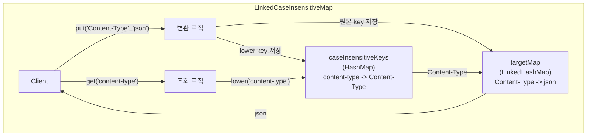

## 정의

**`org.springframework.util.LinkedCaseInsensitiveMap<V>`** 는 [[LinkedHashMap]] 을 기반으로 **key 비교를 대소문자 무시** 로 하는 Map. 단, 원본 key (대소문자 보존) 도 유지.

HTTP 헤더 같은 도메인에서 `"Content-Type"` 과 `"content-type"` 을 같은 key 로 다뤄야 할 때 핵심. Spring 의 `HttpHeaders` 등에서 내부적으로 사용.

## 사용 상황

HTTP 스펙(RFC 7230)은 헤더 이름을 **대소문자 불구(case-insensitive)** 로 다루도록 규정한다. 클라이언트마다 `Content-Type`, `content-type`, `CONTENT-TYPE` 이 혼재할 수 있다.

```
// 잘못된 비교 (일반 HashMap)
headers.put("Content-Type", "application/json");
headers.get("content-type");    // null!

// 올바른 비교 (LinkedCaseInsensitiveMap)
headers.put("Content-Type", "application/json");
headers.get("content-type");    // "application/json"
```

## 내부 구조



내부 필드:

```java
private final LinkedHashMap<String, V> targetMap;
private final HashMap<String, String> caseInsensitiveKeys;  // lower -> original
private final Locale locale;    // 기본 Locale.ENGLISH
```

`put(key, value)` 시:
1. `targetMap.put(key, value)` - 원본 key 로 저장
2. `caseInsensitiveKeys.put(key.toLowerCase(locale), key)` - lower 매핑

`get(key)` 시:
1. `caseInsensitiveKeys.get(key.toLowerCase(locale))` - original key 조회
2. `targetMap.get(originalKey)` - 실제 값 조회

## 사용 예시

### 기본 사용

```java
import org.springframework.util.LinkedCaseInsensitiveMap;

Map<String, String> m = new LinkedCaseInsensitiveMap<>();
m.put("Content-Type", "application/json");
m.put("Accept", "text/html");
m.put("X-Custom-Header", "value");

// 대소문자 무관 조회
m.get("content-type");       // "application/json"
m.get("CONTENT-TYPE");       // "application/json"
m.get("accept");             // "text/html"
m.containsKey("accept");     // true
m.containsKey("ACCEPT");     // true

// keySet 은 원본 key 보존
m.keySet();                  // ["Content-Type", "Accept", "X-Custom-Header"]

// 덮어쓰기: 대소문자 달라도 같은 key 취급
m.put("content-type", "text/plain");    // Content-Type 값을 text/plain 으로 교체
m.size();                               // 3 (key 가 추가 안 됨)
```

### Locale 지정

터키어 등에서 i/I 변환이 다르므로 Locale 을 명시할 수 있다.

```java
// 기본: Locale.ENGLISH
Map<String, String> m = new LinkedCaseInsensitiveMap<>(10, Locale.ENGLISH);
```

### 초기 용량

```java
// 예상 항목 수를 미리 지정해 rehash 최소화
Map<String, String> headers = new LinkedCaseInsensitiveMap<>(16);
```

## HttpHeaders 와의 연관

Spring `HttpHeaders` 는 내부적으로 `LinkedCaseInsensitiveMap` 을 사용한다.

```java
// spring-web: HttpHeaders 내부
public class HttpHeaders implements MultiValueMap<String, String> {
    private final MultiValueMap<String, String> headers;

    public HttpHeaders() {
        this(CollectionUtils.toMultiValueMap(new LinkedCaseInsensitiveMap<>(8, Locale.ENGLISH)));
    }
}
```

따라서 `HttpHeaders` 로 헤더를 다루면 자동으로 대소문자 무관 동작:

```java
HttpHeaders headers = new HttpHeaders();
headers.set("Content-Type", "application/json");

// 모두 동일 결과
headers.getFirst("content-type");   // "application/json"
headers.getFirst("CONTENT-TYPE");   // "application/json"
headers.getContentType();           // MediaType.APPLICATION_JSON
```

## Spring MVC 에서 만나는 곳

```java
// @RequestHeader 로 받을 때
@GetMapping("/test")
public ResponseEntity<Void> test(
    @RequestHeader("Content-Type") String contentType,   // 대소문자 무관으로 매칭
    HttpHeaders headers                                   // 전체 헤더 (LinkedCaseInsensitiveMap 기반)
) {
    String ct = headers.getFirst("content-type");        // 정상 동작
    return ResponseEntity.ok().build();
}
```

```java
// RestClient / WebClient 응답 헤더
RestClient client = RestClient.create();
ResponseEntity<String> response = client.get()
    .uri("https://example.com/api")
    .retrieve()
    .toEntity(String.class);

HttpHeaders responseHeaders = response.getHeaders();
String contentType = responseHeaders.getFirst("content-type");   // 안전하게 조회
```

## HashMap vs LinkedCaseInsensitiveMap 비교

| 항목 | HashMap | LinkedCaseInsensitiveMap |
|:---|:---|:---|
| key 비교 | 정확한 equals/hashCode | 대소문자 무관 |
| 삽입 순서 보장 | X | O (LinkedHashMap 기반) |
| 원본 key 보존 | O | O |
| Thread-safe | X | X |
| 메모리 | 낮음 | 약 2배 (두 개의 내부 맵) |
| 용도 | 일반 | HTTP 헤더, case-insensitive 도메인 |

## 어디서 만나는가

| 클래스 / 컨텍스트 | 용도 |
|:---|:---|
| `HttpHeaders` | HTTP 헤더 이름 case-insensitive |
| `MockHttpServletRequest` (Spring Test) | 테스트 헤더 |
| `RestClient` / `WebClient` 응답 | 응답 헤더 처리 |
| `MergedAnnotations` (일부 메타데이터) | 어노테이션 속성 탐색 |
| 설정 property 로딩 (일부 환경) | 대소문자 무관 키 |

직접 만들 일은 드물지만, Spring API 가 반환하는 경우가 있어 동작을 알고 있어야 한다.

## 직접 사용 예시: 커스텀 헤더 처리기

```java
public class HeaderExtractor {
    private final Map<String, String> normalized = new LinkedCaseInsensitiveMap<>();

    public void load(HttpServletRequest request) {
        Enumeration<String> names = request.getHeaderNames();
        while (names.hasMoreElements()) {
            String name = names.nextElement();
            normalized.put(name, request.getHeader(name));
        }
    }

    public Optional<String> get(String headerName) {
        return Optional.ofNullable(normalized.get(headerName));
    }
}

// 사용
HeaderExtractor extractor = new HeaderExtractor();
extractor.load(request);
extractor.get("authorization");     // 대소문자 무관
extractor.get("AUTHORIZATION");     // 동일 결과
```

## 함정

> [!WARNING]
> **Thread-safe 가 아니다**. `LinkedHashMap` 처럼 단일 스레드 전용. 멀티 스레드에서 공유하면 반드시 외부 동기화 필요.
>
> ```java
> // 잘못된 예: 여러 스레드가 공유 맵에 쓰기
> private static final Map<String, String> sharedHeaders = new LinkedCaseInsensitiveMap<>();
>
> // 올바른 예: 동기화 래핑
> private static final Map<String, String> syncHeaders =
>     Collections.synchronizedMap(new LinkedCaseInsensitiveMap<>());
> ```

> [!IMPORTANT]
> **keySet() 은 원본 대소문자 반환**. 대소문자 변환된 key 가 아니라 처음 `put()` 할 때의 원본 key 가 반환된다.
>
> ```java
> m.put("Content-Type", "json");
> m.put("content-type", "xml");   // 같은 key, 덮어씀
> m.keySet();    // ["Content-Type"] (원본)
> m.get("content-type");    // "xml" (최신 값)
> ```

> [!CAUTION]
> **Locale 의존 소문자 변환**: 기본은 `Locale.ENGLISH`. 터키어(`tr`) Locale 에서는 `"I".toLowerCase()` 가 `"i"` 가 아닌 `"ı"` 가 될 수 있다. HTTP 헤더에는 ASCII 범위 문자만 있으므로 일반적으로 문제 없지만, 커스텀 도메인에서 비ASCII 키를 쓴다면 Locale 명시 권장.

## 관련 위키

- [[Map]] - Java Map 인터페이스
- [[LinkedHashMap]] - 내부 백킹 자료구조
- [[ConcurrentHashMap]] - Thread-safe 대안
- [[spring-multi-value-map]] - MultiValueMap, 헤더의 실제 저장 구조
- [[spring-mvc]] - HTTP 헤더 처리 맥락
- [[spring-restclient]] - 응답 헤더 조회
