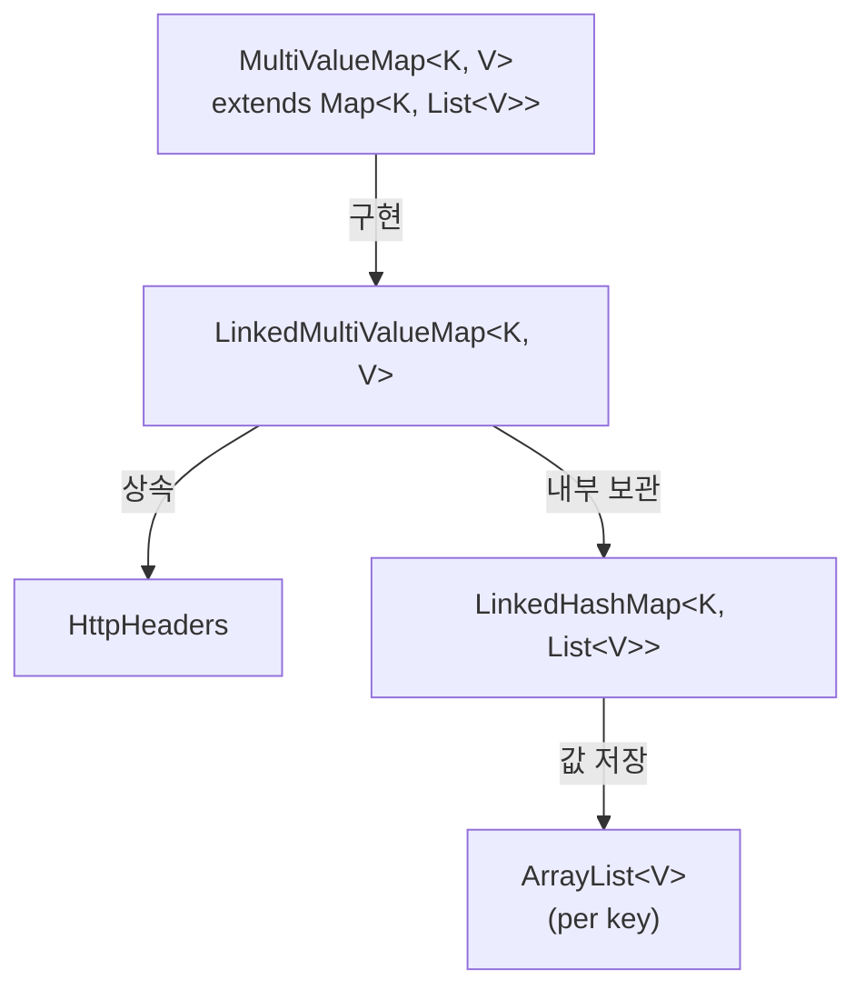
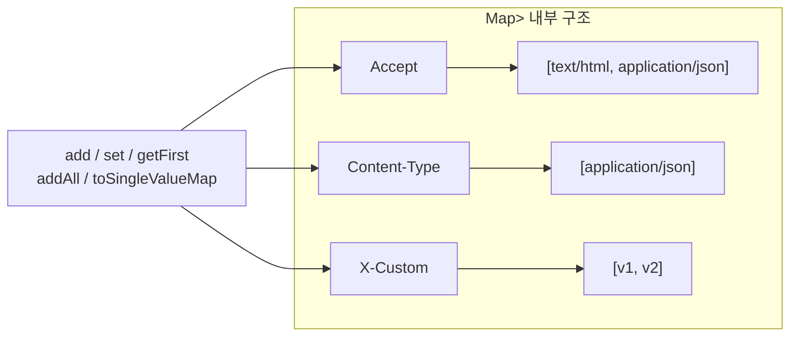

## 정의

**`org.springframework.util.MultiValueMap<K,V>`** 는 **하나의 key 에 여러 value 가 매핑되는 Map** 인터페이스. 형식적으로는 `Map<K, List<V>>` 의 sugared 형태.

**`LinkedMultiValueMap<K,V>`** 는 그 기본 구현체, 내부적으로 `LinkedHashMap<K, List<V>>` 를 보관 (삽입 순서 유지).

Spring 의 HTTP 추상화 (`HttpHeaders`), QueryParam 처리, form 데이터 처리 등에서 **광범위하게 사용** 된다. HTTP 헤더가 **같은 이름의 여러 값** (`Accept: text/html`, `Accept: application/json`) 을 가질 수 있다는 점에서 자연스러운 자료구조.

## 시각화

```anim:spring-multi-value-map
{}
```

## 인터페이스

```java
public interface MultiValueMap<K, V> extends Map<K, List<V>> {
    V getFirst(K key);                  // 첫 번째 값 (편의)
    void add(K key, V value);           // 같은 key 에 값 추가
    void addAll(K key, List<? extends V> values);
    void addAll(MultiValueMap<K, V> values);
    void set(K key, V value);           // 기존 값 모두 대체, 단일 값으로
    void setAll(Map<K, V> values);
    Map<K, V> toSingleValueMap();       // 첫 값만 골라 단일 Map 으로
}
```

기존 `Map<K, List<V>>` 의 모든 메서드도 사용 가능 (extends Map).

## 가장 흔한 사용 예

### HTTP 헤더

```java
HttpHeaders headers = new HttpHeaders();   // LinkedMultiValueMap 의 서브클래스
headers.add("Accept", "text/html");
headers.add("Accept", "application/json");
headers.add("X-Custom", "v1");

headers.getFirst("Accept");                // "text/html"
headers.get("Accept");                     // ["text/html", "application/json"]
```

HTTP/1.1 에서 같은 헤더 이름이 여러 번 등장하는 케이스를 자연스럽게 표현. `HttpHeaders` 는 사실상 LinkedMultiValueMap 의 도메인 특화 버전.

### 폼 데이터

```java
MultiValueMap<String, String> formData = new LinkedMultiValueMap<>();
formData.add("user", "alice");
formData.add("interest", "java");
formData.add("interest", "spring");

// WebClient 로 POST
webClient.post()
    .uri("/submit")
    .body(BodyInserters.fromFormData(formData))
    .retrieve()
    .toBodilessEntity();
```

`<input type="checkbox" name="interest" multiple>` 같은 multiple 폼 필드 표현.

### 쿼리 파라미터

```java
MultiValueMap<String, String> params = new LinkedMultiValueMap<>();
params.add("filter", "active");
params.add("filter", "premium");
params.add("sort", "name");

UriComponentsBuilder.fromHttpUrl("https://api.example.com/users")
    .queryParams(params)
    .build()
    .toUriString();
// → https://api.example.com/users?filter=active&filter=premium&sort=name
```

## 직접 `Map<String, List<V>>` 와 비교

```java
// 기존 방식
Map<String, List<String>> raw = new HashMap<>();
raw.computeIfAbsent("Accept", k -> new ArrayList<>()).add("text/html");
raw.computeIfAbsent("Accept", k -> new ArrayList<>()).add("application/json");

// MultiValueMap 사용
MultiValueMap<String, String> mvm = new LinkedMultiValueMap<>();
mvm.add("Accept", "text/html");
mvm.add("Accept", "application/json");
```

`MultiValueMap.add(...)` 는 내부적으로 같은 `computeIfAbsent` 패턴을 수행. 호출 측이 그걸 매번 쓸 필요가 없다는 것이 장점.

## LinkedMultiValueMap 의 내부

```java
public class LinkedMultiValueMap<K, V> implements MultiValueMap<K, V>, ... {
    private final Map<K, List<V>> targetMap;

    public LinkedMultiValueMap() {
        this.targetMap = new LinkedHashMap<>();
    }

    @Override
    public void add(K key, V value) {
        List<V> values = this.targetMap.computeIfAbsent(
            key, k -> new ArrayList<>(1));
        values.add(value);
    }
}
```

- **`LinkedHashMap`** 백킹 → key 삽입 순서 유지
- 각 key 마다 `ArrayList` 보관, 초기 capacity 1 (대부분의 헤더가 단일 값이므로)

> [!IMPORTANT]
> **thread-safe 가 아니다.** 동시 환경에서 쓰려면 외부 동기화 또는 `Collections.synchronizedMap(...)` 으로 감싸야 한다. HTTP 요청 처리 중에는 보통 단일 스레드이므로 문제가 안 생긴다.

## set vs add

| 메서드 | 동작 |
|:---|:---|
| `add(key, value)` | 기존 값 List 에 append |
| `set(key, value)` | 기존 값 List 를 **완전히 대체**, 단일 값 List 로 |
| `put(key, list)` | 기존 List 를 새 List 로 대체 (`Map.put` 그대로) |

```java
mvm.add("k", "a");      // {k: [a]}
mvm.add("k", "b");      // {k: [a, b]}
mvm.set("k", "c");      // {k: [c]}     ← a, b 사라짐
mvm.put("k", List.of("d", "e"));  // {k: [d, e]}
```

## toSingleValueMap 의 함정

```java
MultiValueMap<String, String> mvm = ...;
mvm.add("k", "a");
mvm.add("k", "b");

Map<String, String> single = mvm.toSingleValueMap();
// {k: "a"}  ← 두 번째 값이 누락
```

**값이 둘 이상이면 첫 값만 살아남고 나머지는 버려진다.** 단일 값이라고 단정할 수 있을 때만 사용. HTTP 헤더의 경우 위험 (Set-Cookie, Vary 등은 여러 값이 의미를 가짐).

## 다른 MultiValueMap 구현

Spring 에는 몇 가지 변형이 있다.

| 구현 | 특징 |
|:---|:---|
| **LinkedMultiValueMap** | 기본, LinkedHashMap 기반 |
| **HttpHeaders** | LinkedMultiValueMap 서브, 헤더 도메인 메서드 추가 |
| **CollectionUtils.toMultiValueMap(Map)** | 기존 `Map<K, List<V>>` 를 wrapping |
| **HttpHeaders.readOnlyHttpHeaders** | 불변 view |

## JDK 에 비슷한 게 있나

JDK 표준 라이브러리에는 **MultiMap 인터페이스가 없다**. 비슷한 패턴이 필요하면 다음 옵션.

| 옵션 | 장단점 |
|:---|:---|
| `Map<K, List<V>>` + `computeIfAbsent` | 단순, 매번 코드 반복 |
| **Spring MultiValueMap** | 간결, Spring 의존성 |
| Apache Commons Collections, MultiValuedMap | 외부 라이브러리 |
| Guava, ListMultimap / SetMultimap | 가장 풍부한 API, 외부 라이브러리 |

Spring 프로젝트라면 MultiValueMap, 그 외에는 Guava 가 대안.

## Guava 와의 비교

```java
// Spring MultiValueMap
MultiValueMap<String, String> spring = new LinkedMultiValueMap<>();
spring.add("k", "v1");
spring.add("k", "v2");

// Guava Multimap
Multimap<String, String> guava = ArrayListMultimap.create();
guava.put("k", "v1");
guava.put("k", "v2");
```

API 가 비슷하지만 다른 점.

- Guava 는 **`Map` 을 확장하지 않는다**, 별도 인터페이스. 그래서 `Map` 으로 받는 코드와 호환 안 됨.
- Spring 은 **`extends Map<K, List<V>>`** 라 기존 Map 메서드 그대로 사용 가능.
- Guava 는 `SetMultimap`, `ListMultimap`, `BiMap` 등 더 다양한 변형.

Spring 안에서는 Spring 의 것을 그대로 쓰는 것이 호환성과 통합 면에서 최선.

## 구조 시각화





## WebClient 와 함께

Spring WebFlux 의 `WebClient` 에서 MultiValueMap 은 쿼리 파라미터, 폼 데이터 전송에 핵심.

```java
// 쿼리 파라미터
MultiValueMap<String, String> params = new LinkedMultiValueMap<>();
params.add("status", "active");
params.add("status", "pending");

WebClient.create()
    .get()
    .uri(uriBuilder -> uriBuilder
        .path("/api/users")
        .queryParams(params)
        .build())
    .retrieve()
    .bodyToFlux(User.class);

// 폼 전송 (application/x-www-form-urlencoded)
MultiValueMap<String, String> form = new LinkedMultiValueMap<>();
form.add("username", "alice");
form.add("role", "admin");
form.add("role", "user");

WebClient.create()
    .post()
    .uri("/submit")
    .contentType(MediaType.APPLICATION_FORM_URLENCODED)
    .body(BodyInserters.fromFormData(form))
    .retrieve()
    .toBodilessEntity();
```

## RestTemplate 과 함께

```java
HttpHeaders headers = new HttpHeaders();
headers.setContentType(MediaType.APPLICATION_FORM_URLENCODED);
headers.add("X-Request-ID", "abc-123");

MultiValueMap<String, String> body = new LinkedMultiValueMap<>();
body.add("field1", "value1");
body.add("tag", "A");
body.add("tag", "B");

HttpEntity<MultiValueMap<String, String>> request = new HttpEntity<>(body, headers);

restTemplate.postForEntity("/api/endpoint", request, Void.class);
```

## @RequestParam 에서의 역할

Spring MVC 에서 같은 이름 파라미터 여러 개를 `MultiValueMap` 이나 `List` 로 받는다.

```java
// GET /search?tag=spring&tag=java&tag=jpa
@GetMapping("/search")
public List<Article> search(@RequestParam MultiValueMap<String, String> params) {
    List<String> tags = params.get("tag");     // [spring, java, jpa]
    String sort = params.getFirst("sort");      // null if absent
    return articleService.search(tags, sort);
}

// 또는 List 로 바로
@GetMapping("/search")
public List<Article> search(@RequestParam(name = "tag") List<String> tags) {
    return articleService.findByTags(tags);
}
```

## UriComponentsBuilder 패턴

URL 생성 시 MultiValueMap 으로 쿼리 파라미터 빌드.

```java
MultiValueMap<String, String> query = new LinkedMultiValueMap<>();
query.add("category", "spring");
query.add("category", "java");
query.add("page", "0");
query.add("size", "20");

String url = UriComponentsBuilder
    .fromHttpUrl("https://api.example.com/articles")
    .queryParams(query)
    .encode()
    .toUriString();
// → https://api.example.com/articles?category=spring&category=java&page=0&size=20
```

## 불변 view 패턴

읽기 전용 MultiValueMap 이 필요할 때.

```java
MultiValueMap<String, String> mutable = new LinkedMultiValueMap<>();
mutable.add("key", "val1");
mutable.add("key", "val2");

// Spring 의 읽기 전용 view
MultiValueMap<String, String> readOnly = CollectionUtils.unmodifiableMultiValueMap(mutable);

// HttpHeaders 에서 읽기 전용
HttpHeaders readOnlyHeaders = HttpHeaders.readOnlyHttpHeaders(headers);
// readOnlyHeaders.add("x", "y");  ← UnsupportedOperationException
```

## 참고

- [[Collection]]
- [[ConcurrentHashMap]]
