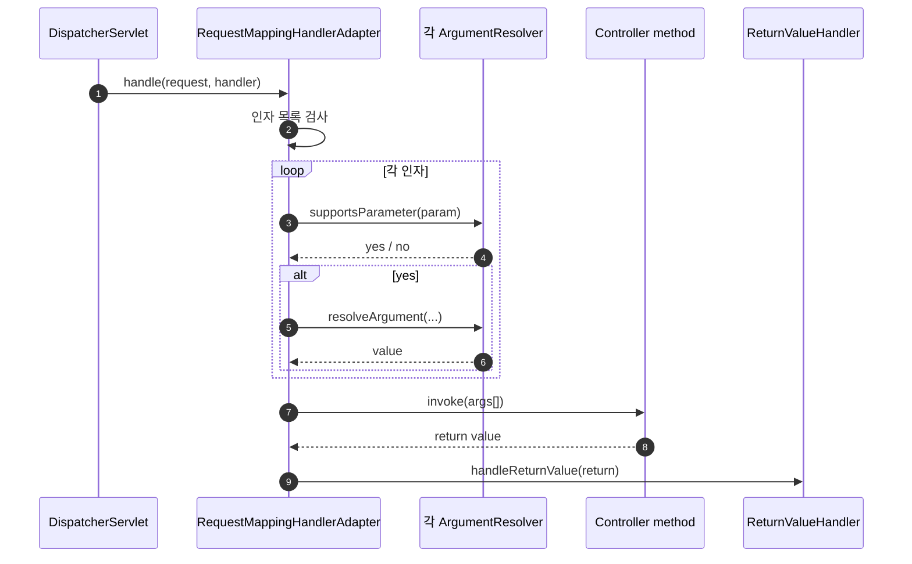
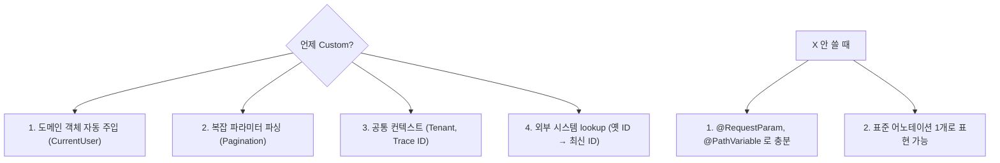

## 정의

**HandlerMethodArgumentResolver** = *컨트롤러 메서드 인자를 어떻게 채울지 결정* 하는 확장점. Spring 의 *수십 개 표준 resolver* + *커스텀 resolver* 추가 가능.

```anim:java-servlet-filter-chain
{}
```

> Filter chain 의 일반 직관. ArgumentResolver 도 *체인* 형태로 *적합한 resolver 가 처리* (Chain of Responsibility 패턴).

## 표준 ArgumentResolver

| 어노테이션 / 타입 | resolver |
|---|---|
| `@PathVariable` | PathVariableMethodArgumentResolver |
| `@RequestParam` | RequestParamMethodArgumentResolver |
| `@RequestBody` | RequestResponseBodyMethodProcessor |
| `@RequestHeader` | RequestHeaderMethodArgumentResolver |
| `@CookieValue` | ServletCookieValueMethodArgumentResolver |
| `@ModelAttribute` | ModelAttributeMethodProcessor |
| `Model`, `ModelMap` | ModelMethodProcessor |
| `Locale` | LocaleResolver |
| `HttpServletRequest` | ServletRequestMethodArgumentResolver |
| `Authentication`, `Principal` | AuthenticationPrincipalArgumentResolver |
| `MultipartFile` | RequestPartMethodArgumentResolver |
| `Pageable` (Spring Data) | PageableHandlerMethodArgumentResolver |

## 흐름



## Custom ArgumentResolver: 예시

### 1. 어노테이션 정의

```java
@Target(ElementType.PARAMETER)
@Retention(RetentionPolicy.RUNTIME)
public @interface CurrentUser { }
```

### 2. Resolver 구현

```java
@Component
public class CurrentUserArgumentResolver implements HandlerMethodArgumentResolver {

    private final UserService userService;

    @Override
    public boolean supportsParameter(MethodParameter parameter) {
        return parameter.hasParameterAnnotation(CurrentUser.class)
            && parameter.getParameterType().equals(User.class);
    }

    @Override
    public Object resolveArgument(
        MethodParameter parameter,
        ModelAndViewContainer mavContainer,
        NativeWebRequest webRequest,
        WebDataBinderFactory binderFactory
    ) throws Exception {
        Authentication auth = (Authentication) webRequest.getUserPrincipal();
        if (auth == null || !auth.isAuthenticated()) return null;

        String username = auth.getName();
        return userService.findByUsername(username);
    }
}
```

### 3. 등록

```java
@Configuration
public class WebConfig implements WebMvcConfigurer {

    private final CurrentUserArgumentResolver currentUserResolver;

    @Override
    public void addArgumentResolvers(List<HandlerMethodArgumentResolver> resolvers) {
        resolvers.add(currentUserResolver);
    }
}
```

### 4. 사용

```java
@RestController
public class UserController {

    @GetMapping("/me")
    public User me(@CurrentUser User user) {
        return user;
    }
}
```

## 사례: API Pagination

```java
@Target(ElementType.PARAMETER)
@Retention(RetentionPolicy.RUNTIME)
public @interface ParsedPagination {
    int defaultSize() default 20;
    int maxSize() default 100;
}

public record Pagination(int page, int size, String sort) { }

@Component
public class PaginationResolver implements HandlerMethodArgumentResolver {

    @Override
    public boolean supportsParameter(MethodParameter parameter) {
        return parameter.getParameterType() == Pagination.class;
    }

    @Override
    public Object resolveArgument(...) {
        ParsedPagination ann = parameter.getParameterAnnotation(ParsedPagination.class);
        int defSize = ann != null ? ann.defaultSize() : 20;
        int maxSize = ann != null ? ann.maxSize() : 100;

        HttpServletRequest req = webRequest.getNativeRequest(HttpServletRequest.class);
        int page = parseInt(req.getParameter("page"), 1);
        int size = Math.min(parseInt(req.getParameter("size"), defSize), maxSize);
        String sort = req.getParameter("sort");

        return new Pagination(page, size, sort);
    }
}

@GetMapping("/users")
public List<User> list(@ParsedPagination Pagination p) {
    return userService.find(p);
}
```

## ReturnValueHandler: 반환값 처리

```java
@Component
public class ApiResponseReturnValueHandler implements HandlerMethodReturnValueHandler {

    private final HandlerMethodReturnValueHandler delegate;

    @Override
    public boolean supportsReturnType(MethodParameter returnType) {
        return returnType.hasMethodAnnotation(ApiResponse.class);
    }

    @Override
    public void handleReturnValue(
        Object returnValue,
        MethodParameter returnType,
        ModelAndViewContainer mavContainer,
        NativeWebRequest webRequest
    ) throws Exception {
        Map<String, Object> wrapped = Map.of(
            "success", true,
            "data", returnValue,
            "timestamp", Instant.now()
        );
        delegate.handleReturnValue(wrapped, returnType, mavContainer, webRequest);
    }
}
```

> 모든 컨트롤러 응답을 *공통 래퍼 (`{success, data, timestamp}`)* 로.

## 표준 vs Custom 비교



## 옛 방식 vs 새 방식

```java
// ❌ 매 컨트롤러마다 코드 반복
@GetMapping("/me")
public User me(HttpServletRequest req) {
    String username = (String) req.getSession().getAttribute("username");
    if (username == null) throw new UnauthorizedException();
    return userService.findByUsername(username);
}

// ✓ Custom resolver 로 매 메서드 한 줄
@GetMapping("/me")
public User me(@CurrentUser User user) {
    return user;
}
```

## 흔한 함정

> [!WARNING]
> 1. **`supportsParameter` 너무 광범위** = 다른 인자도 처리 시도. *어노테이션 + 타입 둘 다* 검사.
> 2. **Resolver 에서 *비즈니스 로직*** = 단순 *값 채우기* 만. 비즈니스는 service.
> 3. **`HttpServletRequest` 직접 의존** = 테스트 어려움. `NativeWebRequest` 추상화.
> 4. **Resolver 등록 안 함** = 적용 안 됨. `WebMvcConfigurer.addArgumentResolvers`.

## 관련 위키

- [[spring-mvc]]
- [[spring-mvc-form-handling]]
- [[spring-mvc-model-bindingresult]]
- [[spring-handler-interceptor]]
- [[spring-dispatcher-servlet]]
