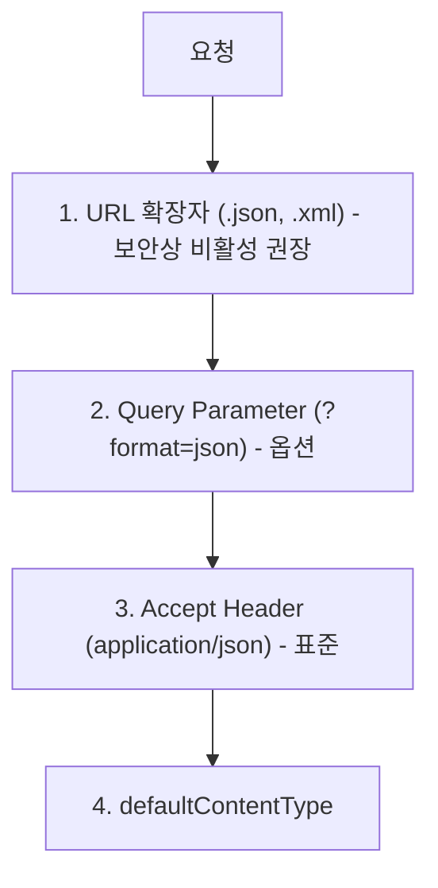
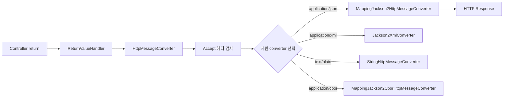
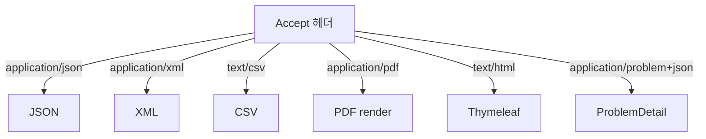

## 정의

**Content Negotiation** = *같은 endpoint 가 *Accept 헤더* 에 따라 *다른 포맷 응답*. JSON / XML / HTML / CSV 등.

## 결정 우선순위



| 전략 | 활성 |
|---|---|
| Path Extension | *비추천* (옛, 보안 위험) |
| Query Parameter | 옵션 |
| **Accept Header** | *표준 (REST API)* |
| Default | fallback |

## 기본 동작

```java
@RestController
@RequestMapping("/users")
public class UserController {

    @GetMapping(value = "/{id}", produces = {
        MediaType.APPLICATION_JSON_VALUE,
        MediaType.APPLICATION_XML_VALUE
    })
    public User get(@PathVariable Long id) {
        return userService.findById(id);
    }
}
```

```bash
# JSON 응답
GET /users/1
Accept: application/json

# XML 응답
GET /users/1
Accept: application/xml
```

## produces / consumes

```java
@PostMapping(
    value = "/upload",
    consumes = MediaType.MULTIPART_FORM_DATA_VALUE,  // 받는 것
    produces = MediaType.APPLICATION_JSON_VALUE       // 보내는 것
)
public UploadResult upload(@RequestParam MultipartFile file) {
    return uploadService.process(file);
}
```

| 옵션 | 의미 |
|---|---|
| `produces` | *응답* Content-Type. Accept 와 매칭 |
| `consumes` | *요청* Content-Type. 클라이언트가 보내는 것 |

## ContentNegotiationConfigurer

```java
@Configuration
public class WebConfig implements WebMvcConfigurer {

    @Override
    public void configureContentNegotiation(ContentNegotiationConfigurer cfg) {
        cfg
            .favorParameter(true)         // ?format=xml 지원
            .parameterName("format")
            .ignoreAcceptHeader(false)    // Accept 헤더 우선
            .defaultContentType(MediaType.APPLICATION_JSON)
            .mediaType("json", MediaType.APPLICATION_JSON)
            .mediaType("xml", MediaType.APPLICATION_XML)
            .mediaType("csv", MediaType.valueOf("text/csv"));
    }
}
```

## HttpMessageConverter



| Converter | 기본 활성 |
|---|---|
| `StringHttpMessageConverter` | text/* |
| `MappingJackson2HttpMessageConverter` | JSON (Jackson, 기본) |
| `MappingJackson2XmlHttpMessageConverter` | XML (jackson-dataformat-xml 의존) |
| `MappingJackson2CborHttpMessageConverter` | CBOR |
| `MappingJackson2SmileHttpMessageConverter` | Smile |
| `ByteArrayHttpMessageConverter` | byte[] |
| `ResourceHttpMessageConverter` | Resource (파일) |
| `ProtobufHttpMessageConverter` | Protobuf |

## 등록 / 우선순위 변경

```java
@Configuration
public class WebConfig implements WebMvcConfigurer {

    @Override
    public void configureMessageConverters(List<HttpMessageConverter<?>> converters) {
        ObjectMapper mapper = JsonMapper.builder()
            .addModule(new JavaTimeModule())
            .disable(SerializationFeature.WRITE_DATES_AS_TIMESTAMPS)
            .build();

        converters.add(0, new MappingJackson2HttpMessageConverter(mapper));
    }
}
```

> *권장*: `extendMessageConverters` (기본 유지 + 확장) vs `configureMessageConverters` (완전 교체).

## Accept 의 *quality value* (q)

```http
Accept: application/json;q=0.8, application/xml;q=0.9, text/html;q=0.7
```

`q` 우선순위: XML (0.9) → JSON (0.8) → HTML (0.7).

## API Versioning by Accept

```java
@GetMapping(value = "/users/{id}", produces = "application/vnd.example.v1+json")
public UserV1 getV1(@PathVariable Long id) { ... }

@GetMapping(value = "/users/{id}", produces = "application/vnd.example.v2+json")
public UserV2 getV2(@PathVariable Long id) { ... }
```

> 클라이언트가 *Accept 헤더로 버전 선택*. URL 깔끔. 자세한 건 [[api-versioning]].

## CSV 응답 예시 (custom)

```java
@Component
public class CsvHttpMessageConverter extends AbstractHttpMessageConverter<List<?>> {

    public CsvHttpMessageConverter() {
        super(MediaType.valueOf("text/csv"));
    }

    @Override
    protected boolean supports(Class<?> clazz) {
        return List.class.isAssignableFrom(clazz);
    }

    @Override
    protected void writeInternal(List<?> list, HttpOutputMessage out) throws IOException {
        try (PrintWriter w = new PrintWriter(out.getBody())) {
            // ... CSV 직렬화
        }
    }
}
```

```bash
GET /reports
Accept: text/csv
```

## REST 응답 패턴



## REST + 뷰 (옛 패턴)

같은 endpoint 가 *HTML 뷰 + JSON 응답*:

```java
@Controller
public class UserController {

    @GetMapping(value = "/users/{id}", produces = MediaType.TEXT_HTML_VALUE)
    public String detailHtml(@PathVariable Long id, Model model) {
        model.addAttribute("user", userService.findById(id));
        return "users/detail";
    }

    @GetMapping(value = "/users/{id}", produces = MediaType.APPLICATION_JSON_VALUE)
    @ResponseBody
    public User detailJson(@PathVariable Long id) {
        return userService.findById(id);
    }
}
```

> 2026 시점 *REST 와 view 분리* 가 더 흔하다. *위 패턴은 옛 통합 컨트롤러*.

## 흔한 함정

> [!WARNING]
> 1. **Path Extension 활성** = `.json` 으로 *Accept 우회* + 보안 위험. *기본 비활성*.
> 2. **produces 누락** = 406 Not Acceptable 가능. 명시.
> 3. **Jackson `@JsonIgnore` 누락** = 비밀번호 등 *민감 정보 노출*. DTO 패턴.
> 4. **MediaType vs Accept** = `application/json` vs `application/*+json` 매칭 주의.

## 관련 위키

- [[spring-mvc]]
- [[REST API Design]]
- [[api-versioning]]
- [[spring-mvc-exception-handler]] (ProblemDetail)
