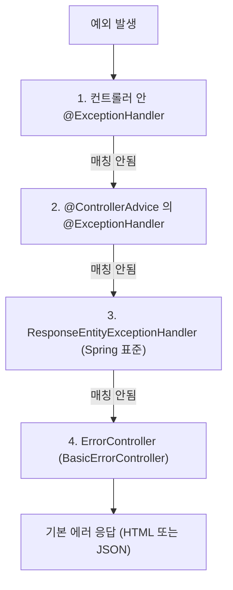

## 정의

Spring MVC 의 *예외 처리* 3 계층:

1. **`@ExceptionHandler`** - 컨트롤러 내부
2. **`@ControllerAdvice` / `@RestControllerAdvice`** - 전역
3. **`ResponseEntityExceptionHandler` 상속** - Spring 의 표준 예외 자동 처리

## 처리 우선순위



## 컨트롤러 내부

```java
@RestController
public class UserController {

    @GetMapping("/{id}")
    public User get(@PathVariable Long id) {
        return userService.findById(id);   // throws UserNotFoundException
    }

    @ExceptionHandler(UserNotFoundException.class)
    @ResponseStatus(HttpStatus.NOT_FOUND)
    public ErrorResponse handleNotFound(UserNotFoundException ex) {
        return new ErrorResponse("USER_NOT_FOUND", ex.getMessage());
    }
}
```

> *컨트롤러 한 곳에서만 처리*. *공통 예외* 는 `@ControllerAdvice` 로.

## @ControllerAdvice / @RestControllerAdvice

```java
@RestControllerAdvice  // = @ControllerAdvice + @ResponseBody
public class GlobalExceptionHandler {

    @ExceptionHandler(UserNotFoundException.class)
    public ResponseEntity<ProblemDetail> handleNotFound(UserNotFoundException ex) {
        ProblemDetail body = ProblemDetail.forStatusAndDetail(HttpStatus.NOT_FOUND, ex.getMessage());
        body.setType(URI.create("https://example.com/probs/user-not-found"));
        body.setTitle("User Not Found");
        return ResponseEntity.status(404).body(body);
    }

    @ExceptionHandler(IllegalArgumentException.class)
    public ResponseEntity<ProblemDetail> handleIllegalArg(IllegalArgumentException ex) {
        return ResponseEntity.badRequest()
            .body(ProblemDetail.forStatusAndDetail(HttpStatus.BAD_REQUEST, ex.getMessage()));
    }

    @ExceptionHandler(Exception.class)
    public ResponseEntity<ProblemDetail> handleAll(Exception ex) {
        log.error("unhandled", ex);
        return ResponseEntity.internalServerError()
            .body(ProblemDetail.forStatusAndDetail(HttpStatus.INTERNAL_SERVER_ERROR, "내부 오류"));
    }
}
```

## ControllerAdvice 범위

```java
@RestControllerAdvice(basePackages = "com.example.api")
@RestControllerAdvice(assignableTypes = {UserController.class, OrderController.class})
@RestControllerAdvice(annotations = ApiV1.class)
```

> 큰 시스템에서 *API v1 vs v2 별로 분리* 가능.

## ProblemDetail (RFC 7807, Spring 6+)

```json
HTTP/1.1 400 Bad Request
Content-Type: application/problem+json

{
  "type": "https://example.com/probs/validation",
  "title": "Validation failed",
  "status": 400,
  "detail": "Email is required",
  "instance": "/api/users",
  "errors": [
    { "field": "email", "code": "REQUIRED" }
  ]
}
```

> *2026 시점 REST API 의 에러 응답 표준*. Spring 6 / Boot 3 부터 *자동 활성*.

```java
@ExceptionHandler(BusinessException.class)
public ProblemDetail handle(BusinessException ex) {
    ProblemDetail pd = ProblemDetail.forStatusAndDetail(HttpStatus.UNPROCESSABLE_ENTITY, ex.getMessage());
    pd.setType(URI.create("https://example.com/probs/" + ex.getCode()));
    pd.setTitle(ex.getTitle());
    pd.setProperty("errorCode", ex.getCode());
    pd.setProperty("traceId", MDC.get("traceId"));
    return pd;
}
```

## 활성화 (Spring Boot)

```yaml
spring:
  mvc:
    problemdetails:
      enabled: true   # Spring 6 default true
```

→ Spring 의 *모든 표준 예외* 가 자동 ProblemDetail 로 응답.

## @Valid 실패 처리

```java
@ExceptionHandler(MethodArgumentNotValidException.class)
public ProblemDetail handleValidation(MethodArgumentNotValidException ex) {
    ProblemDetail pd = ProblemDetail.forStatusAndDetail(HttpStatus.BAD_REQUEST, "검증 실패");
    pd.setProperty("errors", ex.getFieldErrors().stream()
        .map(e -> Map.of(
            "field", e.getField(),
            "rejected", e.getRejectedValue(),
            "message", e.getDefaultMessage()
        ))
        .toList());
    return pd;
}
```

## ResponseEntityExceptionHandler 상속

Spring 의 *수십 가지 표준 예외* (`HttpMessageNotReadableException`, `HttpRequestMethodNotSupportedException` 등) 처리.

```java
@RestControllerAdvice
public class ApiExceptionHandler extends ResponseEntityExceptionHandler {

    @Override
    protected ResponseEntity<Object> handleMethodArgumentNotValid(
        MethodArgumentNotValidException ex,
        HttpHeaders headers,
        HttpStatusCode status,
        WebRequest request
    ) {
        ProblemDetail pd = ProblemDetail.forStatusAndDetail((HttpStatus) status, "Validation failed");
        pd.setProperty("errors", ex.getFieldErrors());
        return ResponseEntity.status(status).body(pd);
    }

    // 비즈니스 예외
    @ExceptionHandler(BusinessException.class)
    public ResponseEntity<ProblemDetail> handle(BusinessException ex) { ... }
}
```

## 옛 ErrorAttributes 와 비교

| 방식 | 의미 |
|---|---|
| `ResponseEntity<...>` 반환 | 직접 응답 객체 만듦 |
| `ProblemDetail` | RFC 7807 표준 (Spring 6+) |
| `ErrorAttributes` | `/error` endpoint 의 응답 데이터 |
| `ErrorController` | 옛 BasicErrorController override |

> 2026 시점 *ProblemDetail 이 표준*. 옛 *ErrorAttributes* 는 *HTML 에러 페이지* 정도에만.

## 예외 분류 전략

```mermaid
flowchart TB
    Q{예외 종류}
    Q --> Biz[비즈니스 예외<br/>(BusinessException)]
    Q --> Val[검증 예외<br/>(ValidationException)]
    Q --> Sys[시스템 예외<br/>(DB, Network)]
    Q --> Sec[보안 예외<br/>(Auth, AccessDenied)]
    Biz --> B1[Status: 4xx<br/>(보통 422 또는 409)]
    Val --> V1[400 + ProblemDetail with errors]
    Sys --> S1[500 + log + alert]
    Sec --> Se1[401 / 403]
```

## 보안 측면

```java
@ExceptionHandler(Exception.class)
public ProblemDetail handleAll(Exception ex, WebRequest req) {
    String traceId = MDC.get("traceId");
    log.error("unhandled [{}]", traceId, ex);   // 내부 로그

    ProblemDetail pd = ProblemDetail.forStatusAndDetail(
        HttpStatus.INTERNAL_SERVER_ERROR,
        "내부 오류가 발생했습니다. 잠시 후 다시 시도해주세요."   // ← 일반화
    );
    pd.setProperty("traceId", traceId);   // 사용자 → 운영자 추적 가능
    return pd;
}
```

> [!CAUTION]
> *예외 메시지 / stack trace 클라이언트 노출 금지*. 내부 정보 (DB 구조, 파일 경로) 누출.

## Logging + Tracing

```java
@ExceptionHandler(BusinessException.class)
public ProblemDetail handle(BusinessException ex) {
    log.warn("biz: code={}, detail={}", ex.getCode(), ex.getMessage());
    return ProblemDetail.forStatusAndDetail(HttpStatus.UNPROCESSABLE_ENTITY, ex.getMessage());
}
```

| 예외 종류 | 로그 레벨 |
|---|---|
| 400 (검증, 입력) | INFO (정상 흐름) |
| 401, 403 | INFO 또는 WARN |
| 404 | INFO |
| 422 (비즈니스) | WARN |
| 500 (시스템) | ERROR + alert |

## 흔한 함정

> [!WARNING]
> 1. **`@ExceptionHandler` 가 더 구체적인 예외부터** = Spring 이 *최적 매칭*. 단 *순서가 보장 안 되니* 명확한 클래스만.
> 2. **`Throwable` 잡음** = `Error` (OOM 등) 까지 잡힘. `Exception` 까지만.
> 3. **`@RestControllerAdvice` + 뷰 컨트롤러** = JSON 응답. `@ControllerAdvice` + `String view` 분리.
> 4. **예외 안에서 다시 예외** = handler 가 *recursion*. *주의*.

## 관련 위키

- [[spring-mvc]]
- [[spring-validation]]
- [[spring-mvc-model-bindingresult]]
- [[REST API Design]] (RFC 7807)
