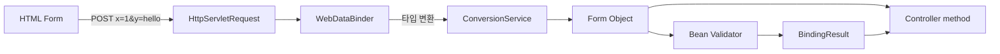
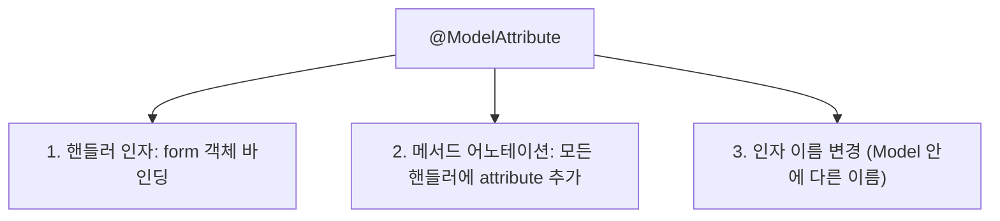
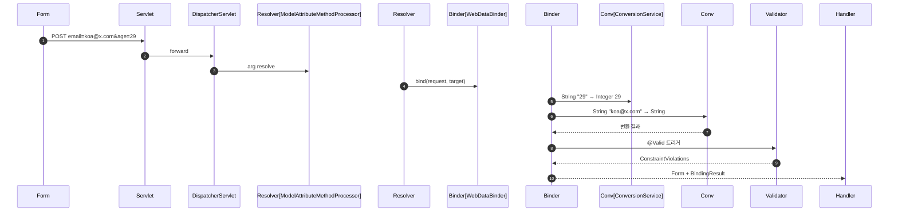

## 정의

**Form Handling** = HTML form 의 *요청 파라미터 → Java 객체* 변환 + *검증* + *에러 처리*. 핵심: `@ModelAttribute` + `WebDataBinder` + `ConversionService`.

## 기본 흐름



자세한 BindingResult 는 [[spring-mvc-model-bindingresult]].

## @ModelAttribute 의 3가지 역할



### 1. 인자에서 (form 바인딩)

```java
@PostMapping("/signup")
public String signup(@ModelAttribute SignupForm form,
                     BindingResult result) {
    if (result.hasErrors()) return "users/signup-form";
    ...
}

// @ModelAttribute 생략 가능 (default)
public String signup(SignupForm form, BindingResult result) { ... }
```

> Spring 이 *기본 생성자 + setter* 또는 *all-args constructor* 로 객체 생성 + 요청 파라미터 매핑.

### 2. 메서드 어노테이션 (공통 attribute)

```java
@Controller
public class UserController {

    @ModelAttribute("countries")
    public List<Country> countries() {
        return countryService.findAll();
    }

    @ModelAttribute
    public Locale locale(HttpServletRequest req) {
        return req.getLocale();
    }

    @GetMapping("/signup")
    public String signupForm(Model model) {
        // countries, locale 자동 추가됨
        model.addAttribute("signupForm", new SignupForm());
        return "users/signup-form";
    }
}
```

### 3. 이름 변경

```java
public String signup(@ModelAttribute("signupForm") SignupForm form) {
    // Model 에 "signupForm" 이름으로 저장
    // 뷰의 th:object="${signupForm}" 와 매칭
}
```

> default 이름 = *클래스 이름 소문자 첫글자* (`signupForm`).

## WebDataBinder 의 동작



## ConversionService 와 Formatter

### 기본 변환

Spring 이 자동 처리:

```
String "29"        → Integer 29
String "true"      → boolean true
String "2026-06-25" → LocalDate (LocaleContextHolder 의 locale)
String "12345"     → enum Status (name 기반)
String "1,2,3"     → List<Integer> (separator: comma)
```

### 커스텀 Formatter

```java
@Component
public class MoneyFormatter implements Formatter<Money> {

    @Override
    public Money parse(String text, Locale locale) throws ParseException {
        // "1,234,567원" → Money
        long amount = Long.parseLong(text.replaceAll("[,원]", ""));
        return new Money(amount, Currency.KRW);
    }

    @Override
    public String print(Money money, Locale locale) {
        return String.format("%,d원", money.amount());
    }
}

@Configuration
public class WebConfig implements WebMvcConfigurer {
    @Override
    public void addFormatters(FormatterRegistry registry) {
        registry.addFormatter(new MoneyFormatter());
    }
}
```

> 이제 `@RequestParam Money price` 자동 변환.

### @DateTimeFormat / @NumberFormat

```java
public record OrderForm(
    @DateTimeFormat(pattern = "yyyy-MM-dd HH:mm")
    LocalDateTime scheduledAt,

    @NumberFormat(pattern = "#,###")
    Long amount,

    @NumberFormat(style = NumberFormat.Style.CURRENCY)
    BigDecimal price
) { }
```

## @InitBinder (커스텀 바인딩 설정)

```java
@Controller
public class OrderController {

    @InitBinder
    public void initBinder(WebDataBinder binder) {
        // 1. 특정 필드 *바인딩 차단* (mass assignment 방어!)
        binder.setDisallowedFields("id", "createdAt", "user");

        // 2. *허용 필드만* 명시 (더 안전)
        binder.setAllowedFields("title", "amount", "deliveryAddress");

        // 3. 커스텀 editor 등록
        binder.registerCustomEditor(Date.class,
            new CustomDateEditor(new SimpleDateFormat("yyyy/MM/dd"), false));
    }
}
```

> [!CAUTION]
> *Mass Assignment 취약점*: `User.role` 같이 *민감 필드* 가 *form 으로 update 가능* 하면 공격자가 admin 으로 승격. `setDisallowedFields` 또는 *DTO 분리*.

## DTO 패턴 (권장)

```java
// ✓ 안전: DTO 만 form 으로 받음
public record SignupForm(
    @NotBlank @Email String email,
    @NotBlank @Size(min = 8) String password,
    @NotBlank String name
) {
    public User toUser() {
        return new User(null, email, hashPassword(password), name, Role.USER);
    }
}

// ✗ 위험: Entity 를 form 으로 받지 말 것
@PostMapping("/signup")
public String signup(@ModelAttribute User user) { ... }   // role 까지 받음
```

## Content Type 별 바인딩

| Content-Type | 바인딩 |
|---|---|
| `application/x-www-form-urlencoded` | `@ModelAttribute` (또는 생략) |
| `multipart/form-data` | `@ModelAttribute` + `MultipartFile` |
| `application/json` | `@RequestBody` (Jackson) |
| `application/xml` | `@RequestBody` (Jackson XML) |

```java
// 파일 업로드
@PostMapping("/upload")
public String upload(@RequestParam("file") MultipartFile file,
                     @ModelAttribute UploadForm form) {
    file.transferTo(Path.of("/var/uploads/" + file.getOriginalFilename()));
    return "redirect:/files";
}
```

## Spring MVC vs WebFlux 차이

| | Spring MVC (Servlet) | WebFlux |
|---|---|---|
| 바인딩 | `WebDataBinder` | `WebExchangeDataBinder` |
| API | sync | reactive |
| 본문 | `@RequestBody DTO` | `Mono<DTO>` |
| Form | `@ModelAttribute` | 동일 (reactive) |

## 흔한 함정

> [!WARNING]
> 1. **DTO 없이 Entity 직접 바인딩** = mass assignment. *항상 DTO 분리*.
> 2. **`@InitBinder` 의 setAllowedFields/setDisallowedFields 둘 다 명시** = allowed 만 적용. 하나로.
> 3. **type 변환 실패 시 메시지** = `typeMismatch.fieldName` i18n 메시지 미정의 → *기본 영문*.
> 4. **`MultipartFile` 의 *기본 size limit*** = 1MB (기본). `spring.servlet.multipart.max-file-size`.

## 관련 위키

- [[spring-mvc-model-bindingresult]]
- [[spring-validation]]
- [[spring-mvc]]
- [[spring-thymeleaf]] (th:field)
- [[spring-mvc-argument-resolver]] (커스텀 resolver)
