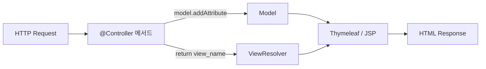
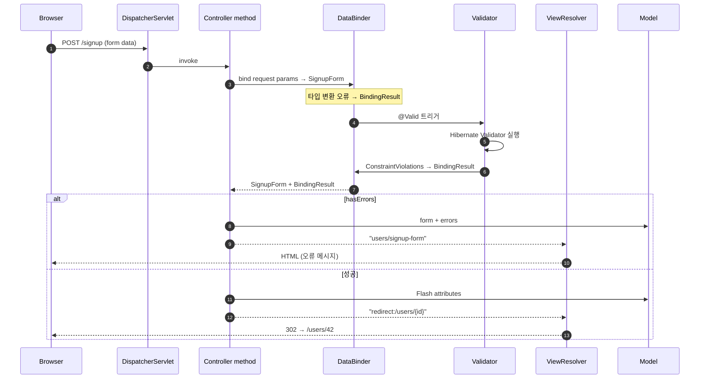

## 정의

**Model** = 컨트롤러 → 뷰 (Thymeleaf, JSP) 로 *데이터 전달*. **BindingResult** = 요청 파라미터 → 객체 *바인딩 결과 + 오류*. 둘 다 *Spring MVC 핸들러 메서드의 특별 인자*.

> [!IMPORTANT]
> REST API (`@RestController`) 는 *JSON 응답* 이라 Model 거의 사용 안 함. *전통 MVC (`@Controller` + 뷰 렌더링)* 의 핵심.

## Model 의 본질



## 사용

```java
@Controller
@RequestMapping("/users")
public class UserViewController {

    @GetMapping
    public String list(Model model) {
        model.addAttribute("users", userService.findAll());
        model.addAttribute("total", userService.count());
        return "users/list";   // → resolved → templates/users/list.html
    }

    @GetMapping("/{id}")
    public String detail(@PathVariable Long id, Model model) {
        User user = userService.findById(id);
        model.addAttribute("user", user);
        return "users/detail";
    }
}
```

```html
<!-- templates/users/list.html -->
<table>
  <tr th:each="u : ${users}">
    <td th:text="${u.name}"></td>
  </tr>
</table>
<p th:text="${'Total: ' + total}"></p>
```

## Model 의 4가지 사용 방법

| 방식 | 코드 |
|---|---|
| `Model` 파라미터 | `model.addAttribute("user", user)` |
| `ModelMap` | 동일 |
| `Map<String, Object>` | 동일 (자동 변환) |
| `@ModelAttribute` 메서드 | 모든 핸들러 공통 attribute |

```java
@ModelAttribute("categories")
public List<Category> categories() {
    return categoryService.findAll();   // 모든 핸들러에서 자동 추가
}
```

## ModelAndView

```java
@GetMapping("/{id}")
public ModelAndView detail(@PathVariable Long id) {
    ModelAndView mv = new ModelAndView("users/detail");
    mv.addObject("user", userService.findById(id));
    return mv;
}
```

> Model 분리 방식이 *깔끔하지만* 옛 스타일. *2026 시점 `Model + return view_name`* 이 표준.

## BindingResult: 바인딩 오류 처리

폼 전송 → 객체 바인딩 → *타입 변환 오류 + Validation 오류* 가 *BindingResult* 에 모임.

```java
@PostMapping("/signup")
public String signup(
    @ModelAttribute @Valid SignupForm form,
    BindingResult result,
    Model model
) {
    if (result.hasErrors()) {
        // 에러 정보 + 폼 데이터 유지하며 다시 폼 페이지로
        return "users/signup-form";
    }
    userService.signup(form);
    return "redirect:/users";
}
```

> [!CAUTION]
> **`BindingResult` 는 *반드시* `@Valid` 또는 `@ModelAttribute` 인자 *바로 다음* 에 위치**. 위치 잘못이면 `MethodArgumentNotValidException` 발생 (400).

```java
// ✗ 잘못된 위치
public String signup(@Valid Form form, Model model, BindingResult result) { ... }

// ✓ 올바른 위치
public String signup(@Valid Form form, BindingResult result, Model model) { ... }
```

## BindingResult 의 핵심 API

```java
result.hasErrors();                      // 전체 에러
result.hasFieldErrors();                 // 필드 단위
result.hasGlobalErrors();                // 객체 전체 (cross-field)
result.hasFieldErrors("email");          // 특정 필드

result.getFieldErrors();                 // List<FieldError>
result.getFieldError("email");           // FieldError 또는 null
result.getAllErrors();                   // List<ObjectError>

result.rejectValue("email", "duplicate", "이미 사용 중인 이메일");
result.reject("invalid", "전체 객체 오류");
```

## Error 객체

```mermaid
flowchart TB
    Errors[Errors interface]
    Errors --> Bind[BindingResult]
    Bind --> Field[FieldError<br/>(필드 단위)]
    Bind --> Object[ObjectError<br/>(객체 전체)]
    Field --> Fields["objectName, field, rejectedValue, codes, defaultMessage"]
    Object --> Objects["objectName, codes, defaultMessage"]
```

| 속성 | 의미 |
|---|---|
| `objectName` | 폼 객체 이름 (보통 `signupForm`) |
| `field` | 필드 이름 |
| `rejectedValue` | 입력한 원본 값 |
| `codes` | 메시지 코드 우선순위 (i18n) |
| `defaultMessage` | 기본 메시지 |

## 뷰에서 에러 표시 (Thymeleaf)

```html
<form th:action="@{/signup}" th:object="${signupForm}" method="post">

  <input type="text" th:field="*{email}"
         th:classappend="${#fields.hasErrors('email')} ? 'is-invalid'" />
  <div class="error" th:if="${#fields.hasErrors('email')}"
       th:errors="*{email}"></div>

  <input type="password" th:field="*{password}" />
  <div class="error" th:errors="*{password}"></div>

  <!-- 전체 (global) 에러 -->
  <ul th:if="${#fields.hasGlobalErrors()}">
    <li th:each="err : ${#fields.globalErrors()}" th:text="${err}"></li>
  </ul>

  <button>가입</button>
</form>
```

자세한 Thymeleaf 는 [[spring-thymeleaf]].

## Bind 메시지 (i18n)

```properties
# messages.properties
NotBlank.signupForm.email=이메일을 입력해주세요
Size.signupForm.password=비밀번호는 {2}자 이상 {1}자 이하
Email.signupForm.email=올바른 이메일 형식이 아닙니다

# typeMismatch 는 special
typeMismatch.signupForm.age=숫자만 입력 가능합니다
typeMismatch.java.lang.Integer=숫자 형식이 잘못되었습니다
```

> Spring 이 자동으로 *코드 우선순위* 로 메시지 lookup.

## RedirectAttributes (PRG 패턴)

```java
@PostMapping
public String signup(
    @Valid SignupForm form,
    BindingResult result,
    RedirectAttributes redirectAttrs
) {
    if (result.hasErrors()) return "users/signup-form";

    User u = userService.signup(form);
    redirectAttrs.addAttribute("id", u.getId());          // URL 쿼리스트링
    redirectAttrs.addFlashAttribute("message", "가입 완료!"); // session 1회 유지

    return "redirect:/users/{id}";   // /users/42?id=42 (PathVariable + Query)
}

@GetMapping("/{id}")
public String detail(@PathVariable Long id, Model model) {
    // Flash attribute 가 자동으로 Model 에 들어감
    // 뷰에서 ${message} 로 사용 가능
    return "users/detail";
}
```

> [!IMPORTANT]
> **POST-Redirect-GET (PRG)** 패턴. 폼 전송 후 *redirect* 로 *새로고침 시 중복 제출 방지*. Flash 로 *일회성 메시지 전달*.

## 동작 흐름



## REST 에서의 BindingResult

`@RestController` + `@RequestBody @Valid` 면 BindingResult 대신 *`MethodArgumentNotValidException` 자동 발생*. `@ControllerAdvice` 에서 처리.

```java
@PostMapping
public User create(@RequestBody @Valid CreateUserDto dto) {
    // 위 메서드는 *BindingResult 없으면* 검증 실패 시 자동 예외
    return userService.create(dto);
}

// → @ExceptionHandler 에서 처리
```

자세한 건 [[spring-mvc-exception-handler]].

## 흔한 함정

> [!WARNING]
> 1. **BindingResult 위치** = `@Valid` 인자 *바로 다음* 이 아니면 *작동 안 함*.
> 2. **Model 에서 *민감 정보 노출*** = `model.addAttribute("user", user)` → user 의 비밀번호가 HTML 에 노출.
> 3. **`@ModelAttribute` 의 이름 충돌** = `@ModelAttribute("signupForm")` 와 뷰 `th:object="${signupForm}"` 이름 일치.
> 4. **Flash attribute 가 *사라짐*** = redirect 직후 1회만. *뒤로가기* 시 재호출하면 없음.

## 관련 위키

- [[spring-mvc]] (REST 기본)
- [[spring-validation]] (Jakarta Bean Validation)
- [[spring-thymeleaf]] (뷰 렌더링)
- [[spring-mvc-form-handling]] (form binding)
- [[spring-mvc-exception-handler]] (예외 처리)
- [[spring-dispatcher-servlet]]
