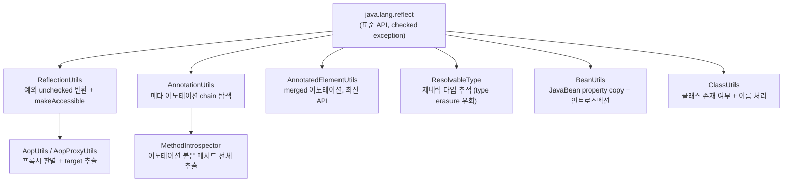

## 정의

Spring 은 reflection 을 헤비하게 쓴다. DI 처리, AOP 프록시, `@Autowired` 해결, Jackson 통합, JPA entity 매핑 모두 reflection 위에서 동작. 그 위에 **사용 편의 + 캐싱 + 예외 변환 + 메타 어노테이션 처리** 를 얹은 유틸 클래스들이 `org.springframework.util` / `org.springframework.core.annotation` 에 있다.

자체 라이브러리 / framework 개발 시에 직접 쓰면 raw `java.lang.reflect` 보다 훨씬 깔끔. [[java-reflection]] 가 기반.

## 유틸 클래스 계층 개요



각 유틸은 **표준 API 의 고통 포인트** 하나를 해결한다. 직접 `java.lang.reflect` 를 쓰기 전에 Spring 유틸 클래스 중 적합한 것이 있는지 먼저 확인한다.

## ReflectionUtils

`java.lang.reflect` 의 checked exception 을 unchecked 로 변환 + 편의 메서드.

```java
import org.springframework.util.ReflectionUtils;

Class<?> c = User.class;

// 필드 / 메서드 찾기 (private 포함, 상속 chain 탐색)
Field name = ReflectionUtils.findField(c, "name");
Method greet = ReflectionUtils.findMethod(c, "greet", String.class);

// 접근 권한 부여
ReflectionUtils.makeAccessible(name);
ReflectionUtils.makeAccessible(greet);

// 호출 (checked 예외 unchecked 로 wrap)
Object value = ReflectionUtils.getField(name, instance);
ReflectionUtils.setField(name, instance, "Alice");
Object result = ReflectionUtils.invokeMethod(greet, instance, "Hi,");
```

원본 reflection 코드:

```java
// java.lang.reflect 직접 사용
try {
    Method m = c.getDeclaredMethod("greet", String.class);
    m.setAccessible(true);
    Object r = m.invoke(instance, "Hi,");
} catch (NoSuchMethodException | IllegalAccessException | InvocationTargetException e) {
    throw new RuntimeException(e);
}
```

ReflectionUtils 가 boilerplate 를 제거.

### doWithFields / doWithMethods (콜백)

```java
ReflectionUtils.doWithFields(c, field -> {
    System.out.println(field.getName());
}, field -> field.getAnnotation(Inject.class) != null);   // 필터
```

상속 chain 의 모든 필드/메서드 순회. JUnit, Mockito, Spring 자체가 이런 패턴 사용.

## AnnotationUtils

표준 reflection 으로 어노테이션 찾기는 **메타 어노테이션 (어노테이션 위의 어노테이션) 인식 안 됨**. `@RestController` 는 메타 어노테이션 `@Controller` 를 가지지만 표준 `method.isAnnotationPresent(Controller.class)` 는 false.

`AnnotationUtils` / `AnnotatedElementUtils` 가 메타 어노테이션 chain 탐색:

<CodeWithOutput
  language="java"
  outputLanguage="text"
  outputLabel="stdout"
  code={`import org.springframework.core.annotation.AnnotatedElementUtils;
import org.springframework.core.annotation.AnnotationUtils;
import org.springframework.web.bind.annotation.RestController;
import org.springframework.stereotype.Controller;

@RestController
class MyApi {}

public class AnnoDemo {
    public static void main(String[] args) {
        Class<?> c = MyApi.class;

        boolean standard = c.isAnnotationPresent(Controller.class);
        boolean springApi = AnnotatedElementUtils.hasAnnotation(c, Controller.class);
        Controller meta = AnnotationUtils.findAnnotation(c, Controller.class);

        System.out.println("standard      : " + standard);
        System.out.println("AEU.has       : " + springApi);
        System.out.println("AU.findValue  : " + (meta != null ? meta.value() : "null"));
    }
}`}
  output={`standard      : false
AEU.has       : true
AU.findValue  : `}
/>

`@RestController` 위에 있는 `@Controller` 까지 추적해 인식. Spring MVC 의 `@RequestMapping` 추출, AOP 의 pointcut 매칭이 이 메커니즘 의존.

`@AliasFor` 처리도 AnnotationUtils 의 책임. `@RequestMapping(path = ...)` 와 `@GetMapping(value = ...)` 의 alias 합성.

## MethodIntrospector

Bean 안에서 특정 어노테이션이 붙은 메서드 전부 추출:

```java
import org.springframework.core.MethodIntrospector;
import org.springframework.core.annotation.AnnotationUtils;

Map<Method, MyAnnotation> result = MethodIntrospector.selectMethods(
    bean.getClass(),
    (MethodIntrospector.MetadataLookup<MyAnnotation>) method ->
        AnnotationUtils.findAnnotation(method, MyAnnotation.class)
);

for (Map.Entry<Method, MyAnnotation> e : result.entrySet()) {
    // 메서드 + 어노테이션 메타 동시 활용
}
```

`@EventListener`, `@KafkaListener`, `@RabbitListener` 같은 Spring 의 listener 등록이 모두 이 메커니즘.

## BeanUtils

reflection 기반 객체 복사 / property 조작:

```java
import org.springframework.beans.BeanUtils;

User src = ...;
UserDto dst = new UserDto();
BeanUtils.copyProperties(src, dst);   // 같은 이름 property 복사

PropertyDescriptor[] pds = BeanUtils.getPropertyDescriptors(User.class);
```

내부적으로 JavaBean Introspector ([[java-javabean]]) 사용. Jackson 의 ObjectMapper / MapStruct 같은 컴파일 타임 매퍼가 성능상 더 좋지만, 간단한 DTO 변환에 충분.

함정: shallow copy. 컬렉션 / 객체 참조는 그대로 복사돼 원본 수정 시 같이 변함.

## ResolvableType (제네릭 타입 추적)

Java 의 type erasure 때문에 런타임에 `List<String>` 의 `String` 을 보통 알 수 없지만, 다음 위치에서는 보존됨:
- super class / interface (`class MyList extends ArrayList<String>`)
- field declaration (`List<String> names;`)
- method parameter / return type

`ResolvableType` 이 이 정보를 추출:

```java
import org.springframework.core.ResolvableType;

class StringList extends ArrayList<String> {}

ResolvableType rt = ResolvableType.forClass(StringList.class).as(List.class);
Class<?> elemType = rt.getGeneric(0).resolve();   // String.class
```

`ApplicationContext.getBeansOfType` 의 generic 매칭, `@Autowired List<MyType<X>>` 같은 컬렉션 + 제네릭 주입이 이걸로 동작.

## AopUtils

AOP 프록시 객체 판별 / target 추출:

```java
import org.springframework.aop.support.AopUtils;
import org.springframework.aop.framework.AopProxyUtils;

boolean isProxy = AopUtils.isAopProxy(bean);
boolean isJdkProxy = AopUtils.isJdkDynamicProxy(bean);
boolean isCglib = AopUtils.isCglibProxy(bean);

// proxy 의 실제 target 클래스
Class<?> targetClass = AopUtils.getTargetClass(bean);

// proxy 를 벗기고 원본 target 인스턴스 얻기 (Advised 가 필요)
Object target = AopProxyUtils.getSingletonTarget(bean);
```

self-invocation 함정 디버깅, AOP 적용 여부 확인에 사용.

## ClassUtils

```java
import org.springframework.util.ClassUtils;

boolean present = ClassUtils.isPresent("com.example.Optional", classLoader);   // 클래스 존재 여부
Class<?> userType = ClassUtils.getUserClass(proxy);                            // CGLIB$$... 가 아닌 원본
String shortName = ClassUtils.getShortName(MyClass.class);                     // "MyClass"
```

`isPresent` 가 핵심: 선택적 의존성 (classpath 에 라이브러리가 있을 때만 Bean 등록) 판별에 사용. Spring Boot AutoConfiguration 의 `@ConditionalOnClass` 가 이걸로 동작 ([[spring-boot-autoconfig]]).

## GraalVM Native Image 와 Reflection

Native Image 는 build-time 분석으로 도달 가능한 코드만 포함하므로, **런타임 reflection 은 기본적으로 동작하지 않는다**.

### 문제 상황

```java
// 이 코드는 native image 에서 실패
Class<?> c = Class.forName(className);          // 동적 클래스 로드
Method m = c.getDeclaredMethod(methodName);     // 동적 메서드 조회
m.invoke(instance);
```

Build-time 에 `className` / `methodName` 을 알 수 없으므로 AOT 분석이 해당 클래스/메서드를 포함하지 않음.

### Spring AOT 자동 생성

Spring Boot 3.x 의 **Spring AOT** 가 상당 부분 자동 처리:

```bash
./gradlew nativeCompile   # Spring AOT 가 reflect-config.json 자동 생성
```

Spring AOT 가 처리하는 것:
- `@Component`, `@Bean`, `@Autowired` 등 Spring 관리 빈의 reflection
- `@EventListener`, `@KafkaListener` 같은 메서드 어노테이션 기반 등록
- `ApplicationContext.getBean()` 으로 가져오는 빈

Spring AOT 가 처리하지 못하는 것:
- 완전히 동적인 `Class.forName(변수)` 패턴
- 자체 제작 reflection 기반 코드 (Spring 없이 직접 쓰는 경우)

### 수동 등록

```java
// @RegisterReflectionForBinding 으로 클래스 등록
@RegisterReflectionForBinding(UserDto.class)
@Configuration
public class NativeConfig {}

// RuntimeHintsRegistrar 로 세밀 제어
@Component
public class MyHints implements RuntimeHintsRegistrar {
    @Override
    public void registerHints(RuntimeHints hints, ClassLoader classLoader) {
        hints.reflection()
            .registerType(MyService.class,
                MemberCategory.INVOKE_DECLARED_METHODS,
                MemberCategory.DECLARED_FIELDS);
    }
}
```

## 함정과 베스트 프랙티스

- **AnnotationUtils 우선**: 표준 `isAnnotationPresent` 는 메타 어노테이션 못 봄
- **`AnnotatedElementUtils` 가 `AnnotationUtils` 보다 모던**: 둘 다 살아 있지만 새 코드는 `AnnotatedElementUtils`
- **ReflectionUtils 캐싱은 자동 아님**: 반복 호출 시 결과를 직접 캐싱
- **GraalVM Native Image**: reflection 사용 위치는 `reflect-config.json` 등록 필요 (Spring AOT 가 자동 생성)
- **JDK 17+ 권장**: 모듈 시스템 + `setAccessible` 제약, 가능하면 `MethodHandle` 사용 ([[java-reflection]])
- **성능 critical 라면 컴파일 타임 매퍼 (MapStruct, ImmutableJ) 우선**

## 관련 위키

- [[java-reflection]]
- [[java-javabean]]
- [[spring-ioc-di]]
- [[spring-aop]]
- [[spring-bean-post-processor]]
- [[spring-stereotypes]]
- [[spring-boot-autoconfig]]
