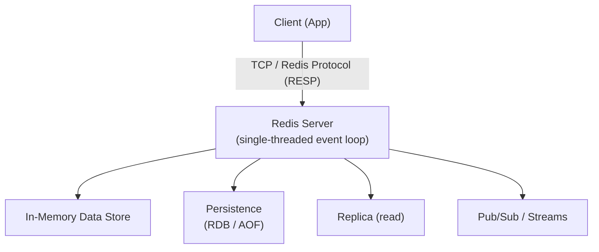
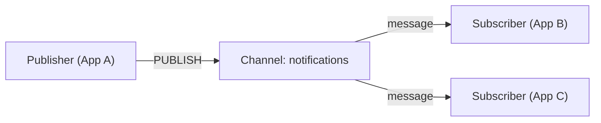
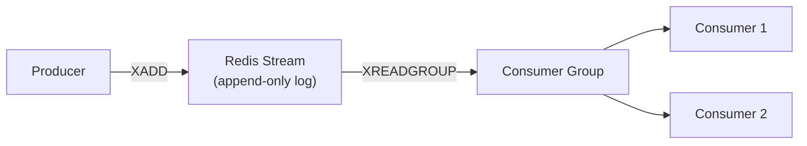
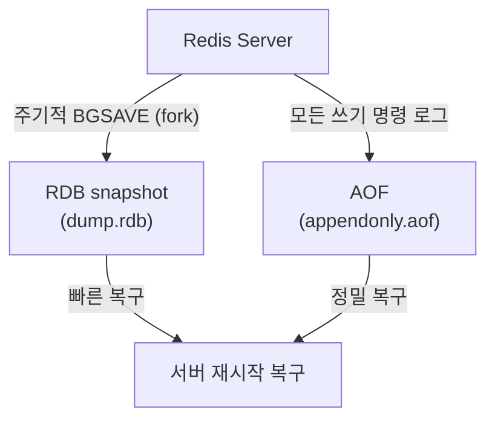
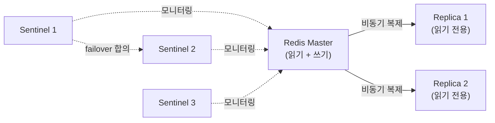
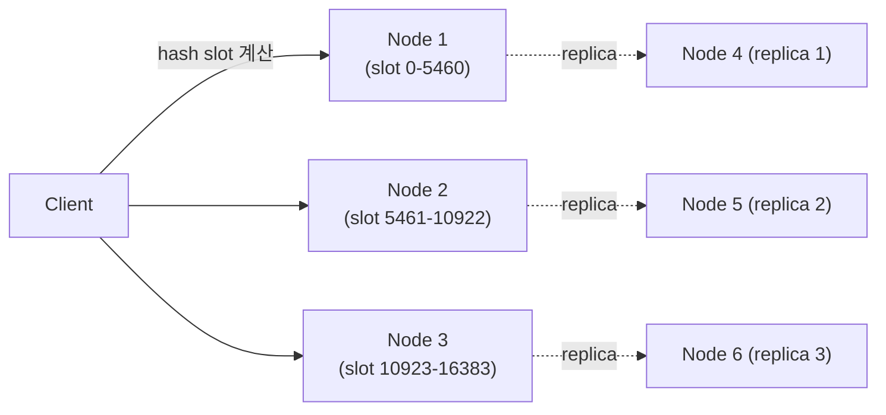

## 정의

**Redis** (REmote DIctionary Server) = *인메모리 자료구조 서버*. Salvatore Sanfilippo 가 2009 년 만들었고, 현재는 Redis Ltd. 가 개발을 주도한다. BSD 라이선스 (7.4 부터는 RSALv2/SSPLv1 듀얼).

메모리에 데이터를 올려 *microsecond 단위 응답 속도* 를 제공한다. 캐시, 세션 저장소, 메시지 브로커, 리더보드 등에 쓰인다.

## 아키텍처



> *Single-threaded event loop*: 명령 처리는 단일 스레드, I/O multiplexing (epoll/kqueue) 으로 동시 처리. 무거운 단일 명령이 전체 블로킹.

## 핵심 특성

- **In-Memory**: 모든 데이터가 RAM, microsecond 응답
- **Single-threaded event loop**: 명령 순서 보장, race condition 없음
- **영속성 옵션**: RDB snapshot 또는 AOF (append-only file) 로 디스크 백업
- **복제 (Replication)**: master-replica 구조, 비동기 복제
- **Pub/Sub + Streams**: 실시간 메시징
- **트랜잭션**: MULTI/EXEC 으로 명령 묶기, ACID 아님

## 데이터 타입 (9가지)

| 타입 | 설명 | 주요 사용처 |
|:---|:---|:---|
| **String** | 바이너리 안전, 최대 512MB | 캐시, counter |
| **List** | 연결 리스트, 양끝 O(1) | 큐, 최근 항목 |
| **Hash** | field-value 맵 | 객체 저장 |
| **Set** | 중복 없는 집합 | 태그, 멤버십 |
| **Sorted Set** | 스코어로 정렬된 집합 | 리더보드, 타임라인 |
| **Stream** | append-only 로그 + consumer group | 이벤트 소싱, MQ |
| **HyperLogLog** | 확률적 카디널리티 추정 | unique visitor (12KB 로 수십억 추정) |
| **Geo** | 경도/위도 + 반경 검색 | 위치 기반 서비스 |
| **Bitmap** | 비트 배열 (String 기반) | 출석 체크, feature flag |

## String 명령

```bash
SET user:1:name "Alice"
GET user:1:name                 # "Alice"
SET counter 0
INCR counter                    # 1
INCRBY counter 10               # 11
SETNX lock:resource "1"         # SET if Not eXists (분산 락)
SET session:abc "..." EX 3600   # TTL 3600초
GETEX session:abc EX 7200       # GET + TTL 연장
MSET k1 v1 k2 v2 k3 v3         # 여러 키 동시 SET
MGET k1 k2 k3                   # 여러 키 동시 GET
```

## Hash 명령

```bash
HSET user:1 name "Alice" email "alice@example.com" age "30"
HGET user:1 name               # "Alice"
HMGET user:1 name email        # ["Alice", "alice@example.com"]
HGETALL user:1                 # 모든 field-value
HINCRBY user:1 age 1           # age 를 1 증가
HKEYS user:1                   # ["name", "email", "age"]
HDEL user:1 email              # email 필드 삭제
```

## List 명령 (큐 / 스택)

```bash
LPUSH queue:tasks "task1" "task2"   # 왼쪽 push (stack push)
RPUSH queue:tasks "task3"           # 오른쪽 push
LPOP queue:tasks                     # 왼쪽 pop (FIFO 큐)
RPOP queue:tasks                     # 오른쪽 pop (LIFO 스택)
BLPOP queue:tasks 0                  # blocking pop (0 = 무한 대기)
LRANGE queue:tasks 0 -1              # 전체 조회
LLEN queue:tasks                     # 길이
LPOS queue:tasks "task1"             # 위치 검색
```

## Set + Sorted Set 명령

```bash
# Set
SADD tags:post:1 "redis" "database" "nosql"
SISMEMBER tags:post:1 "redis"     # 멤버 확인
SMEMBERS tags:post:1              # 전체 멤버
SINTERSTORE result tags:post:1 tags:post:2  # 교집합
SUNIONSTORE result tags:post:1 tags:post:2  # 합집합

# Sorted Set (리더보드)
ZADD leaderboard 1500.0 "alice" 2300.0 "bob" 800.0 "charlie"
ZRANGE leaderboard 0 -1 REV WITHSCORES   # 내림차순 + 점수
ZRANK leaderboard "alice"                 # 순위 (0-indexed)
ZINCRBY leaderboard 100 "alice"           # 점수 증가
ZRANGEBYSCORE leaderboard 1000 2000       # 범위 조회
```

## Pub/Sub



```bash
# Publisher
PUBLISH notifications '{"type":"order","id":123}'

# Subscriber
SUBSCRIBE notifications
# 응답: message / notifications / {"type":"order","id":123}

# 패턴 구독
PSUBSCRIBE notifications.*     # notifications.order, notifications.payment 등
```

```python
# Python 예시 (redis-py)
import redis

r = redis.Redis()

# Subscriber (별도 스레드)
p = r.pubsub()
p.subscribe("notifications")

for message in p.listen():
    if message["type"] == "message":
        print(message["data"])

# Publisher
r.publish("notifications", '{"type":"order","id":123}')
```

> [!WARNING]
> Pub/Sub 은 *Fire-and-Forget*. 구독자가 없으면 메시지 소실. *메시지 영속성 필요 = Stream 사용*.

## Streams (영속 메시지 큐)



```bash
# Producer
XADD events:orders "*" type "order" user_id "1" amount "99.00"
# "*" = 자동 ID (timestamp-seq: 1700000000000-0)

# Consumer Group 생성
XGROUP CREATE events:orders my-group $ MKSTREAM

# Consumer 읽기 (새 메시지)
XREADGROUP GROUP my-group consumer-1 COUNT 10 BLOCK 2000 STREAMS events:orders >

# ACK (처리 완료)
XACK events:orders my-group 1700000000000-0

# Pending 메시지 확인 (ACK 안 된 것)
XPENDING events:orders my-group - + 10

# 메시지 범위 조회
XRANGE events:orders - + COUNT 20

# Stream 길이
XLEN events:orders

# 오래된 메시지 trim (최대 1000개 유지)
XTRIM events:orders MAXLEN ~ 1000
```

> *Pub/Sub 보다 Stream 선호*: *영속성 + consumer group + at-least-once 보장 + 재처리 가능*.

## 영속성 (Persistence)



| 방식 | 동작 | 장점 | 단점 |
|:---|:---|:---|:---|
| **RDB** | 주기적 snapshot (BGSAVE: fork) | 파일 작음, 복구 빠름 | 마지막 snapshot 이후 데이터 손실 가능 |
| **AOF** | 모든 쓰기 명령 로그 | 손실 최소화 | 파일 큼, 복구 느림 (REWRITE 로 압축) |
| **RDB + AOF** | 혼용 | 빠른 복구 + 높은 내구성 | 디스크 사용량 증가 |

```bash
# redis.conf 설정
save 900 1       # 900초 안에 1회 이상 변경 시 RDB
save 300 10      # 300초 안에 10회 이상 변경 시 RDB

appendonly yes
appendfsync everysec   # always / everysec (기본) / no
```

> **fsync 정책**: `always` (매 쓰기 후 fsync, 안전하지만 느림) / `everysec` (초당 1회, 기본) / `no` (OS 관리, 가장 빠름).

## 복제 + 고가용성



- **Master-Replica**: 비동기 복제, replica 는 읽기 전용
- **Sentinel**: 자동 failover, 모니터링, 알림 (최소 3개 Sentinel 권장)
- **Cluster**: 수평 확장, 16384 slot hash partitioning, 노드 장애 시 자동 failover

```bash
# Replica 설정
REPLICAOF master-host 6379

# Sentinel 설정 (sentinel.conf)
sentinel monitor mymaster 127.0.0.1 6379 2   # quorum 2
sentinel down-after-milliseconds mymaster 5000
sentinel failover-timeout mymaster 60000
```

## Redis Cluster



```bash
# Cluster 생성 (6 노드: 3 master + 3 replica)
redis-cli --cluster create \
  127.0.0.1:7000 127.0.0.1:7001 127.0.0.1:7002 \
  127.0.0.1:7003 127.0.0.1:7004 127.0.0.1:7005 \
  --cluster-replicas 1

# Hash Tag: 같은 슬롯 강제 (multi-key 명령 위해)
SET "{user:1}:name" "Alice"
SET "{user:1}:email" "alice@example.com"
MGET "{user:1}:name" "{user:1}:email"   # 같은 슬롯
```

> Cluster 는 *단일 명령이 여러 슬롯에 걸치면 실행 불가*. hash tag `{...}` 으로 회피.

## 캐싱 패턴

| 패턴 | 설명 | 장단점 |
|:---|:---|:---|
| **Cache-aside** (Look-aside) | 앱이 읽기 전 캐시 확인, miss 면 DB 읽고 갱신 | 가장 흔함, 캐시/DB 불일치 가능 |
| **Write-through** | 쓰기마다 캐시 + DB 동시 갱신 | 일관성 높음, 쓰기 느림 |
| **Write-behind** (Write-back) | 캐시 먼저 쓰고 비동기 DB 반영 | 쓰기 빠름, 장애 시 손실 위험 |
| **Read-through** | 캐시 미스 시 캐시가 DB 에서 자동 로드 | 앱 코드 단순, DB 과부하 위험 |

```bash
# TTL + Eviction 정책
SET cache:user:1 '{"name":"Alice"}' EX 3600   # 1시간 TTL

# redis.conf
maxmemory 2gb
maxmemory-policy allkeys-lru   # 전체 키 중 LRU 제거
```

Eviction 정책:
- `noeviction`: 쓰기 거부 (메모리 부족 시 오류)
- `allkeys-lru`, `allkeys-lfu`: 전체 키 중 LRU/LFU 제거
- `volatile-lru`, `volatile-lfu`: TTL 있는 키만 대상
- `allkeys-random`, `volatile-random`: 무작위 제거

## 주요 사용처

- **캐시**: DB 쿼리 결과, API 응답, 세션 데이터
- **Session Store**: 분산 환경에서 사용자 세션 공유
- **Rate Limiting**: INCR + EXPIRE 로 요청 수 제한
- **Leaderboard**: Sorted Set 으로 랭킹 실시간 갱신
- **Pub/Sub Bus**: 실시간 알림, 채팅 메시지 브로커
- **Queue**: List (LPUSH/RPOP) 또는 Stream + consumer group
- **분산 락**: SETNX + EXPIRE (Redlock 알고리즘)
- **Bloom Filter**: RedisBloom 모듈 (중복 체크)
- **Vector Search**: RedisSearch 모듈 (AI 임베딩 검색)

## 약점 + 주의점

- **메모리 비용**: 모든 데이터가 RAM, 큰 데이터셋은 비쌈
- **Single-thread 제약**: 무거운 연산 (`KEYS *`, `SMEMBERS` 큰 Set) 은 전체 차단. `SCAN` 사용.
- **Key 단위 Atomicity**: 여러 키 걸친 트랜잭션은 롤백 불가 (MULTI/EXEC 은 isolation 약함)
- **데이터 일관성**: 비동기 복제라 failover 시 일부 쓰기 손실 가능
- **네트워크 비용**: 클라이언트-서버 왕복, 파이프라이닝으로 완화

```bash
# KEYS * 대신 SCAN (블로킹 없음)
SCAN 0 MATCH "user:*" COUNT 100

# Pipeline (왕복 횟수 감소)
# redis-cli --pipe
```

## 흔한 함정

> [!WARNING]
> 1. **`KEYS *` 프로덕션 사용** = 전체 차단. *항상 `SCAN` 으로 대체*.
> 2. **TTL 없는 캐시 키** = 메모리 무한 증가. 모든 캐시 키에 TTL 필수.
> 3. **Pub/Sub 에 의존** = 구독자 없으면 메시지 소실. 영속성 필요하면 Stream.
> 4. **비동기 복제 = 손실** = failover 시 일부 쓰기 손실. WAIT 명령으로 동기 보장 가능.
> 5. **maxmemory 미설정** = OOM 으로 Redis 프로세스 종료. 항상 설정 + policy 선택.

## 관련 위키

- [[pubsub-bus]]
- [[circuit-breaker]]
- [[docker]]
