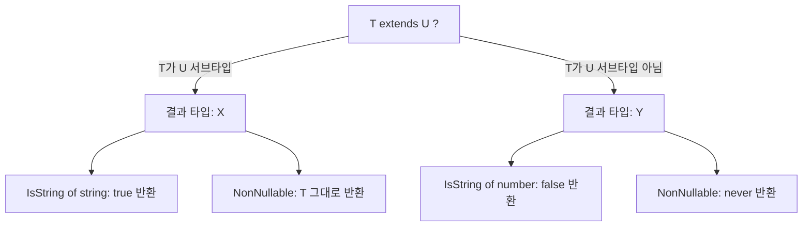
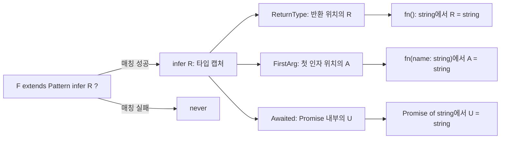

## 정의

**Conditional Type** 은 `T extends U ? X : Y` 형태로 타입 레벨에서 조건 분기를 표현합니다. `infer` 키워드로 매칭된 타입을 추출하고, union 에 대해서는 **자동 분배 (distributive)** 됩니다. Utility type 대부분이 이 위에 구현되어 있습니다.

## 기본

```typescript
type IsString<T> = T extends string ? true : false;

type A = IsString<"hello">;    // true
type B = IsString<42>;          // false
type C = IsString<string>;      // true
```

`T extends U` 는 **T 가 U 에 할당 가능한가** (subtype).

## 조건 분기 흐름

**다이어그램 1: T extends U 분기 트리**



**다이어그램 2: infer 추론 흐름**



## 예: 표준 utility 재구현

### `NonNullable`

```typescript
type NonNullable<T> = T extends null | undefined ? never : T;

type A = NonNullable<string | null>;   // string
type B = NonNullable<number | undefined>;   // number
```

### `Exclude`

```typescript
type Exclude<T, U> = T extends U ? never : T;

type A = Exclude<"a" | "b" | "c", "a">;   // "b" | "c"
```

### `Extract`

```typescript
type Extract<T, U> = T extends U ? T : never;

type A = Extract<string | number | boolean, string | number>;   // string | number
```

## Distributive Conditional Types

Type parameter 가 **naked** 하게 있으면 union 에 대해 자동 분배:

```typescript
type ToArray<T> = T extends any ? T[] : never;

type A = ToArray<string | number>;
// = (string extends any ? string[] : never)
// | (number extends any ? number[] : never)
// = string[] | number[]
```

**주의**: 이는 자주 원치 않는 결과.

```typescript
type A = ToArray<string | number>;   // string[] | number[]
type B = (string | number)[];         // (string | number)[]
// A ≠ B
```

`(string | number)[]` 를 원하면 tuple 로 감싸 분배 방지:

```typescript
type ToArrayNonDist<T> = [T] extends [any] ? T[] : never;

type A = ToArrayNonDist<string | number>;   // (string | number)[]
```

## `infer` 키워드

조건 안에서 특정 위치의 타입을 추출:

```typescript
type ReturnType<F> = F extends (...args: any[]) => infer R ? R : never;

type A = ReturnType<() => string>;              // string
type B = ReturnType<(x: number) => number[]>;    // number[]
type C = ReturnType<{foo: string}>;              // never
```

`infer R` 은 위치의 타입을 R 이라는 이름으로 캡처.

### 예제

```typescript
type FirstArg<F> = F extends (arg: infer A, ...args: any[]) => any ? A : never;

type A = FirstArg<(name: string, age: number) => void>;   // string

type ArrayElement<T> = T extends (infer E)[] ? E : never;

type B = ArrayElement<number[]>;    // number
type C = ArrayElement<string[]>;    // string

type Unwrap<T> = T extends Promise<infer U> ? U : T;

type D = Unwrap<Promise<string>>;    // string
type E = Unwrap<number>;              // number
```

### 재귀 (`Awaited`)

```typescript
type Awaited<T> = T extends Promise<infer U> ? Awaited<U> : T;

type A = Awaited<Promise<Promise<Promise<string>>>>;   // string
```

## 조건 분기 심화

### 함수 오버로드 감지

```typescript
type LastOverload<F> =
  F extends {
    (...args: infer A1): infer R1;
    (...args: infer A2): infer R2;
    (...args: infer A3): infer R3;
  } ? (...args: A3) => R3 :
  F extends {
    (...args: infer A1): infer R1;
    (...args: infer A2): infer R2;
  } ? (...args: A2) => R2 :
  F extends (...args: infer A) => infer R ? (...args: A) => R : never;
```

TypeScript 는 conditional 로 오버로드 signature 를 마지막 것만 매칭하는 한계가 있음.

### tuple 분해

```typescript
type Head<T extends any[]> = T extends [infer H, ...any[]] ? H : never;
type Tail<T extends any[]> = T extends [any, ...infer R] ? R : never;

type A = Head<[1, 2, 3]>;    // 1
type B = Tail<[1, 2, 3]>;    // [2, 3]
```

### 재귀 tuple 처리

```typescript
type Length<T extends readonly any[]> = T["length"];
type Reverse<T extends any[]> =
  T extends [infer F, ...infer R] ? [...Reverse<R>, F] : [];

type A = Reverse<[1, 2, 3]>;   // [3, 2, 1]

type Concat<A extends any[], B extends any[]> = [...A, ...B];

type X = Concat<[1, 2], [3, 4]>;   // [1, 2, 3, 4]
```

## Distributive union filtering

```typescript
type OnlyStrings<T> = T extends string ? T : never;

type A = OnlyStrings<string | number | boolean>;   // string
```

`| never` 는 원 타입으로 흡수 (union 에서 never 제거).

## 조건부 필드 매칭

```typescript
type PickByValue<T, V> = {
  [K in keyof T as T[K] extends V ? K : never]: T[K];
};

type User = {id: number; name: string; age: number};
type Nums = PickByValue<User, number>;   // {id: number; age: number}
```

Mapped type + conditional + key remapping 조합.

## Higher-order utility

```typescript
type OverrideProps<T, U> = Omit<T, keyof U> & U;

type A = {x: number; y: string};
type B = {y: number; z: boolean};

type C = OverrideProps<A, B>;   // {x: number; y: number; z: boolean}
```

## Type-level parser

```typescript
type ParseInt<S extends string> =
  S extends `${infer N extends number}` ? N : never;

type A = ParseInt<"42">;    // 42

type Split<S extends string, D extends string> =
  S extends `${infer H}${D}${infer R}` ? [H, ...Split<R, D>] : [S];

type B = Split<"a,b,c", ",">;   // ["a", "b", "c"]
```

Template literal type + conditional + infer 로 컴파일 타임 문자열 파싱.

## Chain of conditionals

```typescript
type TypeName<T> =
  T extends string ? "string" :
  T extends number ? "number" :
  T extends boolean ? "boolean" :
  T extends undefined ? "undefined" :
  T extends null ? "null" :
  T extends Function ? "function" :
  "object";

type A = TypeName<"hi">;    // "string"
type B = TypeName<42>;       // "number"
```

## 함정

> [!WARNING]
> **Distributive 함정**. Union type parameter 는 자동 분배. 원치 않으면 `[T] extends [U]` 로 tuple 감쌈.

> [!CAUTION]
> **재귀 깊이 제한**. TypeScript 는 재귀 conditional 을 약 50 단계 정도로 제한. 너무 깊으면 컴파일 오류.

> [!WARNING]
> **`infer` 는 조건 안에서만**. `type X = infer Y` 는 오류. `T extends ... infer ...` 구조.

> [!IMPORTANT]
> **성능**. 복잡한 conditional 은 컴파일 시간 급증. 벤치마크 (tsc --extendedDiagnostics).

> [!CAUTION]
> **`never` 흡수**. `A | never` = `A`, `A & never` = `never`. Conditional 에서 필터링 결과 확인 필요.

## 관련 위키

- [[typescript|TypeScript]] - 상위 개요
- [[ts-generics|Generics]] - Conditional 매개변수
- [[ts-mapped-types|Mapped Types]] - Conditional 과 조합
- [[ts-template-literal-types|Template Literal Types]] - Conditional 파싱
- [[ts-union-intersection|Union / Intersection]] - Distributive
- [[ts-utility-types|Utility Types]] - 구현
- [[ts-type-aliases|Type Aliases]]
- [[ts-narrowing|Type Narrowing]]
