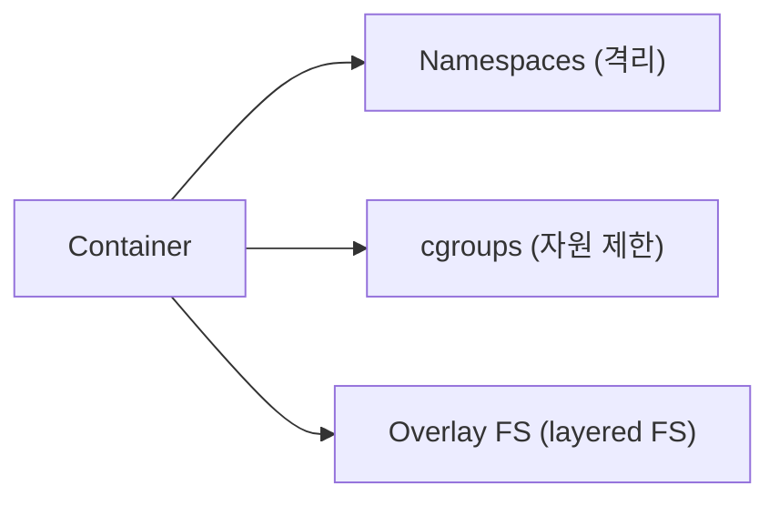
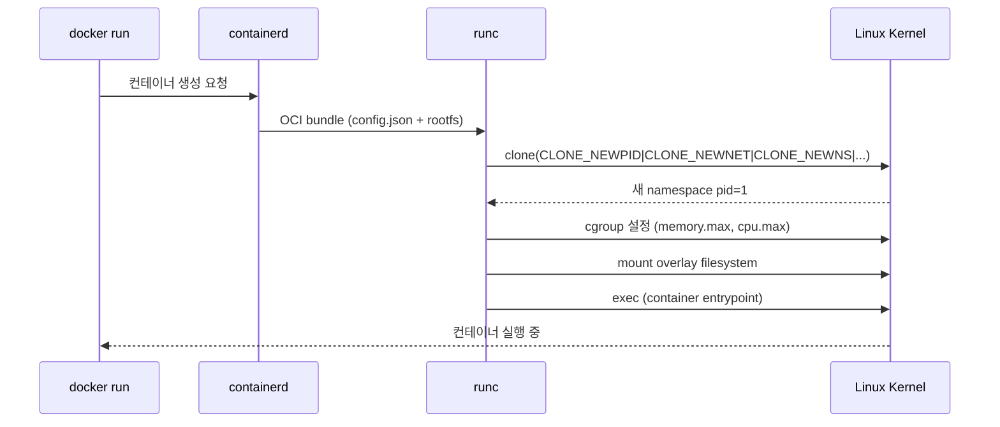
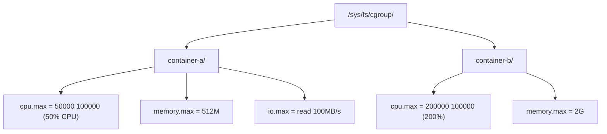
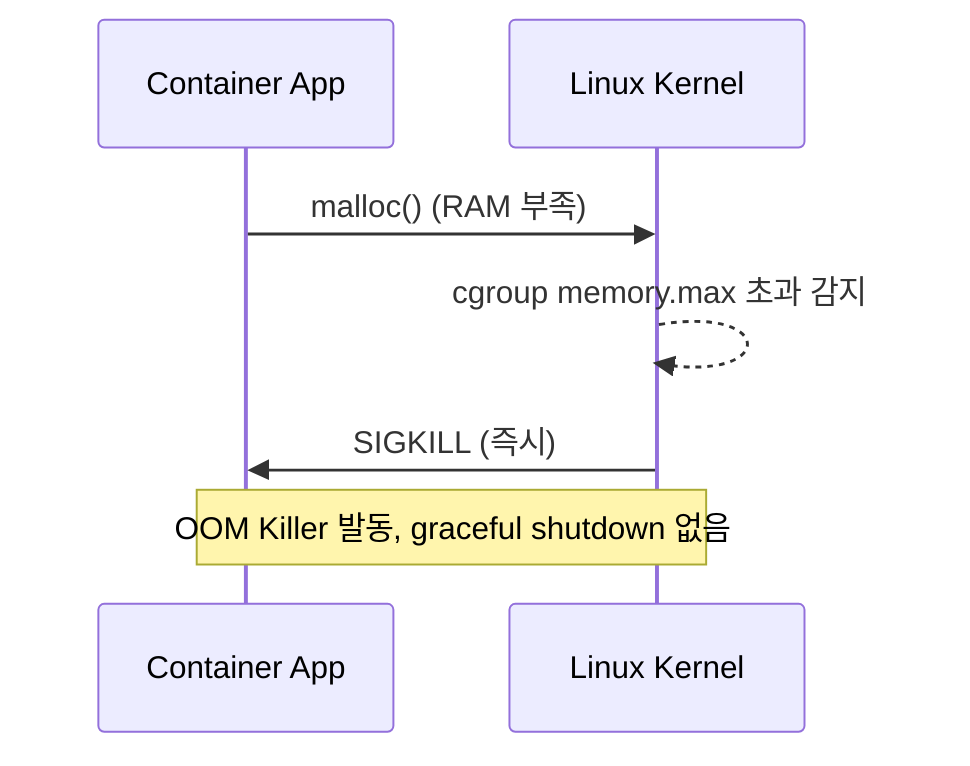

## 정의

컨테이너 = *namespaces + cgroups + 파일시스템 (overlay)*. *VM 이 아니라 host 의 프로세스* + *격리*.



> VM 은 *hypervisor + 별도 커널*, 컨테이너는 *host 커널 공유*. 시작 속도 수 ms vs 수 초.

## 컨테이너 생성 과정



## Namespaces (격리)

Linux 8가지 namespace 로 컨테이너 격리:

| Namespace | 격리 대상 | 커널 버전 |
|---|---|---|
| `pid` | 프로세스 ID (안에서 PID=1) | 3.8 |
| `mnt` | 파일시스템 마운트 | 3.8 |
| `net` | 네트워크 인터페이스, 라우팅, 방화벽 | 3.8 |
| `uts` | hostname, domain | 3.8 |
| `ipc` | System V IPC, POSIX msg queue | 3.8 |
| `user` | UID/GID 매핑 (root in container ≠ root in host) | 3.8 |
| `cgroup` | cgroup root | 4.6 |
| `time` | clock (monotonic, boot time) | 5.6 |

```bash
# 새 namespace 에서 명령 실행
unshare --pid --mount --net --fork bash

# 컨테이너 namespace 확인
ls -la /proc/$(docker inspect --format='{{.State.Pid}}' my-container)/ns/

# namespace 종류별 ID (같은 숫자 = 공유)
lsns -p $(docker inspect --format='{{.State.Pid}}' my-container)
```

## PID Namespace 심화

```
Host                 Container
------               ----------
PID 1: systemd       PID 1: nginx (container init)
PID 2: kthread       PID 2: nginx worker
PID 100: dockerd     (host PIDs 불가시)
PID 234: nginx       (동일 프로세스, host 는 234로 봄)
```

*컨테이너 안 PID 1* 이 종료되면 *컨테이너 전체 종료*. `SIGTERM` 핸들러 필수.

```dockerfile
# PID 1 문제 해결: init process 사용
FROM node:22-alpine
RUN apk add --no-cache tini
ENTRYPOINT ["/sbin/tini", "--"]
CMD ["node", "server.js"]
```

> *tini/dumb-init* = zombie reaping + SIGTERM 전파. 직접 `CMD ["node"]` 하면 zombie process 누적.

## Network Namespace 심화

```
Host network namespace:
  eth0: 192.168.1.10
  docker0 (bridge): 172.17.0.1

Container network namespace:
  eth0 (veth pair): 172.17.0.2
  lo: 127.0.0.1
```

```bash
# container 의 network namespace 진입
nsenter --target $(docker inspect --format='{{.State.Pid}}' c1) \
        --net -- ip addr show

# veth pair 확인 (host side)
ip link show type veth
```

## cgroups (자원 제한)



| Controller | 제한 대상 | 파일 |
|---|---|---|
| `cpu` | CPU 시간 | `cpu.max` |
| `memory` | RAM + swap | `memory.max`, `memory.swap.max` |
| `io` | block I/O | `io.max` |
| `pid` | 프로세스 수 | `pids.max` |
| `cpuset` | CPU core 지정 | `cpuset.cpus` |
| `hugetlb` | huge pages | `hugetlb.*.max` |

```bash
# cgroup v2 확인
cat /sys/fs/cgroup/cgroup.controllers
# output: cpuset cpu io memory hugetlb pids rdma misc

# container cgroup 확인
cat /sys/fs/cgroup/system.slice/docker-<id>.scope/memory.current
cat /sys/fs/cgroup/system.slice/docker-<id>.scope/cpu.stat
```

## cgroup v1 vs v2

| | v1 | v2 |
|---|---|---|
| 출시 | 2007 | 2016 (kernel 4.5) |
| 계층 | *controller 별 다수 트리* | *단일 통합 계층* |
| 파일시스템 | `/sys/fs/cgroup/{cpu,memory,...}/` | `/sys/fs/cgroup/` 하나 |
| thread granularity | 없음 | thread-level 제어 가능 |
| 권장 | legacy | *모든 현대 distro 기본* |
| K8s 지원 | deprecated (1.25+) | *기본 (1.25+)* |

> *Ubuntu 22.04+, Fedora 31+, K8s 1.25+* 가 cgroup v2 기본.

### cgroup v2 CPU 제한 예시

```bash
# CPU 50% 제한 (50ms / 100ms period)
echo "50000 100000" > /sys/fs/cgroup/mycontainer/cpu.max

# Docker 설정
docker run --cpus="0.5" --memory="512m" nginx

# K8s 설정 (내부적으로 cgroup 설정)
resources:
  limits:
    cpu: "500m"
    memory: "512Mi"
```

## OCI Runtime spec 에서

```json
{
  "linux": {
    "namespaces": [
      { "type": "pid" },
      { "type": "network" },
      { "type": "ipc" },
      { "type": "uts" },
      { "type": "mount" }
    ],
    "resources": {
      "memory": { "limit": 536870912 },
      "cpu": { "shares": 1024, "quota": 50000, "period": 100000 }
    }
  }
}
```

## OOM kill (cgroup memory)



> [!CAUTION]
> *Memory limit 초과 = SIGKILL (graceful 없음)*. K8s 는 `OOMKilled` 로 표시. limit 을 *측정 후 여유 있게*.

```bash
# OOM kill 확인
dmesg | grep -i "oom"
kubectl describe pod mypod | grep -A5 "OOMKilled"
```

## User Namespace

```
Container:           Host:
root (uid 0)    =>  uid 100000
user1 (uid 1)   =>  uid 100001
```

*컨테이너 내부 root 가 host root 아님*. 보안 강화. *rootless container* (Podman) 의 토대.

```bash
# rootless Podman (host uid 1000 사용자로 실행)
podman run --rm ubuntu id
# uid=0(root) gid=0(root) ... (container 내부는 root 처럼 보임)

# 실제 host 에서 확인
cat /proc/$(pgrep -n bash)/status | grep Uid
# Uid: 100000  100000 ...  (실제 제한된 uid)
```

> Docker 는 userns-remap 설정 필요. Podman 은 기본 지원.

## OverlayFS

```
lowerdir (read-only): image layers (L1, L2, L3 ...)
upperdir (read-write): container 변경사항
merged:               통합 view (container 가 보는 FS)
workdir:              OverlayFS 내부 작업 디렉토리
```

```bash
# OverlayFS 마운트 확인
mount | grep overlay
# overlay on /var/lib/docker/overlay2/<id>/merged type overlay
#   (lowerdir=<L3>:<L2>:<L1>,upperdir=<upper>,workdir=<work>)

# container 에서 파일 수정 시
# → upperdir 에만 기록 (lowerdir 불변)
# → 삭제는 whiteout 파일로 표시
```

## 흔한 함정

> [!WARNING]
> 1. **`--privileged`** = 모든 namespace 해제 + 모든 capability. 컨테이너 = host process. *capabilities 만 추가 (`--cap-add`)*.
> 2. **호스트 PID/IPC/Network 공유** = `--pid=host` 등. 격리 완전히 없어짐.
> 3. **CPU limit 의 throttle** = container 가 *느려짐* (kill 아님). `cpu_throttled_seconds` 메트릭 확인.
> 4. **Memory limit 너무 작음** = OOM kill 반복. 실제 사용량 측정 후 설정.
> 5. **PID 1 에 signal 핸들러 없음** = SIGTERM 무시, K8s graceful shutdown 실패. tini 사용.

## 관련 위키

- [[docker]]
- [[container-image-best-practices]]
- [[k8s-pod]]
