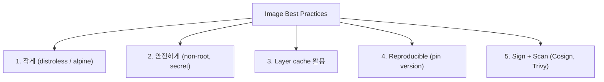
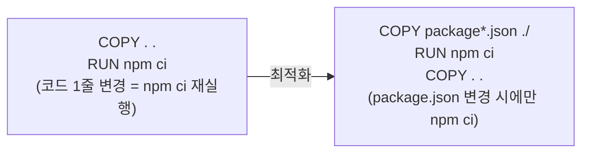

## 정의

컨테이너 image best practices = *작고 (small), 안전하고 (secure), 재현 가능하고 (reproducible), 서명된 (signed)* image 를 만드는 원칙.

## 5가지 원칙



## 1. Base Image 선택

| Base | 크기 | musl/glibc | 적합 |
|---|---|---|---|
| `ubuntu:24.04` | ~70 MB | glibc | 개발 / 디버깅 친화 |
| `debian:12-slim` | ~40 MB | glibc | 일반 범용 |
| `alpine:3.20` | ~5 MB | musl | 작음, glibc 의존성 주의 |
| `distroless/static` | ~2 MB | - | Go / Rust 정적 binary |
| `distroless/cc` | ~20 MB | glibc | C 라이브러리 필요 |
| `distroless/nodejs22` | ~150 MB | glibc | Node.js, 안전 |
| `distroless/java21` | ~200 MB | glibc | Java (JRE 포함) |
| `distroless/python3` | ~50 MB | glibc | Python |
| `scratch` | 0 | - | 정적 binary 전용 |

> *Distroless* = *shell / package manager / OS 유틸 없음*. 공격 면 감소. CVE 도 줄어듦. Google 권장.

```bash
# 크기 비교
docker pull ubuntu:24.04 && docker image ls ubuntu
docker pull gcr.io/distroless/static:nonroot && docker image ls gcr.io/distroless/static
```

## 2. Multi-stage build

### Go + distroless

```dockerfile
FROM golang:1.23 AS builder
WORKDIR /src
COPY go.* ./
RUN go mod download
COPY . .
RUN CGO_ENABLED=0 GOOS=linux go build -o /app ./cmd/server

FROM gcr.io/distroless/static:nonroot
COPY --from=builder /app /app
USER nonroot:nonroot
ENTRYPOINT ["/app"]
```

### Node.js + distroless

```dockerfile
FROM node:22-alpine AS deps
WORKDIR /app
COPY package*.json ./
RUN npm ci --only=production

FROM node:22-alpine AS builder
WORKDIR /app
COPY package*.json ./
RUN npm ci
COPY . .
RUN npm run build

FROM gcr.io/distroless/nodejs22:nonroot
WORKDIR /app
COPY --from=deps /app/node_modules ./node_modules
COPY --from=builder /app/dist ./dist
USER nonroot:nonroot
CMD ["dist/server.js"]
```

### Java + distroless

```dockerfile
FROM gradle:8.5-jdk21 AS builder
WORKDIR /src
COPY . .
RUN gradle bootJar --no-daemon

FROM gcr.io/distroless/java21:nonroot
COPY --from=builder /src/build/libs/app.jar /app.jar
USER nonroot:nonroot
ENTRYPOINT ["java", "-jar", "/app.jar"]
```

> *최종 image 에 빌드 도구 없음*. JDK 대신 JRE / distroless 사용으로 수백 MB 절감.

## 3. Layer Cache 최적화



```dockerfile
# ✅ 의존성 파일 먼저, 소스 나중
COPY package*.json ./
RUN npm ci
COPY . .

# ✅ BuildKit 캐시 마운트 (패키지 캐시 영속)
RUN --mount=type=cache,target=/root/.npm \
    npm ci

# ✅ apt 캐시 마운트
RUN --mount=type=cache,target=/var/cache/apt \
    apt-get update && apt-get install -y --no-install-recommends \
    build-essential \
    && rm -rf /var/lib/apt/lists/*
```

> *BuildKit 캐시 마운트* = npm / pip / apt 캐시를 *build 간 재사용*. CI 에서 수분 단축.

## 4. Non-root User

```dockerfile
# Alpine 방식
RUN addgroup -g 1000 appuser && \
    adduser -D -u 1000 -G appuser appuser
USER appuser:appuser

# Debian/Ubuntu 방식
RUN groupadd -g 1000 appuser && \
    useradd -r -u 1000 -g appuser appuser
USER appuser:appuser

# distroless 내장
FROM gcr.io/distroless/static:nonroot
USER nonroot:nonroot   # uid 65532
```

```yaml
# K8s PodSecurityContext
securityContext:
  runAsNonRoot: true
  runAsUser: 1000
  runAsGroup: 1000
  readOnlyRootFilesystem: true
  allowPrivilegeEscalation: false
```

> K8s 1.23+ *Restricted PodSecurityStandard* = `runAsNonRoot: true` 강제. 미리 맞춰야 배포 됨.

## 5. Secret 처리

```dockerfile
# BuildKit secret (layer 에 절대 안 남음)
RUN --mount=type=secret,id=npmrc \
    cp /run/secrets/npmrc ~/.npmrc && \
    npm ci && \
    rm -f ~/.npmrc

# pip private index
RUN --mount=type=secret,id=pip_conf \
    PIP_CONFIG_FILE=/run/secrets/pip_conf pip install -r requirements.txt
```

```bash
docker buildx build \
  --secret id=npmrc,src=$HOME/.npmrc \
  --secret id=pip_conf,src=$HOME/.pip/pip.conf \
  .
```

> [!CAUTION]
> *ARG / ENV / COPY 로 secret 전달 절대 금지*. `docker history` 로 layer 평문 확인 가능. BuildKit `--secret` 만 사용.

## 6. .dockerignore

```
# 불필요 파일 제외 (build context 최소화)
node_modules
.git
.env
.env.*
**/*.log
.DS_Store
dist
coverage
.vscode
.idea
*.md
tests
docs
```

## 7. HEALTHCHECK

```dockerfile
HEALTHCHECK --interval=30s --timeout=3s --start-period=10s --retries=3 \
  CMD curl -f http://localhost:8080/health || exit 1

# wget 사용 (curl 없는 경우)
HEALTHCHECK --interval=30s --timeout=5s \
  CMD wget -qO- http://localhost:8080/health || exit 1
```

> K8s 에서는 Liveness/Readiness probe 가 우선이지만 `docker run` 환경에서는 HEALTHCHECK 가 유용.

## 8. Image Scan + 서명

```bash
# CVE 스캔 (Trivy)
trivy image --severity HIGH,CRITICAL myapp:1.0

# Grype 스캔
grype myapp:1.0

# 서명 (Cosign + Sigstore)
cosign sign --key cosign.key myapp:1.0
cosign verify --key cosign.pub myapp:1.0

# SBOM 생성 (Syft)
syft myapp:1.0 -o spdx-json > sbom.json

# SBOM 취약점 검사
grype sbom:sbom.json
```

| 도구 | 용도 |
|---|---|
| **Trivy** | CVE / misconfig / secret scan (가장 많이 씀) |
| **Grype** | CVE scan (Anchore) |
| **Cosign** | image 서명 + verify (keyless 지원) |
| **Syft** | SBOM 생성 (SPDX, CycloneDX) |
| **Notary v2** | image trust, CNCF 표준 |

## 9. Dive: Layer 분석

```bash
# 설치
brew install dive

# image layer 분석 (크기 + 파일 변화)
dive myapp:1.0

# CI 모드: efficiency < 90% 이면 실패
CI=true dive --ci-config .dive-ci.yml myapp:1.0
```

```yaml
# .dive-ci.yml
rules:
  lowestEfficiency: 0.9
  highestWastedBytes: "20MB"
  highestUserWastedPercent: 0.1
```

> *Dive* = 각 layer 에서 추가/삭제된 파일 시각화. *불필요 파일 찾기 최고 도구*.

## 10. Reproducible Build + OCI Labels

```dockerfile
ARG BUILD_DATE
ARG GIT_SHA
ARG VERSION

LABEL org.opencontainers.image.created=$BUILD_DATE
LABEL org.opencontainers.image.revision=$GIT_SHA
LABEL org.opencontainers.image.version=$VERSION
LABEL org.opencontainers.image.source="https://github.com/myorg/myapp"
LABEL org.opencontainers.image.licenses="Apache-2.0"
```

```bash
docker buildx build \
  --build-arg BUILD_DATE=$(date -u +"%Y-%m-%dT%H:%M:%SZ") \
  --build-arg GIT_SHA=$(git rev-parse HEAD) \
  --build-arg VERSION=1.2.3 \
  -t myapp:1.2.3 .
```

> 같은 입력 → 같은 output. *supply chain security* 의 토대.

## 빌드 최적화 체크리스트

| 항목 | 확인 |
|---|---|
| Multi-stage build 사용 | 빌드 도구 final image 에 없음 |
| Base image pin (`:22-alpine@sha256:...`) | digest 고정 |
| `.dockerignore` 작성 | context < 10MB 목표 |
| 의존성 파일 먼저 COPY | layer cache 활용 |
| Non-root USER | uid 1000 이상 |
| Secret = `--mount=type=secret` | ARG/ENV 금지 |
| `apt-get clean` 같은 RUN 줄 | 별도 layer 아님 |
| Trivy scan CI 통합 | HIGH/CRITICAL 0건 목표 |
| Cosign 서명 | supply chain |

## 흔한 함정

> [!WARNING]
> 1. **`apt install ... && apt clean` 여러 RUN** = `clean` 이 별도 layer. *하나의 RUN + `&&`* 으로 합치기.
> 2. **`COPY . /app`** = `.dockerignore` 없으면 `.git`, `node_modules` 까지 포함. context 폭발.
> 3. **`latest` tag** = build 마다 다른 결과. digest 또는 명시 tag.
> 4. **root 사용자 + privileged** = K8s Restricted Policy 거부. 미리 non-root.
> 5. **base image 를 자주 갱신 안 함** = CVE 누적. 자동 Renovate / Dependabot 으로 주기 갱신.

## 관련 위키

- [[docker]]
- [[cgroups-namespaces]]
- [[k8s-pod]]
