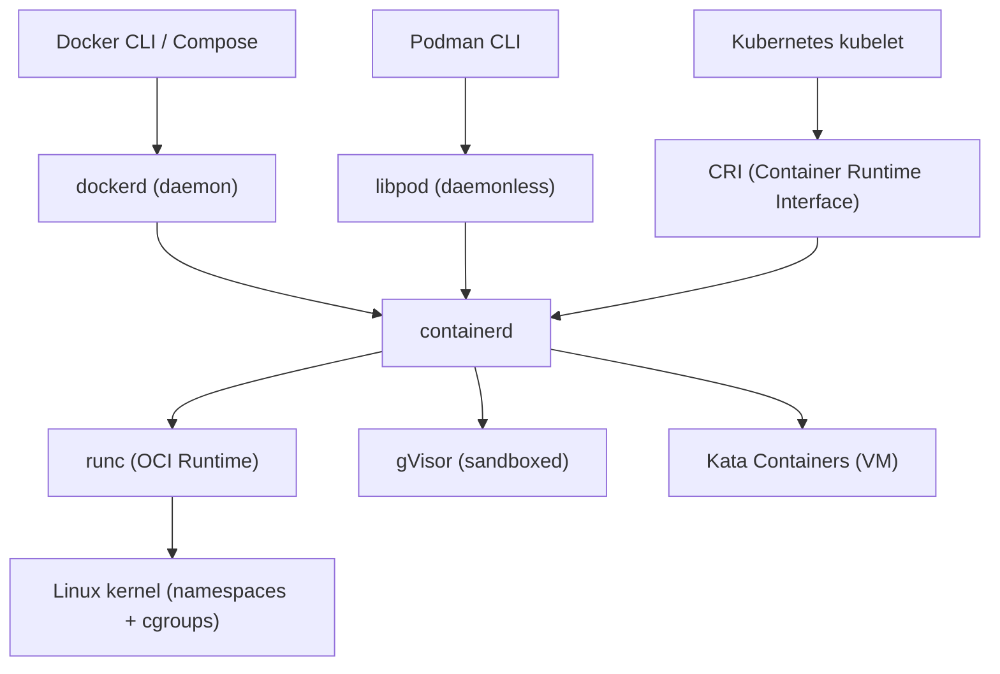
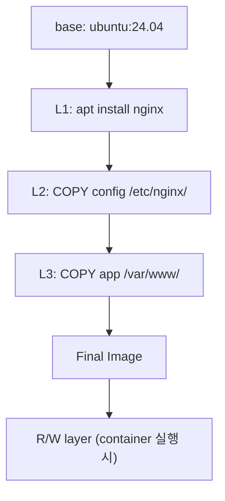

## 정의

**Docker** = 컨테이너 *빌드 + 실행 + 배포* 의 표준 도구. 2013 출시 → *컨테이너 시대* 의 시작. 현재는 *OCI 표준* 으로 진화 (`containerd`, `runc`, `podman` 등 호환).

## 컨테이너 런타임 생태계



| 런타임 | 특징 |
|---|---|
| **dockerd** | 전통 Docker daemon, 개발 환경 표준 |
| **containerd** | CNCF graduated, K8s 표준 CRI |
| **Podman** | daemonless, rootless 지원, systemd 통합 |
| **gVisor** | 사용자 공간 커널, 보안 강화 (Google Cloud Run) |
| **Kata Containers** | VM 기반 격리, 강한 보안 |

> 2026 시점 *프로덕션 K8s = containerd*. 개발 편의는 Docker. 보안 우선 = Podman.

## OCI 표준

*Open Container Initiative* = image + runtime 표준화.

| 스펙 | 내용 |
|---|---|
| **OCI Image Spec** | image manifest, config, layer (tar.gz) |
| **OCI Runtime Spec** | container 생성/실행 (runc 구현) |
| **OCI Distribution Spec** | registry API (push/pull) |

```json
// OCI Image Manifest (요약)
{
  "schemaVersion": 2,
  "mediaType": "application/vnd.oci.image.manifest.v1+json",
  "config": { "mediaType": "application/vnd.oci.image.config.v1+json", "size": 1234 },
  "layers": [
    { "mediaType": "application/vnd.oci.image.layer.v1.tar+gzip", "size": 7023, "digest": "sha256:abc..." },
    { "mediaType": "application/vnd.oci.image.layer.v1.tar+gzip", "size": 1234, "digest": "sha256:def..." }
  ]
}
```

> OCI 표준 덕분에 *Docker build* 로 만든 image 를 *Podman run / K8s* 가 그대로 실행.

## Layered Filesystem



> 각 *Dockerfile instruction* = *별도 layer*. *불변* + *재사용 (cache)*.

## Dockerfile

```dockerfile
# 멀티 스테이지 빌드
FROM node:22-alpine AS builder
WORKDIR /app
COPY package*.json ./
RUN npm ci
COPY . .
RUN npm run build

FROM nginx:alpine AS runtime
COPY --from=builder /app/dist /usr/share/nginx/html
EXPOSE 80
CMD ["nginx", "-g", "daemon off;"]
```

| instruction | 의미 |
|---|---|
| `FROM` | base image |
| `WORKDIR` | 작업 디렉토리 |
| `COPY` / `ADD` | 파일 복사 |
| `RUN` | 빌드 시 실행 |
| `CMD` / `ENTRYPOINT` | 컨테이너 시작 명령 |
| `EXPOSE` | 포트 (문서화, 자동 노출 아님) |
| `ENV` | 환경 변수 |
| `ARG` | 빌드 시 변수 |
| `VOLUME` | mount point |
| `USER` | 실행 사용자 |
| `HEALTHCHECK` | health probe |

## 멀티 스테이지 빌드


*빌드 도구는 final image 에 안 들어감*. 최종 image 가 *작고 안전*.

```dockerfile
# Go: 정적 binary → distroless
FROM golang:1.23 AS builder
WORKDIR /src
COPY go.* ./
RUN go mod download
COPY . .
RUN CGO_ENABLED=0 go build -o /bin/server ./cmd/server

FROM gcr.io/distroless/static:nonroot
COPY --from=builder /bin/server /server
USER nonroot:nonroot
ENTRYPOINT ["/server"]
```

## BuildKit (현대 빌드)

```bash
# BuildKit 활성화 (Docker 23+ 기본)
DOCKER_BUILDKIT=1 docker build .

# 멀티 아키텍처 빌드
docker buildx build \
  --platform linux/amd64,linux/arm64 \
  -t myapp:latest \
  --push .

# 캐시 마운트 (apt / npm 캐시 재사용)
RUN --mount=type=cache,target=/var/cache/apt \
    apt-get update && apt-get install -y build-essential

# Secret 마운트 (layer 에 안 남음)
RUN --mount=type=secret,id=npmrc \
    cp /run/secrets/npmrc ~/.npmrc && npm ci
```

| BuildKit 기능 | 효과 |
|---|---|
| 캐시 마운트 | apt/npm 캐시 재사용, 빌드 수분 → 수초 |
| Secret 마운트 | 평문 secret 이 layer 에 안 남음 |
| 멀티 아키 | ARM + x86 동시 빌드 |
| 병렬 stage | 독립 stage 병렬 실행 |

> *BuildKit 가 2026 표준*. ARM/x86 *멀티 아키 동시 build* + 효율적 cache.

## Image Registry

| Registry | 특징 |
|---|---|
| Docker Hub | 공식, rate limit (anonymous 100 pulls/6h) |
| GHCR (GitHub) | github 통합, free for public |
| ECR (AWS) | IAM 통합, 동일 region 무료 |
| Artifact Registry (GCP) | GCP 통합 |
| Harbor | self-host, RBAC + 취약점 스캔 |

## Podman: daemonless 대안

```bash
# Docker 대체 명령 (거의 동일 CLI)
podman build -t myapp .
podman run -d -p 8080:80 myapp
podman compose up -d

# rootless: root 없이 컨테이너 실행
podman run --rm --userns=keep-id myapp
```

| | Docker | Podman |
|---|---|---|
| Daemon | 있음 (dockerd) | 없음 (fork-exec) |
| Rootless | 제한적 | *완전 지원* |
| systemd 통합 | 수동 | `podman generate systemd` |
| K8s 호환 | containerd shim | 동일 |
| Windows/Mac | Docker Desktop | 가상화 (Podman Machine) |

## Docker Networking

```bash
# 기본 bridge network
docker run -p 8080:80 nginx

# 사용자 정의 bridge (컨테이너간 DNS 이름 해석)
docker network create mynet
docker run --network mynet --name api myapi
docker run --network mynet --name db postgres

# host network (Linux only, 포트 매핑 없이 직접)
docker run --network host nginx
```

| Network 모드 | 설명 |
|---|---|
| `bridge` | 기본, 격리된 가상 LAN |
| `host` | host 네트워크 공유 (Linux, 성능 최적) |
| `none` | 네트워크 없음 (완전 격리) |
| `overlay` | Docker Swarm 멀티 호스트 |

## Docker Compose

```yaml
# compose.yml
services:
  api:
    build: .
    ports:
      - "8080:8080"
    environment:
      - DATABASE_URL=postgresql://db:5432/app
    depends_on:
      db:
        condition: service_healthy
    restart: unless-stopped

  db:
    image: postgres:16-alpine
    environment:
      POSTGRES_PASSWORD: secret
    volumes:
      - pgdata:/var/lib/postgresql/data
    healthcheck:
      test: ["CMD-SHELL", "pg_isready -U postgres"]
      interval: 10s
      timeout: 5s
      retries: 5

volumes:
  pgdata:
```

```bash
docker compose up -d
docker compose logs -f api
docker compose down -v   # volume 포함 삭제
```

## Layer Cache 활용

```dockerfile
# 의존성 파일만 먼저 복사 → cache hit
COPY package*.json ./
RUN npm ci              # package.json 변경 시에만 재실행

# 이후 소스 복사
COPY . .
RUN npm run build
```

```bash
# BuildKit cache 마운트로 npm cache 재사용
RUN --mount=type=cache,target=/root/.npm \
    npm ci
```

## .dockerignore

```
node_modules
.git
.env
**/*.log
dist
coverage
.DS_Store
.vscode
```

> *.gitignore 같은*. *build context 작게* → 빠른 build + context 전송 감소.

## 흔한 함정

> [!WARNING]
> 1. **`latest` tag** = build 마다 다른 결과. *명시 tag 또는 digest sha256*.
> 2. **root 사용자** = 보안 위험. `USER 1000` 명시. K8s PodSecurityPolicy 도 차단.
> 3. **secret 을 ENV / ARG** = image layer 에 평문 남음. BuildKit `--secret`.
> 4. **거대한 image** = transfer 느림. distroless / scratch / alpine 활용.
> 5. **COPY . . 를 의존성 이전에** = 코드 변경 시 의존성 재설치. 순서 중요.
> 6. **RUN 여러 줄 분리** = 각각 layer. `&& \` 로 하나의 RUN 으로 합치기.

## 관련 위키

- [[cgroups-namespaces]]
- [[container-image-best-practices]]
- [[k8s-pod]]
