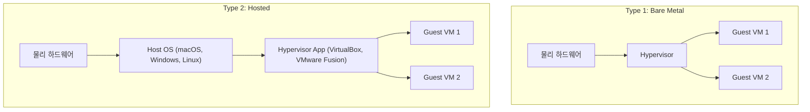
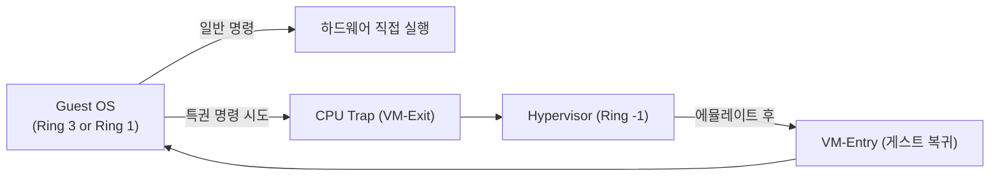

## 정의

**Hypervisor** (Virtual Machine Monitor, VMM) 는 여러 [[virtual-machine|VM]] 을 한 물리 머신 위에서 실행하도록 하드웨어를 가상화하는 소프트웨어입니다. CPU 시간, 메모리 페이지, I/O 디바이스를 게스트 OS 들에게 분배 및 격리합니다.

용어의 어원: **hyper (넘어서는) + supervisor**. 원래 IBM 의 CP-67 (1968) 에서 "supervisor 위에서 supervisor 를 감독한다" 는 의미로 명명되었습니다.

## Popek & Goldberg 정리 (1974)

가상화 가능한 아키텍처의 조건을 처음 정형화한 논문. 세 가지 성질이 필요합니다.

1. **동등성 (Equivalence)**: VM 에서 실행한 프로그램이 실물 하드웨어에서와 같은 결과를 낸다
2. **자원 제어 (Resource Control)**: hypervisor 가 물리 자원을 완전히 통제한다
3. **효율성 (Efficiency)**: 대다수 명령은 하드웨어에서 직접 실행되어야 한다 (인터프리트 X)

핵심 결과: **모든 sensitive instruction (자원 상태 변경) 이 privileged instruction (특권 실행 필요) 의 부분집합** 이어야 가상화 가능. x86 은 원래 이 조건을 만족하지 않았고, 그래서 2005 년 이전 x86 가상화는 이진 재작성 (binary translation, VMware ESX 초기) 을 썼습니다. **Intel VT-x / AMD-V** 가 이 조건을 하드웨어로 만족시켰습니다.

## Type 1 vs Type 2

```anim:virt-hypervisor-types
{}
```



### Type 1: Bare Metal Hypervisor

**하드웨어 위에 직접** 올라갑니다. 그 자체가 OS 역할.

- 오버헤드 작음 (host OS 층이 없음)
- 관리 도구는 별도 (관리 VM 또는 원격 접속)
- 대상: 데이터센터, 서버, 프로덕션 클라우드
- 대표: **VMware ESXi**, **Xen**, **KVM (일부 시각)**, **Microsoft Hyper-V**, **Nutanix AHV**, **Proxmox VE**

> [!NOTE]
> **KVM 은 Type 1 인가 Type 2 인가**? 두 시각이 공존합니다. KVM 은 Linux 커널 모듈로 동작하고 Linux 자체가 host OS 역할을 하지만, KVM 은 Linux 를 hypervisor 로 "승격" 시켜 게스트를 직접 관리합니다. VMware, Red Hat 등은 KVM 을 Type 1 으로 분류하는 경향이 있고, 학술 텍스트는 Type 2 로 보는 경향이 있습니다.

### Type 2: Hosted Hypervisor

**Host OS 위에 애플리케이션으로** 올라갑니다.

- Host OS 층이 있어 오버헤드 다소 큼
- 대신 설치가 간단, 데스크톱에서 편함
- 대상: 개발자 로컬 환경, 학습, 크로스-OS 테스트
- 대표: **Oracle VirtualBox**, **VMware Workstation / Fusion**, **Parallels Desktop**, **QEMU (일반 모드)**

## 주요 hypervisor 상세

### KVM (Kernel-based Virtual Machine)

- 2007 년 Linux 커널에 병합 (Avi Kivity)
- Linux 커널 모듈 형태, `/dev/kvm` 인터페이스
- **QEMU 와 조합** 하는 것이 표준 (QEMU 가 device emulation, KVM 이 CPU/메모리)
- 오픈소스, 무료, 성능 좋음
- **libvirt** 로 관리, virt-manager, virsh CLI
- **RHEL, Ubuntu 등 리눅스 클라우드/서버 기본**
- 사용처: AWS Nitro (일부), Google Cloud, DigitalOcean, OpenStack

### Xen

- 2003 년 케임브리지 대학 발원, paravirtualization 개척
- **Dom0** (관리 도메인) + **DomU** (게스트) 아키텍처
- AWS EC2 초기 세대가 Xen 기반 (~2017)
- 현재는 KVM 에 밀려 점유율 감소, Citrix Hypervisor (XenServer) 로 상용
- 임베디드, 자동차 (Xen ARM) 등 특수 영역에서는 여전히 강함

### VMware ESXi

- VMware 상용 hypervisor, 데이터센터 최강자 (오랫동안)
- **vSphere** 는 ESXi 를 관리하는 상위 스택 (vCenter, vMotion, HA)
- Broadcom 인수 (2023) 후 라이선싱 변경으로 대안 검토가 늘어남
- Type 1, 마이크로커널 기반
- **VMFS** 클러스터 파일시스템, live migration (vMotion) 유명

### Microsoft Hyper-V

- Windows Server 및 Windows 10/11 Pro 에 내장
- Type 1 (기술적으로), 다만 Windows 는 parent partition 이라 UI 상 Type 2 처럼 보임
- Azure 의 기반 hypervisor
- **WSL2** 도 내부적으로 Hyper-V 를 이용해 경량 Linux VM 실행

### Oracle VirtualBox

- 무료, GPL, 크로스플랫폼 (Windows / macOS / Linux)
- Type 2, 데스크톱 개발자 표준
- Vagrant 와 조합해서 개발 환경 구성

### QEMU

- **에뮬레이터** 이자 hypervisor
- 순수 QEMU: 소프트웨어 에뮬레이션 (느림, 하지만 다른 아키텍처 실행 가능, 예: ARM → x86)
- **QEMU + KVM**: 하드웨어 가속 (Linux 표준)
- **QEMU + HVF**: macOS 하드웨어 가속
- Firecracker, Cloud Hypervisor 등이 QEMU 의 subset 을 fork

### Firecracker

- AWS 가 2018 년 오픈소스로 공개
- **microVM**: 극도로 slim 한 hypervisor (수백 KB)
- Rust 로 작성, KVM 기반
- 부팅 125ms 이하
- **AWS Lambda, AWS Fargate** 의 기반
- 컨테이너 편의 + VM 격리의 조합이 목표

### 기타

- **Cloud Hypervisor** (Intel + Rust community): Firecracker 계열, 더 많은 기능
- **Bhyve** (FreeBSD 기반)
- **z/VM** (IBM 메인프레임)
- **PowerVM** (IBM POWER)

## Trap-and-Emulate (가상화 핵심 메커니즘)

게스트 OS 가 특권 명령 (privileged instruction) 을 실행하려 할 때:

1. CPU 가 **trap** 을 발생시켜 hypervisor 로 제어 이전
2. Hypervisor 가 해당 명령을 **에뮬레이트** (실제 효과를 시뮬레이션)
3. 결과를 게스트에게 돌려주고 게스트 실행 재개

비특권 명령은 하드웨어에서 **직접 실행** (Popek & Goldberg "효율성" 조건).



VT-x/AMD-V 가 없던 시절 x86 은 일부 sensitive instruction 이 trap 을 발생시키지 않아 **binary translation** (실행 전 코드를 재작성) 이 필요했습니다.

## 하드웨어 지원

Hypervisor 성능은 CPU 의 가상화 지원에 크게 의존합니다.

- **VT-x / AMD-V**: Ring -1 이라는 새로운 특권 레벨을 만들어 hypervisor 를 여기서 실행
- **EPT / RVI (Nested Paging)**: 게스트 물리 → 호스트 물리 변환을 하드웨어로
- **VT-d / AMD-Vi (IOMMU)**: PCI passthrough 안전화
- **SR-IOV**: NIC 을 VF (Virtual Function) 로 나누어 게스트가 직접 접근
- **APICv**: 인터럽트 가상화 오버헤드 감소

이 모두가 켜져 있으면 컴퓨트/메모리 오버헤드는 몇% 수준, I/O 는 virtio + SR-IOV 로 near-native.

## Nested Virtualization

**VM 안에서 다시 hypervisor 를 돌리는 것**. 예:

- 클라우드에서 개발자가 로컬처럼 KVM 을 돌리고 싶을 때
- WSL2 (Windows 안에서 Hyper-V, 그 안에서 Linux)
- 학습/랩 환경

문제점:

- 성능 오버헤드가 커짐 (트랩 두 번)
- L1 hypervisor 가 nested 를 명시적으로 지원해야 함 (Intel VMCS shadowing 등)
- AWS EC2 는 특정 metal 인스턴스만 nested 허용

## 주요 기능

### Live Migration

실행 중인 VM 을 **중단 없이** 다른 물리 서버로 이동:

- 메모리 페이지를 백그라운드로 복사 (pre-copy 방식)
- Dirty page 만 반복 복사
- 마지막에 잠깐 (수십 ms) freeze 후 CPU 상태 전송
- VMware vMotion, KVM libvirt migration, Xen live migration

### Snapshot

특정 시점 상태 (메모리 + 디스크) 저장. 롤백, 백업.

- 디스크: qcow2 의 CoW 스냅샷
- 메모리: RAM 을 파일로 dump
- 주의: 프로덕션에서 스냅샷 유지는 성능/공간 부담

### Overcommit

물리 자원보다 더 많은 자원을 게스트에 할당:

- **Memory overcommit**: KSM (Kernel Same-page Merging) 으로 동일 페이지 공유, ballooning 으로 회수
- **CPU overcommit**: 물리 코어보다 많은 vCPU (스케줄링으로 시분할)
- 위험: 오버커밋 후 실제 사용량이 급증하면 성능 붕괴, 최악의 경우 OOM

### PCI Passthrough

특정 PCI 디바이스 (GPU, NIC) 를 특정 게스트에게 독점 할당. VFIO (Linux) 로 구현. GPU 가상 데스크톱, HFT 등에 사용.

## Hypervisor 비교

| 항목 | KVM | Xen | ESXi | Hyper-V | VirtualBox |
|:---|:---|:---|:---|:---|:---|
| **유형** | Type 1 (일부 시각 Type 2) | Type 1 | Type 1 | Type 1 | Type 2 |
| **라이선스** | GPL (무료) | GPL / 상용 | 상용 | 상용 (Windows 포함) | GPL |
| **주 사용처** | 클라우드, Linux 서버 | 임베디드, 특수 클라우드 | 엔터프라이즈 DC | Windows DC, Azure | 데스크톱, 개발 |
| **관리 도구** | libvirt, virt-manager | xm/xl, XenCenter | vSphere Client, vCenter | Hyper-V Manager, SCVMM | VirtualBox GUI |
| **live migration** | 지원 (libvirt) | 지원 | 지원 (vMotion) | 지원 | 지원 안 함 |
| **성능** | 우수 (하드웨어 가속 잘 활용) | 우수 (paravirt 특히) | 최상 | 우수 | 중간 |
| **학습 곡선** | 중간 | 높음 | 낮음~중간 (UI 좋음) | 낮음 | 매우 낮음 |

## microVM 트렌드 (Firecracker / gVisor)

전통적인 VM 은 부팅에 수십 초가 걸려 서버리스/컨테이너 밀도에 적합하지 않았습니다. 이를 해결하기 위해 **microVM** 이 등장했습니다.

| 제품 | 기반 | 부팅 | 격리 | 사용처 |
|:---|:---|:---|:---|:---|
| **Firecracker** | KVM + Rust | ~125ms | VM 수준 | AWS Lambda, Fargate |
| **Cloud Hypervisor** | KVM + Rust | ~150ms | VM 수준 | Intel, MS Azure |
| **gVisor** | 시스템콜 인터셉트 | 즉시 | OS 수준 (일부) | Google Cloud Run |
| **Kata Containers** | KVM / QEMU | ~1s | VM 수준 | OCI 호환 컨테이너 런타임 |

**Firecracker** 의 핵심 설계:
- 디바이스 에뮬레이션 최소화 (virtio-net, virtio-blk 만)
- 네트워크, 스토리지, 직렬 포트 외 미지원 (대신 가볍고 빠름)
- Rust 로 작성해 메모리 안전성 보장

**Kata Containers** 는 OCI/CRI 인터페이스를 그대로 사용하므로 Kubernetes 와 바로 통합됩니다.

## Hypervisor 선택 가이드

| 상황 | 권장 |
|:---|:---|
| Linux 서버 / 클라우드 기반 구성 | **KVM + libvirt** |
| 엔터프라이즈 데이터센터, vMotion 필요 | **VMware ESXi / vSphere** |
| Windows 서버 / Azure 연동 | **Hyper-V** |
| 개발자 로컬 (데스크톱) | **VirtualBox** 또는 **Parallels (macOS)** |
| 서버리스, 컨테이너 격리 강화 | **Firecracker** 또는 **Kata Containers** |
| 크로스 아키텍처 에뮬레이션 (ARM on x86) | **QEMU** |

## 함정

- **QEMU-only vs KVM**: `qemu-system-x86_64` 만 실행하면 순수 에뮬레이션으로 느립니다. `-enable-kvm` 이나 `-accel kvm` 을 명시해야 하드웨어 가속됩니다.
- **오버커밋**: 넉넉해 보인다고 무한정 게스트를 얹으면 실제 부하 급증 시 붕괴합니다. 프로덕션은 물리 자원의 80% 정도까지만.
- **NUMA**: 대규모 VM 이 NUMA 노드를 넘어가면 성능 저하. `numa` 옵션으로 게스트가 NUMA 를 인지하게 하거나 pinning 필요.
- **CPU 세대 mismatch**: live migration 대상 서버가 CPU 명령어 셋이 다르면 게스트가 죽을 수 있음. **cluster 내 CPU 마스킹** (EVC in VMware) 필요.
- **Timekeeping**: 게스트 시계가 자주 어긋남. `kvm-clock` (Linux 게스트) 또는 NTP 필수.

## 참고

- 관련 [[virtualization|가상화 전체]]
- 관련 [[virtual-machine|Virtual Machine]]
- 관련 [[vm-vs-container|VM vs Container 비교]]
- Popek & Goldberg 정리: [Formal Requirements for Virtualizable Third Generation Architectures](https://dl.acm.org/doi/10.1145/361011.361073)
- Firecracker paper: [Firecracker: Lightweight Virtualization for Serverless Applications](https://www.usenix.org/system/files/nsdi20-paper-agache.pdf)
