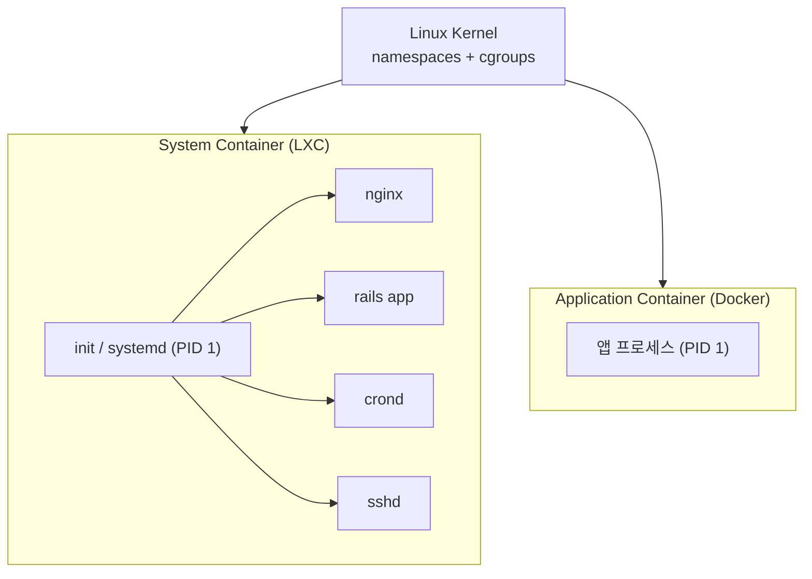

## 정의

**LXC (Linux Containers)** 는 Linux 커널의 [[cgroups-namespaces|namespaces + cgroups]] 를 이용해 **완전한 리눅스 시스템 (init, 서비스, 파일시스템) 을 컨테이너로 실행** 하는 도구입니다. [[docker|Docker]] 가 등장하기 전 (2008 년) 부터 있었으며, "**system container**" 접근의 대표 주자입니다.

**LXD** 는 Canonical (Ubuntu) 이 만든 LXC 위 관리 레이어로, REST API + 이미지 관리 + 클러스터링을 추가합니다. 2023 년 Canonical 이 라이선스를 변경하자 커뮤니티가 **Incus** 로 fork 하여 현재 두 갈래로 발전 중입니다.

## System Container vs Application Container

컨테이너를 사용하는 두 관점입니다.



### System Container (LXC 계열)

- **미니 VM 처럼 사용**: `init` 프로세스 + `systemd` + 여러 서비스 실행
- 안에 여러 프로세스 (nginx + rails + cron 등)
- 로그인 (ssh) 가능한 완전한 리눅스 환경
- **오래 살아있는** 인스턴스, VM 을 대체하는 감각으로 배포
- 대표: LXC, LXD, Incus, systemd-nspawn, OpenVZ

### Application Container (Docker 계열)

- **하나의 프로세스가 하나의 컨테이너**
- Immutable: 로그인해서 고치는 게 아니라 이미지를 새로 빌드
- **일회용, 짧은 수명** (crash 나면 restart)
- Kubernetes 등 오케스트레이터가 대량 실행
- 대표: [[docker|Docker]], Podman, containerd, CRI-O

같은 커널 기술 (namespaces + cgroups) 위에 서 있지만, **사용 철학이 다릅니다**.

## LXC 의 특징

### VM 을 대체할 수 있는 컨테이너

```bash
# 컨테이너 생성 (Ubuntu 24.04 시스템)
lxc-create -n myct -t download -- --dist ubuntu --release noble --arch amd64

# 시작
lxc-start -n myct

# 안에서 shell
lxc-attach -n myct

# 안에서 systemctl 사용 가능
systemctl status
systemctl start nginx
```

**컨테이너 안에 systemd 가 PID 1 로 뜹니다.** 여러 서비스, cron, syslog 등 완전한 리눅스 시스템이 그 안에서 돕니다.

### Privileged vs Unprivileged

- **Unprivileged (기본)**: 컨테이너의 root 가 호스트의 일반 유저에 매핑됨 → 탈출해도 root 권한 없음
- **Privileged**: 컨테이너의 root 가 호스트 root 와 같음 → 성능 우위, 보안 약함

user namespace 를 활용한 unprivileged 모드가 LXC 의 강점입니다. Docker 는 default 로 privileged 이라 (rootless docker 는 별도 설정) LXC 가 이 면에서 오랫동안 앞서 있었습니다.

## LXD / Incus

LXC 위에 얹은 관리 레이어.

- **CLI**: `lxc launch ubuntu:24.04 web`, `lxc list`, `lxc exec web bash`
- **REST API**: 로컬 소켓 또는 HTTPS
- **이미지 서버**: `images:ubuntu/24.04` 로 원격 이미지 자동 다운로드
- **스토리지 백엔드**: dir / zfs / btrfs / lvm / ceph
- **네트워크**: 브릿지, macvlan, ovn
- **클러스터**: 여러 호스트 묶어서 배포
- **Live migration**: CRIU 로 실행 중 컨테이너 이동
- **VM 지원**: LXD 4.0+ 는 QEMU 백엔드로 VM 도 관리 (컨테이너와 통합 UI)

Ubuntu 서버에서 "미니 클라우드" 를 구축하는 표준 방식이었습니다. 2023 년 Canonical 이 CLA 요구 등 라이선스를 강화하자 원 개발자 Stéphane Graber 등이 **Incus** 로 fork. 현재 Incus 가 커뮤니티 주류입니다.

## 다른 시스템 컨테이너 도구

### systemd-nspawn

- systemd 에 내장된 최소 컨테이너 러너
- 완전한 리눅스 시스템 이미지를 빠르게 부팅
- 개발/테스트에 유용, 프로덕션 관리는 별도 도구 필요
- `machinectl` 로 관리

```bash
sudo systemd-nspawn -bD /var/lib/machines/ubuntu-noble/
```

### OpenVZ / Virtuozzo

- 러시아의 Parallels 가 개발한 시스템 컨테이너
- LXC 이전부터 있었음 (2005~)
- 커널 패치 필요 (mainline 이 아님)
- 러시아/CIS 지역의 저가 VPS 호스팅에서 자주 사용

### FreeBSD Jails

- FreeBSD 4.0 (2000) 부터 지원
- 컨테이너의 원조에 가까움
- chroot 확장 + 프로세스/네트워크/사용자 격리
- Linux 컨테이너의 개념적 조상

### Solaris Zones

- Sun Solaris 10 (2005) 부터 지원
- Solaris 서버 통합에서 강력
- Oracle 인수 후 사용 감소

## LXC 와 Docker 비교

| 항목 | LXC (system container) | Docker (application container) |
|:---|:---|:---|
| **철학** | 미니 VM | 프로세스 격리 |
| **PID 1** | `systemd` 또는 `init` | 애플리케이션 프로세스 |
| **수명** | 오래 (일/주/월) | 짧게 (초/분/시간) |
| **이미지** | 완전한 배포판 tarball | 앱 중심 layered image |
| **네트워킹** | 브릿지, VLAN, macvlan | bridge, host, overlay (Docker network) |
| **로그인** | ssh 로 접속 자연스러움 | 원칙적으로 지양 (`docker exec` 로만) |
| **불변성** | 컨테이너 내부 변경 흔함 | 이미지 재빌드로만 변경 |
| **오케스트레이션** | LXD 클러스터, 손수 | Kubernetes (`[[k8s-pod]]` 참조) 등 발달 |
| **주 사용처** | VPS, 개발 환경, 레거시 이관 | 마이크로서비스, CI/CD |

## 언제 LXC 를 쓰는가

### LXC 가 잘 맞는 케이스

- **VPS 대체**: 기존에 VM 으로 돌리던 워크로드를 더 가볍게
- **레거시 앱 이관**: Docker 로 옮기기 어려운 다중 프로세스 모놀리스
- **연구/실험**: 여러 배포판을 로컬에서 병렬로
- **CI 러너**: 완전한 시스템 환경이 필요한 테스트
- **저비용 격리**: OpenVZ 시대의 저가 VPS 호스팅

### Docker 가 나은 케이스

- **마이크로서비스**: 하나의 프로세스 = 하나의 컨테이너
- **불변 인프라**: 재빌드/재배포 파이프라인 잘 되어 있는 조직
- **오케스트레이션**: Kubernetes 생태계 활용
- **표준 이미지**: Docker Hub 의 방대한 이미지 재사용

## 성능

LXC 와 Docker 는 **커널이 같기 때문에 런타임 성능은 거의 동일** 합니다. 차이는 다음에서 옵니다.

- **부팅**: LXC 는 init/systemd 를 시작 (수초), Docker 는 프로세스만 (수백 ms)
- **이미지**: LXC 는 전체 배포판 tarball (수백 MB), Docker 는 layered slim image (수십 MB)
- **격리**: LXC 는 unprivileged 로 user namespace 활용, Docker 는 rootless docker 나 podman 이 뒤늦게 따라잡음

## 실전 명령어 참고

```bash
# LXC (native)
lxc-create -n myct -t download
lxc-start -n myct
lxc-attach -n myct
lxc-stop -n myct

# LXD / Incus
lxc launch ubuntu:24.04 web        # incus 는 incus launch
lxc list
lxc exec web -- bash
lxc file push local.conf web/etc/nginx/
lxc snapshot web backup-2026
lxc restore web backup-2026
lxc stop web

# systemd-nspawn
machinectl list-images
machinectl start ubuntu-noble
machinectl shell ubuntu-noble
```

## 보안 모델 상세

### Unprivileged vs Privileged 심층

LXC 의 **unprivileged container** 는 Linux user namespace 를 활용합니다.

```
호스트 관점          컨테이너 관점
UID 100000 (일반 유저) → UID 0 (root)
UID 100001           → UID 1
...
```

컨테이너 안에서 root 로 실행되더라도, 호스트에서는 UID 100000 (권한 없는 유저) 입니다. 컨테이너가 탈출해도 호스트 root 권한을 얻지 못합니다.

```bash
# /etc/subuid, /etc/subgid 설정 확인
cat /etc/subuid
# myuser:100000:65536

# unprivileged 컨테이너 생성 (기본값)
lxc-create -n myct -t download -- --dist ubuntu --release noble --arch amd64
# /etc/lxc/lxc-usernet 에 bridge 권한 필요
```

### AppArmor / SELinux 프로파일

LXC 는 AppArmor (Ubuntu 기본) 또는 SELinux 프로파일로 컨테이너의 호스트 접근을 추가 제한합니다.

- `/etc/apparmor.d/usr.bin.lxc-start` 에 기본 프로파일 포함
- `/proc`, `/sys` 의 민감한 하위 경로 마운트 제한
- `SYS_ADMIN` 같은 위험 capability 기본 박탈

### Capability 관리

컨테이너 시작 시 불필요한 Linux capability 를 드롭합니다.

```bash
# config 에서 capability 제한
lxc.cap.drop = sys_admin
lxc.cap.drop = sys_rawio
lxc.cap.drop = net_admin
```

## 함정

> [!WARNING]
> **Privileged container 는 root 탈출 위험**. `lxc-create` 기본값은 unprivileged 이지만, 구버전 문서나 튜토리얼이 privileged 를 전제하는 경우가 있습니다. 프로덕션에서는 항상 unprivileged 확인.

> [!CAUTION]
> **nested container 는 추가 설정 필요**. LXD 컨테이너 안에서 Docker 를 쓰려면 `security.nesting: true` 설정 필요. 설정 없이는 docker 가 커널 기능을 사용하지 못합니다.

> [!WARNING]
> **이미지 파일시스템 크기 기본값이 작을 수 있습니다**. 기본 루트 파티션이 수 GB 인 경우 패키지 설치 중 공간 부족. 생성 시 크기를 명시하거나 ZFS/btrfs 백엔드로 동적 확장 구성.

> [!IMPORTANT]
> **Live migration (CRIU)** 은 실험적 기능입니다. 특정 syscall / device 를 쓰는 프로세스는 checkpoint 실패. 중요 서비스 migration 전 충분한 테스트.

## 참고

- 관련 [[docker|Docker]] (application container)
- 관련 [[cgroups-namespaces|cgroups + namespaces]] (LXC 의 근간)
- 관련 [[virtualization|가상화 전체]]
- 관련 [[vm-vs-container|VM vs Container 비교]]
- 관련 [[k8s-pod|Kubernetes Pod]] (쿠버네티스에서의 컨테이너 단위)
- 공식: [linuxcontainers.org](https://linuxcontainers.org/)
- Incus: [https://linuxcontainers.org/incus/](https://linuxcontainers.org/incus/)
- Ubuntu 튜토리얼: [https://ubuntu.com/tutorials/how-to-run-docker-inside-lxd-containers](https://ubuntu.com/tutorials/how-to-run-docker-inside-lxd-containers)
