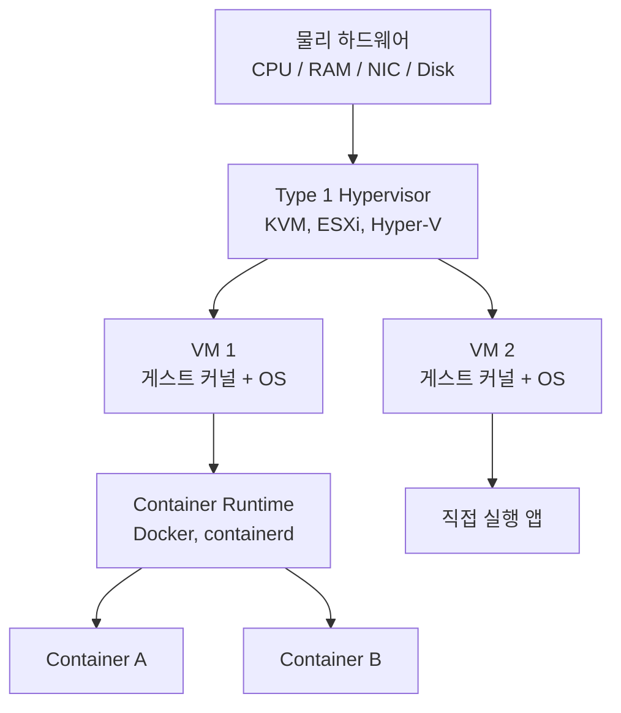

## 정의

**가상화 (Virtualization)** 는 물리 자원 (CPU, RAM, 디스크, NIC) 을 소프트웨어 계층으로 감싸 **여러 논리 인스턴스로 분할** 하거나 **하나로 통합** 하는 기술 전반입니다. "한 대의 머신을 여러 대처럼", 또는 "여러 대를 한 대처럼" 보이게 만드는 것이 목적입니다.

가상화는 크게 다음 세 층에서 일어납니다.

- **하드웨어 가상화**: hypervisor 가 CPU/메모리를 나눠 [[virtual-machine|VM]] 을 만듭니다
- **OS 수준 가상화**: 커널이 프로세스 그룹을 격리해 [[docker|container]] 를 만듭니다
- **애플리케이션 가상화**: JVM, WebAssembly 등 언어 런타임이 앱을 격리합니다

## 왜 가상화하는가

- **자원 활용률**: 물리 서버 한 대의 CPU 가 5% 만 쓰이는 것이 흔합니다. 가상화로 여러 워크로드를 밀집시키면 30~70% 까지 올릴 수 있습니다.
- **격리**: 워크로드 A 의 크래시가 B 에 영향 주지 않음
- **이식성**: 이미지 형태로 다른 하드웨어에 옮길 수 있음
- **재현성**: 개발 환경과 운영 환경을 동일하게 만들 수 있음
- **관리성**: 스냅샷, 라이브 마이그레이션, 자동 스케일링이 가능해짐

## 가상화 분류 (taxonomy)

### 1. 하드웨어 가상화 (Full Virtualization)

Hypervisor 가 CPU/메모리/디바이스를 완전히 에뮬레이션하여, **게스트 OS 는 자기가 실물 하드웨어 위에 있다고 착각** 하도록 만듭니다.

- 게스트 OS 커널을 **수정 없이** 그대로 실행
- 대신 CPU 의 특권 명령 (privileged instruction) 을 hypervisor 가 가로채 처리 → 오버헤드 발생
- Intel **VT-x**, AMD **AMD-V** 같은 하드웨어 지원이 나오면서 오버헤드가 크게 감소했습니다 (2005~)
- 예: KVM, VMware ESXi, VirtualBox, Hyper-V

### 2. Paravirtualization

**게스트 OS 를 수정** 하여, 성능이 중요한 명령을 hypervisor 에 직접 hypercall 로 요청하게 합니다.

- 특권 명령 트랩이 없어 오버헤드가 작음
- 게스트 OS 소스에 접근할 수 있어야 하므로 폐쇄 OS (오래된 Windows) 에는 부적합
- 원조: **Xen** (2003 년 케임브리지)
- 오늘날 순수 paravirt 는 드물고, 하이브리드 (하드웨어 지원 + paravirt 드라이버) 형태가 표준

### 3. OS-Level Virtualization (Containers)

Hypervisor 가 아니라 **커널 자체가 여러 격리된 실행 환경** 을 제공합니다.

- 같은 커널을 공유하지만 [[cgroups-namespaces|namespaces]] 로 프로세스/파일시스템/네트워크 뷰를 분리
- [[cgroups-namespaces|cgroups]] 로 CPU/메모리 사용량 제한
- 커널 부팅 없음 → **부팅이 순식간**
- 예: [[docker|Docker]], [[lxc-system-containers|LXC/LXD]], Podman, systemd-nspawn, FreeBSD Jails, Solaris Zones

### 4. Application Virtualization

앱 자체를 언어 런타임이나 샌드박스로 격리합니다.

- **JVM** (Java): 바이트코드를 어느 OS/CPU 에서도 실행
- **WebAssembly (Wasm)**: 브라우저 및 서버 (Wasmtime, Wasmer) 에서 안전한 실행
- **Firecracker**: AWS 가 만든 초경량 hypervisor (Lambda 에서 사용), 애플리케이션 가상화라기보다 microVM 이지만 경계에 위치

## 계층 비교

```anim:virt-vm-vs-container-stack
{}
```

핵심은 **"어디까지 공유하는가"** 입니다.

- VM: **하드웨어만 공유** (커널, libs, app 모두 게스트 각자)
- Container: **커널까지 공유** (libs, app 만 각자)
- Application VM: **OS 까지 공유** (런타임과 앱만 격리)

공유 범위가 넓을수록 가볍고 빠르지만, 격리 강도는 약해집니다. **가벼움 vs 격리** 트레이드오프.

## 종합 비교표

| 축 | Full Virtualization (VM) | Paravirtualization | Container (OS-level) | App VM |
|:---|:---|:---|:---|:---|
| **격리 대상** | 하드웨어 | 하드웨어 (수정된 게스트) | 프로세스 그룹 | 프로세스 |
| **커널** | 게스트 각자 | 게스트 각자 (hypercall) | host 공유 | host 공유 |
| **부팅 시간** | 분 단위 | 수초 ~ 분 | 초 단위 | 밀리초 |
| **오버헤드** | 중간 (하드웨어 가속으로 완화) | 낮음 | 매우 낮음 | 최저 |
| **격리 강도** | 강함 | 강함 | 중간 (커널 취약점 공유) | 약함 |
| **밀도** | 서버당 수십 개 | 서버당 수십 개 | 서버당 수백~수천 개 | 프로세스만큼 |
| **이미지 크기** | GB 단위 | GB 단위 | MB 단위 | KB ~ MB |
| **대표** | KVM, ESXi, Hyper-V | Xen, KVM+virtio | Docker, LXC | JVM, Wasm |

## 언제 무엇을 쓰는가

### VM 이 유리한 경우

- 다른 커널이 필요할 때 (Linux 위에서 Windows 실행)
- 강한 격리가 필수 (멀티테넌트 클라우드, 규제 산업)
- 커널 수준 튜닝이 필요할 때 (실시간 커널, 커스텀 모듈)
- 이식 대상이 다른 CPU 아키텍처 (QEMU 로 x86 → ARM 에뮬레이션)

### Container 가 유리한 경우

- 개발/운영 환경 일치 (dev = staging = prod)
- 마이크로서비스 (하나에 수십~수백 서비스 배포)
- 빠른 스케일링 (몇 초 안에 새 인스턴스)
- 자원 밀도가 중요 (같은 하드웨어에 더 많이)

### 하이브리드

현대 클라우드는 두 층 모두 씁니다.

- 물리 서버 → 여러 [[virtual-machine|VM]] (예: EC2 인스턴스)
- 각 VM 안에 여러 [[docker|Container]] (예: 쿠버네티스 파드)

AWS Fargate, Google Cloud Run 은 **하나의 컨테이너를 microVM 안에 실행** 하는 방식으로 컨테이너의 편의와 VM 의 격리를 결합합니다 (Firecracker, gVisor).

## 하드웨어 지원

CPU 가 가상화를 도와주는 기능들:

- **Intel VT-x / AMD-V**: 특권 명령 트랩을 하드웨어 수준에서 지원
- **Intel EPT / AMD RVI**: 게스트-호스트 페이지 테이블 이중 관리를 하드웨어로 (nested paging)
- **VT-d / AMD-Vi (IOMMU)**: 게스트가 특정 PCI 디바이스를 직접 접근하도록 안전하게 매핑
- **SR-IOV**: NIC 하나를 여러 게스트가 하드웨어 레벨로 나누어 사용
- **APICv, GICv3**: 인터럽트 가상화

이 지원들 덕에 오늘날 VM 오버헤드는 대부분의 워크로드에서 5% 미만입니다.

## 성능 오버헤드가 발생하는 지점

**VM 이 왜 느린가**:

1. **CPU 특권 명령 트랩**: 하드웨어 지원으로 크게 완화됨
2. **메모리 접근**: 게스트 물리 → 호스트 물리 이중 변환 (EPT 도움)
3. **I/O**: 디스크/네트워크가 hypervisor 를 경유 (virtio 로 완화)
4. **부팅 시간**: 게스트 커널을 매번 부팅해야 함

**Container 가 왜 빠른가**:

1. **커널 공유**: 게스트 커널 부팅 자체가 없음
2. **직접 시스템콜**: 게스트 커널 트랩이 없어 syscall 오버헤드 최소
3. **이미지 크기**: MB 단위, 다운로드/실행 빠름
4. **CoW 파일시스템**: 여러 컨테이너가 read-only 레이어를 공유

## 함정과 오해

### "Container 는 항상 빠르다"

- Startup 은 확실히 빠릅니다
- 하지만 **런타임 CPU/메모리 성능** 은 VM 과 큰 차이 없습니다 (하드웨어 가속으로 VM 도 빠름)
- 밀도 (같은 하드웨어에 몇 개 얹을 수 있는가) 관점에서 컨테이너가 유리

### "VM 은 격리가 완벽하다"

- 이론적으로는 강한 격리
- 하지만 **Spectre, Meltdown** 같은 CPU-level 취약점은 VM 경계를 넘습니다
- **Row Hammer** 같은 DRAM 공격도 이론적으로 가능
- 완벽한 격리는 없음, "충분히 강한 격리" 만 있습니다

### "Container 는 격리가 약하다"

- Docker default 로는 root capability, seccomp filter, AppArmor 등 여러 방어층이 이미 켜져 있습니다
- **gVisor** (Google) 나 **Kata Containers** 는 컨테이너를 microVM 안에서 실행하여 격리를 강화합니다
- Firecracker (AWS Lambda) 도 이 계열

### "가상화는 오버헤드가 크다"

- 2005 년 이전에는 사실이었습니다
- 하드웨어 지원 이후 대부분의 워크로드에서 5% 미만
- 예외: CPU 밀집형 (HFT), GPU 가상화 (NVIDIA vGPU 는 여전히 특수한 기술)

## 가상화 레이어 스택

현대 클라우드의 2단 계층 구조를 시각화합니다.



물리 하드웨어 → Type 1 하이퍼바이저 → VM → 컨테이너 런타임 → 컨테이너 순서로 쌓이는 것이 AWS EC2 + ECS/EKS 구성의 실제 모습입니다.

## 최신 동향: microVM

일반 VM 보다 훨씬 가벼운 *microVM* 이 서버리스 / FaaS 의 테넌트 격리 계층이 되었습니다.

### Firecracker (AWS Lambda, Fargate)

AWS 가 Rust 로 작성한 초경량 KVM hypervisor.

- 부팅 시간 **125 ms 이하** (일반 VM 수십 초 대비)
- 메모리 오버헤드 **약 5 MB** (일반 hypervisor 수백 MB)
- Lambda 는 각 함수 호출을 별도 microVM 에서 실행해 테넌트 격리
- KVM 위에서 동작, x86-64 / aarch64 지원

### gVisor (Google GKE Sandbox)

컨테이너의 syscall 을 사용자 공간 커널이 처리하는 샌드박스.

- 컨테이너가 host 커널을 직접 호출하지 않음 → 커널 취약점 공격면 축소
- Go 로 작성, `runsc` OCI 런타임으로 containerd / CRI-O 와 통합
- GKE Sandbox 옵션으로 활성화 가능

### Kata Containers

OCI 컨테이너 이미지를 경량 VM 안에서 실행하는 CNCF 프로젝트.

- "컨테이너 API + VM 격리"를 함께 제공
- QEMU / Firecracker / Cloud Hypervisor 백엔드 선택 가능
- containerd + `kata-containers` shim 으로 기존 쿠버네티스 클러스터에 통합

> [!TIP]
> microVM 은 "컨테이너의 편의 + VM 의 격리"를 결합합니다. 멀티테넌트 FaaS 와 공개 클라우드에서 점점 표준이 되고 있습니다.

## NUMA 와 가상화

대용량 서버에서 VM 을 배치할 때 NUMA (Non-Uniform Memory Access) 를 무시하면 성능 저하가 큽니다.

- **NUMA 노드**: CPU 와 해당 CPU 가 빠르게 접근하는 RAM 의 묶음
- VM 이 여러 NUMA 노드에 걸치면 원격 메모리 접근 지연 발생
- KVM / ESXi 는 NUMA topology 를 VM 에 반영하는 *pinning* 기능 제공
- 컨테이너 수준: `numactl` 또는 쿠버네티스 Topology Manager 로 제어

## 참고

- 관련 [[hypervisor|Hypervisor Type 1 vs Type 2]]
- 관련 [[virtual-machine|Virtual Machine 개념]]
- 관련 [[docker|Docker]]
- 관련 [[lxc-system-containers|LXC / LXD]]
- 관련 [[cgroups-namespaces|cgroups + namespaces]]
- 관련 [[vm-vs-container|VM vs Container 심층 비교]]
- Xen 논문: [Xen and the Art of Virtualization](https://www.cl.cam.ac.uk/research/srg/netos/papers/2003-xensosp.pdf)
- Wikipedia: [Hardware virtualization](https://en.wikipedia.org/wiki/Hardware_virtualization)
