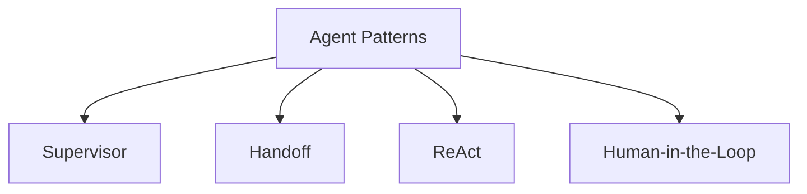
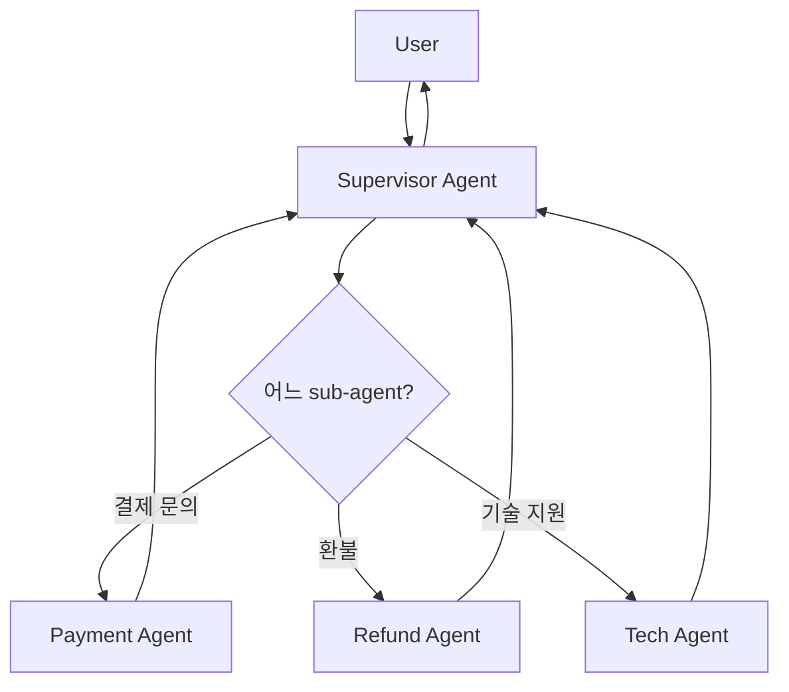
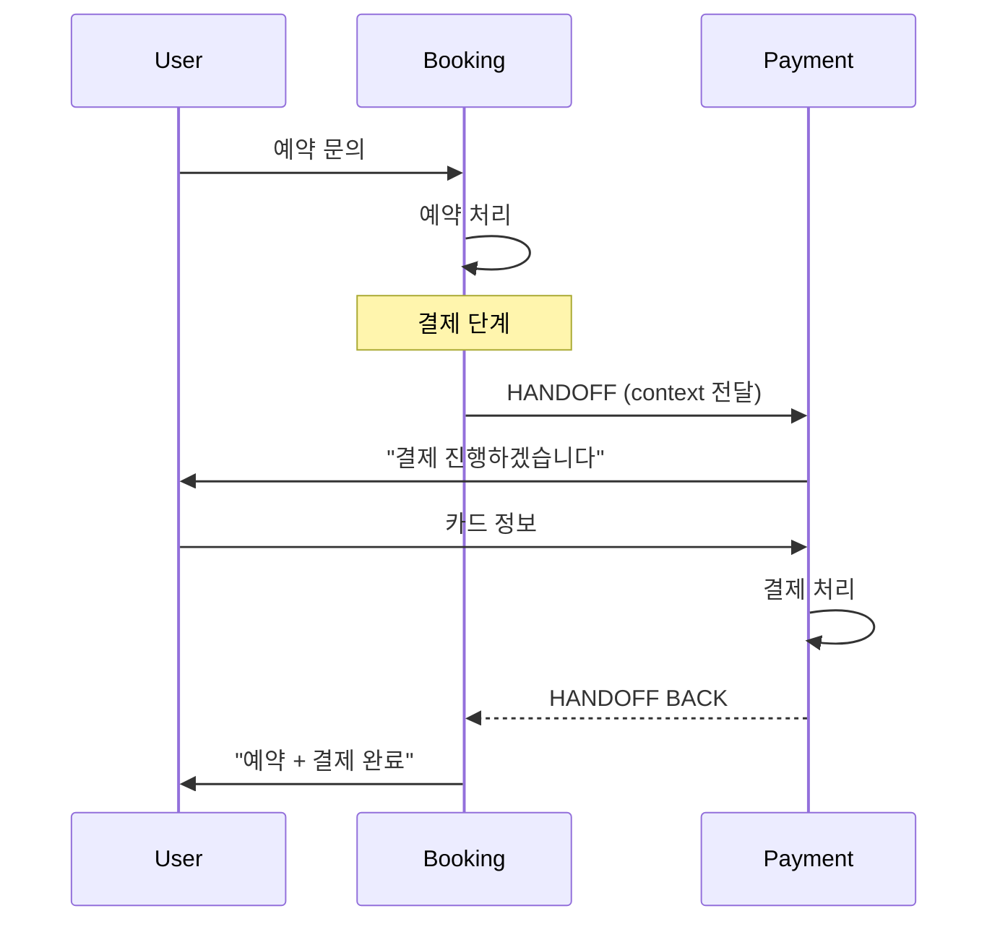
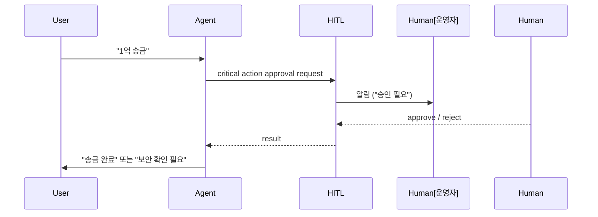
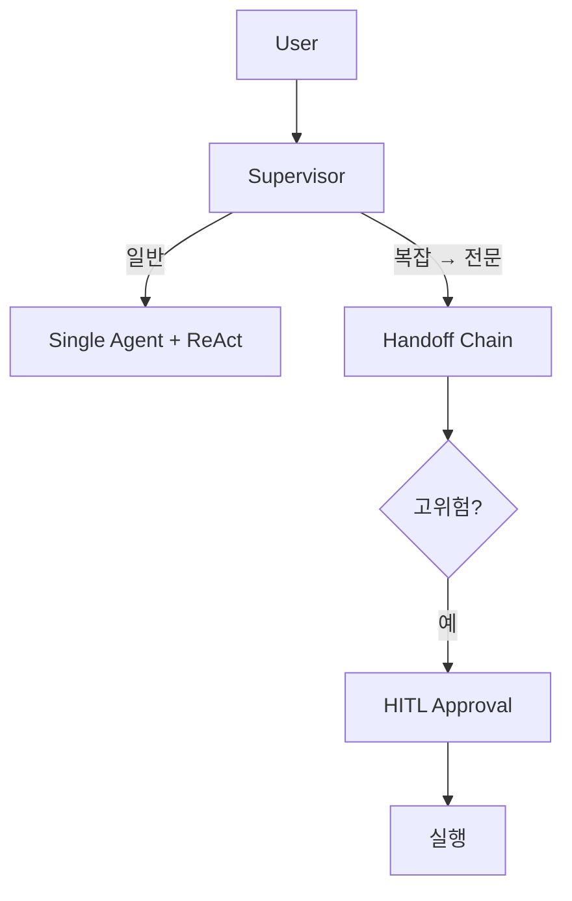

## 정의

복잡한 음성 에이전트 = *여러 sub-agent + 조정 패턴*. 단일 LLM 으로 처리하기 어려운 흐름.

> [!IMPORTANT]
> 각 sub-agent 내부는 *VAD → STT → LLM → TTS 순차 파이프라인* 위에서 동작. 본 페이지의 패턴은 *상위 조정 (orchestration)* 레이어.

## 4가지 핵심 패턴



## 1. Supervisor



```python
class SupervisorAgent:
    """질의 → 적절 sub-agent 라우팅"""

    sub_agents = {
        "payment": PaymentAgent(),
        "refund": RefundAgent(),
        "tech_support": TechAgent(),
    }

    async def handle(self, user_input: str) -> str:
        # LLM 으로 의도 분류
        intent = await self._classify_intent(user_input)
        agent = self.sub_agents[intent]
        return await agent.handle(user_input)

    async def _classify_intent(self, text: str) -> str:
        result = await llm.structured_output(
            schema=IntentSchema,
            messages=[{"role": "user", "content": text}],
        )
        return result.intent
```

> 작은 분류 모델 (gpt-4o-mini, Haiku) 가 *intent classifier*, *세부 agent 가 더 큰 모델*.

## 2. Handoff



OpenAI Swarm 의 *handoff* 패턴:

```python
from swarm import Swarm, Agent

booking_agent = Agent(
    name="Booking",
    instructions="식당 예약을 도와줍니다.",
    functions=[lookup_restaurant, check_availability, transfer_to_payment],
)

payment_agent = Agent(
    name="Payment",
    instructions="결제를 처리합니다.",
    functions=[charge_card, transfer_to_booking],
)

def transfer_to_payment():
    return payment_agent

def transfer_to_booking():
    return booking_agent

client = Swarm()
response = client.run(agent=booking_agent, messages=messages)
```

> *Function return 으로 agent 교체*. 깔끔.

## 3. ReAct (Reason + Act)

```
Thought: 사용자가 "내일 오후 회의 잡아줘" 라고 했다.
Action: search_calendar(date="내일")
Observation: 14:00-15:00 비어있음
Thought: 14시에 잡으면 되겠다. 참석자는 누구?
Action: ask_user("참석자는 누구신가요?")
Observation: "민수씨와 영희씨요"
Thought: 그들의 가용성 확인 필요
Action: check_availability(["민수", "영희"], "내일 14:00")
Observation: 모두 OK
Thought: 회의 생성
Action: create_meeting(...)
Observation: 회의 생성됨, ID=m_42
Thought: 사용자에게 알림
Action: respond("내일 오후 2시에 민수씨, 영희씨와 회의 잡았습니다.")
```

```python
async def react_loop(user_input, max_steps=10):
    messages = [{"role": "user", "content": user_input}]
    for step in range(max_steps):
        response = await llm.chat(messages, tools=tools)

        if response.finish_reason == "stop":
            return response.content   # 최종 답변

        if response.tool_calls:
            for tc in response.tool_calls:
                result = await execute_tool(tc)
                messages.append({"role": "tool", "tool_call_id": tc.id, "content": result})

    raise ReActLoopExceededError()
```

> 음성에서는 *너무 많은 step* = 지연 폭증. *max_steps 3-5* 권장.

## 4. Human-in-the-Loop (HITL)



```python
@agent.tool
async def transfer_money(amount: int, to: str):
    if amount > 10_000_000:
        approval = await request_human_approval(
            action=f"송금 {amount:,}원 → {to}",
            timeout=30,
        )
        if not approval:
            return "송금이 보류되었습니다. 보안팀 확인 후 처리됩니다."

    await bank_api.transfer(amount, to)
    return f"{amount:,}원이 송금되었습니다."
```

> *고위험 작업* (금액 큰 송금, 데이터 삭제, 외부 noti) 에 인간 승인.

## 패턴 조합



## LangGraph 예시 (다중 agent + state machine)

```python
from langgraph.graph import StateGraph, END

class State(TypedDict):
    user_input: str
    intent: str
    result: str

def classify(state):
    state["intent"] = classify_intent(state["user_input"])
    return state

def payment(state):
    state["result"] = handle_payment(state["user_input"])
    return state

def refund(state):
    state["result"] = handle_refund(state["user_input"])
    return state

graph = StateGraph(State)
graph.add_node("classify", classify)
graph.add_node("payment", payment)
graph.add_node("refund", refund)

graph.set_entry_point("classify")
graph.add_conditional_edges(
    "classify",
    lambda s: s["intent"],
    {"payment": "payment", "refund": "refund", "other": END},
)
graph.add_edge("payment", END)
graph.add_edge("refund", END)

app = graph.compile()
```

## 흔한 함정

> [!WARNING]
> 1. **모든 query 에 ReAct** = 단순 FAQ 도 3-step. 의도 분류 후 *복잡한 것만*.
> 2. **Handoff 후 *context 손실*** = 사용자가 같은 정보 반복. handoff 시 *summary* 전달.
> 3. **너무 많은 sub-agent** = supervisor 가 *분류 어려움*. 5-7개 이내.
> 4. **HITL 없이 critical action** = 사고. 임계 정의 + 자동 승인 vs 인간.

## 관련 위키

- [[voice-agent-architecture]]
- [[voice-first-prompt]]
- [[function-calling]] (만일 별도 wiki 있다면)
