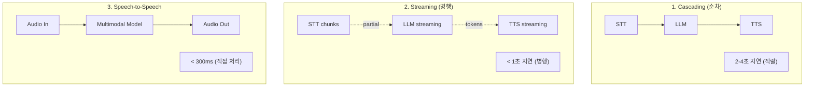
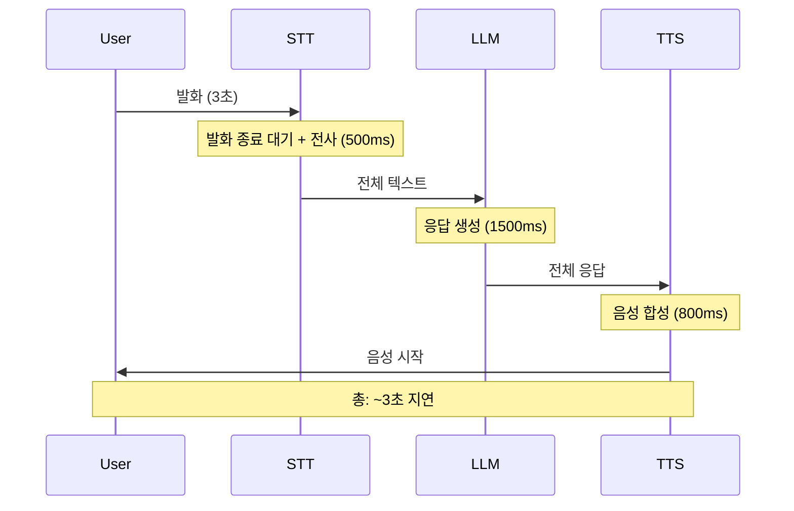
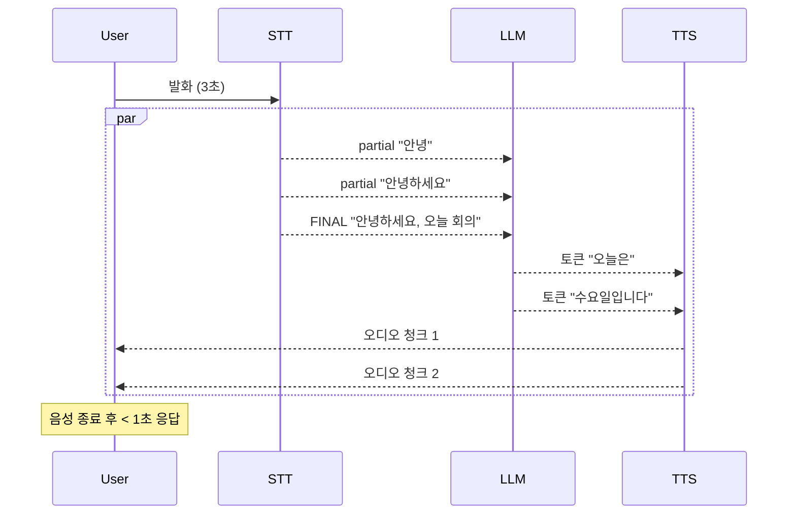
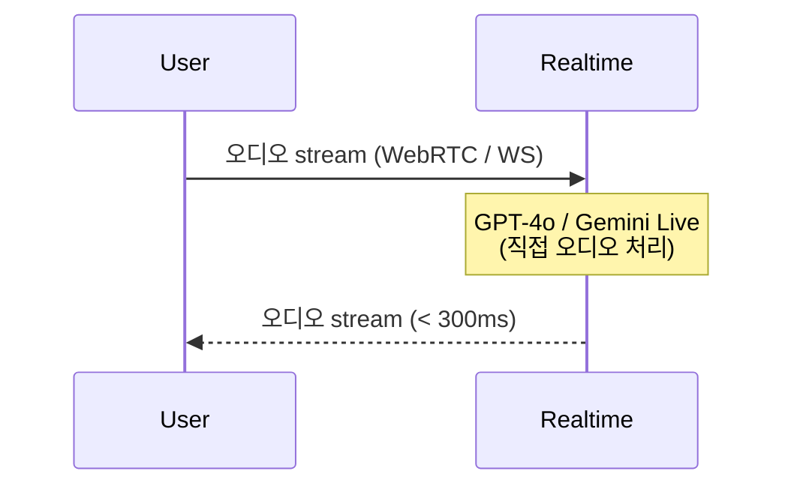
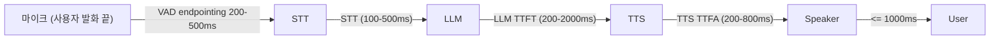
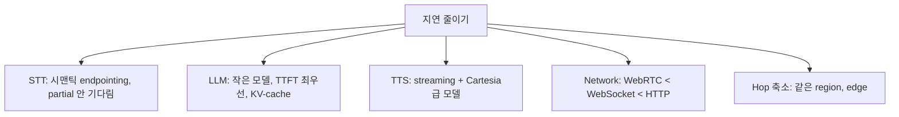
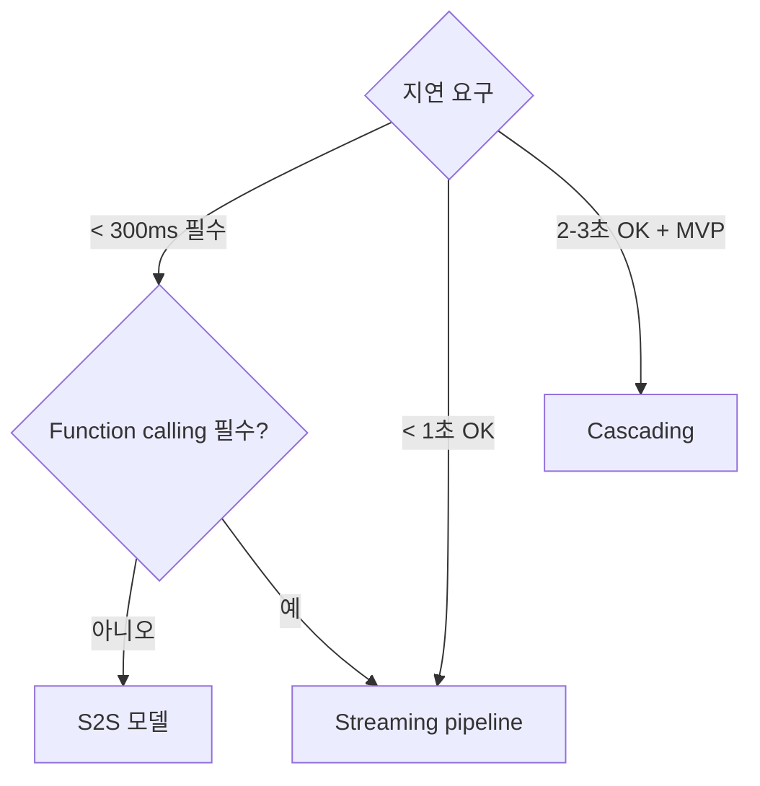

## 정의

실시간 음성 AI 의 *3가지 패턴*. 각자 *지연 vs 유연성 vs 비용* 트레이드오프.

## 3 패턴 비교



| | Cascading | Streaming | S2S |
|---|---|---|---|
| 종단 지연 | *2-4초* | *< 1초* | *< 300ms* |
| 구현 난이도 | 쉬움 | 중간 | 어려움 (제약) |
| 유연성 | *최고* (각 단계 교체) | 높음 | *낮음* (벤더 lock) |
| 비용 | 낮음 | 중간 | *높음* |
| Function calling | OK | OK | *제한* |
| 톤/감정 보존 | X | X | *예* |
| 한국어 | 모델 마다 | 모델 마다 | 일부 (Realtime API 한국어) |
| 사용 | MVP / 일반 | *프로덕션 표준* | 고급 UX |

## 1. Cascading (순차)



```python
async def cascaded_pipeline(audio_url):
    transcript = await stt.transcribe(audio_url)   # 발화 끝나길 기다림
    response = await llm.chat(transcript)           # 전체 응답
    audio = await tts.synthesize(response)          # 전체 합성
    return audio
```

> *MVP 에는 OK*. 프로덕션은 *streaming* 으로 진화.

## 2. Streaming (현재 표준)



```python
async def streaming_pipeline(audio_stream):
    async for transcript_chunk in stt.stream(audio_stream):
        if transcript_chunk.is_final:
            async for token in llm.stream(transcript_chunk.text):
                sentence = aggregator.feed(token)
                if sentence:
                    async for audio_chunk in tts.stream(sentence):
                        yield audio_chunk
```

> [!IMPORTANT]
> *모든 단계 스트리밍 + sentence aggregator*. 2026 시점 *프로덕션 음성 AI 의 표준*.

## 3. Speech-to-Speech (S2S)



| 모델 | 출시 | 한국어 | 특징 |
|---|---|---|---|
| **OpenAI Realtime API (GPT-4o)** | 2024-10 | 우수 | WebRTC / WS, function calling 부분 |
| **Gemini Live (gemini-live-2.5)** | 2024-12 | 우수 | Google AI Studio |
| **Moshi (Kyutai)** | OSS | 영어 | full-duplex, 자체 호스팅 |

> [!CAUTION]
> S2S 의 *function calling 제약* = enterprise 시스템 연동 어려움. *function 이 필수면 cascading + streaming* 채택. [arXiv 참조].

## Latency Budget (지연 예산)



| 단계 | 일반 | 최적 |
|---|---|---|
| Network (Mic → Server) | 30-100ms | 20ms |
| VAD endpointing | 500ms | 200ms (시맨틱) |
| STT (final) | 200-500ms | 100ms |
| LLM TTFT (Time-to-First-Token) | 500-2000ms | 200ms |
| Sentence aggregation | 50-200ms | 0 (streaming) |
| TTS TTFB | 200-800ms | 90ms (Cartesia) |
| Network (Server → Speaker) | 30-100ms | 20ms |
| **총** | **2-4초** | **< 700ms** |

> [!IMPORTANT]
> *800ms 가 "로봇 같지 않게 느껴지는" 임계*. 사람 평균 응답 300-500ms. *모든 단계 동시 최적화* 필요.

## 단계별 최적화



## 결정 트리



## 한국 시장 권장

| 시나리오 | 권장 |
|---|---|
| 콜봇 (상담) | Streaming: CLOVA STT + GPT-4o-mini + CLOVA Voice |
| 고급 음성 AI | Streaming: Deepgram + GPT-4o + Cartesia |
| 비용 절감 | Cascading: Whisper + GPT-3.5 + Edge TTS |
| 톤/감정 critical | S2S: GPT-4o Realtime |

## 흔한 함정

> [!WARNING]
> 1. **STT/LLM/TTS 각자 다른 region** = network hop 누적 → 500ms+. 같은 region.
> 2. **batch 모델로 시작했다가 latency 못 맞춤** = 처음부터 streaming 모델.
> 3. **LLM 응답 끝나길 기다리고 TTS 시작** = TTS 의 streaming 의미 없음.
> 4. **VAD 없이 STT** = STT 가 *전사 못 끝남*. 발화 종료 감지 필수.

## 관련 위키

- [[stt-streaming]]
- [[tts-streaming-ssml]]
- [[speech-to-speech-realtime]]
- [[vad-silero]]
- [[turn-detection-barge-in]]
- [[latency-percentiles]]
- [[pipecat-livekit]]
