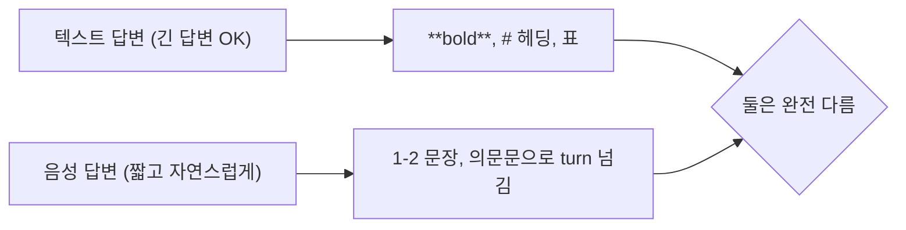
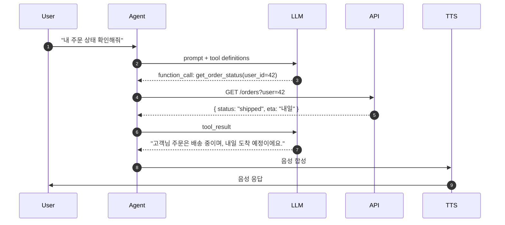

## 음성 우선 프롬프트 설계

음성 답변 = *귀로 듣는다*. 텍스트 답변과 *완전 다르게* 짜야 한다.



## 음성 프롬프트의 핵심 원칙

| 원칙 | 의미 |
|---|---|
| **짧게** | 한 답변 1-2 문장. 50-80 글자 |
| **자연스럽게** | "$5 = '오 달러'" (숫자 정규화 사전 정의) |
| **마크다운 금지** | `**`, `#`, `-` 등 모두 *음성에 안 들어감* |
| **listicle 분해** | "1, 2, 3..." 대신 *대화로 분배* |
| **turn 넘기기** | 질문으로 끝내거나 "도와드릴까요?" |
| **에스컬레이션** | "사람 상담원 연결해드릴까요?" 명시 |

```python
SYSTEM_PROMPT = """
당신은 친절한 한국어 콜센터 상담원입니다.

응답 규칙:
- 한 응답은 *1-2 문장* 으로 짧게
- 자연스러운 구어체 사용 ("입니다" 보다 "이에요")
- 숫자는 풀어쓰기 (예: "100만 원" 보다 "백만 원")
- 마크다운, 영어 약어, 코드 사용 금지
- 모르는 정보면 "확인이 어렵네요. 사람 상담원 연결해드릴까요?"
- 답변 끝에 *질문* 으로 turn 을 사용자에게 넘김

페르소나:
- 침착하고 공감하는 톤
- 고객을 "고객님" 으로 호칭
- 절대 "AI" 라고 본인을 칭하지 말 것
"""
```

## Function / Tool Calling



### OpenAI Function Calling

```python
tools = [
    {
        "type": "function",
        "function": {
            "name": "get_order_status",
            "description": "사용자의 주문 상태를 조회합니다",
            "parameters": {
                "type": "object",
                "properties": {
                    "user_id": {"type": "integer", "description": "사용자 ID"},
                    "order_id": {"type": "string", "description": "주문 ID (선택)"}
                },
                "required": ["user_id"]
            }
        }
    },
    {
        "type": "function",
        "function": {
            "name": "transfer_to_human",
            "description": "사람 상담원에게 연결합니다",
            "parameters": {
                "type": "object",
                "properties": {
                    "reason": {"type": "string"},
                    "priority": {"type": "string", "enum": ["low", "high"]}
                },
                "required": ["reason"]
            }
        }
    }
]

response = await client.chat.completions.create(
    model="gpt-4o-mini",
    messages=messages,
    tools=tools,
    tool_choice="auto",
    stream=True,
)
```

## 병렬 Function Calling

```python
# 같은 응답에서 여러 함수 동시 호출 가능
{
  "tool_calls": [
    { "id": "call_1", "function": { "name": "get_weather", "arguments": "..." } },
    { "id": "call_2", "function": { "name": "get_traffic", "arguments": "..." } }
  ]
}

# 병렬 실행
results = await asyncio.gather(
    get_weather(...),
    get_traffic(...),
)
```

> *직렬* 보다 *수배 빠름*. 독립 호출이면 활용.

## 결과를 대화에 자연스럽게

```python
@function_tool
async def get_order_status(user_id: int) -> dict:
    order = await db.get_order(user_id)
    return {
        "status": order.status,
        "eta": order.eta,
        # 함수 결과는 *데이터* 만. *음성 문장* 은 LLM 이 합성
    }

# 잘못된 예: 함수가 문장 반환
@function_tool
async def get_order_status_bad(user_id: int) -> str:
    order = await db.get_order(user_id)
    return f"주문 {order.id} 는 {order.status} 상태이며 ETA {order.eta} 입니다."
    # ← TTS 가 "ETA" 를 영어로 발음하거나 어색
```

## Structured Output

LLM 응답을 *JSON schema 강제*:

```python
class IntentExtraction(BaseModel):
    intent: Literal["order_status", "refund", "complaint", "transfer", "other"]
    user_id: Optional[int]
    order_id: Optional[str]
    urgency: Literal["low", "normal", "high"]

response = await client.chat.completions.parse(
    model="gpt-4o-mini",
    messages=[{"role": "user", "content": user_text}],
    response_format=IntentExtraction,
)

intent = response.choices[0].message.parsed
# intent.intent == "order_status"  ← 타입 안전
```

## 슬롯 채우기 (Slot Filling)

```python
# 사용자가 부분 정보만 주면 → 부족한 슬롯 묻기
class BookingRequest(BaseModel):
    restaurant: Optional[str]
    date: Optional[str]
    party_size: Optional[int]
    is_complete: bool = False

# 첫 발화: "내일 5명 예약하고싶어"
# extracted: { date: "내일", party_size: 5, restaurant: None, is_complete: false }

# LLM 이 부족한 정보 *질문*
if not extracted.restaurant:
    response = "어느 식당으로 예약 도와드릴까요?"
```

## 페르소나 일관성

```python
PERSONA = """
이름: 민지
성격: 친절, 차분, 약간 유머
역할: 카페 음성 주문 도우미
말투: 격식 있는 존댓말 ("이에요", "괜찮으세요?")
금지: 비속어, 정치/종교, 의료 조언
"""

SYSTEM = f"""
{PERSONA}

응답 규칙:
- 항상 페르소나 일관성 유지
- 메뉴 외 질문은 정중히 거절 + 본업으로 유도
"""
```

## 흔한 함정

> [!WARNING]
> 1. **시스템 프롬프트가 *길고 마크다운*** = TTS 가 안 읽지만, *LLM 의 응답이 마크다운 따라함*. 출력 형식 명시.
> 2. **숫자 발음** = "1500000원" → "일오영영영영영원". *별도 정규화* 또는 SSML.
> 3. **function 결과로 *긴 텍스트 반환*** = LLM 이 그대로 *읽음*. 데이터만.
> 4. **tool calling 중 *interruption 허용*** = DB write 중간에 끊김. `disallow_interruptions`.

## 관련 위키

- [[voice-agent-architecture]]
- [[voice-rag]]
- [[agent-patterns]]
- [[turn-detection-barge-in]]
