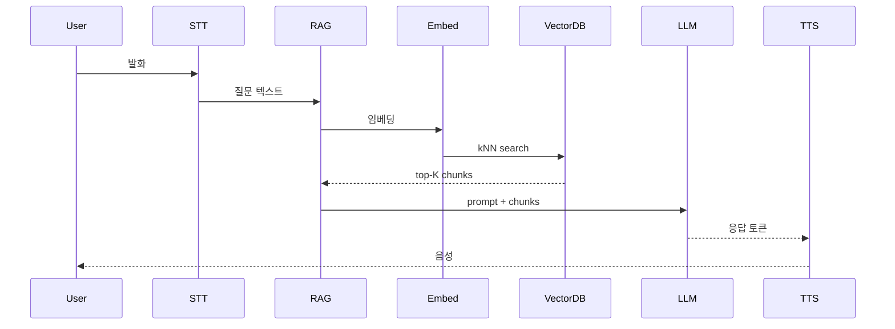
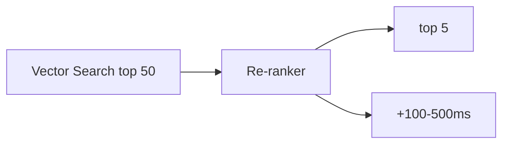

## 정의

**Voice RAG** = 음성 에이전트에 *RAG (Retrieval-Augmented Generation)* 결합. *벡터 DB 조회* 가 *지연 누적* 의 큰 원인이 되므로 *예측적 프리페치* 같은 패턴 필수.

## 기본 흐름



> *각 단계가 직렬*. RAG 추가 *200-1000ms* → 종단 지연 *2초+*.

## 지연 분해

| 단계 | 일반 | 최적 |
|---|---|---|
| Embedding | 50-200ms | 30ms (로컬 small 모델) |
| Vector DB query | 30-200ms | 10ms (Redis vector, ES kNN) |
| Re-ranking | 100-500ms | 50ms (cross-encoder small) |
| LLM prompt assembly | 5-20ms | 5ms |
| **RAG overhead** | **200-1000ms** | **< 100ms** |

## 예측적 프리페치 (Speculative Retrieval)

```mermaid
flowchart LR
    Partial[Partial transcript] --> Predict[가능 의도 예측]
    Predict --> Pre[미리 fetch (병렬)]
    Final[Final transcript] --> Match{예측 매칭?}
    Match -->|예| UsePre[프리페치 결과 사용]
    Match -->|아니오| Re[다시 fetch]
```

```python
class SpeculativeRAG:
    def __init__(self):
        self.prefetched: Dict[str, Future] = {}

    async def on_partial(self, partial: str):
        """partial 받자마자 예측 fetch 시작"""
        if len(partial.split()) < 3:
            return   # 너무 짧으면 skip

        # 이미 fetch 중인 것이 있고 유사하면 재사용
        if any(self._similar(partial, k) for k in self.prefetched):
            return

        # 미리 fetch (병렬)
        fut = asyncio.create_task(self._retrieve(partial))
        self.prefetched[partial] = fut

    async def on_final(self, final: str) -> List[Chunk]:
        """final 시 prefetched 결과 활용 또는 새로 fetch"""
        # 가장 유사한 prefetched 찾기
        best = max(self.prefetched.keys(),
                   key=lambda k: self._similarity(k, final),
                   default=None)
        if best and self._similarity(best, final) > 0.85:
            return await self.prefetched[best]
        return await self._retrieve(final)
```

> *partial 받자마자 *추측 fetch** → final 시 *대부분 즉시 사용 가능*. RAG overhead → 0 에 가깝게.

## 캐시 계층

```mermaid
flowchart TB
    Q[Query] --> L1[L1: in-memory recent (LRU)]
    L1 -.miss.-> L2[L2: Redis semantic cache]
    L2 -.miss.-> L3[L3: Vector DB]
    L3 --> Pop[populate L2 + L1]
```

### Semantic Cache

```python
class SemanticCache:
    """비슷한 질문의 결과 재사용"""
    def __init__(self, similarity_threshold=0.92):
        self.cache = {}   # embedding → result
        self.threshold = similarity_threshold

    async def get(self, query: str):
        emb = await embed(query)
        for cached_emb, result in self.cache.items():
            sim = cosine_similarity(emb, cached_emb)
            if sim > self.threshold:
                return result
        return None
```

자세한 건 [[Redis Vector Search]] 의 semantic cache.

## RAG 인덱스 선택 (음성 환경)

| | Pinecone | Redis Vector | ES kNN | Qdrant |
|---|---|---|---|---|
| Latency (kNN) | 30-100ms | 5-20ms | 20-50ms | 10-30ms |
| 운영 | managed | 익숙 | 익숙 | 중간 |
| Hybrid (BM25 + vector) | X | 별도 | *우수 (RRF)* | 가능 |

> 음성 에이전트 + 한국어 hybrid search = *ElasticSearch kNN + nori* 가 강력.

## 청크 전략 (음성 친화)

```python
# 일반 RAG: 큰 청크 (500-1000 tokens)
# 음성 RAG: *짧은 청크* (100-300 tokens) → LLM 응답 짧게 유도

def chunk_for_voice(doc: str) -> list[str]:
    """문장 단위 + 의미 단위 분할"""
    sentences = nltk.sent_tokenize(doc, language='korean')
    chunks = []
    cur = ""
    for s in sentences:
        if len(cur) + len(s) > 300:
            chunks.append(cur)
            cur = s
        else:
            cur += " " + s
    if cur:
        chunks.append(cur)
    return chunks
```

## Re-ranking 의 trade-off



> *정확도 ↑ vs 지연 ↑*. 음성 에이전트는 *작은 cross-encoder* (Cohere rerank-v3 light, BAAI bge-reranker-base) 권장.

## 흔한 함정

> [!WARNING]
> 1. **RAG 매 turn 동기 fetch** = 매 응답 200-1000ms 증가. *예측적 프리페치*.
> 2. **거대 청크** = LLM 응답이 길어짐. 짧은 청크.
> 3. **Cross-encoder rerank 무조건** = 500ms+ 부담. *trade-off* 결정.
> 4. **결과 그대로 prompt** = 토큰 폭증. 요약 또는 selection.

## 관련 위키

- [[voice-agent-architecture]]
- [[voice-first-prompt]]
- [[elasticsearch-vector-search]]
- [[Redis Vector Search]]
- [[latency-percentiles]]
