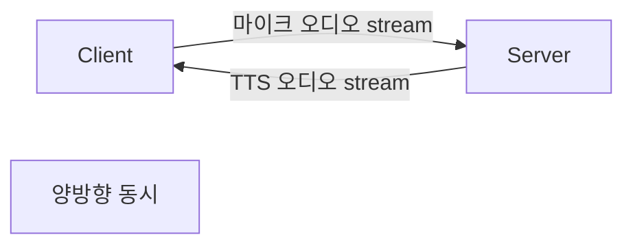
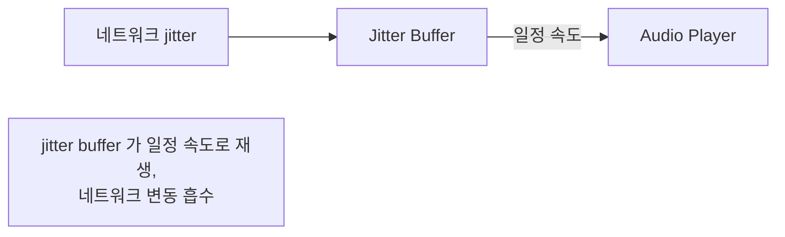

## 정의

**WebSocket Media Stream** = 양방향 *바이너리 오디오 스트림*. WebRTC 가 어려운 *전화 / 서버↔서버 / 옛 클라이언트* 에서 표준.

자세한 일반 WebSocket 은 [[WebSocket]].

## 풀듀플렉스 (Full Duplex)



```javascript
const ws = new WebSocket('wss://voice-agent.example.com/stream');
ws.binaryType = 'arraybuffer';

// 양방향
const audioContext = new AudioContext({ sampleRate: 16000 });

// Send: 마이크 → ws
const processor = audioContext.createScriptProcessor(2048, 1, 1);
processor.onaudioprocess = (e) => {
  const pcm = float32To16BitPCM(e.inputBuffer.getChannelData(0));
  if (ws.readyState === WebSocket.OPEN) {
    ws.send(pcm);
  }
};

// Receive: ws → 스피커
ws.onmessage = async (e) => {
  if (e.data instanceof ArrayBuffer) {
    const pcm = new Int16Array(e.data);
    const float32 = int16ToFloat32(pcm);
    audioQueue.push(float32);
    playFromQueue();
  } else {
    // JSON event
    const event = JSON.parse(e.data);
    handleEvent(event);
  }
};
```

## 프레임 버퍼링



```python
class JitterBuffer:
    def __init__(self, target_ms=100):
        self.queue = deque()
        self.target_ms = target_ms

    def push(self, chunk_with_ts):
        # timestamp 순으로 정렬 삽입
        heapq.heappush(self.queue, chunk_with_ts)

    def pop(self):
        # buffer 가 충분히 차면 일정 속도로 pop
        if self._buffered_ms() >= self.target_ms:
            return heapq.heappop(self.queue)
        return None
```

| 구성 | 의미 |
|---|---|
| **Target** | 보통 50-150ms (latency vs 안정성 trade-off) |
| **Adaptive** | 네트워크 jitter 측정 → buffer 크기 동적 조정 |

## Twilio Media Streams

```xml
<!-- Twilio TwiML -->
<Response>
  <Connect>
    <Stream url="wss://your-server/stream">
      <Parameter name="call_id" value="CA123"/>
    </Stream>
  </Connect>
</Response>
```

```python
# 서버
@app.websocket("/stream")
async def media_stream(ws: WebSocket):
    await ws.accept()
    while True:
        msg = await ws.receive_json()
        if msg["event"] == "start":
            stream_sid = msg["start"]["streamSid"]
        elif msg["event"] == "media":
            payload = base64.b64decode(msg["media"]["payload"])
            # mulaw 8kHz → PCM 16kHz 변환
            pcm = mulaw_to_pcm(payload)
            await stt_send(pcm)
        elif msg["event"] == "stop":
            break

        # TTS 결과 전송
        if tts_audio_chunk:
            mulaw = pcm_to_mulaw(tts_audio_chunk)
            await ws.send_json({
                "event": "media",
                "streamSid": stream_sid,
                "media": {"payload": base64.b64encode(mulaw).decode()},
            })
```

## 오디오 포맷

| 형식 | 사용처 |
|---|---|
| **PCM 16-bit 16kHz mono** | 표준 (STT, 내부) |
| **mulaw 8kHz** | 전화 (PSTN, Twilio) |
| **Opus** | 압축 (대역폭 제한) |
| **AAC** | iOS / 일부 SDK |

### Sample Rate 변환

```python
import resampy

def resample_to_16k(audio: np.ndarray, sr: int) -> np.ndarray:
    if sr == 16000:
        return audio
    return resampy.resample(audio, sr, 16000)
```

> *Twilio = 8kHz mulaw* → 내부 STT 가 *16kHz PCM* 이면 *resampling* 필요.

## Binary + JSON 혼용

```python
# Pattern 1: 모두 binary (audio 만)
ws.send(pcm_bytes)

# Pattern 2: JSON event + binary
ws.send(json.dumps({"type": "start", "session": session_id}))
ws.send(pcm_bytes)
ws.send(json.dumps({"type": "stop"}))

# Pattern 3: JSON with base64 audio (Twilio 식)
ws.send(json.dumps({
    "event": "media",
    "media": {"payload": base64.b64encode(pcm).decode()},
}))
```

> Base64 = *33% 크기 증가*. 대역폭 critical = binary frame.

## Heartbeat / Reconnect

```python
class VoiceWebSocket:
    async def heartbeat_loop(self):
        while True:
            await asyncio.sleep(20)
            try:
                await self.ws.ping()
            except Exception:
                await self.reconnect()
                return

    async def reconnect(self):
        for attempt in range(5):
            try:
                self.ws = await connect(self.url)
                # Session 복구
                await self.ws.send_json({"type": "resume", "session": self.session_id})
                return
            except Exception:
                await asyncio.sleep(2 ** attempt)
```

## Backpressure

```python
class BoundedWebSocket:
    """WebSocket buffer 가 차면 입력 drop 또는 압축"""
    MAX_BUFFER = 1024 * 1024  # 1MB

    async def send_safe(self, data):
        if self.ws.transport.get_write_buffer_size() > self.MAX_BUFFER:
            # 옛 데이터 drop (오디오는 lossy OK)
            return False
        await self.ws.send(data)
        return True
```

자세한 backpressure 는 [[backpressure]].

## 흔한 함정

> [!WARNING]
> 1. **base64 사용** = 대역폭 33% 증가. Binary frame 권장.
> 2. **Jitter buffer 없음** = 네트워크 변동 시 *오디오 끊김*. 100ms buffer.
> 3. **Sample rate 불일치** = 16kHz 데이터를 8kHz 로 처리 → 발음 깨짐.
> 4. **Heartbeat 부재** = NAT timeout (60s) 후 silent close.
> 5. **압축 안 함 (큰 PCM)** = 1분 통화 = 1.92MB (16kHz, 16-bit). Opus / mulaw 압축.

## 관련 위키

- [[WebSocket]]
- [[webrtc]]
- [[stt-streaming]]
- [[tts-streaming-ssml]]
- [[backpressure]]
- [[voice-pipeline-decoupling]]
