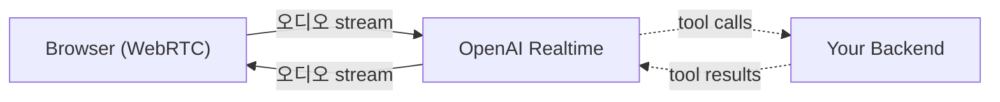
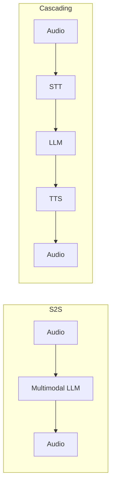

## 정의

**S2S (Speech-to-Speech)** = STT → LLM → TTS *직렬 파이프라인 우회*, *오디오 → 오디오* 직접 처리. 톤/감정 보존 + < 300ms latency.

## 주요 모델

| 모델 | 출시 | 한국어 | latency | 특징 |
|---|---|---|---|---|
| **OpenAI Realtime API (GPT-4o)** | 2024-10 | 우수 | 232ms 평균 | WebRTC + WebSocket, function calling 일부 |
| **Gemini Live (2.5)** | 2024-12 | 우수 | < 500ms | Google AI Studio, multimodal |
| **Moshi (Kyutai)** | 2024-09 | 영어 | 160ms | OSS, full-duplex, 자체 호스팅 |
| **Hume EVI 2** | 2024 | 영어 | 700ms | emotion 인식 |

## OpenAI Realtime API



```javascript
// WebRTC 연결
const pc = new RTCPeerConnection();

// 마이크 오디오 추가
const stream = await navigator.mediaDevices.getUserMedia({ audio: true });
stream.getTracks().forEach(t => pc.addTrack(t, stream));

// 음성 응답 받기
pc.ontrack = (e) => {
  audioEl.srcObject = e.streams[0];
};

// DataChannel (이벤트, function call)
const dc = pc.createDataChannel('oai-events');
dc.onmessage = (e) => {
  const event = JSON.parse(e.data);
  if (event.type === 'response.function_call_arguments.done') {
    // function calling
  }
};

// SDP offer
const offer = await pc.createOffer();
await pc.setLocalDescription(offer);

// OpenAI 에 offer 전송
const resp = await fetch('https://api.openai.com/v1/realtime?model=gpt-4o-realtime-preview', {
  method: 'POST',
  headers: { Authorization: `Bearer ${API_KEY}`, 'Content-Type': 'application/sdp' },
  body: offer.sdp,
});
await pc.setRemoteDescription({ type: 'answer', sdp: await resp.text() });
```

### Session 이벤트

```json
{
  "type": "session.update",
  "session": {
    "modalities": ["text", "audio"],
    "voice": "alloy",
    "instructions": "You are a helpful Korean assistant. Speak naturally.",
    "input_audio_format": "pcm16",
    "output_audio_format": "pcm16",
    "input_audio_transcription": { "model": "whisper-1" },
    "turn_detection": { "type": "server_vad", "threshold": 0.5 },
    "tools": [...],
    "tool_choice": "auto",
    "temperature": 0.8
  }
}
```

| 이벤트 | 의미 |
|---|---|
| `session.created` | 시작 |
| `input_audio_buffer.append` | 오디오 추가 |
| `input_audio_buffer.commit` | 처리 트리거 |
| `response.audio.delta` | 음성 청크 |
| `response.audio_transcript.delta` | 응답 전사 |
| `response.function_call_arguments.done` | tool call |

## Gemini Live

```python
from google import genai

client = genai.Client(api_key=API_KEY)

config = {
    "response_modalities": ["AUDIO"],
    "system_instruction": "당신은 친절한 한국어 어시스턴트입니다.",
    "speech_config": {
        "voice_config": {
            "prebuilt_voice_config": {"voice_name": "Aoede"}
        }
    }
}

async with client.aio.live.connect(model="gemini-2.5-flash-live", config=config) as session:
    async def send_audio(audio_stream):
        async for chunk in audio_stream:
            await session.send_realtime_input(audio=chunk)

    async def receive():
        async for response in session.receive():
            if response.audio:
                play(response.audio)

    await asyncio.gather(send_audio(mic), receive())
```

## Moshi (OSS, self-host)

```mermaid
flowchart LR
    User[User audio] -->|streaming| Moshi[Moshi (7B params)]
    Moshi -->|streaming| User
    Moshi --> Mimi[Mimi audio codec<br/>(12.5Hz)]
```

- *Full-duplex*: 듣고 + 말하기 *동시*.
- *Mimi codec*: 12.5Hz token rate (vs Encodec 75Hz).
- *Self-host* 가능 (Apache 2.0).
- 영어 위주, 한국어 약함.

## S2S vs Streaming Cascading 비교



| 항목 | S2S | Streaming Cascading |
|---|---|---|
| Latency | < 300ms | < 1s |
| 톤/감정 보존 | *예* | 손실 |
| Function calling | 제한 | *완전* |
| 컴포넌트 교체 | *불가* | 자유 |
| 비용 | 높음 ($0.06-0.20/min) | 저렴 ($0.01-0.05/min) |
| Privacy | 외부 API | 자체 가능 |
| 한국어 | OpenAI Realtime 우수 | 모델 선택 |

## 적합 시나리오

```mermaid
flowchart TD
    Q{용도}
    Q -->|친밀한 대화 (외국어 학습)| S2S
    Q -->|complex tool calling (예약, 결제)| Cascade[Cascading streaming]
    Q -->|MVP / 다국어| S2S
    Q -->|비용 critical + 대량| Cascade
    Q -->|커스텀 LLM (자체 모델)| Cascade
```

## Function Calling 제약

OpenAI Realtime API 의 *function calling* 은 지원하지만:

- 모델이 *function call 중 음성 응답 안 함* (텍스트 → 음성 변환 별도 처리)
- 복잡한 *멀티 단계 reasoning* 은 약함
- *enterprise 시스템 통합* 은 cascading 이 더 안정

> [!IMPORTANT]
> *S2S 모델 다수가 function calling 미지원*. *function 이 필수인 enterprise* 는 *cascading streaming* 채택 (arXiv 참조).

## 비용 비교

| 모델 | 가격 |
|---|---|
| OpenAI Realtime (gpt-4o) | input $40/M tok, output $80/M tok |
| Gemini Live | input $0.50/M, output $2.00/M |
| Cascading (Whisper + GPT-4o-mini + Cartesia) | ~$0.01/min |

> Realtime API 가 *5-10배 비싸다*. 비용 sensitive 면 cascading.

## 흔한 함정

> [!WARNING]
> 1. **모든 시나리오에 S2S** = 비용 폭증 + function 제약. 용도 분석 후.
> 2. **WebRTC 설정 복잡** = Signaling, ICE, TURN. SDK 사용.
> 3. **한국어 발음** = 모델 마다 차이 큼. *audio sample* 직접 들어보고 선택.
> 4. **Realtime API 의 session 종료** = idle 시 자동 종료. heartbeat 필요.

## 관련 위키

- [[voice-agent-architecture]]
- [[webrtc]]
- [[tts-models-overview]]
- [[function-calling-tool-use]]
- [[pipecat-livekit]]
