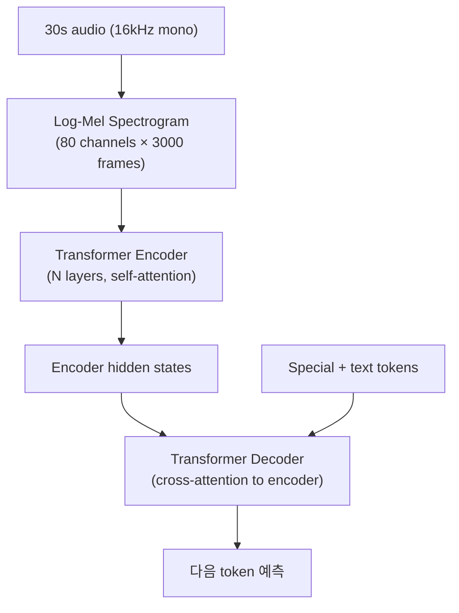
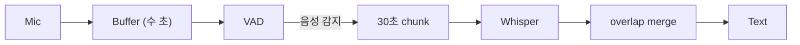

## 정의

**Whisper** = OpenAI 의 *encoder-decoder Transformer* STT. 680K 시간 다국어 supervised training. 2022 공개, 2023 v2, 2023 v3.

개요는 [[stt-models-overview]] 참고. 본 페이지는 *내부 아키텍처 + 코드*.

## 아키텍처



## 모델 사이즈

| 모델 | Layers | Width | Heads | Params |
|---|---|---|---|---|
| tiny | 4 | 384 | 6 | 39M |
| base | 6 | 512 | 8 | 74M |
| small | 12 | 768 | 12 | 244M |
| medium | 24 | 1024 | 16 | 769M |
| large-v3 | 32 | 1280 | 20 | 1550M |

## Log-Mel Spectrogram

```python
import numpy as np
import librosa

# 16kHz, 30초 = 480000 samples
audio, sr = librosa.load('sample.wav', sr=16000)
audio = audio[:16000 * 30]   # 30초 padding/trim

# Log-mel spectrogram
mel = librosa.feature.melspectrogram(
    y=audio,
    sr=16000,
    n_fft=400,       # window 25ms
    hop_length=160,  # stride 10ms
    n_mels=80,       # 80 mel channels
)
log_mel = np.log10(np.clip(mel, 1e-10, None))
# shape: (80, 3000)
```

| 파라미터 | 값 |
|---|---|
| Window | 25ms (400 samples at 16kHz) |
| Hop | 10ms (160 samples) |
| Mel channels | 80 |
| Input size | 80 × 3000 |

## Encoder (self-attention)

```
mel (80, 3000) → conv1d → conv1d → transformer layers
```

- *양방향 self-attention* (모든 시간대 봄).
- Output: `(1500, d_model)` (2x downsample).

## Decoder (autoregressive)

```
<|startoftranscript|> <|ko|> <|transcribe|> <|notimestamps|> "안" "녕" "하세요" <|endoftext|>
```

각 토큰 예측:

- **cross-attention**: encoder hidden states 참조.
- **causal self-attention**: 옛 토큰만 봄.

## Special Tokens

| Token | 의미 |
|---|---|
| `<|startoftranscript|>` | 시작 |
| `<|en|>`, `<|ko|>`, ... | 언어 (99 개) |
| `<|transcribe|>` | 전사 mode |
| `<|translate|>` | 번역 mode (→ 영어) |
| `<|notimestamps|>` | timestamp 생략 |
| `<|0.00|>` ~ `<|30.00|>` | timestamp (0.02s 간격) |
| `<|endoftext|>` | 끝 |

## Timestamp 생성

```python
# 예 (with timestamps):
<|startoftranscript|> <|ko|> <|transcribe|>
<|0.00|> 안녕하세요 <|1.50|>
<|1.50|> 오늘 <|2.00|>
<|2.00|> 날씨가 좋네요 <|3.50|>
<|endoftext|>
```

*모델이 timestamp token 을 다른 vocab 처럼* 예측. 정확도는 word-level ~200ms 오차.

## 30초 chunking

```python
def transcribe_long_audio(audio, model):
    chunk_size = 30 * 16000   # 30초
    stride = 25 * 16000        # 25초 (5초 overlap)

    results = []
    for start in range(0, len(audio), stride):
        chunk = audio[start:start + chunk_size]
        chunk = pad_or_trim(chunk, chunk_size)

        mel = log_mel_spectrogram(chunk)
        result = model.decode(mel, options)
        results.append(result)

    return merge_with_overlap(results)
```

> Whisper 는 *30초 단위* 만 처리. 긴 오디오는 *chunking + overlap*.

## Hallucination 문제

```
무음 구간 → 모델이 *없는 문장 생성*
```

**해결**:

1. **VAD 전처리** (Silero) - 무음 제거
2. **Temperature 0** - 결정론적
3. **compression_ratio_threshold** - 반복 감지
4. **logprob_threshold** - 확신 낮으면 skip

```python
result = model.transcribe(
    audio,
    language='ko',
    temperature=0,
    compression_ratio_threshold=2.4,
    logprob_threshold=-1.0,
    no_speech_threshold=0.6,   # VAD 임계
    condition_on_previous_text=False,   # hallucination 방지
)
```

## Faster-Whisper (CTranslate2)

```python
from faster_whisper import WhisperModel

model = WhisperModel(
    "large-v3",
    device="cuda",
    compute_type="float16",   # 또는 int8_float16
)

segments, info = model.transcribe(
    "audio.wav",
    language="ko",
    beam_size=5,
    vad_filter=True,   # 내장 Silero VAD!
    vad_parameters={"min_silence_duration_ms": 500},
)

for seg in segments:
    print(f"[{seg.start:.2f} → {seg.end:.2f}] {seg.text}")
```

| 최적화 | 배속 |
|---|---|
| CTranslate2 | ~4x |
| INT8 quantization | +2x |
| Beam search skip (greedy) | +1.5x |
| VAD filter | 노이즈 절감 |

## Distil-Whisper

```
Teacher (large-v3) → Distillation → Student
- Decoder layers 축소 (32 → 2)
- ~6x 빠름, 49% 작음
- 영어 정확도 유지, 다국어 약함
```

## Streaming (WhisperLive, WhisperLink)

Whisper 는 *batch 모델* → streaming 은 *별도 wrapper*:



- *partial transcript* 를 30초 chunk 마다 갱신.
- Overlap 으로 문장 경계 매끄럽게.
- 완전 real-time 은 아님 (500ms-1.5s 지연).

## Vocab (Multilingual Tokenizer)

```python
# GPT-2 style BPE (Byte-Pair Encoding)
tokenizer.encode("안녕하세요")
# → [23283, 9573, 7539, ...] (subword tokens)

len(tokenizer.vocab)   # 51864 tokens
```

Multilingual model = *다국어 subword 학습*. 한국어도 자연스러운 tokenization.

## 흔한 함정

> [!WARNING]
> 1. **긴 오디오 그대로 넣음** = 30초 이상 무시. Chunking 필수.
> 2. **VAD 없이** = 무음 구간 hallucination.
> 3. **`condition_on_previous_text=True` (기본)** = 옛 오류가 다음 chunk 로 전파.
> 4. **CTranslate2 없이 batch** = 4배 느림. Faster-whisper 권장.

## 관련 위키

- [[stt-models-overview]]
- [[stt-streaming]]
- [[vad-silero]]
- [[llm-serving-vllm]] (Transformer 서빙)
