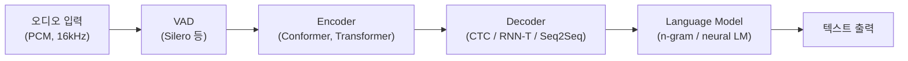
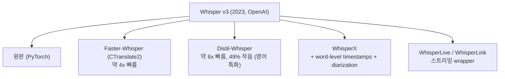
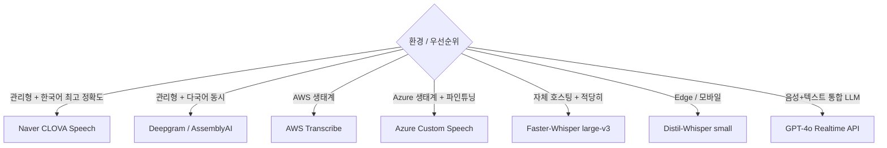

## 정의

**STT (Speech-to-Text) / ASR (Automatic Speech Recognition)** = *음성 → 텍스트* 변환. 2026 시점 *전사 정확도 인간 수준*, *실시간 < 300ms* 도 흔함.

## STT 아키텍처



| 컴포넌트 | 역할 |
|---|---|
| **VAD** | 음성 구간 감지 (무음 제거) |
| **Feature Extraction** | MFCC, Filter Bank, log-mel spectrogram |
| **Encoder** | 음성 특징 추출 (Conformer, Transformer) |
| **Decoder** | CTC, RNN-T, Whisper 의 seq2seq |
| **LM** | 언어 모델 rescoring |

## 주요 모델 매트릭스 (2026)

| 모델 | 종류 | 한국어 | 스트리밍 | 강점 |
|---|---|---|---|---|
| **OpenAI Whisper v3** | open weights | 우수 | batch (스트리밍 별도) | 99 언어, 견고, self-host 가능 |
| **Faster-Whisper / Distil-Whisper** | OSS | 우수 | 가능 | Whisper 의 4x 속도 + 작은 모델 |
| **WhisperX** | OSS | 우수 | 제한적 | word-level timestamp + diarization |
| **Deepgram Nova-3** | API | 보통 | *최강 (300ms)* | 멀티턴, diarization, latency |
| **AssemblyAI Universal-2** | API | 보통 | 우수 | 다국어, multispeaker, 가격 경쟁력 |
| **Google Speech-to-Text v2** | API | 우수 | 우수 | 한국어 정확도, telephony 특화 |
| **Azure Speech** | API | 우수 | 우수 | enterprise 통합, Custom Speech |
| **AWS Transcribe** | API | 보통 | 우수 | AWS 생태계, 의료/법률 특화 모델 |
| **Naver CLOVA Speech** | API | *압도적* | gRPC, < 1s | 한국어 1위, 도메인 사전 |
| **Kakao i Speech** | API | 우수 | 가능 | 한국어 + 카카오 생태계 |
| **NVIDIA NeMo Parakeet** | open | 영어 | 우수 | edge, low-latency |
| **GPT-4o transcribe** | API | 우수 | 가능 | GPT-4o 의 audio 통합 |

## Whisper 계보



> 2026 시점 *자체 호스팅 = Faster-Whisper + Silero VAD* 가 거의 표준.

```python
# Faster-Whisper 사용 예시
from faster_whisper import WhisperModel

model = WhisperModel("large-v3", device="cuda", compute_type="float16")

segments, info = model.transcribe("audio.mp3", language="ko", beam_size=5)

for segment in segments:
    print(f"[{segment.start:.2f}s - {segment.end:.2f}s] {segment.text}")
```

## 모델 사이즈 vs 정확도 vs 속도 (Whisper)

<ChartJs
  client:visible
  type="bar"
  title="Whisper 모델 사이즈 vs 한국어 WER (가상 직관)"
  caption="Large-v3 가 WER 가장 낮음. Tiny 는 빠르지만 한국어 정확도 떨어짐."
  height="240px"
  data={{
    labels: ['tiny (39M)', 'base (74M)', 'small (244M)', 'medium (769M)', 'large-v3 (1.55B)'],
    datasets: [
      { label: '한국어 WER (%, 낮을수록 좋음)', data: [25, 18, 12, 8, 5], backgroundColor: '#3b82f6' },
      { label: 'RTF (시간 비례, 낮을수록 빠름)', data: [0.05, 0.08, 0.15, 0.3, 0.5], backgroundColor: '#f59e0b' },
    ],
  }}
  options={{ scales: { y: { beginAtZero: true } } }}
/>

## Google Speech-to-Text v2

```python
from google.cloud import speech_v2
from google.cloud.speech_v2.types import cloud_speech

client = speech_v2.SpeechClient()
project_id = "my-project"

config = cloud_speech.RecognitionConfig(
    auto_decoding_config=cloud_speech.AutoDetectDecodingConfig(),
    language_codes=["ko-KR"],
    model="long",  # long / short / telephony / medical_dictation
)

request = cloud_speech.RecognizeRequest(
    recognizer=f"projects/{project_id}/locations/global/recognizers/_",
    config=config,
    content=audio_bytes,
)
response = client.recognize(request=request)
for result in response.results:
    print(result.alternatives[0].transcript)
```

| 모델 | 적합한 오디오 |
|---|---|
| `long` | 60초+ 녹음, 전화 통화 아닌 일반 오디오 |
| `short` | 60초 미만, 빠른 응답 |
| `telephony` | 전화 통화 (8kHz narrow-band) |
| `medical_dictation` | 의료 도메인 (영어) |
| `chirp` | 최신 범용 모델 |

## AWS Transcribe

```python
import boto3
import json

transcribe = boto3.client('transcribe', region_name='ap-northeast-2')

# 비동기 전사
transcribe.start_transcription_job(
    TranscriptionJobName='my-job',
    Media={'MediaFileUri': 's3://my-bucket/audio.mp3'},
    MediaFormat='mp3',
    LanguageCode='ko-KR',
    Settings={
        'ShowSpeakerLabels': True,
        'MaxSpeakerLabels': 4,
        'VocabularyName': 'my-custom-vocab',  # 커스텀 사전
    }
)

# 실시간 스트리밍 (WebSocket 기반)
# aws transcribe-streaming start-stream-transcription \
#   --language-code ko-KR \
#   --media-encoding pcm \
#   --media-sample-rate-hertz 16000
```

| 기능 | 설명 |
|---|---|
| **Custom Vocabulary** | 도메인 특화 단어 추가 (브랜드명, 인명) |
| **Custom Language Model** | 대규모 도메인 텍스트로 파인튜닝 |
| **Medical Transcribe** | 의료 용어 특화 |
| **Call Analytics** | 콜센터 분석 (감정, 침묵, 방해) |
| **ToxicityDetection** | 욕설 / 혐오 발화 감지 |

## Azure Speech

```python
import azure.cognitiveservices.speech as speechsdk

speech_config = speechsdk.SpeechConfig(
    subscription="your-key",
    region="koreacentral"
)
speech_config.speech_recognition_language = "ko-KR"

# Custom Speech (파인튜닝된 모델)
speech_config.endpoint_id = "your-custom-endpoint-id"

audio_config = speechsdk.AudioConfig(filename="audio.wav")
recognizer = speechsdk.SpeechRecognizer(
    speech_config=speech_config,
    audio_config=audio_config
)

result = recognizer.recognize_once()
print(result.text)
```

> **Custom Speech** = 도메인 데이터로 파인튜닝 가능. 한국어 의료/법률/금융 도메인에 활용.

## 한국어 STT 선택 가이드



> [!IMPORTANT]
> 한국어 *전사 정확도*: CLOVA > Whisper-large-v3 > Google > Deepgram. 단 *latency* 는 거의 반대. 실시간 대화 = latency 우선.

## Diarization (화자 분리)

```
"안녕하세요"          -> speaker_1
"네 안녕하세요"        -> speaker_2
"오늘 회의 시작합니다"  -> speaker_1
```

| 도구 | 의미 |
|---|---|
| **pyannote.audio** | OSS, Hugging Face |
| **WhisperX** | Whisper + pyannote 통합 |
| **AssemblyAI** | API 내장, speaker labels |
| **Deepgram** | API 내장, diarize 파라미터 |
| **AWS Transcribe** | ShowSpeakerLabels |

## API vs Self-host

| | API (Deepgram, AssemblyAI) | Self-host (Whisper) |
|---|---|---|
| Latency | 매우 낮음 (300ms 가능) | GPU + 튜닝 필요 |
| 비용 | 분당 $0.005-0.015 | GPU 시간 |
| Privacy | 데이터 외부 전송 | 내부 유지 |
| 가용성 | 99.9% SLA | 자체 운영 |
| 커스터마이즈 | 제한적 | 자유 (fine-tune) |
| 한국어 | CLOVA, Google | Whisper-large 충분 |

## 평가 지표

| 지표 | 의미 | 목표 |
|---|---|---|
| **WER** (Word Error Rate) | 단어 단위 오류율 | 한국어 < 10% |
| **CER** (Character Error Rate) | 문자 단위 (한국어/중국어 적합) | < 5% |
| **RTF** (Real-Time Factor) | 처리 시간 / 오디오 시간 | < 1 (real-time 가능) |
| **TTF** (Time to Final) | 발화 종료 → final transcript | < 500ms |
| **TTP** (Time to Partial) | 첫 partial 까지 | < 200ms |
| **CNC** (Confidence) | 단어별 신뢰도 | - |

## 흔한 함정

> [!WARNING]
> 1. **Whisper batch 모드를 스트리밍처럼** = *전체 오디오 받고서* 시작. 실시간 불가.
> 2. **언어 자동 감지** = 짧은 발화에서 오류. *언어 명시* 권장 (`language="ko"`).
> 3. **Hallucination** (Whisper) = 무음 / 노이즈 구간에서 *없는 문장 생성*. VAD 전처리 필수.
> 4. **Sample rate** = 16kHz 표준. 44.1kHz 보내면 *내부 resampling 추가 latency*.
> 5. **부분 결과로 LLM 호출** = final 까지 기다리거나 semantic endpointing 사용.

## 관련 위키

- [[stt-streaming]]
- [[tts-models-overview]]
- [[voice-agent-architecture]]
- [[vad-silero]]
