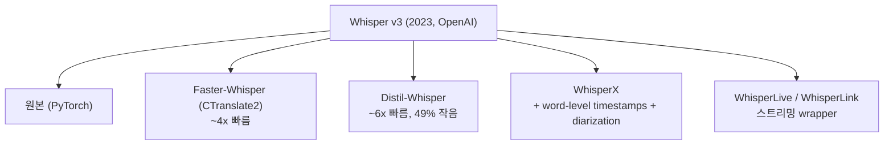
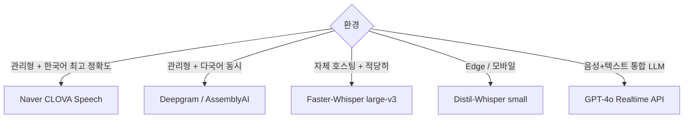

## 정의

**STT (Speech-to-Text) / ASR (Automatic Speech Recognition)** = *음성 → 텍스트* 변환. 2026 시점 *전사 정확도 인간 수준*, *실시간 < 300ms* 도 흔함.

## 주요 모델 매트릭스 (2026)

| 모델 | 종류 | 한국어 | 스트리밍 | 강점 |
|---|---|---|---|---|
| **OpenAI Whisper v3** | open weights | 우수 | *batch* (스트리밍 별도) | 99 언어, 견고, *self-host* 가능 |
| **Whisper-Live / WhisperX** | OSS 변형 | 우수 | 가능 | 자체 호스팅 + VAD |
| **Deepgram Nova-3** | API | 보통 | *최강* (300ms) | 멀티턴, diarization, latency |
| **AssemblyAI Universal-2** | API | 보통 | 우수 | 다국어, multispeaker, 가격 경쟁력 |
| **Google Speech-to-Text v2** | API | 우수 | 우수 | 한국어 정확도, telephony 특화 |
| **Azure Speech** | API | 우수 | 우수 | enterprise 통합 |
| **Naver CLOVA Speech** | API | *압도적* | gRPC, < 1s | *한국어 1위*, 도메인 사전 |
| **Kakao i Speech** | API | 우수 | 가능 | 한국어 + 카카오 생태계 |
| **Faster-Whisper / Distil-Whisper** | OSS | 우수 | 가능 | *Whisper 의 4x 속도* + 작은 모델 |
| **NVIDIA NeMo Parakeet** | open | 영어 | 우수 | edge, low-latency |
| **GPT-4o transcribe** | API | 우수 | 가능 | GPT-4o 의 audio 통합 |

## Whisper 의 위치



> 2026 시점 *자체 호스팅 = Faster-Whisper + Silero VAD* 가 거의 표준. Distil-Whisper 가 *영어 한정* 으로 더 빠름.

## 모델 사이즈 vs 정확도 vs 속도 (Whisper)

<ChartJs
  client:visible
  type="bar"
  title="Whisper 모델 사이즈 vs 한국어 WER (가상 직관)"
  caption="Large-v3 가 WER 가장 낮음. Tiny 는 빠르지만 한국어 정확도 떨어짐."
  height="240px"
  data={{
    labels: ['tiny (39M)', 'base (74M)', 'small (244M)', 'medium (769M)', 'large-v3 (1.55B)'],
    datasets: [
      { label: '한국어 WER (%, 낮을수록 좋음)', data: [25, 18, 12, 8, 5], backgroundColor: '#3b82f6' },
      { label: 'RTF (시간 비례, 낮을수록 빠름)', data: [0.05, 0.08, 0.15, 0.3, 0.5], backgroundColor: '#f59e0b' },
    ],
  }}
  options={{ scales: { y: { beginAtZero: true } } }}
/>

## 한국어 STT 선택 가이드



> [!IMPORTANT]
> 한국어 *전사 정확도* = CLOVA > Whisper-large-v3 > Google > Deepgram. 단 *latency* 는 정반대.

## Diarization (화자 분리)

```
"안녕하세요"          → speaker_1
"네 안녕하세요"        → speaker_2
"오늘 회의 시작합니다"  → speaker_1
```

| 도구 | 의미 |
|---|---|
| **pyannote.audio** | OSS, Hugging Face |
| **WhisperX** | Whisper + pyannote |
| **AssemblyAI** | API 내장 |
| **Deepgram** | API 내장 |

## API vs Self-host

| | API (Deepgram, AssemblyAI) | Self-host (Whisper) |
|---|---|---|
| Latency | 매우 낮음 (300ms 가능) | GPU + 튜닝 필요 |
| 비용 | 분당 $0.005-0.015 | GPU 시간 |
| Privacy | 데이터 외부 | 내부 |
| 가용성 | 99.9% SLA | 자체 운영 |
| 커스터마이즈 | 제한 | 자유 (fine-tune) |
| 한국어 | CLOVA, Google | Whisper-large 충분 |

## 평가 지표

| 지표 | 의미 |
|---|---|
| **WER** (Word Error Rate) | 단어 단위 오류율 |
| **CER** (Character Error Rate) | 문자 단위 (한국어/중국어 적합) |
| **RTF** (Real-Time Factor) | 처리 시간 / 오디오 시간 |
| **TTF** (Time to Final) | 발화 종료 → final transcript |
| **TTP** (Time to Partial) | 첫 partial 까지 |

## 흔한 함정

> [!WARNING]
> 1. **Whisper batch 모드를 스트리밍처럼** = *전체 오디오 받고서* 시작. 실시간 X.
> 2. **언어 자동 감지** = 짧은 발화에서 오류. *언어 명시* 권장 (`language="ko"`).
> 3. **Hallucination** (Whisper) = 무음 / 노이즈 구간에서 *없는 문장 생성*. VAD 전처리 필수.
> 4. **Sample rate** = 16kHz 표준. 44.1kHz / 48kHz 보내면 *내부 resampling 추가 latency*.

## 관련 위키

- [[stt-streaming]]
- [[tts-models-overview]]
- [[voice-agent-architecture]]
- [[vad-silero]]
- [[Redis Vector Search]] (transcript indexing)
