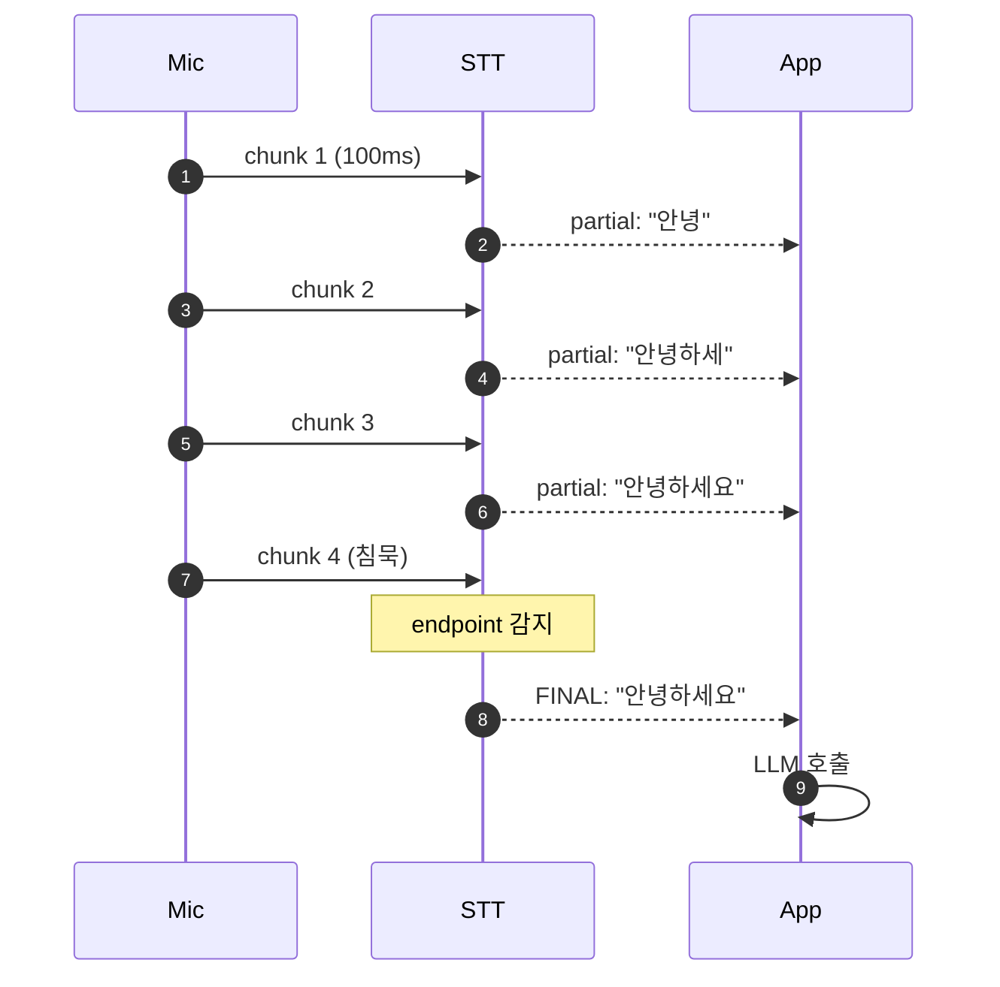
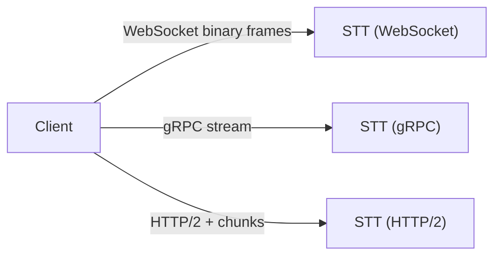
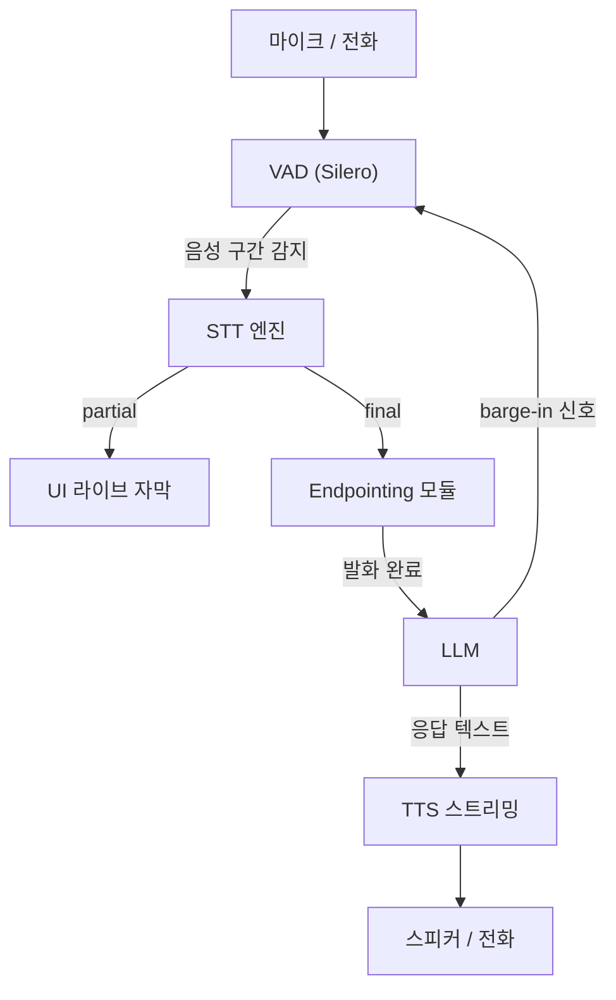

## 정의

**스트리밍 STT** = *오디오 청크* 가 들어올 때마다 *부분 결과 (partial)* 를 즉시 반환 + *발화 종료* 시 *최종 결과 (final)* 확정.

> [!IMPORTANT]
> *대화형 음성 AI 의 첫 단계*. **종단 지연 1초 미만** 의 *시작점*.

## partial vs final



| | partial (interim) | final |
|---|---|---|
| 의미 | *현재 추정* (변경 가능) | *확정* |
| 빈도 | 매 100-300ms | endpointing 후 1회 |
| 정확도 | 낮음 (변경됨) | 높음 |
| 사용 | UI 라이브 자막 | LLM 호출, action |

> [!CAUTION]
> *partial 로 LLM 호출 금지*. *반복 호출 + 변경된 텍스트* → 낭비 + 일관성 깨짐.

## Endpointing (발화 종료 감지)

```
사용자 침묵 → 얼마나 기다린 후 final?
```

| 전략 | 의미 |
|---|---|
| **에너지 기반 VAD** | 침묵 N ms 후 종료 |
| **신경망 VAD (Silero)** | 음성/비음성 확률 기반 |
| **시맨틱 endpointing** | 문장 의미 + VAD (LiveKit 0.4) |
| **고정 timeout** | 무조건 N초 후 |

```
일반: 침묵 500-800ms 후 final
short: 200-400ms (빠른 대화)
long: 1000-1500ms (사용자가 멈춤 많음)
```

### 시맨틱 endpointing 의 가치

```
❌ 순수 VAD: "내 번호는 010-..." [500ms 침묵] → final "내 번호는 010" → 사용자 끊김!
✓ 시맨틱: "내 번호는 010-1234-5678" 까지 *기다림* (전화번호 패턴 인식)
```

> *LiveKit, Pipecat 의 자체 모델* 이 *오디오 + 텍스트* 보고 *~300ms* 까지 단축.

## 프로토콜: WebSocket vs gRPC



| 프로토콜 | 장점 | 단점 |
|---|---|---|
| **WebSocket** | 브라우저 native, 단순 | 텍스트/binary 혼합 어색 |
| **gRPC bidi-stream** | binary 효율적, schema | 브라우저는 grpc-web 필요 |
| **HTTP/2 chunked** | 표준 | session 관리 직접 |

> 2026 시점 *서버↔서버 = gRPC* (CLOVA, Google), *브라우저↔서버 = WebSocket* (Deepgram, AssemblyAI) 분기.

## WebSocket 예시 (Deepgram)

```javascript
const ws = new WebSocket('wss://api.deepgram.com/v1/listen?model=nova-3&language=ko&interim_results=true&endpointing=500');

ws.binaryType = 'arraybuffer';

ws.onmessage = (e) => {
  const data = JSON.parse(e.data);
  if (data.channel?.alternatives[0]) {
    const transcript = data.channel.alternatives[0].transcript;
    const isFinal = data.is_final;
    if (isFinal) {
      onFinalTranscript(transcript);
    } else {
      onPartial(transcript);
    }
  }
};

// 마이크 → WebSocket 오디오 청크
const audioContext = new AudioContext({ sampleRate: 16000 });
const processor = audioContext.createScriptProcessor(2048, 1, 1);
processor.onaudioprocess = (e) => {
  const pcm = float32To16BitPCM(e.inputBuffer.getChannelData(0));
  ws.send(pcm);
};
```

## gRPC 예시 (CLOVA, Python)

```python
import grpc
import nest_pb2, nest_pb2_grpc

def request_generator(audio_stream):
    yield nest_pb2.NestRequest(
        type=nest_pb2.RequestType.CONFIG,
        config=nest_pb2.NestConfig(
            language='ko-KR',
            sample_rate=16000,
            encoding=nest_pb2.AudioEncoding.LINEAR16,
        )
    )
    for chunk in audio_stream:
        yield nest_pb2.NestRequest(
            type=nest_pb2.RequestType.AUDIO,
            audio=chunk,
        )

with grpc.secure_channel('clovaspeech-gw.ncloud.com:443', creds) as channel:
    stub = nest_pb2_grpc.NestServiceStub(channel)
    metadata = [('authorization', f'Bearer {token}')]
    for response in stub.Recognize(request_generator(audio_iter), metadata=metadata):
        if response.is_final:
            print('FINAL:', response.transcript)
        else:
            print('partial:', response.transcript)
```

## 지표

| 지표 | 의미 | 목표 |
|---|---|---|
| **TTP** (Time-to-Partial) | 첫 partial 까지 | < 200ms |
| **TTF** (Time-to-Final) | 발화 종료 → final | < 500ms |
| **TTL** (Time-to-Last partial) | 마지막 partial 까지 | < 100ms |
| **Stability** | partial 의 변경 빈도 | < 5% |

자세한 latency 분석은 [[latency-percentiles]].

## 흔한 함정

> [!WARNING]
> 1. **partial 로 LLM 호출** = 낭비. final 까지 기다리거나 *시맨틱 endpointing*.
> 2. **endpointing 너무 김 (1.5초+)** = 대화 어색. 사용자가 *답답함*.
> 3. **endpointing 너무 짧음 (200ms)** = 사용자 *말끊김*. 시맨틱 권장.
> 4. **WebSocket idle timeout** = 침묵 시 connection close. ping/pong 주기적.
> 5. **언어 자동 감지** = 짧은 발화 / 다국어 혼용 시 깨짐. *명시*.

## 오디오 포맷

| 항목 | 권장 | 이유 |
|---|---|---|
| Sample rate | 16,000 Hz | ASR 모델 학습 표준 |
| Bit depth | 16-bit Linear PCM | 무손실, 변환 오버헤드 없음 |
| Channels | 1 (mono) | 스테레오는 다운믹스 후 전송 |
| Chunk 크기 | 100-200ms | partial 응답 주기와 균형 |
| Codec | Raw PCM 또는 Opus | Opus 는 대역폭 절약 (WebRTC 표준) |

```python
# Web Audio API Float32 -> Linear PCM 16-bit 변환
import numpy as np

def float32_to_int16(audio: np.ndarray) -> bytes:
    clipped = np.clip(audio, -1.0, 1.0)
    return (clipped * 32767).astype(np.int16).tobytes()
```

## 연결 안정성

스트리밍은 수 분~수 시간 연결 유지가 필요. 네트워크 상태에 따라 끊길 수 있음.

### KeepAlive (WebSocket)

```javascript
// Deepgram: 10초마다 KeepAlive 메시지 전송, 침묵 시 연결 종료 방지
let backoff = 1000;
const keepAlive = setInterval(() => {
  if (ws.readyState === WebSocket.OPEN) {
    ws.send(JSON.stringify({ type: 'KeepAlive' }));
  }
}, 10_000);

ws.onclose = () => {
  clearInterval(keepAlive);
  setTimeout(connect, Math.min(backoff * 2, 30_000)); // exponential backoff
};
```

### gRPC Keepalive (Python)

```python
channel_options = [
    ('grpc.keepalive_time_ms', 15_000),
    ('grpc.keepalive_timeout_ms', 5_000),
    ('grpc.keepalive_permit_without_calls', True),
]
channel = grpc.secure_channel(host, creds, options=channel_options)
```

## 화자 분리 (Diarization)

여러 화자가 동시에 등장하는 환경 (회의, 콜센터) 에서 화자별 전사 필요.

```javascript
// Deepgram diarize=true 예시
const ws = new WebSocket(
  'wss://api.deepgram.com/v1/listen?diarize=true&model=nova-3&language=ko'
);

ws.onmessage = (e) => {
  const { is_final, channel } = JSON.parse(e.data);
  if (is_final) {
    const words = channel.alternatives[0].words;
    words.forEach(w => {
      console.log(`[Speaker ${w.speaker}] ${w.word}`);
    });
  }
};
```

| 상황 | 권장 |
|---|---|
| 사용자:AI 1:1 대화 | diarization 불필요 |
| 회의 전사 | diarize=true + 화자 수 힌트 |
| 콜센터 | 채널 분리 후 각 채널 별도 전사 |

## 음성 에이전트 통합 아키텍처



> partial 이 들어오는 동안 *barge-in* 감지 시 TTS 중단 + VAD 재활성화.

## 관련 위키

- [[stt-models-overview]]
- [[vad-silero]]
- [[turn-detection-barge-in]]
- [[voice-agent-architecture]]
- [[WebSocket]]
- [[gRPC]]
