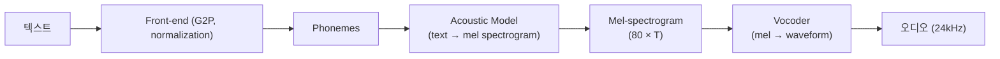
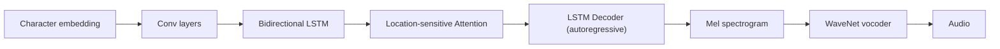
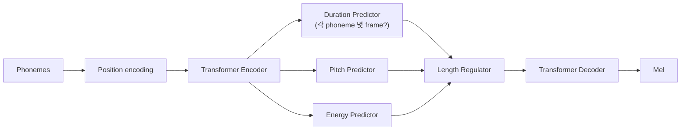
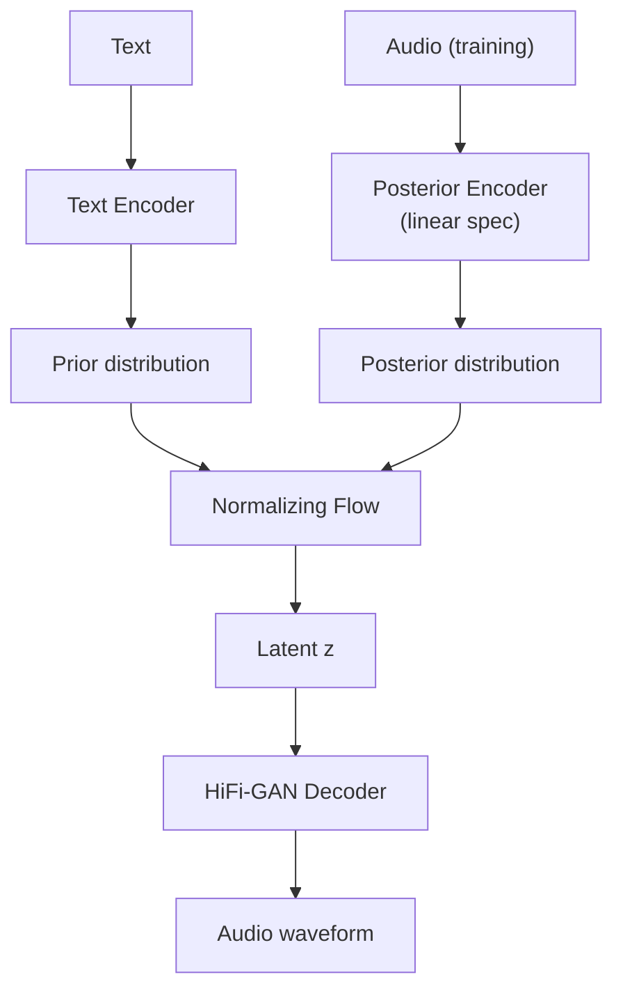
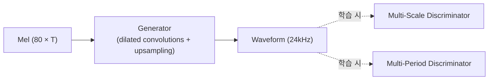
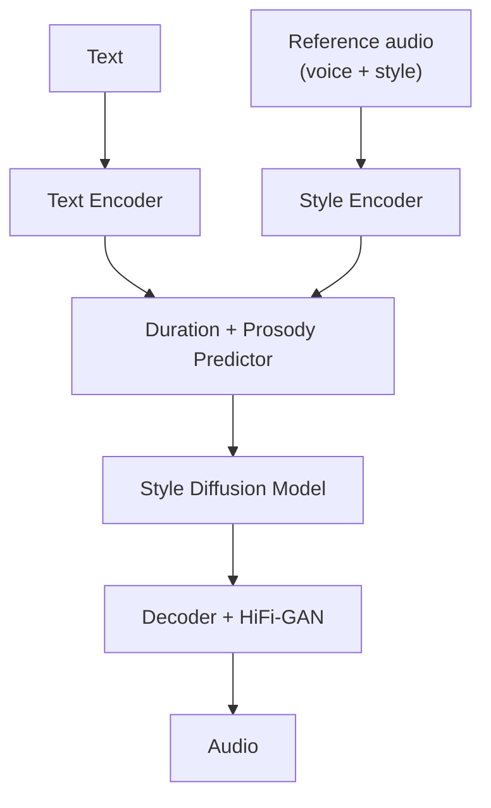
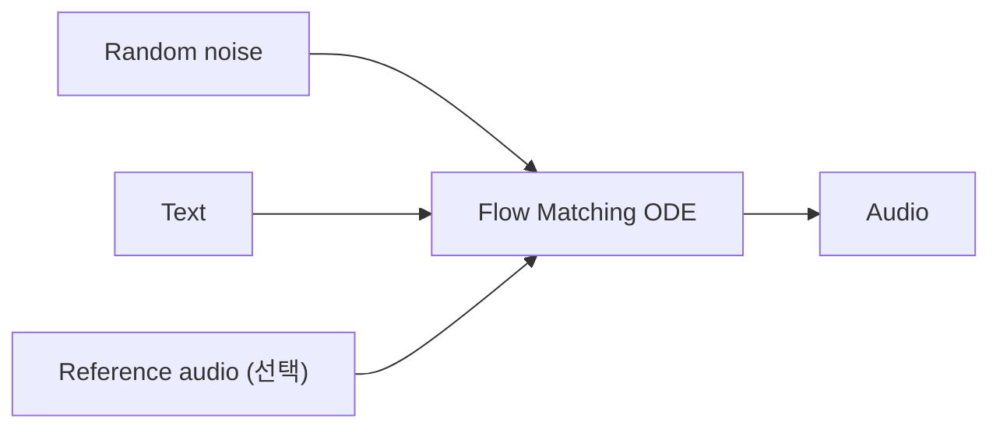

## 정의

Neural TTS 의 *진화*: 2단계 (acoustic + vocoder) → end-to-end. 2026 시점 *VITS 계열 + Flow matching* 이 상용 표준.

개요는 [[tts-models-overview]] 참고. 본 페이지는 *내부 아키텍처 + 코드*.

## 2단계 파이프라인 (전통)



| 단계 | 대표 모델 |
|---|---|
| G2P | Sequence-to-sequence, Phonemizer |
| Acoustic | Tacotron 2, FastSpeech 2, Glow-TTS |
| Vocoder | WaveNet, WaveRNN, HiFi-GAN, BigVGAN |

## Tacotron 2 (2017-2018)



- **Autoregressive**: 매 mel frame 순차 생성.
- **Attention alignment**: text ↔ audio 매핑 학습.
- 단점: *느림 (real-time factor > 1)*, *robustness 문제* (repetition, skipping).

## FastSpeech 2 (2020)



- **Non-autoregressive**: *병렬 생성* → 수십 배 빠름.
- Duration predictor 로 *길이 예측* (attention 없음).
- Pitch/Energy 예측으로 *운율 제어*.

## VITS (2021, 상용 표준)

**Variational Inference with adversarial learning for end-to-end Text-to-Speech**



**핵심 아이디어**:

- **End-to-end**: Mel intermediate 없이 *바로 waveform*.
- **VAE + Flow + GAN** 결합.
- Duration predictor + Stochastic (자연스러움).
- *상용 TTS 의 표준 base*.

```python
# Coqui XTTS-v2 사용
from TTS.api import TTS

tts = TTS(
    model_name="tts_models/multilingual/multi-dataset/xtts_v2",
    progress_bar=False,
).to("cuda")

tts.tts_to_file(
    text="안녕하세요. 음성 합성 테스트입니다.",
    speaker_wav="reference_voice.wav",   # voice cloning
    language="ko",
    file_path="output.wav",
)
```

## HiFi-GAN (Vocoder)

Mel → waveform 변환. **Generator + Multi-scale + Multi-period Discriminator**.



- 학습: adversarial + mel loss + feature matching.
- 추론: *생성기만* 사용. real-time factor < 1.
- Quality: WaveNet 수준, 100x 빠름.

## StyleTTS 2 (2023)



- **Diffusion + adversarial** hybrid.
- *Voice cloning* 3초 sample.
- Human-level quality (MOS 4.5+).

## Flow Matching TTS (F5-TTS, 2024)



- Diffusion 의 *더 효율적* 변형.
- 3-shot voice cloning.
- 자체 호스팅 친화 (Apache 2.0).

## Text Normalization

```python
# 숫자, 기호, 약어 → 발음 가능 형태
"$5"    → "다섯 달러"
"100"   → "백" 또는 "일영영"
"AI"    → "에이아이"
"3:30"  → "세 시 삼십 분"

# Python: normalize
import re

def normalize_kr(text):
    text = re.sub(r'\$(\d+)', lambda m: number_to_kor(int(m.group(1))) + ' 달러', text)
    text = re.sub(r'(\d+)원', lambda m: number_to_kor(int(m.group(1))) + ' 원', text)
    text = text.replace('AI', '에이아이')
    text = text.replace('API', '에이피아이')
    return text
```

## G2P (Grapheme-to-Phoneme)

한국어:

```
"안녕하세요"
→ 발음: "안녕하세요"
→ IPA: /an.njʌŋ.ha.se.jo/
```

라이브러리:

- **g2pK** (한국어) - Rule-based
- **phonemizer** (다국어) - eSpeak
- **KoG2P** - Sequence-to-sequence

```python
from g2pk import G2p
g2p = G2p()

print(g2p("안녕하세요"))          # "안녕하세요"
print(g2p("Hello 안녕"))           # "헬로 안녕"
print(g2p("2026년 6월"))           # "이천이십육년 육월"
```

## Prosody 제어 (SSML)

자세한 SSML 은 [[tts-streaming-ssml]].

```python
# 모델에 직접 prosody 전달
audio = tts.synthesize(
    text="안녕하세요",
    speaker_id="female-1",
    speed=1.2,        # 20% 빠르게
    pitch=+2,         # 반음 2 up
    energy=1.1,       # 10% 큰 소리
)
```

## Voice Cloning (few-shot)

```python
# XTTS-v2 (6초 sample 로 cloning)
tts.tts_to_file(
    text="한 번도 만난 적 없는 사람의 목소리를 합성합니다.",
    speaker_wav="unknown_person_6sec.wav",   # ← 그 사람 음성 sample
    language="ko",
    file_path="cloned.wav",
)
```

내부:

1. Speaker encoder → 256-dim embedding.
2. TTS generator 가 embedding 조건 삽입.
3. 새 텍스트 + 그 embedding → 합성.

## 흔한 함정

> [!WARNING]
> 1. **normalization 없이** = "$100" → "달러 백" 같이 이상. Front-end 처리 필수.
> 2. **G2P 무시** = 한자, 영어 발음 이상. g2pK 등.
> 3. **VITS 학습 데이터 편향** = *특정 speaker* 만 자연스러움. Multi-speaker 학습.
> 4. **Vocoder 만 교체** = mismatch → 음질 나빠짐. 함께 학습 필요.

## 관련 위키

- [[tts-models-overview]]
- [[tts-streaming-ssml]]
- [[stt-internals-whisper]] (STT 대칭)
- [[voice-agent-architecture]]
