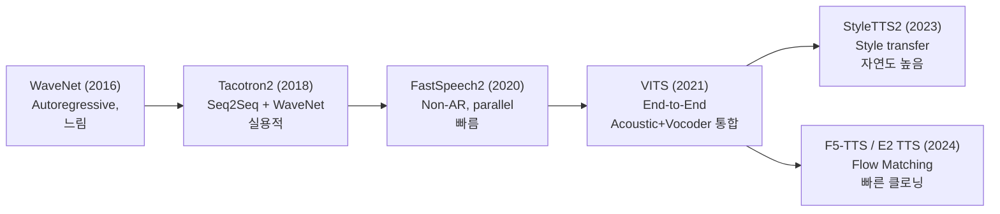
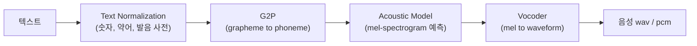
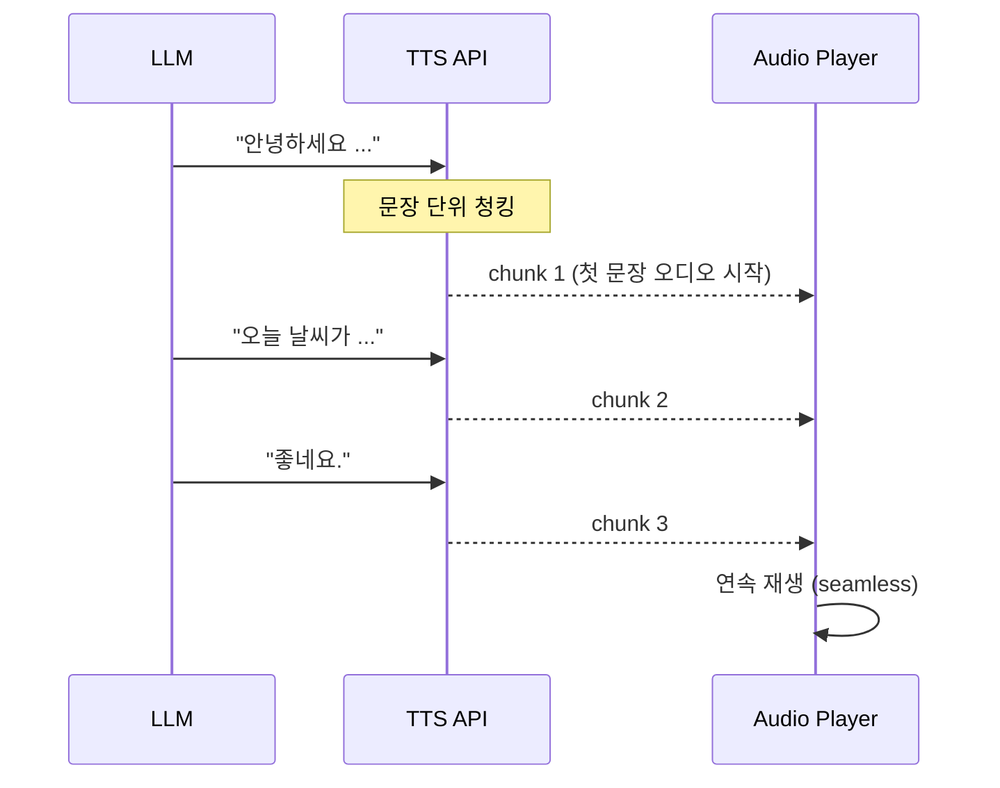
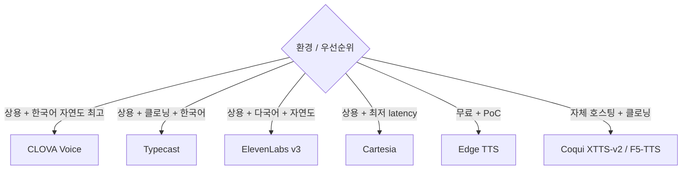
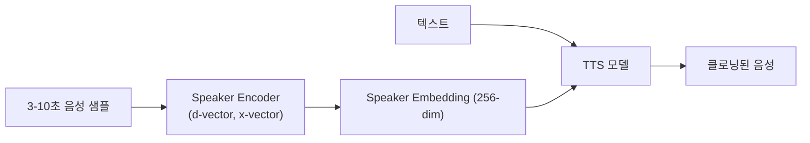

## 정의

**TTS (Text-to-Speech)** = *텍스트 → 음성* 합성. 2026 시점 *사람과 구분 어려운 자연도* + *< 200ms first audio* + *voice cloning* 표준.

## 뉴럴 TTS 아키텍처 진화



| 모델 | 방식 | 특징 |
|---|---|---|
| **WaveNet** (DeepMind 2016) | autoregressive 샘플 생성 | 최초 신경망 보코더, 매우 느림 |
| **Tacotron2** (Google 2018) | seq2seq + Griffin-Lim/WaveNet | text → mel-spectrogram |
| **FastSpeech2** (MS 2020) | non-autoregressive, parallel | 빠름, 자연도 중간 |
| **VITS** (2021) | end-to-end (acoustic + vocoder) | 자연도 높음, 빠름 |
| **HiFi-GAN** (2020) | GAN 보코더 | 고속, 고품질 mel → waveform |
| **StyleTTS2** (2023) | style diffusion + SLM | 사람 수준 자연도 |
| **F5-TTS / E2 TTS** (2024) | flow matching | 빠른 클로닝, 경량 |

## 뉴럴 TTS 파이프라인



> 2026 시점 *상용 TTS 는 거의 모두 end-to-end* (acoustic + vocoder 통합). VITS / StyleTTS2 계열.

## 주요 모델 매트릭스 (2026)

| 모델 | 종류 | 한국어 | TTFB | 클로닝 | 강점 |
|---|---|---|---|---|---|
| **ElevenLabs v3** | API | 우수 | 200-400ms | 수초 샘플 | 자연도 1위, 다국어, 감정 제어 |
| **Cartesia Sonic-2** | API | 보통 | *< 90ms* | 가능 | 최저 latency, 실시간 voice agent |
| **OpenAI TTS-1-HD / GPT-4o TTS** | API | 우수 | 300-500ms | 제한 | GPT 통합 |
| **Google Cloud TTS** (Studio voices) | API | 우수 | 300ms | 제한 | 안정성 |
| **Azure Speech TTS** | API | 우수 | 200-400ms | Custom Neural Voice | enterprise |
| **Microsoft Edge TTS** | 무료 (비공식 API) | 우수 | 보통 | X | 비용 0 |
| **Naver CLOVA Voice** | API | *최우수* | 200-400ms | 가능 | 한국어 1위 |
| **Typecast** | API | 우수 | 적당 | 강력 | 한국 voice cloning |
| **Coqui XTTS-v2** | OSS | 우수 | self-host | 수초 샘플 | 자체 호스팅 + 클로닝 |
| **F5-TTS** (2024) | OSS | 보통 | self-host | 가능 | flow matching, 빠름 |
| **StyleTTS 2** | OSS | 영어 | self-host | 가능 | 사람 수준 자연도 |

## TTFB (Time-to-First-Byte) 비교

<ChartJs
  client:visible
  type="bar"
  title="TTS TTFB (첫 오디오까지, ms)"
  caption="Cartesia 가 최저. 실시간 voice agent 에 필수 < 200ms."
  height="240px"
  data={{
    labels: ['Cartesia Sonic-2', 'Azure Neural', 'ElevenLabs Turbo', 'OpenAI TTS-1', 'Edge TTS', 'CLOVA Voice'],
    datasets: [
      { label: 'TTFB (ms, 낮을수록 좋음)', data: [85, 220, 250, 400, 600, 320], backgroundColor: ['#22c55e', '#3b82f6', '#3b82f6', '#f59e0b', '#ef4444', '#a78bfa'] },
    ],
  }}
  options={{ scales: { y: { title: { display: true, text: 'ms' } } } }}
/>

## 스트리밍 TTS 파이프라인



```python
# ElevenLabs 스트리밍 예시
from elevenlabs.client import ElevenLabs
from elevenlabs import stream

client = ElevenLabs(api_key="your-api-key")

audio_stream = client.generate(
    text="안녕하세요. 음성 합성 스트리밍 테스트입니다.",
    voice="Rachel",
    model="eleven_multilingual_v2",
    stream=True,
)
stream(audio_stream)  # 재생까지 처리
```

```python
# Cartesia 스트리밍
import cartesia

client = cartesia.Cartesia(api_key="your-api-key")

for chunk in client.tts.bytes(
    model_id="sonic-2",
    transcript="Hello, this is a streaming TTS test.",
    voice={"id": "your-voice-id"},
    output_format={"container": "raw", "encoding": "pcm_s16le", "sample_rate": 16000},
    stream=True,
):
    audio_player.write(chunk)
```

## Edge TTS (Microsoft 비공식 API)

```python
import edge_tts
import asyncio

async def main():
    communicate = edge_tts.Communicate(
        text="안녕하세요. 음성 합성 테스트입니다.",
        voice="ko-KR-SunHiNeural"
    )
    await communicate.save("output.mp3")

# 스트리밍
async def stream_tts(text):
    communicate = edge_tts.Communicate(text, voice="ko-KR-InJoonNeural")
    async for chunk in communicate.stream():
        if chunk["type"] == "audio":
            yield chunk["data"]

# 한국어 음성 목록 확인
voices = await edge_tts.list_voices()
korean = [v for v in voices if v["Locale"].startswith("ko-KR")]
```

| 한국어 Edge TTS 음성 | 성별 | 특성 |
|---|---|---|
| `ko-KR-SunHiNeural` | 여성 | 자연스러운 뉴스 톤 |
| `ko-KR-InJoonNeural` | 남성 | 차분한 성우 톤 |
| `ko-KR-HyunsuNeural` | 남성 | 젊은 톤 (멀티링구얼) |
| `ko-KR-BongJinNeural` | 남성 | 낭독 스타일 |

> [!IMPORTANT]
> *Edge TTS 는 비공식*. Microsoft Edge 브라우저의 read-aloud 기능을 외부 사용. 상용 서비스 사용은 위험. *PoC, 개인 프로젝트* 에 적합.

## SSML / Prosody 제어

```xml
<!-- SSML 예시 -->
<speak>
  <s>안녕하세요.</s>
  <break time="500ms"/>
  <prosody rate="slow" pitch="+2st">
    천천히 높은 음으로 말합니다.
  </prosody>
  <say-as interpret-as="characters">AI</say-as>
  <phoneme alphabet="ipa" ph="ˈmɒkɪŋ">mocking</phoneme>
</speak>
```

| SSML 태그 | 역할 |
|---|---|
| `<prosody rate/pitch/volume>` | 속도, 음높이, 음량 |
| `<break>` | 침묵 삽입 |
| `<say-as interpret-as>` | 숫자/날짜/문자 읽기 방식 |
| `<phoneme>` | IPA 발음 직접 지정 |
| `<emphasis>` | 강조 |

## 한국어 TTS 선택



## Voice Cloning



| 도구 | 샘플 길이 | 품질 |
|---|---|---|
| ElevenLabs Instant Voice | 1분 | 최고 |
| ElevenLabs Professional Voice | 30분+ | 정밀 (스튜디오 녹음) |
| XTTS-v2 | 6초 | 좋음 (OSS) |
| F5-TTS | 10초 | 빠름 |
| Cartesia Voice Cloning | 수분 | 상업용 |

> [!CAUTION]
> *허락 없는 voice cloning 은 법적 / 윤리적 문제*. 공인 / 유명인 음성 무단 사용 금지. *생성 음성에 워터마크* 권장.

## 발음 교정 사전 (lexicon)

```xml
<!-- SSML lexicon 참조 -->
<lexicon uri="https://example.com/lex.pls"/>

<!-- lex.pls -->
<lexicon xmlns="http://www.w3.org/2005/01/pronunciation-lexicon">
  <lexeme>
    <grapheme>Karatsuba</grapheme>
    <phoneme>karatsˈuːba</phoneme>
  </lexeme>
  <lexeme>
    <grapheme>네이버</grapheme>
    <phoneme>ne.i.beo</phoneme>
  </lexeme>
</lexicon>
```

> 브랜드명, 인명, 기술 용어를 *정확히 발음*. 자세한 SSML 은 [[tts-streaming-ssml]].

## 평가 지표

| 지표 | 의미 |
|---|---|
| **MOS** (Mean Opinion Score) | 1-5, 인간 평가 (4.0+ = 자연스러움) |
| **CMOS** | 비교 MOS |
| **CER** | 합성된 음성을 STT 로 다시 전사 → 정확도 |
| **TTFB** | 첫 오디오까지 |
| **RTF** (Real-Time Factor) | 처리 시간 / 음성 시간 (< 1 = 실시간 가능) |

## 흔한 함정

> [!WARNING]
> 1. **TTFB 만 보고 선택** = 자연도 떨어지면 *사용자 외면*. TTFB + MOS 둘 다 확인.
> 2. **숫자 발음** = "100" → "100" 또는 "백" 모델마다 다름. SSML `<say-as>` 명시.
> 3. **긴 문장 한 번에** = 첫 오디오 지연. *문장 단위 청킹 후 스트리밍*.
> 4. **클로닝 음질** = 샘플 노이즈에 민감. *조용한 환경 + 16kHz+ 녹음*.
> 5. **Edge TTS 상용 사용** = 비공식 API, 언제든 차단 가능. 상용 서비스는 공식 API.

## 관련 위키

- [[tts-streaming-ssml]]
- [[stt-models-overview]]
- [[voice-agent-architecture]]
- [[speech-to-speech-realtime]]
