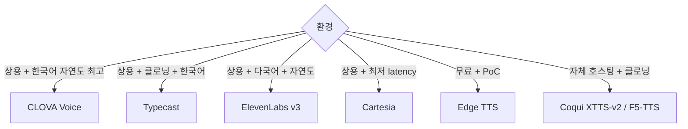
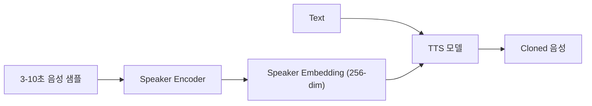

## 정의

**TTS (Text-to-Speech)** = *텍스트 → 음성* 합성. 2026 시점 *사람과 구분 어려운 자연도* + *< 200ms first audio* + *voice cloning* 표준.

## 뉴럴 TTS 구조

```mermaid
flowchart LR
    Text["텍스트"] --> Norm[Text Normalization<br/>(숫자, 약어, 발음 사전)]
    Norm --> Front[Front-end<br/>(grapheme → phoneme)]
    Front --> Acoustic[Acoustic Model<br/>(mel-spectrogram)]
    Acoustic --> Vocoder[Vocoder<br/>(mel → waveform)]
    Vocoder --> Audio[음성 wav]
```

| 단계 | 역할 |
|---|---|
| Normalization | "100$" → "백 달러" |
| G2P | grapheme → phoneme |
| Acoustic | Tacotron2, FastSpeech2, VITS, Glow-TTS |
| Vocoder | HiFi-GAN, WaveNet, BigVGAN |
| 통합 | VITS, StyleTTS2 (end-to-end) |

> 2026 시점 *상용 TTS 는 거의 모두 end-to-end* (acoustic + vocoder 통합). Diffusion 기반도 활발.

## 주요 모델 매트릭스 (2026)

| 모델 | 종류 | 한국어 | TTFB | 클로닝 | 강점 |
|---|---|---|---|---|---|
| **ElevenLabs v3** | API | 우수 | 200-400ms | *수초 샘플* | 자연도 1위, 다국어, 감정 |
| **Cartesia Sonic-2** | API | 보통 | **< 90ms** | 가능 | *최저 latency*, 실시간 voice agent 표준 |
| **OpenAI TTS-1-HD / GPT-4o TTS** | API | 우수 | 300-500ms | 제한 | GPT 통합 |
| **Google Cloud TTS** (Studio voices) | API | 우수 | 300ms | 제한 | 안정성 |
| **Azure Speech TTS** | API | 우수 | 200-400ms | Custom Neural Voice | enterprise |
| **Microsoft Edge TTS** | *무료 (비공식 API)* | 우수 | 보통 | X | *비용 0*, edge-tts 패키지 |
| **Naver CLOVA Voice** | API | *최우수* | 200-400ms | 가능 | 한국어 1위 |
| **Typecast** | API | 우수 | 적당 | 강력 | 한국 voice cloning |
| **Coqui XTTS-v2** | OSS | 우수 | self-host | *수초 샘플* | 자체 호스팅 + 클로닝 |
| **F5-TTS** (2024) | OSS | 보통 | self-host | 가능 | flow matching, 빠름 |
| **MaskGCT** (2024) | OSS | 우수 | self-host | 가능 | non-autoregressive |
| **StyleTTS 2** | OSS | 영어 | self-host | 가능 | high quality |

## TTFB (Time-to-First-Byte) 비교

<ChartJs
  client:visible
  type="bar"
  title="TTS TTFB (첫 오디오까지, ms)"
  caption="Cartesia 가 최저. 실시간 voice agent 에 필수 < 200ms."
  height="240px"
  data={{
    labels: ['Cartesia Sonic-2', 'Azure Neural', 'ElevenLabs Turbo', 'OpenAI TTS-1', 'Edge TTS', 'CLOVA Voice'],
    datasets: [
      { label: 'TTFB (ms, 낮을수록 좋음)', data: [85, 220, 250, 400, 600, 320], backgroundColor: ['#22c55e', '#3b82f6', '#3b82f6', '#f59e0b', '#ef4444', '#a78bfa'] },
    ],
  }}
  options={{ scales: { y: { title: { display: true, text: 'ms' } } } }}
/>

## Edge TTS (Microsoft 비공식 API)

```python
import edge_tts
import asyncio

async def main():
    communicate = edge_tts.Communicate(
        text="안녕하세요. 음성 합성 테스트입니다.",
        voice="ko-KR-SunHiNeural"
    )
    await communicate.save("output.mp3")

# 스트리밍
async def stream_tts(text):
    communicate = edge_tts.Communicate(text, voice="ko-KR-InJoonNeural")
    async for chunk in communicate.stream():
        if chunk["type"] == "audio":
            yield chunk["data"]
```

| 장점 | 단점 |
|---|---|
| *무료* | Microsoft 정책 변경 위험 |
| 다국어 (한국어 4 음성) | rate limit 불명확 |
| 빠름 | enterprise SLA 없음 |
| edge-tts 패키지 1줄 | 비공식 (API 변경 가능) |

> [!IMPORTANT]
> *Edge TTS 는 비공식*. Microsoft 가 *Edge 브라우저 의 read-aloud 기능* 을 외부 사용. 상용 서비스 사용은 위험. *PoC, 개인 프로젝트* 에 적합.

## 한국어 TTS 선택



## Voice Cloning



| 도구 | 샘플 길이 | 품질 |
|---|---|---|
| ElevenLabs Instant Voice | 1분 | *최고* |
| ElevenLabs Professional Voice | 30분+ | 정밀 (스튜디오 녹음) |
| XTTS-v2 | 6초 | 좋음 (OSS) |
| F5-TTS | 10초 | 빠름 |
| Coqui (옛) | 10분+ | 옛 |

> [!CAUTION]
> *허락 없는 voice cloning 은 법적 / 윤리적 문제*. 공인 / 유명인 음성 무단 사용 금지. *생성 음성에 워터마크* 권장 (Resemble AI 의 PerthNet 등).

## 발음 교정 사전 (lexicon)

```xml
<!-- SSML -->
<lexicon uri="https://example.com/lex.pls"/>
```

```xml
<!-- lex.pls -->
<lexicon xmlns="http://www.w3.org/2005/01/pronunciation-lexicon">
  <lexeme>
    <grapheme>Karatsuba</grapheme>
    <phoneme>karatsˈuːba</phoneme>
  </lexeme>
</lexicon>
```

> 브랜드명, 인명, 기술 용어를 *정확히 발음*. 자세한 SSML 은 [[tts-streaming-ssml]].

## 평가 지표

| 지표 | 의미 |
|---|---|
| **MOS** (Mean Opinion Score) | 1-5, 인간 평가 |
| **CER** | 합성된 음성을 STT 로 다시 → 정확도 |
| **TTFB** | 첫 오디오까지 |
| **RTF** (Real-Time Factor) | 처리 시간 / 음성 시간 (< 1 = real-time 가능) |
| **WER** (TTS-STT round trip) | 종합 정확도 |

## 흔한 함정

> [!WARNING]
> 1. **TTFB 만 보고 선택** = 자연도 떨어지면 *사용자 외면*. 둘 다 확인.
> 2. **숫자 발음** = "100" → "100" 또는 "백" 가는지 모델 마다 다름. SSML `<say-as>` 명시.
> 3. **긴 문장 한 번에** = 첫 오디오 지연. *문장 단위 청킹* 후 스트리밍. 자세한 건 [[tts-streaming-ssml]].
> 4. **클로닝 음질** = 샘플 노이즈에 민감. *조용한 환경 + 16kHz+ 녹음*.

## 관련 위키

- [[tts-streaming-ssml]]
- [[stt-models-overview]]
- [[voice-agent-architecture]]
- [[speech-to-speech-realtime]]
