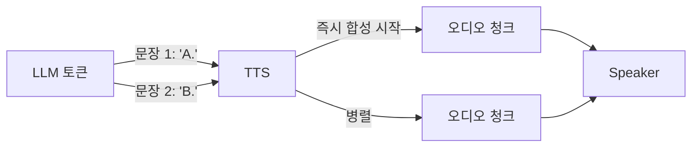
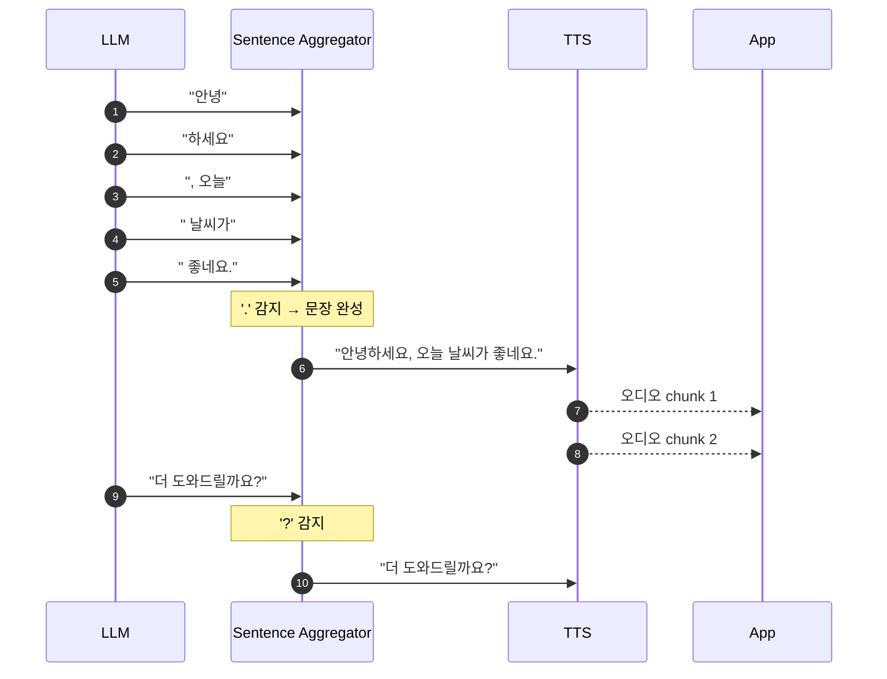
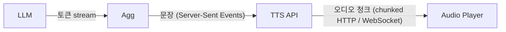
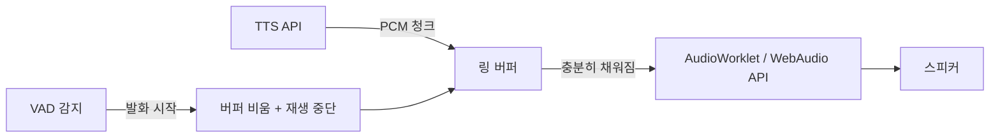

## 정의

**TTS 스트리밍** = 텍스트 *일부만 받아도 즉시 합성* + 오디오 *청크 단위 전송*. *TTFB (Time-to-First-Audio)* 최소화 = 대화 자연스러움의 핵심.

## TTFB 의 중요성



> [!IMPORTANT]
> *사람 대화는 응답 < 500ms*. TTS 가 *문장 전체 끝나고 합성 시작* 하면 (예: 5초 응답) → 5초 + 합성 latency = *불가능*. **문장 단위 스트리밍** 필수.

## Sentence Aggregation



```python
class SentenceAggregator:
    def __init__(self):
        self.buffer = ""
        self.delimiters = ".!?。!?"

    def feed(self, token: str):
        self.buffer += token
        # 문장 끝 감지
        for i, ch in enumerate(self.buffer):
            if ch in self.delimiters:
                # 다음 글자가 공백 또는 끝 → 문장 종료
                if i == len(self.buffer) - 1 or self.buffer[i+1] in ' \n':
                    sentence = self.buffer[:i+1].strip()
                    self.buffer = self.buffer[i+1:].lstrip()
                    return sentence
        return None
```

> Pipecat / LiveKit 의 *내장 sentence aggregator*. 직접 구현도 어렵지 않음.

## SSML (Speech Synthesis Markup Language)

```xml
<speak version="1.1" xml:lang="ko-KR">
  안녕하세요. <break time="300ms"/>
  오늘 회의는 <emphasis level="strong">오후 3시</emphasis>입니다.
  <prosody rate="slow" pitch="+2st">천천히 또박또박 말합니다.</prosody>
  주문 번호는 <say-as interpret-as="characters">A1B2</say-as>입니다.
  금액은 <say-as interpret-as="currency" language="ko-KR">1500000</say-as>원입니다.
</speak>
```

## 주요 SSML 태그

| 태그 | 의미 |
|---|---|
| `<break time="500ms"/>` | 일시 정지 |
| `<emphasis level="strong">` | 강조 (강/중/약) |
| `<prosody rate="slow" pitch="+2st" volume="loud">` | 운율 (속도, 높낮이, 음량) |
| `<say-as interpret-as="characters">` | 글자 하나씩 (A1B2 → A 1 B 2) |
| `<say-as interpret-as="currency">` | 통화 |
| `<say-as interpret-as="date">` | 날짜 |
| `<say-as interpret-as="time">` | 시간 |
| `<say-as interpret-as="telephone">` | 전화번호 |
| `<phoneme alphabet="ipa" ph="kæɹətsˈuːba">Karatsuba</phoneme>` | 음소 직접 명시 |
| `<sub alias="에이아이">AI</sub>` | 대체 발음 |
| `<voice name="...">` | 음성 변경 |
| `<lang xml:lang="en-US">Hello</lang>` | 다국어 |

## 스트리밍 프로토콜



| 프로토콜 | 의미 |
|---|---|
| **chunked HTTP** | `Transfer-Encoding: chunked` |
| **SSE** (Server-Sent Events) | `text/event-stream` |
| **WebSocket** | 양방향, 실시간 |
| **gRPC stream** | 효율적, schema |

## 오디오 청크 형식

| 형식 | 의미 |
|---|---|
| **PCM 16-bit 16kHz** | 가장 작음 + 즉시 재생 |
| **MP3** | 압축 + 일반 |
| **Opus** | 효율적 + 음질 |
| **AAC** | iOS 호환성 |
| **WebM Opus** | 브라우저 native |

> 실시간 voice agent = *PCM 또는 Opus* 표준. MP3 는 encoder buffer 때문에 latency 추가.

## ElevenLabs 스트리밍 예시

```python
import requests

def stream_tts(text, voice_id):
    url = f"https://api.elevenlabs.io/v1/text-to-speech/{voice_id}/stream"
    headers = {"xi-api-key": API_KEY, "Content-Type": "application/json"}
    body = {
        "text": text,
        "model_id": "eleven_turbo_v2_5",
        "voice_settings": {"stability": 0.5, "similarity_boost": 0.75},
        "output_format": "pcm_16000",
    }
    resp = requests.post(url, json=body, headers=headers, stream=True)
    for chunk in resp.iter_content(chunk_size=1024):
        yield chunk   # 즉시 재생기로 push
```

## Cartesia 스트리밍 (WebSocket)

```javascript
const ws = new WebSocket('wss://api.cartesia.ai/tts/websocket');

ws.send(JSON.stringify({
  model_id: 'sonic-2',
  voice: { mode: 'id', id: 'voice_id_xyz' },
  output_format: { container: 'raw', encoding: 'pcm_s16le', sample_rate: 16000 },
  language: 'ko',
  transcript: 'continue',   // streaming mode
}));

// 문장 단위 push
ws.send(JSON.stringify({ transcript: '안녕하세요. ', continue: true }));
ws.send(JSON.stringify({ transcript: '오늘 날씨가 좋네요.', continue: false }));

ws.onmessage = (e) => {
  // binary audio chunk
  player.feed(e.data);
};
```

## 클라이언트 재생 파이프라인



## 지연 시간 분석

| 단계 | 일반 수치 | 최적화 방법 |
|:---|:---|:---|
| LLM 첫 토큰 | 200-600ms | 작은 모델 / 투기적 실행 |
| 문장 집계 | 0-200ms | 구두점 감지 임계값 낮춤 |
| TTS API TTFB | 100-400ms | 지역 근접 endpoint |
| 오디오 버퍼 채움 | 50-150ms | PCM direct, chunk 크기 최소화 |
| **전체 E2E** | **약 500-1200ms** | 비동기 파이프라인으로 단축 |

> [!TIP]
> LLM 토큰 생성과 TTS 합성을 **비동기 파이프라인**으로 연결하면 TTFB 를 LLM TTFT (Time-to-First-Token) + TTS TTFB 수준으로 단축 가능.

## SSML 지원 현황 (2026)

| TTS 공급자 | SSML | 스트리밍 | 한국어 |
|:---|:---:|:---:|:---:|
| Google Cloud TTS | 완전 | ✅ | ✅ |
| AWS Polly | 완전 | ✅ | ✅ |
| ElevenLabs | 일부 | ✅ HTTP stream | ✅ |
| Cartesia | 일부 | ✅ WebSocket | ✅ |
| OpenAI TTS | 미지원 | ✅ | ✅ |
| Naver Clova | 완전 | ✅ | ✅ |

## Barge-in 처리

사용자가 AI 말 중간에 끼어들기:

```python
# Pipecat 기반 예시
class BargeInHandler:
    def __init__(self, player, vad):
        self.playing = False
        vad.on_speech_start = self.on_user_speech

    def on_user_speech(self):
        if self.playing:
            player.stop()           # 현재 재생 즉시 중단
            player.clear_buffer()   # 대기 청크 제거
            self.playing = False
```

VAD 가 사용자 음성 시작 감지 → 즉시 TTS 재생 중단 + LLM context 에 발화 추가 → 새 응답 생성.
[[turn-detection-barge-in]] 의 상세 구현 참조.

## 발음 제어 패턴

```python
# 숫자 → 한국어 변환
text = "주문번호 1234"
ssml = f'<speak>주문번호 <say-as interpret-as="characters">{order_id}</say-as></speak>'

# 금액
amount = 1500000
ssml = f'<speak>{amount:,}원</speak>'   # 또는 say-as currency

# 영문 약어
ssml = '<speak><sub alias="에이피아이">API</sub> 키를 발급받았습니다.</speak>'

# 강조
ssml = '<speak>주문 번호는 <emphasis level="strong">반드시</emphasis> 적어주세요.</speak>'
```

## 흔한 함정

> [!WARNING]
> 1. **전체 텍스트 받고 합성 시작** = 응답 5초 후 음성 시작. *문장 단위 streaming*.
> 2. **MP3 출력** = encoder buffer 100-300ms 추가. *PCM* 또는 *Opus*.
> 3. **SSML escape 안 함** = `<`, `&` 가 본문에 있으면 *XML parse 에러*. `xml.sax.saxutils.escape`.
> 4. **너무 짧은 청크** = "안녕." 만 합성 시 *자연도 떨어짐*. 최소 *수 단어 단위*.
> 5. **문장 분리 오인** = "Mr." 의 `.` 을 문장 종료로 인식. 약어 사전 또는 *최소 길이 + 휴리스틱*.

## 관련 위키

- [[tts-models-overview]]
- [[voice-agent-architecture]]
- [[turn-detection-barge-in]]
- [[llm-serving-vllm]] (LLM 토큰 → SSE)
