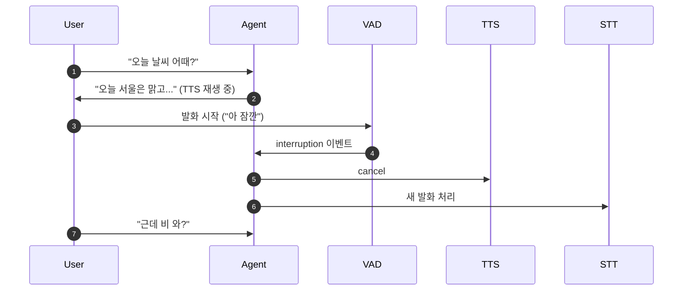
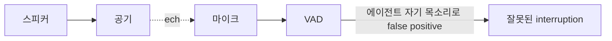
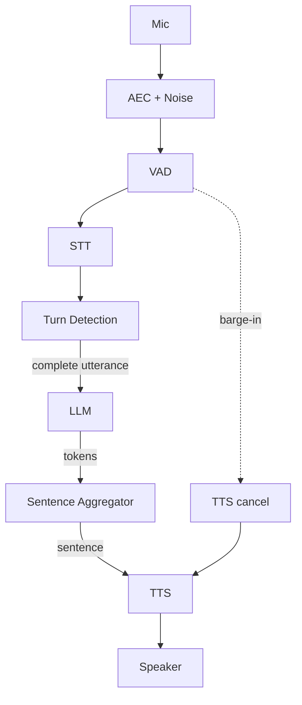

## 정의

자연스러운 음성 대화의 *3 요소*:

1. **Turn Detection** - 사용자가 *말끝났는지* 정확히 판단
2. **Barge-in** - 에이전트가 말하는 *중에 사용자가 끼어들 수 있게*
3. **AEC** - 에이전트의 *자기 음성을 자기 마이크에서 제거*

## 1. Turn Detection (시맨틱)

### 순수 VAD endpointing 의 한계

```
"내 전화번호는 010-1234-5678 입니다"

VAD endpointing (500ms 침묵):
"내 전화번호는 010-" [400ms 침묵, 사용자가 생각 중]
→ FINAL "내 전화번호는 010" → 사용자 끊김!
```

### 시맨틱 Turn Detection

```mermaid
flowchart LR
    Audio[Audio] --> VAD
    Audio --> STT
    STT --> Partial[Partial transcript]
    VAD --> Sil[Silence detected]
    Partial --> SemModel[Turn Detection Model<br/>(오디오 + 텍스트)]
    Sil --> SemModel
    SemModel --> Decision{문장 종료 의도?}
    Decision -->|yes| End[Turn ended]
    Decision -->|no, 더 기다림| Wait[Continue waiting]
```

> *오디오 prosody (운율) + 텍스트 의미* 보고 *완성 문장인지* 판단. ~300ms 까지 단축.

| 도구 | 의미 |
|---|---|
| **LiveKit Turn Detection** | 자체 모델 |
| **Pipecat End-of-utterance detector** | 통합 |
| **Cartesia turn detection** | API |

```python
# LiveKit Agents 예시
from livekit.agents import VoiceAssistant
from livekit.plugins.turn_detector import EOUModel

assistant = VoiceAssistant(
    vad=silero.VAD.load(),
    stt=deepgram.STT(),
    llm=openai.LLM(),
    tts=cartesia.TTS(),
    turn_detector=EOUModel(),   # End-of-utterance 시맨틱 모델
    min_endpointing_delay=0.5,
    max_endpointing_delay=3.0,
)
```

## 2. Barge-in (끼어들기)



### Barge-in 흐름

```python
class VoiceAgent:
    def __init__(self):
        self.tts_playing = False
        self.tts_cancel = None

    async def on_user_speech_start(self):
        if self.tts_playing:
            await self.tts_cancel()       # 재생 중인 TTS 즉시 중단
            await self.flush_audio()       # 출력 buffer 비움
            self.tts_playing = False

    async def speak(self, text):
        self.tts_playing = True
        try:
            async for chunk in self.tts.stream(text):
                if self.cancel_event.is_set():
                    break
                await self.send_audio(chunk)
        finally:
            self.tts_playing = False
```

### Disallow Interruptions (보호)

```python
# Tool call (DB write 같은 되돌릴 수 없는 작업) 중에는 차단
@agent.function_tool
async def transfer_money(amount: int, to: str):
    with disallow_interruptions():
        await db.transfer(amount, to)        # 끼어들기 금지
    return f"{amount}원이 {to}님께 송금되었습니다."
```

> [!IMPORTANT]
> *DB write*, *외부 API 호출 (결제)* 같은 *비가역 작업* 중에는 *반드시 disallow_interruptions*.

## 3. Echo Cancellation (AEC)

### 문제: 자기 목소리가 다시 마이크로



### 해결 3계층

```mermaid
flowchart TB
    L1[1. 클라이언트: getUserMedia echoCancellation=true]
    L1 --> L2[2. 디바이스: hardware AEC (이어폰 사용)]
    L2 --> L3[3. 서버: echo gate (TTS 재생 중 마이크 무시)]
```

### 서버측 Echo Gate

```python
class EchoGate:
    """TTS 재생 중 마이크 입력 무시 (or 감쇠)"""
    def __init__(self, attenuation_db=20):
        self.tts_active = False
        self.atten = 10 ** (-attenuation_db / 20)

    def attenuate(self, audio_chunk):
        if self.tts_active:
            return audio_chunk * self.atten
        return audio_chunk

    async def on_tts_start(self):
        self.tts_active = True

    async def on_tts_end(self):
        self.tts_active = False
```

> [!CAUTION]
> *순수 마이크 mute* 면 *진짜 barge-in 도 막힘*. *부분 감쇠 (20dB)* + *VAD 임계값 상승* 이 균형.

## 4. Sentence Aggregation (LLM 토큰 → TTS 문장)

```python
class SentenceAggregator:
    def feed_token(self, token):
        self.buffer += token
        if any(self.buffer.endswith(p) for p in ['. ', '! ', '? ', '。', '!', '?']):
            sent = self.buffer.strip()
            self.buffer = ""
            return sent
        return None

# 사용
async for token in llm.stream(prompt):
    sent = aggregator.feed_token(token)
    if sent:
        async for audio in tts.stream(sent):
            yield audio
```

자세한 건 [[tts-streaming-ssml]].

## 통합 흐름



## 흔한 함정

> [!WARNING]
> 1. **AEC 없이 스피커 출력** = 무한 루프 (자기 목소리 → STT → LLM → TTS → ...). 이어폰 또는 echo gate.
> 2. **순수 VAD endpointing 만** = 전화번호 / 주소 발화 시 끊김. 시맨틱 turn detection.
> 3. **Barge-in 시 TTS buffer 남음** = "끊었는데" 음성 1-2초 더 들림. *오디오 buffer flush*.
> 4. **Sentence aggregation 너무 길게** = 첫 음성 지연. *문장 1-2개 단위* (50-100 글자).

## 관련 위키

- [[vad-silero]]
- [[stt-streaming]]
- [[tts-streaming-ssml]]
- [[voice-agent-architecture]]
- [[pipecat-livekit]]
