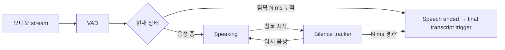
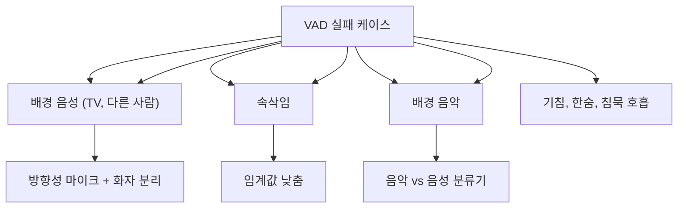
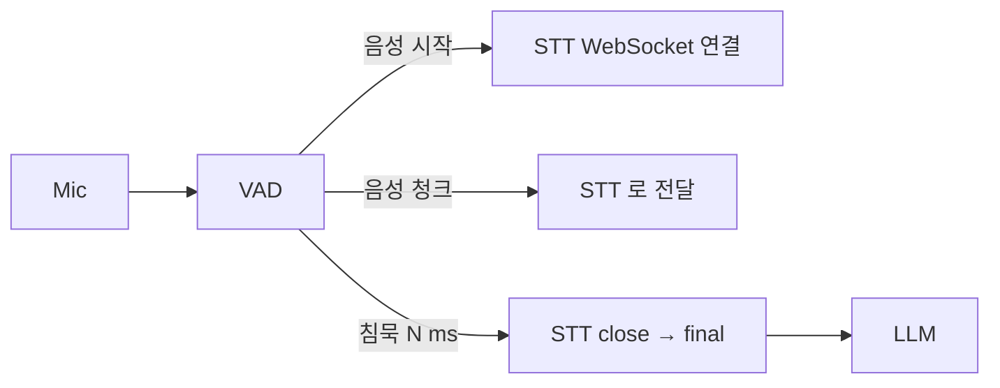

## 정의

**VAD (Voice Activity Detection)** = 오디오 스트림에서 *음성 vs 비음성 (침묵, 노이즈)* 구분. 음성 에이전트의 *발화 시작 / 종료* 감지에 필수.

## 종류

```mermaid
flowchart TB
    VAD[VAD 종류]
    VAD --> Energy[Energy-based<br/>(RMS, ZCR)]
    VAD --> Spectral[Spectral feature]
    VAD --> Neural[Neural network<br/>(Silero, Marble)]
    VAD --> Webrtc[WebRTC VAD<br/>(GMM)]
    Energy --> Simple["단순, 빠름, 노이즈에 약함"]
    Neural --> Robust["robust, 정확, 작은 모델"]
```

| VAD | 정확도 | 속도 | 노이즈 견고성 |
|---|---|---|---|
| Energy (RMS) | 낮음 | *매우 빠름* | *X* |
| WebRTC VAD (GMM) | 보통 | 빠름 | 보통 |
| **Silero VAD** | *높음* | 빠름 (2MB) | *우수* |
| **Marble VAD** | 매우 높음 | 보통 | 우수 |
| Whisper VAD | 매우 높음 | *느림* | 우수 |

## Silero VAD (사실상 표준)

```python
import torch
torch.set_num_threads(1)

model, utils = torch.hub.load(
    repo_or_dir='snakers4/silero-vad',
    model='silero_vad',
    onnx=False,
)

# 32ms 청크 (16kHz, 512 sample) 단위로 처리
def is_speech(audio_chunk: torch.Tensor) -> float:
    """0.0 ~ 1.0 (음성 확률)"""
    return model(audio_chunk, 16000).item()

# 실시간 처리
chunk_size = 512   # 32ms at 16kHz
threshold = 0.5    # 0.5 이상 → 음성
for chunk in audio_stream:
    prob = is_speech(chunk)
    if prob > threshold:
        on_voice_active()
    else:
        on_silence()
```

### Silero VAD 특징

| 속성 | 값 |
|---|---|
| 모델 크기 | *2MB* (ONNX) |
| 입력 | 32ms 청크 (512 samples at 16kHz) |
| 추론 시간 | *< 1ms* on CPU |
| 정확도 | 96%+ on LibriSpeech |
| 라이센스 | MIT |

> [!IMPORTANT]
> 2026 시점 *voice agent VAD 의 사실상 표준*. Silero VAD 가 *Pipecat, LiveKit Agents, faster-whisper-streaming* 등의 *기본*.

## Endpointing (발화 종료 결정)



```python
class EndpointDetector:
    def __init__(self, silence_threshold_ms=700):
        self.silence_ms = 0
        self.threshold = silence_threshold_ms
        self.in_speech = False

    def feed(self, vad_prob: float, chunk_ms: int = 32):
        is_voice = vad_prob > 0.5
        if is_voice:
            self.silence_ms = 0
            self.in_speech = True
        else:
            if self.in_speech:
                self.silence_ms += chunk_ms
                if self.silence_ms >= self.threshold:
                    self.in_speech = False
                    return "speech_ended"
        return None
```

## Endpointing 임계값 튜닝

| 시나리오 | silence ms |
|---|---|
| 빠른 대화 (FAQ 봇) | 300-500ms |
| 일반 대화 | *500-800ms* |
| 사용자가 천천히 말함 (고연령) | 1000-1500ms |
| 전화번호 / 주소 dictation | *시맨틱 endpointing* (순수 VAD 부적합) |

> [!CAUTION]
> *순수 VAD endpointing 의 한계*: "내 번호는 010..." [짧은 침묵] → final → 사용자 끊김. *시맨틱 turn detection* 으로 보완. 자세한 건 [[turn-detection-barge-in]].

## 노이즈 감쇠 전처리

```mermaid
flowchart LR
    Mic --> NS[Noise Suppression<br/>(RNNoise, Krisp, getUserMedia)]
    NS --> VAD
    VAD --> STT
```

| 도구 | 의미 |
|---|---|
| `getUserMedia({ noiseSuppression: true })` | 브라우저 내장 |
| **RNNoise** | OSS, 신경망 기반 |
| **Krisp SDK** | 상용, 고성능 |
| **DeepFilterNet** | OSS, real-time |

## VAD 실패 시나리오



## getUserMedia 옵션

```javascript
const stream = await navigator.mediaDevices.getUserMedia({
  audio: {
    echoCancellation: true,
    noiseSuppression: true,
    autoGainControl: true,
    sampleRate: 16000,
    channelCount: 1,
  },
});
```

> *브라우저 내장 신호처리* 가 기본. 일부 OS 는 *덮어쓰기 안 됨* (Chrome 의 hardware AEC).

## VAD + STT 통합 패턴



```python
async def voice_pipeline(mic_stream):
    vad = SileroVAD()
    endpoint = EndpointDetector(silence_threshold_ms=700)
    stt_ws = None

    async for chunk in mic_stream:
        prob = vad.predict(chunk)

        if prob > 0.5 and not stt_ws:
            stt_ws = await connect_stt()

        if stt_ws:
            await stt_ws.send(chunk)

            transcript = await stt_ws.recv()
            if transcript.is_final:
                yield transcript.text

        result = endpoint.feed(prob)
        if result == "speech_ended":
            await stt_ws.close()
            stt_ws = None
```

## 흔한 함정

> [!WARNING]
> 1. **에너지 기반 VAD 의 한계** = 카페 / 키보드 소리에 활성. Silero 권장.
> 2. **임계값 0.5 그대로** = 환경에 따라 조정. *조용한 곳* 은 0.3, *시끄러운 곳* 은 0.7.
> 3. **VAD 없이 STT** = 침묵 동안 *전사 못 끝남* + 비용 폭증.
> 4. **chunk size 가 16/32ms 가 아님** = Silero 가 *512 samples (32ms at 16kHz)* 만 받음. resampling 필요.

## 관련 위키

- [[turn-detection-barge-in]]
- [[stt-streaming]]
- [[voice-agent-architecture]]
- [[webrtc]]
